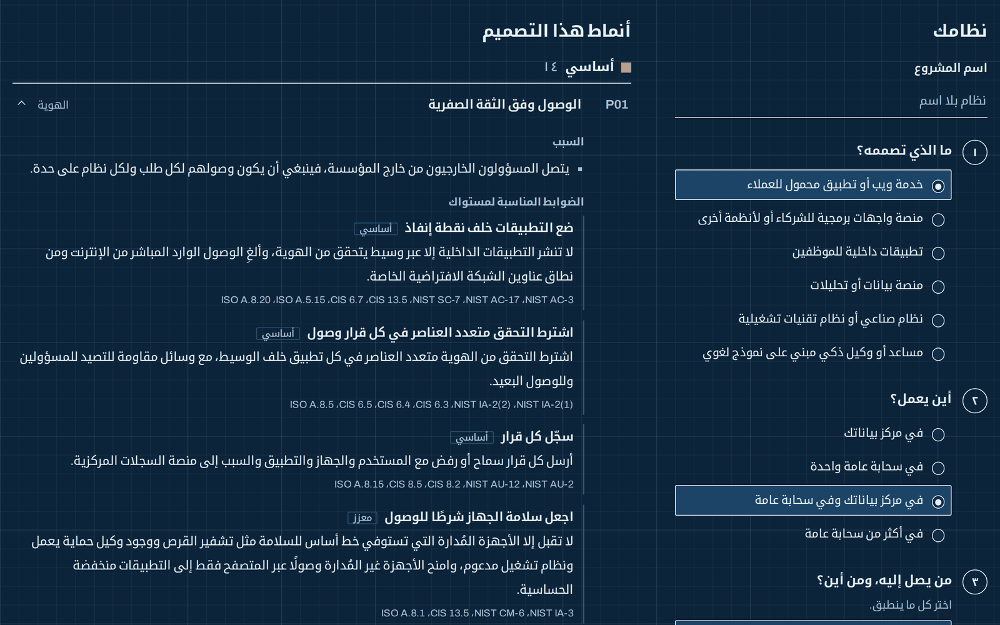
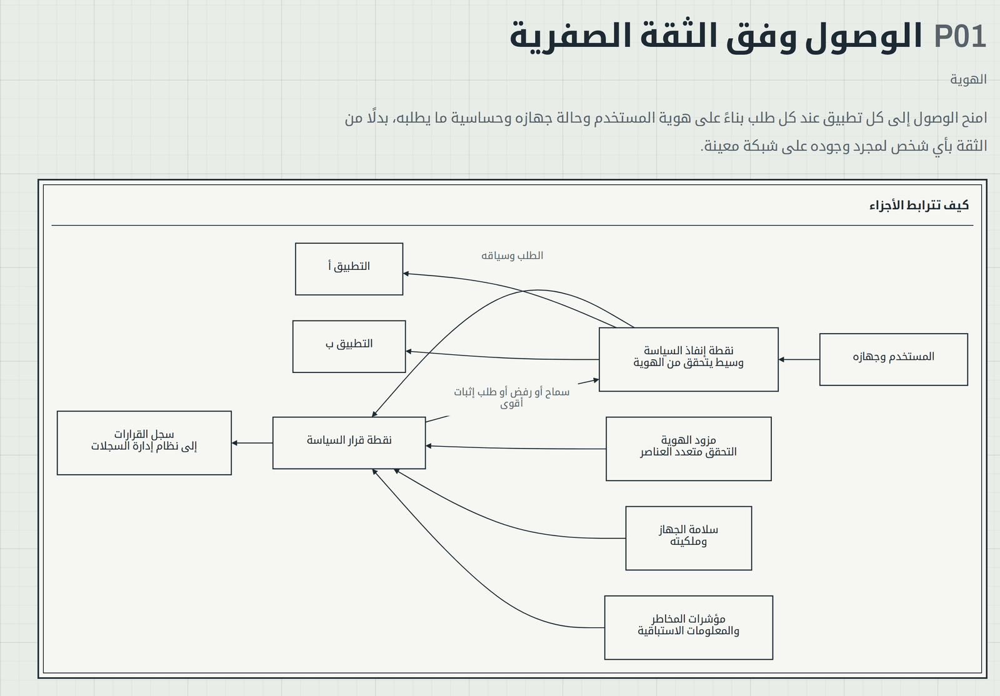
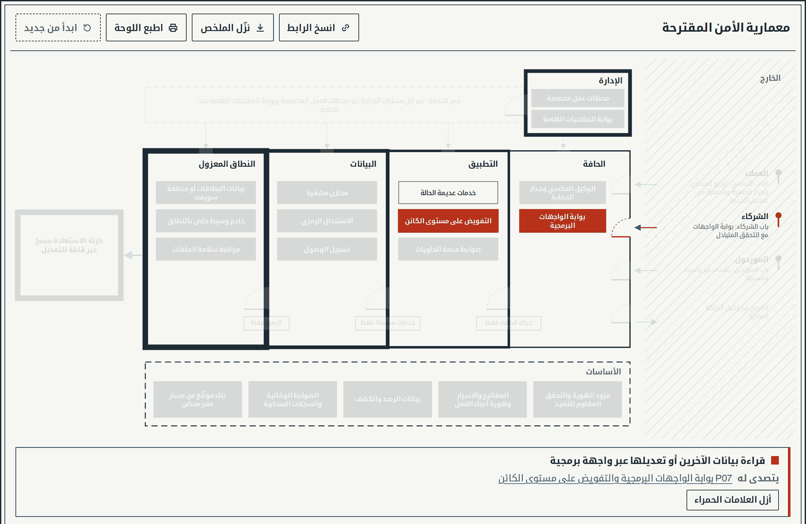
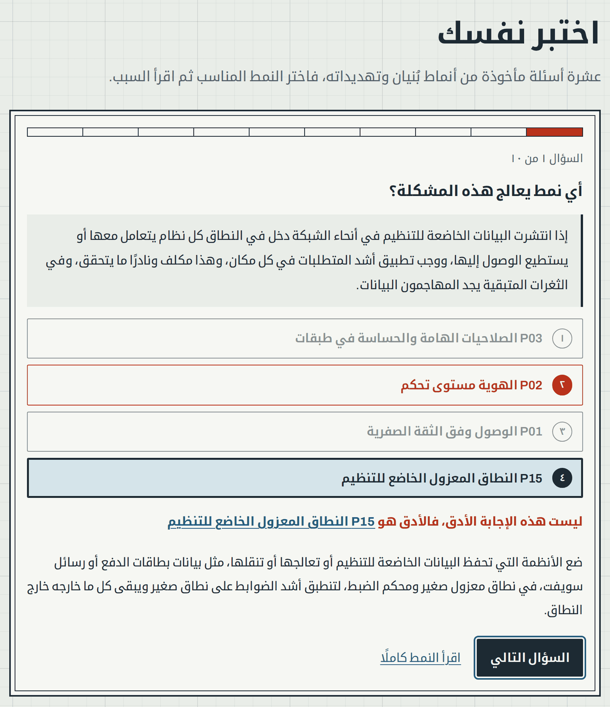

<div dir="rtl" lang="ar">

[English](README.md)

# بُنيان

**تعلّم معمارية الأمن السيبراني ثم صمّمها بإتقان.**

[](https://github.com/SiteQ8/Bunyan/actions/workflows/ci.yml) [](https://github.com/SiteQ8/Bunyan/releases) [](LICENSE)

يضم بُنيان دليلًا مفتوحًا وفهرسًا لأنماط التصميم ومستشارًا للتصميم في معمارية الأمن السيبراني، وهو مكتوب بالعربية والإنجليزية لكل من يريد تعلّم هذا التخصص أو استخدامه في عمله، واسمه مستوحى من صورة البُنيان الذي يشد بعضه بعضًا.


## افتح مستشار التصميم

أجب عن تسعة أسئلة عن نظامك عبر [bunyan.3li.info](https://bunyan.3li.info/?lang=ar)، فيقترح المستشار الأنماط التي يحتاجها تصميمك ويشرح سبب وجود كل منها، ثم يرسم النتيجة مخططًا للمناطق والأبواب والأساسات ويسرد التهديدات التي تبدأ بنمذجتها، وتستطيع أن تشير إلى أي عنصر في المخطط لترى النمط الذي وضعه، أو أن تعلّم أي تهديد بالأحمر لترى ما يتصدى له، أو أن تحمّل مثالًا وتراقب المخطط وهو يتغير، ويمكنك مشاركة التصميم رابطًا أو تنزيل ملخص بصيغة Markdown أو طباعة اللوحة، ولا يغادر أي شيء تُدخله متصفحك.

| بالإنجليزية يُقرأ المخطط من اليسار إلى اليمين | وضع المخطط الأزرق للشاشات الداكنة |
| --- | --- |
|  |  |

| كل نمط مع مخططه | على الهاتف باللغتين |
| --- | --- |
|  |  |

| أشر إلى المخطط أو علّم تهديدًا بالأحمر | اختبر نفسك |
| --- | --- |
|  |  |

## ما الذي يضمه المشروع

| الجزء | ما يقدمه لك |
| --- | --- |
| [الدليل](handbook/ar/01-what-security-architecture-is.md) | سبعة فصول من تعريف التخصص حتى مسار التعلم |
| [الأنماط](patterns/ar/README.md) | أربعة وعشرون نمطًا بضوابط على ثلاثة مستويات، مرتبطة بمعايير NIST SP 800-53 Rev 5 وCIS Controls v8.1 وISO/IEC 27001:2022 |
| [تمارين التصميم](katas/ar/K01-mobile-banking.md) | ثلاثة سيناريوهات واقعية مع إجابات نموذجية |
| [القوالب](templates/ar/security-architecture-document.md) | وثيقة للمعمارية وورقة عمل لنمذجة التهديدات وسجل للقرار وقائمة تحقق للمراجعة |
| [المصطلحات](glossary/ar.md) | تعريفات قصيرة للمصطلحات المستخدمة في المشروع |
| [الاختبار](https://bunyan.3li.info/?lang=ar#quiz) | عشرة أسئلة في كل جولة مأخوذة من الأنماط والتهديدات |

## من أين تبدأ

1. اقرأ [ما معمارية الأمن السيبراني](handbook/ar/01-what-security-architecture-is.md) و[مبادئ التصميم](handbook/ar/02-design-principles.md).
2. مرّر نظامًا تعرفه عبر [مستشار التصميم](https://bunyan.3li.info/?lang=ar).
3. اقرأ الأنماط التي يقترحها، ثم جرّب [تمرين التصميم الأول](katas/ar/K01-mobile-banking.md).
4. استخدم [القوالب](templates/ar/security-architecture-document.md) في عمل حقيقي.

## الأنماط

<!-- patterns:start -->

| الرقم | النمط | المجال |
| --- | --- | --- |
| P01 | [الوصول وفق الثقة الصفرية](patterns/ar/P01-zero-trust-access.md) | الهوية |
| P02 | [الهوية مستوى تحكم](patterns/ar/P02-identity-control-plane.md) | الهوية |
| P03 | [الصلاحيات الهامة والحساسة في طبقات](patterns/ar/P03-tiered-privileged-access.md) | الهوية |
| P04 | [العزل والتقسيم الدقيق](patterns/ar/P04-segmentation.md) | الشبكة |
| P05 | [حافة إنترنت محمية وحركة صادرة مضبوطة](patterns/ar/P05-internet-edge-and-egress.md) | الشبكة |
| P06 | [منطقة هبوط سحابية بضوابط وقائية](patterns/ar/P06-cloud-landing-zone.md) | المنصة |
| P07 | [بوابة الواجهات البرمجية والتفويض على مستوى الكائن](patterns/ar/P07-api-security.md) | التطبيقات |
| P08 | [الأسرار والمفاتيح وهوية أعباء العمل](patterns/ar/P08-secrets-keys-workload-identity.md) | المنصة |
| P09 | [حماية تتمحور حول البيانات](patterns/ar/P09-data-centric-protection.md) | البيانات |
| P10 | [بيانات الرصد ومسار الكشف](patterns/ar/P10-detection-telemetry.md) | العمليات |
| P11 | [سلسلة إمداد برمجيات موثوقة](patterns/ar/P11-software-supply-chain.md) | التطبيقات |
| P12 | [استعادة صامدة أمام برامج الفدية](patterns/ar/P12-resilient-recovery.md) | العمليات |
| P13 | [المناطق والقنوات في التقنيات التشغيلية](patterns/ar/P13-ot-zones-and-conduits.md) | التقنيات التشغيلية |
| P14 | [حواجز الحماية لتطبيقات النماذج اللغوية والوكلاء الذكيين](patterns/ar/P14-llm-application-guardrails.md) | الذكاء الاصطناعي |
| P15 | [النطاق المعزول الخاضع للتنظيم](patterns/ar/P15-regulated-enclave.md) | البيانات |
| P16 | [الضوابط الوقائية لمنصات الحاويات](patterns/ar/P16-container-platform-guardrails.md) | المنصة |
| P17 | [هوية العملاء وحماية حساباتهم](patterns/ar/P17-customer-identity.md) | الهوية |
| P18 | [حماية البريد الإلكتروني وأدوات التعاون](patterns/ar/P18-email-and-collaboration.md) | بيئة العمل |
| P19 | [أجهزة طرفية مُدارة ومحصّنة](patterns/ar/P19-managed-endpoints.md) | بيئة العمل |
| P20 | [حافة الخدمات الأمنية للمستخدمين أينما كانوا](patterns/ar/P20-security-service-edge.md) | بيئة العمل |
| P21 | [إدارة مستمرة للانكشاف](patterns/ar/P21-exposure-management.md) | العمليات |
| P22 | [توافرية صامدة عبر مواقع متعددة](patterns/ar/P22-resilient-availability.md) | العمليات |
| P23 | [مرونة التشفير والجاهزية لما بعد الحوسبة الكمية](patterns/ar/P23-crypto-agility.md) | البيانات |
| P24 | [الجاهزية الجنائية والاستجابة للحوادث](patterns/ar/P24-forensic-readiness.md) | العمليات |

<!-- patterns:end -->

## كيف يحافظ المشروع على دقته

يعامل بُنيان محتواه بوصفه بيانات، ويختبره كما تُختبر البرمجيات:

- يرتبط كل ضابط بعناصر حقيقية في فهارس NIST وCIS وISO، ويُتحقق من صحة كل مرجع في ATT&CK وOWASP.
- لكل نص إنجليزي نظير عربي بالبنية نفسها والأرقام نفسها، ويتبع كلاهما قواعد أسلوب مكتوبة.
- تُنشأ صفحات الأنماط والمصطلحات وبيانات الموقع من البيانات آليًا، ويُخفق الفحص إذا ابتعدت عنها.
- يُختبر المستشار على سيناريوهات واقعية وعلى مئات السيناريوهات العشوائية، وعلى قاعدة ألا يظهر على المخطط شيء دون النمط الذي يفرضه.
- تفحص مهمة أسبوعية كل رابط خارجي، بما في ذلك الروابط التي انتقلت وجهتها بصمت.

## شغّله بنفسك

```sh
git clone https://github.com/SiteQ8/Bunyan.git
cd Bunyan
npm test
npm run build
python3 -m http.server 8000 --directory docs
```

يحتاج المشروع إلى Node.js 22 أو ما بعده ولا يعتمد على أي حزم خارجية، أما الموقع فمكتوب بلغات HTML وCSS وJavaScript في المجلد docs دون أدوات بناء.

## أدوات ذات صلة

- يرسم [معمار](https://siteq8.github.io/Mimar/) النظام وينمذج تهديداته بطريقة STRIDE داخل المتصفح.
- يكتب [حصن](https://siteq8.github.io/Hisn/) المخططات الأمنية بوصفها شيفرة.
- يُعدّك [رفيق دراسة SC-100](https://siteq8.github.io/SC-100/) لاختبار معماري الأمن السيبراني من مايكروسوفت.

## المساهمة

نرحب بالتصحيحات والأنماط الجديدة وتحسين العربية، فاقرأ [دليل المساهمة](CONTRIBUTING.ar.md) أولًا، لأن الاختبارات تفرض قواعد الكتابة.

## الترخيص

يصدر بُنيان بموجب رخصة MIT التي تجد نصها في [LICENSE](LICENSE)، ويشرف عليه علي العنزي.

</div>
