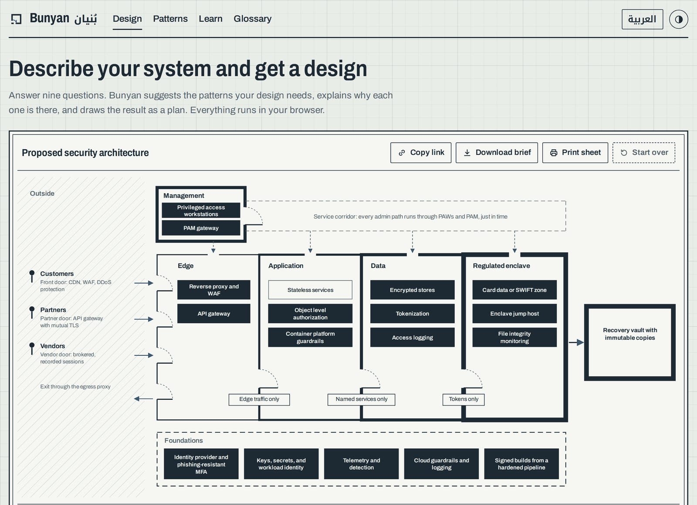
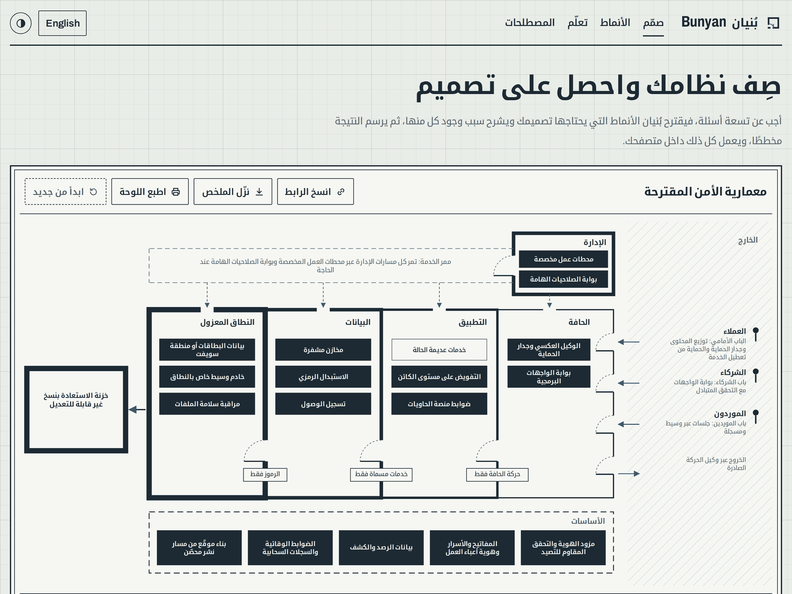
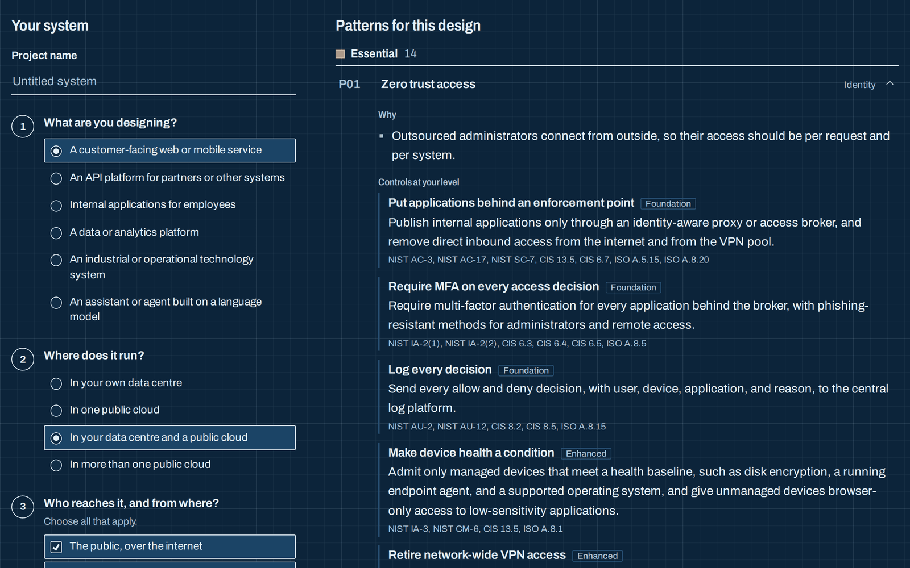
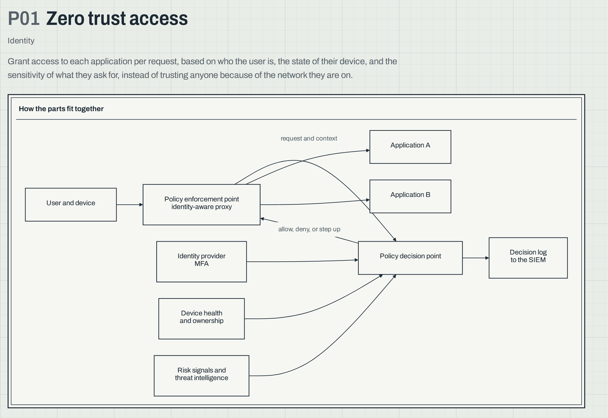
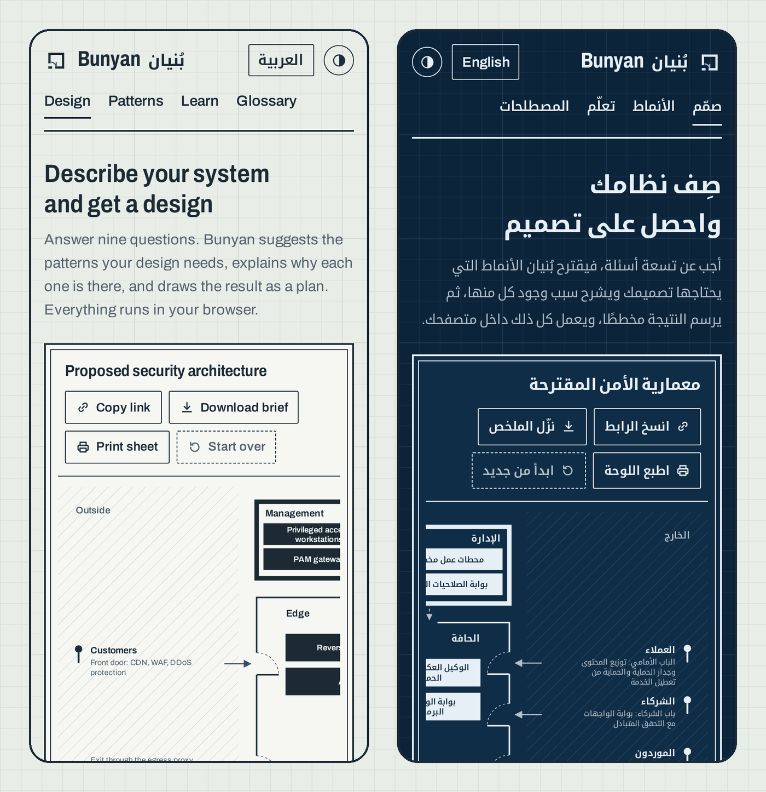
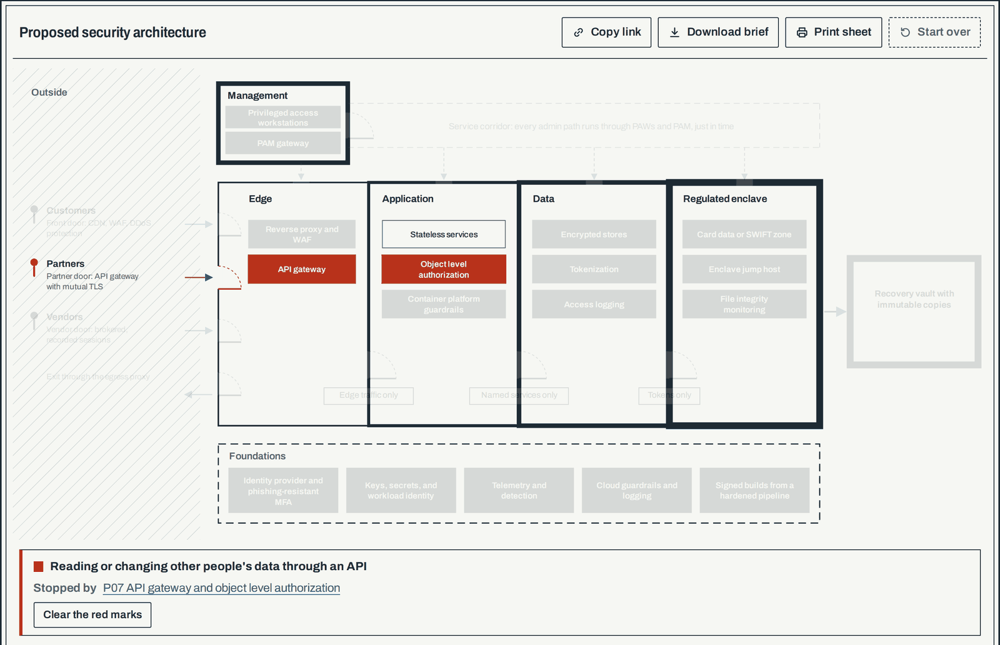
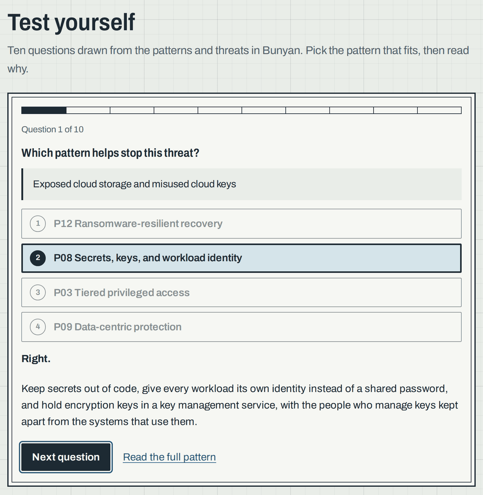

[العربية](README.ar.md)

# Bunyan

**Learn security architecture, then design it well.**

[](https://github.com/SiteQ8/Bunyan/actions/workflows/ci.yml) [](https://github.com/SiteQ8/Bunyan/releases) [](LICENSE)

Bunyan is an open handbook, a catalogue of design patterns, and a design advisor for security architecture, written in English and Arabic for anyone who wants to learn the discipline or use it at work. The name comes from the Arabic بُنيان, a structure whose parts hold one another up.



## Open the design advisor

Answer nine questions about your system at [bunyan.3li.info](https://bunyan.3li.info/?lang=en). The advisor suggests the patterns your design needs and explains why each one is there, draws the result as a floor plan of zones, doors, and foundations, and lists the threats to model first. Point at anything on the plan to see which pattern put it there, mark up a threat in red to see what stops it, or load an example and watch the plan change. You can share the design as a link, download a brief in Markdown, or print the sheet. Nothing you enter leaves your browser.

| In Arabic, the plan reads right to left | Blueprint mode for dark screens |
| --- | --- |
|  |  |

| Every pattern with its drawing | On a phone, in both languages |
| --- | --- |
|  |  |

| Point at the plan, or mark up a threat in red | Test yourself |
| --- | --- |
|  |  |

## What is inside

| Part | What it gives you |
| --- | --- |
| [Handbook](handbook/en/01-what-security-architecture-is.md) | Seven chapters, from what the discipline is to a learning path |
| [Patterns](patterns/en/README.md) | Thirty-two patterns with controls at three levels, mapped to NIST SP 800-53 Rev 5, CIS Controls v8.1, and ISO/IEC 27001:2022 |
| [Design exercises](katas/en/K01-mobile-banking.md) | Three realistic briefs with worked answers |
| [Templates](templates/en/security-architecture-document.md) | An architecture document, a threat model worksheet, a decision record, and a review checklist |
| [Glossary](glossary/en.md) | Short definitions of the terms used across the project |
| [Quiz](https://bunyan.3li.info/?lang=en#quiz) | Ten questions at a time, drawn from the patterns and the threats |

## Where to start

1. Read [what security architecture is](handbook/en/01-what-security-architecture-is.md) and the [design principles](handbook/en/02-design-principles.md).
2. Run a system you know through the [design advisor](https://bunyan.3li.info/?lang=en).
3. Read the patterns it suggests, then try the [first design exercise](katas/en/K01-mobile-banking.md).
4. Use the [templates](templates/en/security-architecture-document.md) on real work.

## The patterns

<!-- patterns:start -->

| No. | Pattern | Domain |
| --- | --- | --- |
| P01 | [Zero trust access](patterns/en/P01-zero-trust-access.md) | Identity |
| P02 | [Identity as the control plane](patterns/en/P02-identity-control-plane.md) | Identity |
| P03 | [Tiered privileged access](patterns/en/P03-tiered-privileged-access.md) | Identity |
| P04 | [Segmentation and micro-segmentation](patterns/en/P04-segmentation.md) | Network |
| P05 | [Protected internet edge and controlled egress](patterns/en/P05-internet-edge-and-egress.md) | Network |
| P06 | [Cloud landing zone with guardrails](patterns/en/P06-cloud-landing-zone.md) | Platform |
| P07 | [API gateway and object level authorization](patterns/en/P07-api-security.md) | Application |
| P08 | [Secrets, keys, and workload identity](patterns/en/P08-secrets-keys-workload-identity.md) | Platform |
| P09 | [Data-centric protection](patterns/en/P09-data-centric-protection.md) | Data |
| P10 | [Security telemetry and detection pipeline](patterns/en/P10-detection-telemetry.md) | Operations |
| P11 | [Trusted software supply chain](patterns/en/P11-software-supply-chain.md) | Application |
| P12 | [Ransomware-resilient recovery](patterns/en/P12-resilient-recovery.md) | Operations |
| P13 | [OT zones and conduits](patterns/en/P13-ot-zones-and-conduits.md) | Industrial |
| P14 | [Guardrails for LLM applications and agents](patterns/en/P14-llm-application-guardrails.md) | AI |
| P15 | [Regulated enclave](patterns/en/P15-regulated-enclave.md) | Data |
| P16 | [Container platform guardrails](patterns/en/P16-container-platform-guardrails.md) | Platform |
| P17 | [Customer identity and account protection](patterns/en/P17-customer-identity.md) | Identity |
| P18 | [Email and collaboration protection](patterns/en/P18-email-and-collaboration.md) | Workplace |
| P19 | [Managed and hardened endpoints](patterns/en/P19-managed-endpoints.md) | Workplace |
| P20 | [Security service edge for users anywhere](patterns/en/P20-security-service-edge.md) | Workplace |
| P21 | [Continuous exposure management](patterns/en/P21-exposure-management.md) | Operations |
| P22 | [Resilient availability across sites](patterns/en/P22-resilient-availability.md) | Operations |
| P23 | [Cryptographic agility and post-quantum readiness](patterns/en/P23-crypto-agility.md) | Data |
| P24 | [Forensic readiness and incident response](patterns/en/P24-forensic-readiness.md) | Operations |
| P25 | [SaaS tenant guardrails](patterns/en/P25-saas-guardrails.md) | Platform |
| P26 | [Secure data exchange with partners](patterns/en/P26-partner-data-exchange.md) | Data |
| P27 | [Mobile application protection](patterns/en/P27-mobile-app-protection.md) | Application |
| P28 | [Secure development lifecycle](patterns/en/P28-secure-development.md) | Application |
| P29 | [AI agents that use tools](patterns/en/P29-ai-agents.md) | AI |
| P30 | [Sovereign cloud and data residency](patterns/en/P30-sovereign-cloud.md) | Platform |
| P31 | [Identity threat detection and response](patterns/en/P31-identity-threat-detection.md) | Identity |
| P32 | [Transaction signing for payments](patterns/en/P32-transaction-signing.md) | Application |

<!-- patterns:end -->

## How the project keeps itself honest

Bunyan treats its content as data, and tests it the way software is tested:

- Every control maps to real entries in the NIST, CIS, and ISO catalogues, and every ATT&CK and OWASP reference resolves.
- Every English text has an Arabic twin with the same structure and the same numbers, and both follow written style rules.
- The pattern pages, the glossary, and the website data are generated from the data, and a check fails if they drift.
- The advisor is tested on realistic scenarios, on hundreds of random ones, and on the rule that nothing appears on the plan without the pattern that enforces it.
- A weekly job checks every external link, including links whose target quietly moved.

## Run it yourself

```sh
git clone https://github.com/SiteQ8/Bunyan.git
cd Bunyan
npm test
npm run build
python3 -m http.server 8000 --directory docs
```

The project needs Node.js 22 or later and has no dependencies. The website is plain HTML, CSS, and JavaScript in the docs folder, with no build tools.

## Related tools

- [Mimar](https://siteq8.github.io/Mimar/) draws a system and threat models it with STRIDE in the browser.
- [Hisn](https://siteq8.github.io/Hisn/) writes security blueprints as code.
- The [SC-100 study companion](https://siteq8.github.io/SC-100/) prepares you for the Microsoft Cybersecurity Architect exam.

## Contributing

Corrections, new patterns, and better Arabic are all welcome. Read the [contributing guide](CONTRIBUTING.md) first, because the tests enforce the writing rules.

## License

Bunyan is released under the MIT license, which you can read in [LICENSE](LICENSE). It is maintained by Ali AlEnezi.
