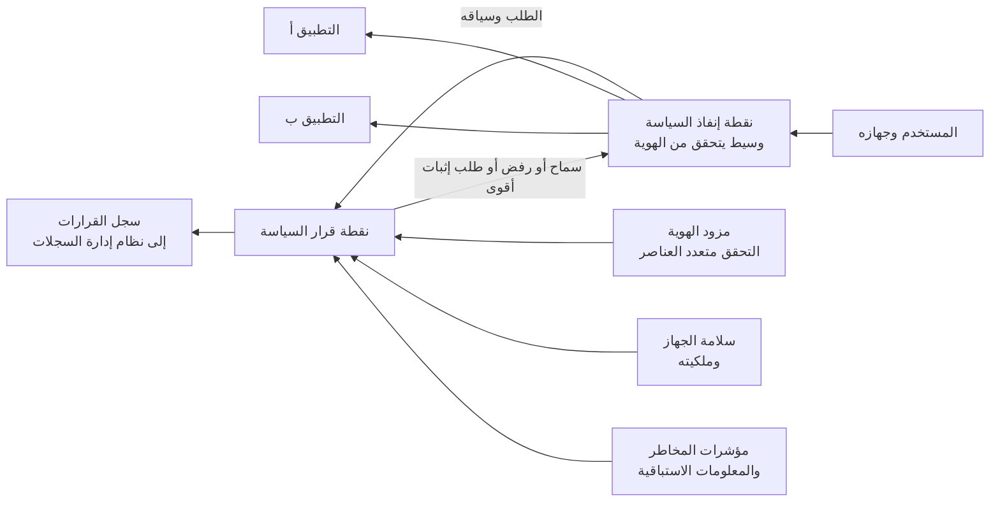

<!-- Generated by scripts/build.mjs from data/patterns/P01.json. Edit the data, then run npm run build. -->

[English](../en/P01-zero-trust-access.md)

# P01 الوصول وفق الثقة الصفرية

> امنح الوصول إلى كل تطبيق عند كل طلب بناءً على هوية المستخدم وحالة جهازه وحساسية ما يطلبه، بدلًا من الثقة بأي شخص لمجرد وجوده على شبكة معينة.

| المجال | أنماط ذات صلة |
| --- | --- |
| الهوية | [P02 الهوية مستوى تحكم](P02-identity-control-plane.md)، [P03 الصلاحيات الهامة والحساسة في طبقات](P03-tiered-privileged-access.md)، [P04 العزل والتقسيم الدقيق](P04-segmentation.md)، [P10 بيانات الرصد ومسار الكشف](P10-detection-telemetry.md)، [P20 حافة الخدمات الأمنية للمستخدمين أينما كانوا](P20-security-service-edge.md) |

## المشكلة

تضع الشبكة الافتراضية الخاصة أو شبكة المكتب المستخدمَ في الداخل، والداخل عادةً مفتوح على مصراعيه، فإذا اتصل حساب مسروق أو حاسوب مصاب وصل إلى أكثر بكثير من التطبيق الوحيد الذي يحتاجه المستخدم، ولذلك تُعد الحسابات الصالحة وخدمات الوصول البعيد الخارجية من أكثر مداخل المهاجمين شيوعًا.

## متى تستخدمه

- يصل الموظفون أو المتعاقدون أو الموردون إلى التطبيقات الداخلية من خارج المكتب.
- ما زلت تعتمد على شبكة افتراضية خاصة تضع المستخدمين في شبكة داخلية واسعة.
- تحتاج إلى إثبات من وصل إلى أي تطبيق ومن أي جهاز.

## التصميم

ضع نقطة إنفاذ للسياسة أمام كل تطبيق، أي وسيطًا يتحقق من الهوية لتطبيقات الويب وموصلًا يتصل من منطقة التطبيقات إلى الخارج لبقية التطبيقات، فلا يبقى أي منفذ مفتوحًا على الإنترنت، ثم يُرسَل كل طلب إلى نقطة قرار السياسة التي تزن هوية المستخدم وقوة تحققه وسلامة الجهاز وملكيته وحساسية التطبيق ومؤشرات مثل الموقع ودرجة المخاطر، فتسمح بالطلب أو ترفضه أو تطلب إثباتًا أقوى.

يكون الوصول إلى تطبيق واحد لا إلى جزء من الشبكة، وتكون الجلسات قصيرة، ويُعاد تقييم القرار كلما تغيّرت المؤشرات، ثم يُسجَّل كل قرار مع سببه.

## الضوابط

### أساسي

- **ضع التطبيقات خلف نقطة إنفاذ:** لا تنشر التطبيقات الداخلية إلا عبر وسيط يتحقق من الهوية، وألغِ الوصول الوارد المباشر من الإنترنت ومن نطاق عناوين الشبكة الافتراضية الخاصة.
  `NIST AC-3` `NIST AC-17` `NIST SC-7` `CIS 13.5` `CIS 6.7` `ISO A.5.15` `ISO A.8.20`
- **اشترط التحقق متعدد العناصر في كل قرار وصول:** اشترط التحقق من الهوية متعدد العناصر في كل تطبيق خلف الوسيط، مع وسائل مقاومة للتصيد للمسؤولين وللوصول البعيد.
  `NIST IA-2(1)` `NIST IA-2(2)` `CIS 6.3` `CIS 6.4` `CIS 6.5` `ISO A.8.5`
- **سجّل كل قرار:** أرسل كل قرار سماح أو رفض مع المستخدم والجهاز والتطبيق والسبب إلى منصة السجلات المركزية.
  `NIST AU-2` `NIST AU-12` `CIS 8.2` `CIS 8.5` `ISO A.8.15`

### معزز

- **اجعل سلامة الجهاز شرطًا للوصول:** لا تقبل إلا الأجهزة المُدارة التي تستوفي خط أساس للسلامة مثل تشفير القرص ووجود وكيل حماية يعمل ونظام تشغيل مدعوم، وامنح الأجهزة غير المُدارة وصولًا عبر المتصفح فقط إلى التطبيقات منخفضة الحساسية.
  `NIST IA-3` `NIST CM-6` `CIS 13.5` `ISO A.8.1`
- **ألغِ الوصول الشامل عبر الشبكة الافتراضية الخاصة:** انقل التطبيقات خلف الوسيط مجموعةً بعد أخرى بدءًا بالأكثر حساسية، وقلّص الشبكة الافتراضية الخاصة إلى البروتوكولات القليلة التي ما زالت تحتاجها.
  `NIST AC-17` `NIST SC-7` `CIS 13.5` `ISO A.8.20` `ISO A.8.22`
- **امنح الموردين جلسات عبر الوسيط ومسجلة:** امنح الأطراف الخارجية الوصول إلى أنظمة محددة بالاسم فقط عبر الوسيط، مع موافقة على كل جلسة وحد زمني وتسجيل للجلسة.
  `NIST MA-4` `NIST AC-17` `NIST AU-14` `CIS 13.5` `ISO A.5.19` `ISO A.5.20`

### متقدم

- **قيّم المخاطر باستمرار:** أعد تقييم الجلسات عند تغيّر مؤشرات المخاطر، مثل الدخول من موقعين يستحيل التنقل بينهما أو ظهور جهاز جديد أو تطابق مع المعلومات الاستباقية، ثم أنهِ الجلسة أو اطلب إثباتًا أقوى دون انتظار انتهائها.
  `NIST AC-12` `NIST IA-11` `NIST SI-4` `ISO A.8.16`
- **انقل الهوية إلى داخل التطبيق:** مرّر الهوية الموثقة وسياق الطلب إلى التطبيق ليتحقق من تفويض كل إجراء، واحفظ بيانات التفويض في مكان واحد بدلًا من نسخها في كل تطبيق.
  `NIST AC-3` `NIST AC-6` `NIST AC-24` `CIS 6.8` `ISO A.5.15` `ISO A.8.3`

## قرارات يجب توثيقها

- ما التطبيقات التي تنتقل أولًا خلف الوسيط، وما خطة إلغاء الوصول الشامل عبر الشبكة الافتراضية الخاصة وما موعدها؟
- ماذا يحدث إذا تعذّر الوصول إلى نقطة قرار السياسة، فأي التطبيقات تُغلق بأمان، وهل يوجد مسار طوارئ مضبوط؟
- ما حالات الأجهزة المسموح بها، وإلى ماذا يصل الجهاز غير المُدار؟

## المفاضلات

- تصبح نقطة قرار السياسة بنية تحتية حرجة، لذا صمّمها لتعمل بتوافرية عالية وحدّد مسبقًا كيف يتصرف كل تطبيق عند تعطّلها.
- يصعب تمرير البروتوكولات القديمة مثل تطبيقات سطح المكتب ومشاركة الملفات عبر الوسيط مقارنة بتطبيقات الويب، لذلك يكون الانتقال متفاوتًا.
- قد تمنع فحوص الأجهزة الصارمة مستخدمين مشروعين من الوصول أثناء حادثة أو عند تعطّل خدمة إدارة الأجهزة.

## أنماط خاطئة يجب تجنبها

- تسمية الشبكة الافتراضية الخاصة بالثقة الصفرية بينما يصل المستخدمون إلى شبكة داخلية مسطحة كما كانوا.
- التحقق من الهوية مرة واحدة عند الدخول ثم الوثوق بالجلسة لأيام.
- استثناء كبار التنفيذيين أو الموردين أو مكتب الدعم من السياسة لأنها غير مريحة.

## كيف تتحقق منه

- حاول الوصول إلى تطبيق مباشرة من جهاز غير مُدار ومن نطاق عناوين الشبكة الافتراضية القديمة، وتأكد أن المحاولة تفشل.
- عطّل مستخدمًا في مزود الهوية وتأكد أن جلساته المفتوحة تنتهي خلال الوقت المستهدف.
- افحص نطاق عناوينك الخارجية وتأكد أنه لا يستجيب أي تطبيق داخلي على الإنترنت.
- خذ عينة من سجل القرارات وتحقق أن كل سجل يذكر المستخدم والجهاز والتطبيق والقرار وسببه.

## التهديدات التي يتصدى لها

| المرجع | الاسم |
| --- | --- |
| [T1078](https://attack.mitre.org/techniques/T1078/) | الحسابات الصالحة |
| [T1133](https://attack.mitre.org/techniques/T1133/) | خدمات الوصول البعيد الخارجية |
| [T1021](https://attack.mitre.org/techniques/T1021/) | الخدمات البعيدة |
| [T1199](https://attack.mitre.org/techniques/T1199/) | العلاقة الموثوقة |

## المراجع

- [معمارية الثقة الصفرية NIST SP 800-207](https://csrc.nist.gov/pubs/sp/800/207/final)
- [نموذج نضج الثقة الصفرية من CISA، الإصدار ٢٫٠](https://www.cisa.gov/zero-trust-maturity-model)
- [مبادئ تصميم معمارية الثقة الصفرية من المركز الوطني للأمن السيبراني في المملكة المتحدة](https://www.ncsc.gov.uk/collection/zero-trust-architecture)
- [تطبيق معمارية الثقة الصفرية NIST SP 1800-35](https://csrc.nist.gov/pubs/sp/1800/35/final)

