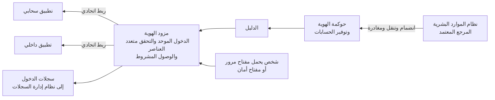

<!-- Generated by scripts/build.mjs from data/patterns/P02.json. Edit the data, then run npm run build. -->

[English](../en/P02-identity-control-plane.md)

# P02 الهوية مستوى تحكم

> اجعل مزود هوية واحدًا المرجع لكل شخص، واجعل التحقق المقاوم للتصيد الطريقة المعتادة للدخول، لأن الهوية هي المحيط الذي يختبره المهاجمون أولًا.

| المجال | أنماط ذات صلة |
| --- | --- |
| الهوية | [P01 الوصول وفق الثقة الصفرية](P01-zero-trust-access.md)، [P03 الصلاحيات الهامة والحساسة في طبقات](P03-tiered-privileged-access.md)، [P10 بيانات الرصد ومسار الكشف](P10-detection-telemetry.md)، [P17 هوية العملاء وحماية حساباتهم](P17-customer-identity.md)، [P31 رصد تهديدات الهوية والاستجابة لها](P31-identity-threat-detection.md) |

## المشكلة

تتوزع الحسابات على أدلة كثيرة وحسابات محلية وحسابات مشتركة وبروتوكولات قديمة، فتفتح للمهاجمين أبوابًا كثيرة يكفي معها غالبًا اصطياد كلمة مرور واحدة أو تخمينها بالرش، كما تبقى الصلاحيات قائمة بعد زوال الحاجة إليها بوقت طويل حين تُدار حالات الانضمام والتنقل والمغادرة عبر البريد الإلكتروني.

## متى تستخدمه

- يدخل الناس إلى تطبيقات كثيرة بحسابات أو كلمات مرور مختلفة.
- ما زالت كلمات المرور أو الرموز النصية أو الموافقة عبر الإشعارات هي طرق التحقق الرئيسية.
- تُمنح الصلاحيات وتُسحب يدويًا دون ربط بسجلات الموارد البشرية.

## التصميم

اختر مزود هوية واحدًا مصدرًا للتحقق في تطبيقات الموظفين، واربط به كل تطبيق عبر SAML أو OpenID Connect، ثم عطّل البروتوكولات القديمة التي لا تدعم التحقق متعدد العناصر، واجعل دورة حياة الحسابات تنطلق من نظام الموارد البشرية بحيث تتغير الصلاحيات آليًا عند الانضمام والتنقل والمغادرة.

اجعل وسائل التحقق المقاومة للتصيد هي الخيار الافتراضي، مثل مفاتيح الأمان بمعيار FIDO2 ومفاتيح المرور والبطاقات الذكية، واستخدم الوصول المشروط لفرضها على المسؤولين وعلى الوصول البعيد والتطبيقات الحساسة، وعامل حسابات الخدمة بوصفها هويات أيضًا لكل منها مالك وقيد في سجل الحصر دون كلمة مرور مشتركة.

## الضوابط

### أساسي

- **اربط كل تطبيق بمزود هوية واحد:** اربط تطبيقات الموظفين بمزود الهوية عبر الدخول الموحد، واحتفظ بقائمة التطبيقات التي يتعذر ربطها حتى الآن مع خطة لكل منها.
  `NIST IA-2` `NIST AC-2` `CIS 5.6` `CIS 6.6` `CIS 6.7` `ISO A.5.16` `ISO A.8.5`
- **اشترط التحقق متعدد العناصر في كل مكان بدءًا بالمسؤولين:** اشترط التحقق من الهوية متعدد العناصر على جميع المستخدمين، مع البدء بوسائل مقاومة للتصيد للمسؤولين وللتطبيقات المكشوفة خارجيًا.
  `NIST IA-2(1)` `NIST IA-2(2)` `CIS 6.3` `CIS 6.4` `CIS 6.5` `ISO A.8.5`
- **امنع بروتوكولات التحقق القديمة:** عطّل البروتوكولات التي تتجاوز التحقق متعدد العناصر، مثل التحقق الأساسي في البريد الإلكتروني والاتصالات القديمة بالدليل، وأطلق تنبيهًا عند أي محاولة لاستخدامها.
  `NIST IA-2` `NIST CM-7` `CIS 4.8` `ISO A.8.5`
- **أتمت الانضمام والتنقل والمغادرة:** أنشئ الحسابات وعدّلها وعطّلها انطلاقًا من أحداث الموارد البشرية، وعطّل الحسابات الخاملة بعد مدة محددة.
  `NIST AC-2` `NIST AC-2(3)` `CIS 5.3` `CIS 6.1` `CIS 6.2` `ISO A.5.16` `ISO A.5.18`

### معزز

- **استخدم الوصول المشروط:** قرّر الوصول بناءً على مخاطر المستخدم وحالة الجهاز والموقع وحساسية التطبيق، واشترط تحققًا أقوى كلما ارتفعت المخاطر.
  `NIST AC-3` `NIST IA-2` `CIS 6.7` `ISO A.5.15` `ISO A.8.5`
- **أحكم إدارة حسابات الخدمة:** احتفظ بسجل حصر لحسابات الخدمة مع مالك وغرض لكل منها، وامنع الدخول التفاعلي بها، ودوّر بيانات اعتمادها أو استبدلها.
  `NIST AC-2` `NIST IA-5` `CIS 5.5` `ISO A.5.16` `ISO A.5.17`
- **راجع الصلاحيات وفق جدول زمني:** اطلب من المالكين تأكيد صلاحيات الوصول إلى التطبيقات الحساسة وفق جدول ثابت، وأزل كل صلاحية لا يؤكدونها.
  `NIST AC-2` `CIS 6.2` `ISO A.5.18`

### متقدم

- **استغنِ عن كلمات المرور:** انقل المستخدمين إلى مفاتيح المرور أو مفاتيح الأمان وسيلةَ تحقق وحيدة، وأزل كلمات المرور من الحسابات التي لم تعد تحتاجها.
  `NIST IA-2` `NIST IA-5` `ISO A.8.5`
- **احمِ مزود الهوية بوصفه من الطبقة الصفرية:** لا تُدر مزود الهوية إلا من محطات عمل مخصصة للصلاحيات الهامة، وراقب أي تغيير في إعداداته، وأطلق تنبيهًا عند إضافة علاقة ثقة اتحادية جديدة أو مفتاح جديد لتوقيع الرموز.
  `NIST AC-6(5)` `NIST CM-3` `NIST SI-4` `CIS 5.4` `CIS 12.8` `ISO A.8.2` `ISO A.8.9`

## قرارات يجب توثيقها

- ما مزود الهوية المعتمد مرجعًا، وكيف تتزامن معه الأدلة الأخرى؟
- ما وسائل التحقق المسموح بها لكل فئة من المستخدمين، وما إجراء الاستعادة عند فقدان إحداها؟
- ما التطبيقات التي يتعذر ربطها بمزود الهوية، وما الضوابط البديلة التي تُطبق عليها؟

## المفاضلات

- يركّز مزود الهوية الواحد المخاطر، إذ يؤثر تعطله أو اختراقه في كل شيء، لذلك يحتاج إلى خطة صمود خاصة به وإلى أقوى حماية إدارية.
- تتطلب وسائل التحقق المقاومة للتصيد تكلفة وتدريبًا، ويجب أن تكون إجراءات الاستعادة بقوة وسيلة التحقق نفسها، وإلا استهدفها المهاجمون بدلًا منها.
- تعتمد أتمتة دورة حياة الحسابات على دقة بيانات الموارد البشرية، فتتحول أخطاؤها إلى أخطاء في الصلاحيات.

## أنماط خاطئة يجب تجنبها

- الاعتماد على الرموز النصية أو الموافقة البسيطة عبر الإشعارات عاملًا ثانيًا وحيدًا للمسؤولين.
- الحسابات المشتركة بين الفرق أو الموردين أو مكتب الدعم.
- مكتب دعم يعيد ضبط التحقق متعدد العناصر بمكالمة هاتفية دون التحقق من هوية المتصل.

## كيف تتحقق منه

- اعرض قائمة جميع التطبيقات وتأكد أن كلًا منها يستخدم الدخول الموحد أو له استثناء موثق.
- جرّب الدخول عبر بروتوكول قديم وتأكد أنه يُمنع ويُطلق تنبيهًا.
- سجّل موظفًا تجريبيًا على أنه مغادر في نظام الموارد البشرية وقِس الوقت حتى تتعطل جميع حساباته.
- نفّذ تمرين تصيد يستهدف المسؤولين وتأكد أن وسائل تحققهم لا يمكن تمريرها عبر وسيط.

## التهديدات التي يتصدى لها

| المرجع | الاسم |
| --- | --- |
| [T1078](https://attack.mitre.org/techniques/T1078/) | الحسابات الصالحة |
| [T1110.003](https://attack.mitre.org/techniques/T1110/003/) | التخمين، رش كلمات المرور |
| [T1110.004](https://attack.mitre.org/techniques/T1110/004/) | التخمين، حشو بيانات الاعتماد |
| [T1566](https://attack.mitre.org/techniques/T1566/) | التصيد |
| [T1621](https://attack.mitre.org/techniques/T1621/) | إغراق طلبات التحقق متعدد العناصر |
| [T1556](https://attack.mitre.org/techniques/T1556/) | تعديل عملية التحقق من الهوية |

## المراجع

- [إرشادات الهوية الرقمية NIST SP 800-63-4](https://pages.nist.gov/800-63-4/)
- [إرشادات CISA لتطبيق التحقق متعدد العناصر المقاوم للتصيد](https://www.cisa.gov/sites/default/files/publications/fact-sheet-implementing-phishing-resistant-mfa-508c.pdf)
- [مفاتيح المرور من تحالف FIDO](https://fidoalliance.org/passkeys/)

