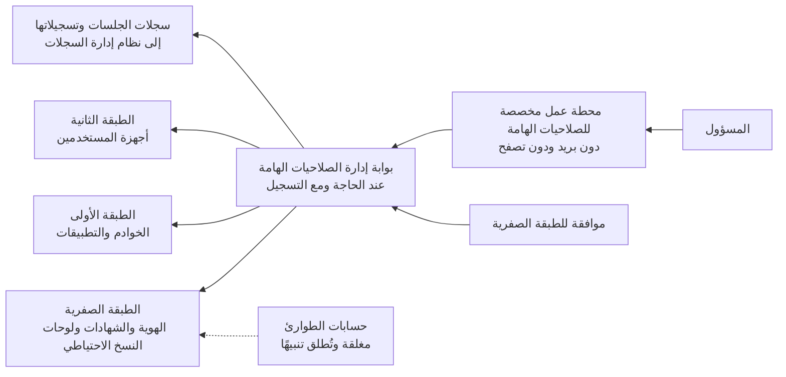

<!-- Generated by scripts/build.mjs from data/patterns/P03.json. Edit the data, then run npm run build. -->

[English](../en/P03-tiered-privileged-access.md)

# P03 الصلاحيات الهامة والحساسة في طبقات

> افصل الحسابات والأجهزة والمسارات المستخدمة في الإدارة عن تلك المستخدمة في العمل اليومي، وامنح الصلاحيات الهامة عند الحاجة فقط، حتى لا يتحول حاسوب محمول أو صندوق بريد مخترق إلى سيطرة على كل شيء.

| المجال | أنماط ذات صلة |
| --- | --- |
| الهوية | [P02 الهوية مستوى تحكم](P02-identity-control-plane.md)، [P04 العزل والتقسيم الدقيق](P04-segmentation.md)، [P12 استعادة صامدة أمام برامج الفدية](P12-resilient-recovery.md)، [P10 بيانات الرصد ومسار الكشف](P10-detection-telemetry.md) |

## المشكلة

تبلغ معظم الاختراقات أقصى خطورتها عندما يصل المهاجم إلى أحد المسؤولين، فالمسؤول الذي يقرأ بريده ويتصفح الإنترنت بالحساب والحاسوب نفسيهما اللذين يدير بهما الخوادم يسلّم بيانات اعتماده لأول رسالة تصيد أو موقع ضار، كما أن الصلاحيات الدائمة تجعل بيانات الاعتماد هذه صالحة في أي ساعة.

## متى تستخدمه

- يستخدم المسؤولون الحساب نفسه في العمل اليومي وفي الإدارة.
- تكون صلاحيات الإدارة دائمة بدلًا من منحها لمهمة محددة.
- يدير موردون أو فرق خارجية أنظمتك.

## التصميم

صنّف الأنظمة في طبقات بحسب ما تتحكم فيه، فتضم الطبقة الصفرية البنية التحتية للهوية والأمن مثل مزود الهوية والدليل وجهة إصدار الشهادات ولوحات تحكم النسخ الاحتياطي والإدارة، وتضم الطبقة الأولى الخوادم والتطبيقات، بينما تضم الطبقة الثانية أجهزة المستخدمين، ثم اجعل كل حساب إداري يدير طبقة واحدة فقط ولا يدخل أبدًا إلى طبقة أدنى منها، فيتوقف انتقال بيانات الاعتماد صعودًا عبر السلسلة.

يعمل المسؤولون من محطات عمل مخصصة للصلاحيات الهامة لا تتصفح الإنترنت ولا تقرأ البريد، ويصلون إلى الأنظمة عبر بوابة لإدارة الصلاحيات الهامة تتوسط الجلسات وتسجلها، ويحصلون على الصلاحية عند الحاجة ولمهمة محددة مع اشتراط الموافقة في الطبقة الصفرية، أما حسابات الطوارئ فتُحفظ مغلقة بعيدًا عن الشبكة ولا تُستخدم إلا في الطوارئ، ويُطلق استخدامها تنبيهًا فوريًا.

## الضوابط

### أساسي

- **افصل حسابات الإدارة:** امنح كل مسؤول حسابًا إداريًا مخصصًا منفصلًا عن حسابه اليومي، ولا تمنح الحسابات الإدارية صندوق بريد أو وصولًا إلى الإنترنت أبدًا.
  `NIST AC-6(2)` `NIST AC-6(5)` `CIS 5.4` `ISO A.8.2`
- **اشترط تحققًا مقاومًا للتصيد في كل وصول إداري:** اشترط تحققًا متعدد العناصر مقاومًا للتصيد في كل دخول إداري، بما في ذلك لوحات التحكم السحابية وأجهزة الشبكة.
  `NIST IA-2(1)` `CIS 6.5` `ISO A.8.5`
- **احصر حسابات الصلاحيات الهامة:** احتفظ بسجل حصر لكل حساب ذي صلاحيات هامة، بشريًا كان أو حساب خدمة، مع مالك لكل منها، وأزل الحسابات التي لا يستطيع أحد تبريرها.
  `NIST AC-2` `CIS 5.1` `CIS 5.5` `ISO A.8.2` `ISO A.5.16`

### معزز

- **استخدم محطات عمل مخصصة للصلاحيات الهامة:** لا تنفّذ أعمال الإدارة إلا من محطات عمل محصّنة لا تستخدم البريد ولا تتصفح الإنترنت، واقصر الدخول الإداري على هذه الأجهزة.
  `NIST AC-6` `NIST CM-6` `CIS 12.8` `ISO A.8.2` `ISO A.8.1`
- **مرّر الجلسات عبر وسيط وسجّلها:** مرّر جلسات الصلاحيات الهامة عبر بوابة لإدارة هذه الصلاحيات تُدخل بيانات الاعتماد نيابةً عن المسؤولين فلا يرونها أبدًا، وتسجّل كل ما جرى في الجلسة.
  `NIST AC-6(9)` `NIST AU-14` `CIS 8.5` `ISO A.8.2` `ISO A.8.15`
- **امنح الصلاحية عند الحاجة:** ألغِ صلاحيات الإدارة الدائمة وامنحها لمهمة محددة ولفترة زمنية محددة، مع اشتراط الموافقة في الطبقة الصفرية.
  `NIST AC-2` `NIST AC-6` `CIS 6.1` `ISO A.8.2` `ISO A.5.18`

### متقدم

- **افرض الفصل بين الطبقات تقنيًا:** امنع حسابات الطبقتين الصفرية والأولى من الدخول إلى الطبقات الأدنى بقيود على الدخول، وأطلق تنبيهًا عند أي محاولة.
  `NIST AC-3` `NIST AC-6` `CIS 5.4` `ISO A.8.2` `ISO A.8.3`
- **أحكم حسابات الطوارئ واختبرها:** احتفظ بحسابين للطوارئ تُحفظ بيانات اعتمادهما مغلقة بعيدًا عن الشبكة تحت رقابة شخصين، وأطلق تنبيهًا عند أي استخدام لهما، واختبرهما وفق جدول زمني.
  `NIST AC-2` `NIST AU-6` `ISO A.8.2`

## قرارات يجب توثيقها

- ما الأنظمة التي تُعد من الطبقة الصفرية في بيئتك، ومن يحق له إدارتها؟
- كيف يُمنح الموردون والمسؤولون الخارجيون حق الوصول، وكيف يُراجع عملهم؟
- أين تُحفظ بيانات اعتماد حسابات الطوارئ، ومن يملك صلاحية فتحها؟

## المفاضلات

- تُبطئ محطات العمل والبوابات والموافقات عمل المسؤولين، لذا احرص على أن تبقى المهام الشائعة سريعة، وإلا بحث الناس عن طرق التفاف.
- تصبح بوابة إدارة الصلاحيات الهامة نفسها نظامًا من الطبقة الصفرية، فيجب حمايتها وضمان صمودها على هذا الأساس.
- يحتاج الوصول عند الحاجة إلى مسار طوارئ سريع للحوادث، وإلا تجاوزه الناس في أشد الأوقات حاجة إليه.

## أنماط خاطئة يجب تجنبها

- استخدام صلاحيات مسؤول النطاق أو المسؤول العام في أعمال روتينية مثل تثبيت البرامج على الحواسيب المحمولة.
- حفظ كلمات مرور المسؤولين في جداول بيانات أو نصوص برمجية أو في مجلد مشترك داخل مدير كلمات المرور.
- إدارة لوحة تحكم النسخ الاحتياطي بالحسابات نفسها التي تُدار بها الخوادم التي تحميها.

## كيف تتحقق منه

- اعرض قائمة كل من يملك صلاحيات هامة دائمة وقارنها بقائمة من يجب أن يملكها.
- جرّب الدخول بحساب من الطبقة الصفرية على محطة عمل عادية، وتأكد أنه يُمنع ويُطلق تنبيهًا.
- اختر جلسة مسجلة لصلاحية هامة وتأكد أنك تستطيع معرفة من فعل ماذا وعلى أي نظام ومتى.

## التهديدات التي يتصدى لها

| المرجع | الاسم |
| --- | --- |
| [T1078](https://attack.mitre.org/techniques/T1078/) | الحسابات الصالحة |
| [T1003](https://attack.mitre.org/techniques/T1003/) | استخراج بيانات الاعتماد من نظام التشغيل |
| [T1550](https://attack.mitre.org/techniques/T1550/) | استخدام مواد تحقق بديلة |
| [T1021](https://attack.mitre.org/techniques/T1021/) | الخدمات البعيدة |
| [T1098](https://attack.mitre.org/techniques/T1098/) | التلاعب بالحسابات |

## المراجع

- [نموذج الوصول المؤسسي من Microsoft](https://learn.microsoft.com/en-us/security/privileged-access-workstations/privileged-access-access-model)
- [الضوابط الأمنية وضوابط الخصوصية NIST SP 800-53 Rev 5](https://csrc.nist.gov/pubs/sp/800/53/r5/upd1/final)
- [الإدارة الآمنة للأنظمة من المركز الوطني للأمن السيبراني في المملكة المتحدة](https://www.ncsc.gov.uk/collection/secure-system-administration)

