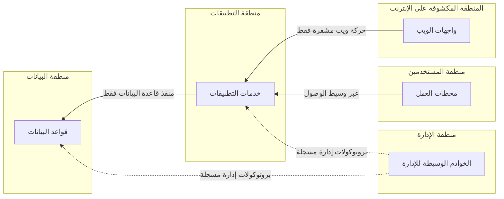

<!-- Generated by scripts/build.mjs from data/patterns/P04.json. Edit the data, then run npm run build. -->

[English](../en/P04-segmentation.md)

# P04 العزل والتقسيم الدقيق

> قسّم البيئة إلى مناطق بحسب الوظيفة ومستوى الثقة، واسمح فقط بالتدفقات التي تحتاجها كل منطقة، وامنع كل ما عداها بينها، حتى لا يفتح نظام واحد مخترق الطريق إلى بقية الأنظمة.

| المجال | أنماط ذات صلة |
| --- | --- |
| الشبكة | [P01 الوصول وفق الثقة الصفرية](P01-zero-trust-access.md)، [P03 الصلاحيات الهامة والحساسة في طبقات](P03-tiered-privileged-access.md)، [P15 النطاق المعزول الخاضع للتنظيم](P15-regulated-enclave.md)، [P13 المناطق والقنوات في التقنيات التشغيلية](P13-ot-zones-and-conduits.md) |

## المشكلة

يستطيع كل نظام في الشبكة المسطحة أن يتصل بأي نظام آخر، فينتقل برنامج الفدية والمتسللون من موطئ القدم الأول إلى أثمن الأصول بأدوات عادية، ويصبح نطاق الضرر لأي اختراق هو الشبكة كلها.

## متى تستخدمه

- تشترك الخوادم وأجهزة المستخدمين وواجهات الإدارة في الشبكات نفسها.
- لا تستطيع تحديد الأنظمة المسموح لها بالاتصال بقواعد بياناتك.
- يُلزمك تنظيم ما بعزل بيئة خاضعة للتنظيم.

## التصميم

حدّد المناطق انطلاقًا من تدفقات البيانات لا من الهيكل التنظيمي، فالمجموعة المعتادة للبدء هي أجهزة المستخدمين والخدمات المكشوفة على الإنترنت وخدمات التطبيقات ومخازن البيانات والإدارة وأدوات الأمن، مع وضع الأنظمة الخاضعة للتنظيم في نطاق معزول خاص بها، ثم اسمح بين المناطق بالتدفقات المسماة فقط، مكتوبة بالمصدر والوجهة والمنفذ والغرض، وامنع كل ما عداها بما في ذلك الاتصال بين أجهزة المستخدمين.

يطبّق التقسيم الدقيق الفكرة نفسها على مستوى كل عبء عمل، إذ تسمح جدران الحماية على الخوادم أو سياسات الشبكة المرتبطة بهوية كل عبء عمل بالاتصالات التي يحتاجها فقط، فيُحتوى التنقل الجانبي حتى داخل المنطقة الواحدة، وابدأ بالمناطق الأعلى قيمة واستعن بسجلات التدفق لمعرفة السلوك الطبيعي قبل تفعيل المنع.

## الضوابط

### أساسي

- **ارسم خريطة المناطق وحافظ على حداثتها:** احتفظ بمخطط محدّث للمناطق وللتدفقات المسموح بها بينها، وراجعه كلما تغيرت المعمارية.
  `NIST PL-8` `NIST CA-9` `CIS 12.4` `CIS 3.8` `ISO A.8.22` `ISO A.8.27`
- **اجعل المنع هو الأصل بين المناطق:** صفِّ الحركة بين المناطق وفق قائمة سماح بالتدفقات المسماة، وامنع كل ما عداها وسجّله.
  `NIST SC-7` `NIST SC-7(5)` `NIST AC-4` `CIS 13.4` `CIS 12.2` `ISO A.8.20` `ISO A.8.22`
- **اعزل واجهات الإدارة:** ضع واجهات إدارة الخوادم وأجهزة الشبكة وأنظمة المحاكاة الافتراضية في منطقة إدارة لا يصل إليها إلا الخوادم الوسيطة المخصصة للإدارة.
  `NIST SC-7` `NIST SC-2` `CIS 12.3` `CIS 12.8` `ISO A.8.22`

### معزز

- **امنع الاتصال بين أجهزة المستخدمين:** امنع محطات العمل من الاتصال ببعضها مباشرة، فتُغلق بذلك طريقًا شائعًا للتنقل الجانبي.
  `NIST SC-7` `NIST AC-4` `CIS 4.5` `CIS 13.4` `ISO A.8.22`
- **اجمع سجلات التدفق عند حدود المناطق:** سجّل تدفقات الشبكة بين المناطق، ومرّرها إلى أنظمة الكشف، واستخدمها لتضييق القواعد.
  `NIST AU-12` `NIST SI-4` `CIS 13.6` `ISO A.8.16`
- **راجع القواعد وفق جدول زمني:** حدّد لكل قاعدة مالكًا وتاريخًا للمراجعة، واحذف القواعد التي لم تعد تمر عبرها أي حركة.
  `NIST CM-6` `NIST SC-7` `CIS 4.2` `ISO A.8.20`

### متقدم

- **طبّق التقسيم الدقيق على أعباء العمل الحرجة:** افرض سياسات لكل عبء عمل على حدة بناءً على هويته في الأنظمة الأعلى قيمة، بحيث لا يصل كل منها إلا إلى اعتمادياته المسماة.
  `NIST AC-4` `NIST SC-7(21)` `CIS 13.4` `CIS 3.12` `ISO A.8.22`
- **اختبر التقسيم كما يختبره المهاجم:** اختبر من كل منطقة أن المسارات غير المسموح بها مغلقة فعلًا، مرة كل ستة أشهر على الأقل وبعد كل تغيير كبير.
  `NIST CA-8` `CIS 18.1` `ISO A.8.22`

## قرارات يجب توثيقها

- ما المناطق، وما التدفقات المسموح بها بينها، ولماذا؟
- أين يُطبّق التقسيم، في جدران حماية الشبكة أم في جدران الحماية على الخوادم أم في مجموعات الأمان السحابية أم في أكثر من موضع؟
- من يوافق على تدفق جديد، وما مدة صلاحية الاستثناء؟

## المفاضلات

- تضيف كل حدود قواعد تحتاج إلى صيانة، وتنجرف مجموعات القواعد سيئة الإدارة تدريجيًا نحو السماح بكل شيء.
- يؤدي تفعيل المنع مبكرًا إلى تعطل التطبيقات ذات الاعتماديات غير الموثقة، لذا تعلّم من سجلات التدفق أولًا.
- تضيف أدوات التقسيم الدقيق وكلاء أو اعتماديات على المنصة يجب تأمينها هي الأخرى.

## أنماط خاطئة يجب تجنبها

- شبكات افتراضية محلية تفصل الحركة لكنها تسمح بأي اتصال بينها.
- قاعدة فُتحت لمشروع ولم تُغلق أبدًا.
- واجهات إدارة يمكن الوصول إليها من شبكة المستخدمين.

## كيف تتحقق منه

- افحص مناطق البيانات والإدارة من محطة عمل أحد المستخدمين، وتأكد أنه لا يستجيب أي شيء.
- قارن قواعد جدار الحماية بالتدفقات الموثقة، واعرض كل قاعدة ليس لها مالك أو غرض.
- حاكِ التنقل الجانبي من محطة عمل إلى أخرى، وتأكد أنه يُمنع ويُكتشف.

## التهديدات التي يتصدى لها

| المرجع | الاسم |
| --- | --- |
| [T1021](https://attack.mitre.org/techniques/T1021/) | الخدمات البعيدة |
| [T1210](https://attack.mitre.org/techniques/T1210/) | استغلال الخدمات البعيدة |
| [T1046](https://attack.mitre.org/techniques/T1046/) | اكتشاف خدمات الشبكة |
| [T1486](https://attack.mitre.org/techniques/T1486/) | تشفير البيانات بقصد الإضرار |

## المراجع

- [ضوابط CIS Controls v8.1](https://www.cisecurity.org/controls/v8-1)
- [منع التنقل الجانبي من المركز الوطني للأمن السيبراني في المملكة المتحدة](https://www.ncsc.gov.uk/guidance/preventing-lateral-movement)
- [إرشادات جدران الحماية وسياساتها NIST SP 800-41 Rev 1](https://csrc.nist.gov/pubs/sp/800/41/r1/final)

