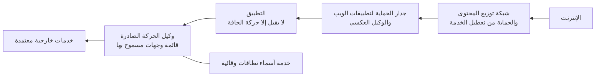

<!-- Generated by scripts/build.mjs from data/patterns/P05.json. Edit the data, then run npm run build. -->

[English](../en/P05-internet-edge-and-egress.md)

# P05 حافة إنترنت محمية وحركة صادرة مضبوطة

> أنهِ كل خدمة مكشوفة على الإنترنت عند حافة محصّنة تمتص الهجمات قبل وصولها إلى التطبيق، ولا تسمح للأنظمة بالوصول إلى الإنترنت إلا عبر مسارات مضبوطة ومسجلة.

| المجال | أنماط ذات صلة |
| --- | --- |
| الشبكة | [P07 بوابة الواجهات البرمجية والتفويض على مستوى الكائن](P07-api-security.md)، [P04 العزل والتقسيم الدقيق](P04-segmentation.md)، [P10 بيانات الرصد ومسار الكشف](P10-detection-telemetry.md)، [P09 حماية تتمحور حول البيانات](P09-data-centric-protection.md) |

## المشكلة

يُعد استغلال التطبيقات المكشوفة للعموم من أكثر طرق الاختراق شيوعًا، كما أن الخوادم القادرة على الوصول إلى أي عنوان على الإنترنت تمنح البرمجيات الضارة قناة مفتوحة لتنزيل الأدوات وإخراج البيانات، ولذلك لا يُكتشف كثير من الاختراقات إلا بعد خروج البيانات.

## متى تستخدمه

- تنشر تطبيقات ويب أو واجهات برمجية على الإنترنت.
- تستطيع خوادمك فتح اتصالات إلى أي عنوان على الإنترنت.
- يجب أن تبقى خدماتك متاحة أثناء هجمات تعطيل الخدمة.

## التصميم

ضع في الاتجاه الوارد طبقة لتوزيع المحتوى والحماية من هجمات تعطيل الخدمة في المقدمة، يليها جدار الحماية لتطبيقات الويب ووكيل عكسي ينهيان اتصال TLS ويوحّدان صيغة الطلبات، ثم يأتي التطبيق الذي لا يقبل الحركة إلا من الحافة، واحرص على إخفاء عناوين الخادم الأصلي حتى لا يمكن تجاوز الحافة.

امنع في الاتجاه الصادر الوصول المباشر من الخوادم إلى الإنترنت، ومرّر ما تحتاجه عبر وكيل أو جدار حماية للحركة الصادرة يعمل بقائمة وجهات مسموح بها مع تصفية DNS والتسجيل، بينما تمر حركة المستخدمين عبر بوابة ويب آمنة سواء كانوا في المكتب أو خارجه.

## الضوابط

### أساسي

- **ضع كل خدمة عامة خلف الحافة:** لا تنشر التطبيقات المكشوفة على الإنترنت إلا عبر جدار الحماية لتطبيقات الويب والوكيل العكسي، واقصر الخوادم الأصلية على قبول الحركة من الحافة وحدها.
  `NIST SC-7` `CIS 13.10` `CIS 12.2` `ISO A.8.20` `ISO A.8.21`
- **امنع الوصول الصادر المباشر من الخوادم:** امنع الخوادم من الوصول إلى الإنترنت مباشرة، واسمح بالوجهات المطلوبة عبر وكيل للحركة الصادرة يعمل بقائمة سماح.
  `NIST SC-7` `NIST SC-7(5)` `NIST AC-4` `CIS 4.4` `ISO A.8.20` `ISO A.8.23`
- **استخدم خدمة DNS وقائية:** استعلم عن الأسماء عبر خوادم DNS تصفّي النطاقات الضارة المعروفة وتحجبها، وسجّل كل استعلام.
  `NIST SC-7` `NIST SI-4` `CIS 9.2` `CIS 8.6` `CIS 4.9` `ISO A.8.23` `ISO A.8.16`

### معزز

- **امتص هجمات تعطيل الخدمة:** استخدم خدمة حماية من هجمات تعطيل الخدمة الموزعة بمستوى مزودي الخدمة تتسع لذروة حركتك، مع حدود للمعدل لكل عميل عند الحافة.
  `NIST SC-5` `ISO A.8.6` `ISO A.8.14`
- **اضبط جدار الحماية لتطبيقات الويب على التطبيق:** شغّل مجموعات القواعد المُدارة في وضع المنع، وأضف قواعد لمسارات التطبيق ومعاملاته الخاصة، وراجع الإنذارات الخاطئة كل أسبوع.
  `NIST SC-7` `NIST SI-4` `CIS 13.10` `ISO A.8.26`
- **سجّل الحركة الصادرة وافحصها:** سجّل كل اتصال صادر مع مصدره ووجهته وحجم البيانات المنقولة، وأطلق تنبيهًا عند عمليات النقل الكبيرة أو غير المعتادة.
  `NIST SI-4(4)` `NIST AU-12` `CIS 13.6` `CIS 8.7` `ISO A.8.16`

### متقدم

- **أضف ضوابط لمكافحة الروبوتات وإساءة الاستخدام:** اكشف حشو بيانات الاعتماد وجمع البيانات الآلي وإساءة الاستخدام الآلية عند الحافة بمؤشرات سلوكية، ثم اختبر العملاء الآليين أو احجبهم في المسارات الحساسة.
  `NIST SI-4` `NIST SC-5` `CIS 13.10` `ISO A.8.16`
- **افحص الحركة الصادرة المشفرة بصورة انتقائية:** افحص الحركة الصادرة المشفرة من الخوادم ومن المستخدمين عاليي المخاطر حيث يسمح القانون والسياسة، واستثنِ فئات مثل المصارف والصحة حفاظًا على الخصوصية.
  `NIST SI-4(4)` `NIST SC-7` `ISO A.8.23`

## قرارات يجب توثيقها

- ما المزود أو المنتجات التي تشكّل الحافة، وكيف تمنع الحركة من تجاوزها؟
- ما الوجهات التي يُسمح للخوادم بالوصول إليها، ومن يوافق على الإضافة إلى القائمة؟
- أين يُنهى اتصال TLS، وكيف تُحمى الشهادات والمفاتيح هناك؟

## المفاضلات

- ترى الحافة السحابية الحركة بعد فك تشفيرها، فتثير أسئلة حول توطين البيانات وخصوصيتها في حالة البيانات الخاضعة للتنظيم.
- تعطّل قوائم الوجهات المسموح بها تحديثات البرامج والتكاملات حتى تكتمل، لذلك ابدأ بوضع المراقبة.
- يقلل جدار الحماية لتطبيقات الويب المخاطر لكنه لا يصلح الشيفرة الضعيفة، كما أن القواعد المتشددة تحجب عملاء حقيقيين.

## أنماط خاطئة يجب تجنبها

- خوادم أصلية ما زالت تقبل الحركة من أي عنوان.
- السماح بكل الحركة الصادرة من شبكة الخوادم.
- ترك جدار الحماية لتطبيقات الويب في وضع المراقبة لسنوات.

## كيف تتحقق منه

- أرسل طلبات مباشرة إلى عنوان الخادم الأصلي، وتأكد أنها تُرفض.
- حاول من أحد الخوادم الوصول إلى عنوان غير موجود في قائمة السماح، وتأكد أنه يُمنع ويُسجَّل.
- استعلم عن نطاق اختبار معروف بأنه ضار، وتأكد أن خدمة DNS الوقائية تحجبه.

## التهديدات التي يتصدى لها

| المرجع | الاسم |
| --- | --- |
| [T1190](https://attack.mitre.org/techniques/T1190/) | استغلال تطبيق مكشوف للعموم |
| [T1498](https://attack.mitre.org/techniques/T1498/) | تعطيل الخدمة على مستوى الشبكة |
| [T1071](https://attack.mitre.org/techniques/T1071/) | بروتوكول طبقة التطبيقات |
| [T1567](https://attack.mitre.org/techniques/T1567/) | التسريب عبر خدمة ويب |
| [T1105](https://attack.mitre.org/techniques/T1105/) | نقل الأدوات إلى الداخل |

## المراجع

- [مجموعة القواعد الأساسية من OWASP لجدران الحماية لتطبيقات الويب](https://coreruleset.org/)
- [إرشادات هجمات تعطيل الخدمة من المركز الوطني للأمن السيبراني في المملكة المتحدة](https://www.ncsc.gov.uk/collection/denial-service-dos-guidance-collection)
- [إرشادات جدران الحماية وسياساتها NIST SP 800-41 Rev 1](https://csrc.nist.gov/pubs/sp/800/41/r1/final)

