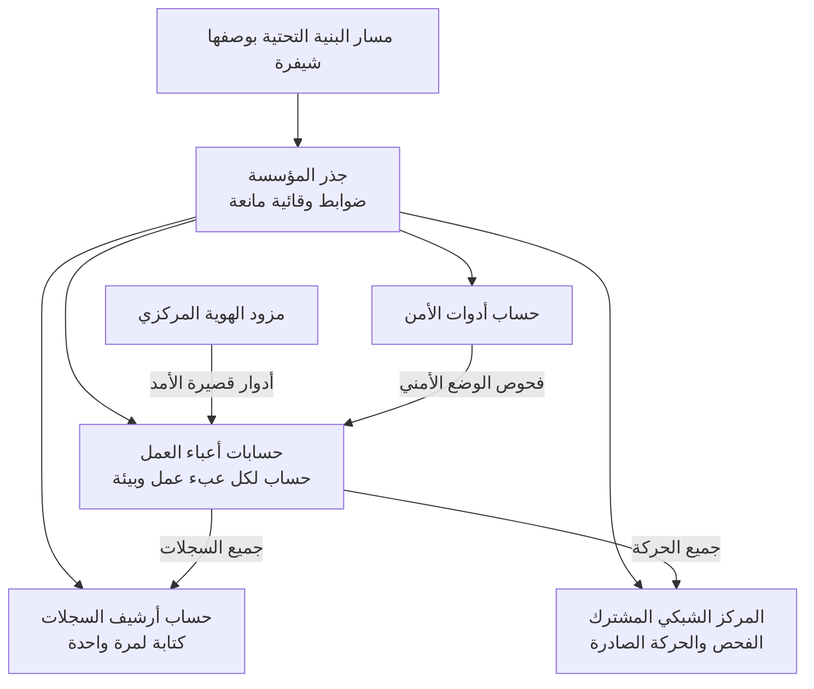

<!-- Generated by scripts/build.mjs from data/patterns/P06.json. Edit the data, then run npm run build. -->

[English](../en/P06-cloud-landing-zone.md)

# P06 منطقة هبوط سحابية بضوابط وقائية

> ابنِ كل عبء عمل سحابي على أساس مُعدّ مسبقًا من حسابات منفصلة وهوية مركزية وضوابط وقائية على مستوى المؤسسة وشبكات مشتركة وسجلات لا تستطيع فرق أعباء العمل إيقافها.

| المجال | أنماط ذات صلة |
| --- | --- |
| المنصة | [P02 الهوية مستوى تحكم](P02-identity-control-plane.md)، [P08 الأسرار والمفاتيح وهوية أعباء العمل](P08-secrets-keys-workload-identity.md)، [P10 بيانات الرصد ومسار الكشف](P10-detection-telemetry.md)، [P16 الضوابط الوقائية لمنصات الحاويات](P16-container-platform-guardrails.md) |

## المشكلة

تُسهّل الحوسبة السحابية إنشاء الموارد وتُسهّل كشفها بالقدر نفسه، فإذا غاب الأساس تشاركت الفرق الحسابات ومنحت صلاحيات واسعة وكشفت وحدات التخزين على الإنترنت خطأً ثم أوقفت السجلات التي كانت ستكشف ذلك.

## متى تستخدمه

- تشغّل أعباء عمل في سحابة عامة أو توشك على ذلك.
- تنشر فرق عدة إلى السحابة كلٌّ على حدة.
- تشترك بيئات الإنتاج وغير الإنتاج في الحسابات أو الاشتراكات نفسها.

## التصميم

استخدم البنية التنظيمية لدى مزود الخدمة لفصل الحسابات أو الاشتراكات أو المشاريع بحسب عبء العمل والبيئة، مع تخصيص حسابات لأدوات الأمن وأرشيف السجلات والشبكات المشتركة والهوية، ثم طبّق الضوابط الوقائية على مستوى المؤسسة، أي سياسات مانعة تحظر ما يجب ألا يحدث أبدًا مثل التخزين المكشوف للعموم وإيقاف السجلات والمناطق السحابية غير المعتمدة، وقواعد كاشفة تنبه إلى أي انحراف عن خط الأساس.

يدخل الأشخاص عبر مزود الهوية المركزي بجلسات أدوار قصيرة الأمد لا بمفاتيح مستخدمين طويلة الأمد، وتمر الحركة بين أعباء العمل وإلى الإنترنت عبر مركز مشترك يمكن فحصها فيه، كما يُعرَّف الأساس كله بوصفه شيفرة تُراجَع وتُنشر عبر مسار آلي، فيمكن إعادة بنائه وتدقيقه.

## الضوابط

### أساسي

- **افصل الحسابات بحسب عبء العمل والبيئة:** امنح كل عبء عمل وكل بيئة حسابًا أو اشتراكًا خاصًا به، وأبقِ بيئة الإنتاج منفصلة عن كل ما سواها.
  `NIST SC-32` `CIS 16.8` `CIS 12.2` `ISO A.8.31` `ISO A.5.23`
- **وحّد الهوية مع وصول قصير الأمد:** أدخل الأشخاص عبر مزود الهوية المركزي بجلسات أدوار، وأزل مفاتيح الوصول طويلة الأمد المخصصة للأشخاص، واحمِ حسابات الجذر أو المسؤول العام بتحقق متعدد العناصر مقاوم للتصيد.
  `NIST IA-2(1)` `NIST AC-2` `NIST IA-5` `CIS 6.5` `CIS 5.6` `ISO A.5.17` `ISO A.8.5`
- **فعّل السجلات على مستوى المؤسسة:** فعّل سجلات مستوى التحكم في كل حساب وكل منطقة سحابية، وأرسلها إلى حساب منفصل لأرشيف السجلات لا تستطيع فرق أعباء العمل تعديله، واحتفظ بها للمدة التي تفرضها التزاماتك.
  `NIST AU-2` `NIST AU-9(2)` `NIST AU-11` `CIS 8.2` `CIS 8.9` `CIS 8.10` `CIS 8.12` `ISO A.8.15`

### معزز

- **افرض الضوابط الوقائية المانعة:** طبّق سياسات على مستوى المؤسسة تمنع التخزين المكشوف للعموم وإيقاف السجلات أو خدمات الأمن والمناطق السحابية غير المعتمدة والموارد غير المشفرة.
  `NIST CM-6` `NIST CM-7` `CIS 4.1` `CIS 3.3` `ISO A.8.9` `ISO A.5.23`
- **راقب الوضع الأمني باستمرار:** شغّل فحوص الوضع الأمني السحابي على جميع الحسابات مقارنة بمعيار مرجعي، ووجّه النتائج إلى الفريق المالك مع موعد نهائي بحسب الخطورة.
  `NIST CA-7` `NIST RA-5` `NIST CM-6` `CIS 4.1` `CIS 7.1` `ISO A.8.8` `ISO A.8.9`
- **مرّر الحركة عبر مركز مشترك:** مرّر الحركة بين أعباء العمل وإلى الإنترنت عبر مركز شبكي مشترك فيه جدران حماية وضبط للحركة الصادرة، وامنح أعباء العمل نقاط وصول خاصة إلى الخدمات السحابية.
  `NIST SC-7` `NIST AC-4` `CIS 12.2` `CIS 13.4` `ISO A.8.20` `ISO A.8.22`

### متقدم

- **عرّف منطقة الهبوط بوصفها شيفرة:** احفظ تعريفات الحسابات والسياسات والشبكات كلها في نظام لإدارة الإصدارات، وراجع التغييرات، وانشرها عبر مسار آلي، وأطلق تنبيهًا عند أي تغيير يتم خارجه.
  `NIST CM-2` `NIST CM-3` `NIST SA-10` `CIS 4.1` `ISO A.8.9` `ISO A.8.32`
- **عالج الانحرافات الحرجة آليًا:** أعد الانحرافات الحرجة إلى وضعها الصحيح آليًا، مثل وحدة تخزين أصبحت مكشوفة للعموم، وأبلغ مالكها.
  `NIST CM-6` `NIST SI-4` `CIS 4.1` `ISO A.8.9`

## قرارات يجب توثيقها

- كيف تُنظَّم الحسابات أو الاشتراكات، ومن يحق له إنشاء حسابات جديدة؟
- ما الضوابط الوقائية المانعة وما الكاشفة، وكيف تُمنح الاستثناءات؟
- ما المناطق السحابية المسموح بها في ضوء التزامات توطين البيانات لديك؟

## المفاضلات

- تُبطئ الضوابط الوقائية القوية الفرق التي تحتاج إلى أمر غير معتاد، لذلك تحتاج الاستثناءات إلى مسار سريع وموثق.
- يُبسّط المركز الشبكي المشترك الفحص، لكنه يضيف تكلفة ونقطة مركزية يجب أن تعمل بتوافرية عالية.
- تضاعف السحابة المتعددة عمل الضوابط الوقائية، لأن ضوابط كل مزود تختلف عن غيره.

## أنماط خاطئة يجب تجنبها

- حساب واحد لكل شيء تجاور فيه بيئة الإنتاج التجارب.
- مفاتيح وصول طويلة الأمد على حواسيب المطورين وفي مستودعات الشيفرة.
- حفظ السجلات في حساب عبء العمل نفسه، حيث يستطيع مهاجم يملك صلاحيات إدارية حذفها.

## كيف تتحقق منه

- حاول إنشاء وحدة تخزين مكشوفة للعموم في أحد حسابات أعباء العمل، وتأكد أن الضابط الوقائي يمنعها.
- اعرض كل مفتاح وصول طويل الأمد والشخص أو النظام الذي يقف خلفه.
- حاول إيقاف السجلات بصفتك مسؤولًا عن عبء عمل، وتأكد أن المحاولة تُرفض وتُطلق تنبيهًا.

## التهديدات التي يتصدى لها

| المرجع | الاسم |
| --- | --- |
| [T1078.004](https://attack.mitre.org/techniques/T1078/004/) | الحسابات الصالحة، الحسابات السحابية |
| [T1530](https://attack.mitre.org/techniques/T1530/) | بيانات من التخزين السحابي |
| [T1537](https://attack.mitre.org/techniques/T1537/) | نقل البيانات إلى حساب سحابي |
| [T1685.002](https://attack.mitre.org/techniques/T1685/002/) | تعطيل الأدوات أو تعديلها، تعطيل السجل السحابي أو تعديله |

## المراجع

- [مصفوفة الضوابط السحابية من تحالف أمن السحابة](https://cloudsecurityalliance.org/research/cloud-controls-matrix)
- [معايير CIS Benchmarks للإعدادات الآمنة لدى مزودي السحابة](https://www.cisecurity.org/cis-benchmarks)
- [إرشادات التحكم في الوصول للأنظمة السحابية NIST SP 800-210](https://csrc.nist.gov/pubs/sp/800/210/final)

