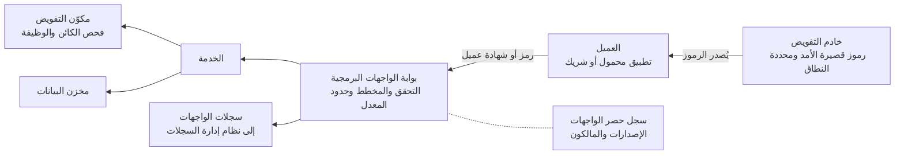

<!-- Generated by scripts/build.mjs from data/patterns/P07.json. Edit the data, then run npm run build. -->

[English](../en/P07-api-security.md)

# P07 بوابة الواجهات البرمجية والتفويض على مستوى الكائن

> لا تكشف الواجهات البرمجية إلا عبر بوابة تتحقق من هوية كل مستدعٍ وتفرض الحدود، واجعل الواجهة نفسها تتحقق عند كل كائن من أن المستدعي مخوّل بالتعامل معه.

| المجال | أنماط ذات صلة |
| --- | --- |
| التطبيقات | [P05 حافة إنترنت محمية وحركة صادرة مضبوطة](P05-internet-edge-and-egress.md)، [P02 الهوية مستوى تحكم](P02-identity-control-plane.md)، [P08 الأسرار والمفاتيح وهوية أعباء العمل](P08-secrets-keys-workload-identity.md)، [P11 سلسلة إمداد برمجيات موثوقة](P11-software-supply-chain.md) |

## المشكلة

تكشف الواجهات البرمجية منطق الأعمال مباشرة، وأخطر ثغراتها ثغرات التفويض، كأن يغيّر المستدعي رقم حساب في الطلب فيحصل على بيانات شخص آخر، وتلتقط البوابات الحركة غير الموثقة والمسيئة، لكن الخدمة وحدها تعرف مالك كل كائن.

## متى تستخدمه

- تستهلك تطبيقات الأجهزة المحمولة أو الشركاء أو أنظمة أخرى واجهاتك البرمجية.
- تعيد واجهاتك البرمجية بيانات العملاء أو الحسابات أو المدفوعات أو تعدّلها.
- لا تملك سجل حصر كاملًا لواجهاتك البرمجية وإصداراتها.

## التصميم

انشر الواجهات البرمجية عبر بوابة تتحقق من رموز الوصول وفق OAuth 2.0 أو من شهادات العملاء في TLS المتبادل، وترفض الطلبات غير المطابقة لمخطط الواجهة، وتفرض حدودًا للمعدل والحصص لكل عميل، ثم أصدر الرموز من خادم تفويض بأعمار قصيرة ونطاقات ضيقة وقيود على الجهة المستهدفة، واربطها بالعميل كلما أمكن.

تحقق داخل الخدمة من تفويض كل طلب على مستوى الكائن والوظيفة استنادًا إلى هوية المستدعي، مستخدمًا مكوّن تفويض مشتركًا بدلًا من عمليات تحقق متناثرة في الشيفرة، واحتفظ بسجل حصر لكل واجهة وإصدارها وبيئتها، ثم أوقف الإصدارات القديمة وفق جدول زمني.

## الضوابط

### أساسي

- **تحقق من هوية كل استدعاء عند البوابة:** ارفض أي طلب لا يحمل رمزًا صالحًا أو شهادة عميل صالحة، ولا تعتمد أبدًا على مفاتيح الواجهات وحدها لحماية البيانات الحساسة.
  `NIST IA-2` `NIST IA-9` `NIST AC-3` `CIS 16.11` `ISO A.8.5` `ISO A.8.26`
- **تحقق من تفويض كل كائن وكل وظيفة:** تحقق داخل الخدمة في كل طلب من أن المستدعي يحق له الوصول إلى الكائن المحدد وتنفيذ الوظيفة المحددة، وغطِّ ذلك باختبارات آلية.
  `NIST AC-3` `NIST AC-6` `CIS 16.10` `CIS 16.12` `ISO A.8.26` `ISO A.8.28`
- **تحقق من المدخلات وفق المخطط:** تحقق من الطلبات وفق مواصفات الواجهة عند البوابة وداخل الخدمة، وارفض الحقول غير المعروفة والحمولات المفرطة الحجم.
  `NIST SI-10` `CIS 16.12` `ISO A.8.26` `ISO A.8.28`
- **احتفظ بسجل حصر للواجهات البرمجية:** سجّل كل واجهة برمجية مع مالكها وإصدارها وبيئتها وتصنيف بياناتها والجهات التي تستهلكها، وأنشئ هذا السجل من البوابة كلما أمكن.
  `NIST CM-8` `ISO A.5.9`

### معزز

- **قيّد المعدل والاستهلاك:** طبّق حدودًا للمعدل والحصص وحجم الحمولة لكل عميل ولكل نقطة نهاية، مع حدود أشد للعمليات المكلفة أو الحساسة.
  `NIST SC-5` `ISO A.8.6`
- **أصدر رموزًا قصيرة الأمد ومحددة النطاق:** استخدم رموز وصول تنتهي صلاحيتها خلال دقائق، ولا تحمل إلا النطاقات اللازمة، وتقتصر على الواجهة المستهدفة.
  `NIST IA-5` `NIST SC-23` `CIS 16.11` `ISO A.8.5`
- **استخدم TLS المتبادل مع الشركاء:** تحقق من استدعاءات الشركاء والاستدعاءات بين الأنظمة عبر TLS المتبادل أو رموز مرتبطة بالشهادات، مع إصدار الشهادات وتدويرها آليًا.
  `NIST IA-9` `NIST SC-8` `CIS 3.10` `ISO A.8.24` `ISO A.5.14`

### متقدم

- **احمِ مسارات الأعمال الحساسة:** اكشف إساءة الاستخدام الآلية وقيّدها في مسارات مثل فتح الحسابات والمدفوعات وطلبات كلمات المرور لمرة واحدة، عبر حدود لكل مسار ومؤشرات سلوكية وتحقق أقوى كلما ارتفعت المخاطر.
  `NIST SI-4` `NIST AC-3` `ISO A.8.16` `ISO A.8.26`
- **اختبر التفويض باستمرار:** شغّل في مسار النشر اختبارات آلية تستدعي كل نقطة نهاية بهويات مستخدمين وأدوار أخرى، وأفشل البناء إذا نجح أي من هذه الاستدعاءات.
  `NIST SA-11` `NIST CA-8` `CIS 16.12` `CIS 16.13` `ISO A.8.29`

## قرارات يجب توثيقها

- ما خادم التفويض الذي يُصدر الرموز، وما أعمار الرموز ونطاقاتها لكل واجهة؟
- أين يقع التفويض على مستوى الكائن، في كل خدمة أم في مكتبة مشتركة أم في محرك سياسات مركزي؟
- كيف يُضاف العملاء من الشركاء وتُصدر بيانات اعتمادهم ثم تُسحب عند انتهاء العلاقة؟

## المفاضلات

- يجعل محرك السياسات المركزي التفويض متسقًا وقابلًا للتدقيق، لكنه يضيف زمن تأخير واعتمادية إلى كل طلب.
- تحسّن الأعمار القصيرة للرموز الأمان، لكنها تزيد الحمل على خادم التفويض والتعقيد على العملاء.
- يلتقط التحقق الصارم من المخطط الهجمات، لكنه يعطّل أيضًا العملاء الذين يرسلون حقولًا غير متوقعة، لذا اعتمد إصدارات واضحة لواجهاتك.

## أنماط خاطئة يجب تجنبها

- الوثوق بمعرّف الكائن لمجرد أن هوية المستدعي موثقة.
- مفاتيح واجهات طويلة الأمد تُرسل إلى الشركاء عبر البريد الإلكتروني.
- ترك إصدارات قديمة من الواجهات تعمل دون الضوابط التي أُضيفت إلى الإصدارات الأحدث.

## كيف تتحقق منه

- استدعِ كل نقطة نهاية برمز مستخدم ثانٍ ومعرّفات كائنات المستخدم الأول، وتأكد أن كل استدعاء يُرفض.
- قارن قائمة المسارات في البوابة بسجل الحصر، وتحقق من أي عنصر ناقص في أي منهما.
- أرسل طلبات تتجاوز حد المعدل وأخرى بحقول غير معروفة، وتأكد أنها تُرفض.

## التهديدات التي يتصدى لها

| المرجع | الاسم |
| --- | --- |
| [T1190](https://attack.mitre.org/techniques/T1190/) | استغلال تطبيق مكشوف للعموم |
| [T1528](https://attack.mitre.org/techniques/T1528/) | سرقة رمز وصول التطبيق |
| [API1:2023](https://owasp.org/API-Security/editions/2023/en/0xa1-broken-object-level-authorization/) | كسر التفويض على مستوى الكائن |
| [API2:2023](https://owasp.org/API-Security/editions/2023/en/0xa2-broken-authentication/) | كسر التحقق من الهوية |
| [API3:2023](https://owasp.org/API-Security/editions/2023/en/0xa3-broken-object-property-level-authorization/) | كسر التفويض على مستوى خصائص الكائن |
| [API4:2023](https://owasp.org/API-Security/editions/2023/en/0xa4-unrestricted-resource-consumption/) | استهلاك الموارد دون قيود |
| [API5:2023](https://owasp.org/API-Security/editions/2023/en/0xa5-broken-function-level-authorization/) | كسر التفويض على مستوى الوظيفة |
| [API6:2023](https://owasp.org/API-Security/editions/2023/en/0xa6-unrestricted-access-to-sensitive-business-flows/) | الوصول غير المقيد إلى مسارات الأعمال الحساسة |
| [API9:2023](https://owasp.org/API-Security/editions/2023/en/0xa9-improper-inventory-management/) | قصور حصر الواجهات البرمجية |

## المراجع

- [قائمة OWASP لأهم ١٠ مخاطر في أمن الواجهات البرمجية لعام ٢٠٢٣](https://owasp.org/API-Security/editions/2023/en/0x11-t10/)
- [معيار OWASP للتحقق من أمن التطبيقات ASVS، الإصدار ٥٫٠](https://github.com/OWASP/ASVS)
- [أفضل الممارسات الحالية لأمن OAuth 2.0 في الوثيقة RFC 9700](https://datatracker.ietf.org/doc/rfc9700/)

