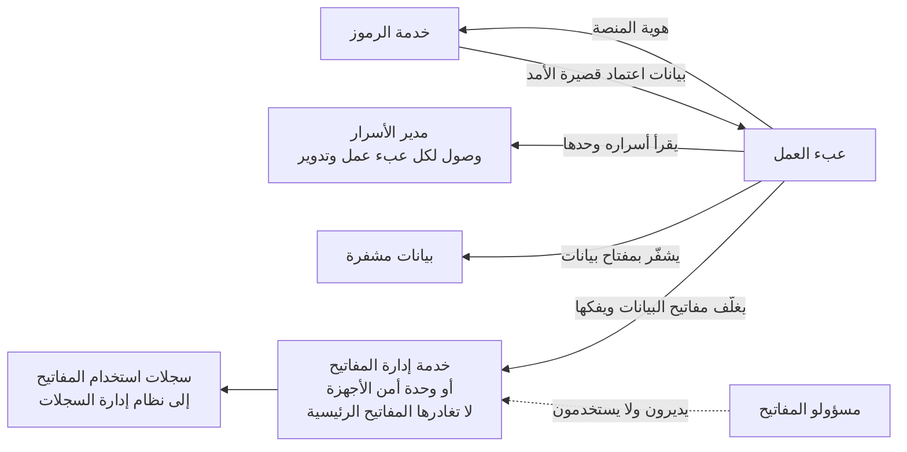

<!-- Generated by scripts/build.mjs from data/patterns/P08.json. Edit the data, then run npm run build. -->

[English](../en/P08-secrets-keys-workload-identity.md)

# P08 الأسرار والمفاتيح وهوية أعباء العمل

> أبعد الأسرار عن الشيفرة، وامنح كل عبء عمل هوية خاصة به بدلًا من كلمة مرور مشتركة، واحفظ مفاتيح التشفير في خدمة لإدارة المفاتيح مع الفصل بين من يدير المفاتيح والأنظمة التي تستخدمها.

| المجال | أنماط ذات صلة |
| --- | --- |
| المنصة | [P06 منطقة هبوط سحابية بضوابط وقائية](P06-cloud-landing-zone.md)، [P09 حماية تتمحور حول البيانات](P09-data-centric-protection.md)، [P11 سلسلة إمداد برمجيات موثوقة](P11-software-supply-chain.md)، [P16 الضوابط الوقائية لمنصات الحاويات](P16-container-platform-guardrails.md) |

## المشكلة

تنتهي كلمات المرور ومفاتيح الواجهات والشهادات في الشيفرة المصدرية وملفات الإعداد ومتغيرات مسارات النشر ورسائل المحادثة، حيث تُنسخ وتتسرب ونادرًا ما تُدوَّر، وقد يكفي تسرب مفتاح سحابي واحد أو كلمة مرور واحدة لقاعدة بيانات لوقوع اختراق، كما أن قوة التشفير لا تتجاوز قوة حماية مفاتيحه.

## متى تستخدمه

- تتصل التطبيقات بقواعد البيانات أو قوائم الرسائل أو الواجهات ببيانات اعتماد مخزنة.
- تشفّر البيانات وتحتاج إلى تحديد من يتحكم في المفاتيح.
- يكشف فحص الأسرار وجود بيانات اعتماد في مستودعاتك.

## التصميم

امنح أعباء العمل هويات تصدرها المنصة، مثل هويات أعباء العمل السحابية ورموز حسابات الخدمة في Kubernetes وشهادات SPIFFE، واستخدمها للحصول على بيانات اعتماد قصيرة الأمد أثناء التشغيل، وإذا تعذّر تجنب سر ثابت فاحفظه في مدير للأسرار واجعل كل عبء عمل يقرأ أسراره وحدها، ثم دوّره آليًا ولا تكتبه أبدًا في الشيفرة أو صور الحاويات أو السجلات.

شفّر البيانات بمفاتيح محفوظة في خدمة لإدارة المفاتيح أو في وحدة أمن الأجهزة، مستخدمًا التشفير المغلف بحيث تُغلَّف مفاتيح البيانات بمفاتيح رئيسية لا تغادر الخدمة أبدًا، وافصل الأدوار التي تدير المفاتيح عن الأدوار التي تستخدمها، وسجّل كل استخدام لأي مفتاح، ثم خطّط لكيفية تدوير كل مفتاح أو إبطاله بما في ذلك مفاتيح جهة إصدار الشهادات لديك.

## الضوابط

### أساسي

- **افحص الأسرار وامنعها:** افحص المستودعات ومسارات النشر وصور الحاويات بحثًا عن الأسرار، وامنع الالتزامات التي تحتوي عليها، ودوّر أي سر انكشف ولو مرة واحدة.
  `NIST IA-5` `CIS 16.12` `ISO A.5.17` `ISO A.8.28`
- **استخدم مديرًا للأسرار:** احفظ أسرار التطبيقات في مدير للأسرار يمنح الوصول لكل عبء عمل على حدة ويسجّل عمليات الوصول ويدوّر الأسرار آليًا حيث يدعم النظام المستهدف ذلك.
  `NIST IA-5` `NIST SC-28` `ISO A.5.17` `ISO A.8.24`
- **احفظ المفاتيح في خدمة لإدارة المفاتيح:** أنشئ مفاتيح التشفير واحفظها في خدمة لإدارة المفاتيح أو في وحدة أمن الأجهزة، لا في الملفات أو إعدادات التطبيقات.
  `NIST SC-12` `NIST SC-13` `CIS 3.11` `ISO A.8.24`

### معزز

- **استبدل الأسرار الثابتة بهوية أعباء العمل:** تحقق من هوية أعباء العمل أمام الخدمات السحابية وفيما بينها بهويات تصدرها المنصة وبيانات اعتماد قصيرة الأمد.
  `NIST IA-9` `NIST IA-5` `ISO A.8.5`
- **افصل إدارة المفاتيح عن استخدامها:** امنح حق إدارة المفاتيح وحق استخدامها في التشفير لأدوار مختلفة، واشترط وجود شخصين في عمليات المفاتيح التي لا يمكن التراجع عنها.
  `NIST AC-5` `NIST SC-12` `ISO A.5.3` `ISO A.8.24`
- **أتمت دورة حياة الشهادات:** أصدر الشهادات وجدّدها آليًا، واحتفظ بسجل حصر لها مع تواريخ انتهائها، وأطلق تنبيهًا قبل انتهائها بوقت كافٍ.
  `NIST SC-12` `NIST SC-17` `ISO A.8.24`

### متقدم

- **استخدم مفاتيح تتحكم فيها للبيانات الخاضعة للتنظيم:** احمِ البيانات الخاضعة للتنظيم بمفاتيح تتحكم فيها داخل وحدة أمن الأجهزة، مع خطة خروج إذا انتهت العلاقة مع المزود.
  `NIST SC-12` `NIST SC-13` `CIS 3.11` `ISO A.8.24` `ISO A.5.23`
- **خطّط للمرونة في التشفير:** احتفظ بسجل حصر للخوارزميات وأطوال المفاتيح ومواضع استخدام كل منها، حتى تستطيع الانتقال إلى خوارزميات ما بعد الحوسبة الكمية دون إعادة تصميم.
  `NIST SC-13` `NIST CM-8` `ISO A.8.24`

## قرارات يجب توثيقها

- ما مدير الأسرار وخدمة إدارة المفاتيح المعتمدان معيارًا، ومن يشغّلهما؟
- ما البيانات التي تحتاج إلى مفاتيح تتحكم فيها أو إلى وحدة أمن الأجهزة؟
- ما فترة التدوير لكل نوع من الأسرار والمفاتيح، وكيف يُختبر التدوير؟

## المفاضلات

- يُعد مدير الأسرار هدفًا ثمينًا واعتمادية عند بدء التشغيل، فيجب أن يعمل بتوافرية عالية وأن تُضبط إدارته بإحكام.
- تضيف وحدات أمن الأجهزة تكلفة وتتطلب مهارة تشغيلية، وفقدان المفتاح يعني فقدان البيانات.
- يعطّل التدوير المتسارع الأنظمة التي تخزّن بيانات الاعتماد مؤقتًا، لذا دوّرها مع فترة تداخل.

## أنماط خاطئة يجب تجنبها

- أسرار في ملفات البيئة تُرفع إلى المستودع.
- كلمة مرور واحدة لحساب خدمة تتشاركها تطبيقات كثيرة ولا تتغير أبدًا.
- حفظ مفاتيح التشفير على الخادم نفسه الذي يحفظ البيانات التي تحميها.

## كيف تتحقق منه

- شغّل أداة لفحص الأسرار على جميع المستودعات بما فيها تاريخها، وتأكد أن النتائج صفر أو أنها دُوّرت بالفعل.
- اختر عبء عمل واعرض كل بيانات الاعتماد التي يستطيع الحصول عليها، وتأكد أن كلًا منها ضروري وقصير الأمد.
- تأكد أن مسؤول المفاتيح لا يستطيع فك تشفير البيانات وأن مستخدم المفاتيح لا يستطيع حذفها.

## التهديدات التي يتصدى لها

| المرجع | الاسم |
| --- | --- |
| [T1552.001](https://attack.mitre.org/techniques/T1552/001/) | بيانات اعتماد غير مؤمنة، بيانات الاعتماد في الملفات |
| [T1528](https://attack.mitre.org/techniques/T1528/) | سرقة رمز وصول التطبيق |
| [T1078.004](https://attack.mitre.org/techniques/T1078/004/) | الحسابات الصالحة، الحسابات السحابية |

## المراجع

- [توصيات إدارة المفاتيح NIST SP 800-57 Part 1 Rev 5](https://csrc.nist.gov/pubs/sp/800/57/pt1/r5/final)
- [دليل OWASP المختصر لإدارة الأسرار](https://cheatsheetseries.owasp.org/cheatsheets/Secrets_Management_Cheat_Sheet.html)
- [معيار SPIFFE لهويات أعباء العمل](https://spiffe.io/)
- [أداة مفتاح لحصر التشفير والجاهزية لما بعد الحوسبة الكمية](https://github.com/SiteQ8/miftah)

