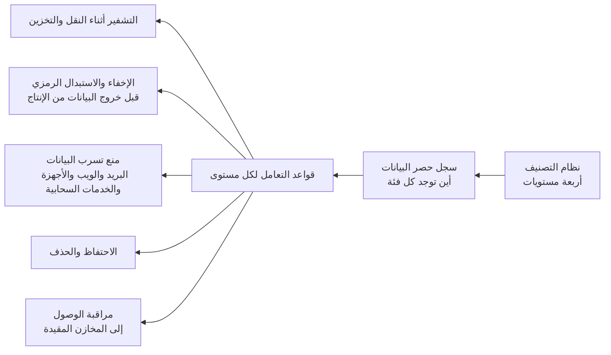

<!-- Generated by scripts/build.mjs from data/patterns/P09.json. Edit the data, then run npm run build. -->

[English](../en/P09-data-centric-protection.md)

# P09 حماية تتمحور حول البيانات

> صنّف البيانات، ثم اجعل التصنيف يحدد طريقة حفظها وتشفيرها وإخفائها ومشاركتها والاحتفاظ بها ومراقبتها، حتى تتبع الحماية البيانات أينما ذهبت.

| المجال | أنماط ذات صلة |
| --- | --- |
| البيانات | [P08 الأسرار والمفاتيح وهوية أعباء العمل](P08-secrets-keys-workload-identity.md)، [P05 حافة إنترنت محمية وحركة صادرة مضبوطة](P05-internet-edge-and-egress.md)، [P15 النطاق المعزول الخاضع للتنظيم](P15-regulated-enclave.md)، [P14 حواجز الحماية لتطبيقات النماذج اللغوية والوكلاء الذكيين](P14-llm-application-guardrails.md)، [P26 تبادل آمن للبيانات مع الشركاء](P26-partner-data-exchange.md) |

## المشكلة

تغفل الضوابط المبنية حول الأنظمة أن البيانات تتنقل، فتنتهي نسخ منها في بيئات الاختبار ومنصات التحليل وجداول البيانات وأدوات الخدمات السحابية التي لم تُصمَّم لحفظها، ولا يمكنك حماية ما لم تكتشفه بعد ولا ترتيب الأولويات دون معرفة الأهم.

## متى تستخدمه

- تحتفظ ببيانات شخصية أو مالية أو صحية.
- تُنسخ بيانات الإنتاج إلى بيئات الاختبار أو التحليل أو إلى الشركاء.
- يُلزمك قانون لحماية البيانات أو جهة تنظيمية بمعرفة أماكن وجود البيانات الشخصية.

## التصميم

ابدأ بنظام تصنيف قصير يضم عادةً أربعة مستويات مثل عام وداخلي وسري ومقيد، وبسجل حصر للبيانات يوثق أماكن وجود كل فئة ومسارات تدفقها، ثم اربط بكل مستوى قواعد تعامل، أي التشفير أثناء النقل في كل مكان، والتشفير أثناء التخزين بمفاتيح تتناسب مع الحساسية، وإخفاء البيانات أو استبدالها رمزيًا قبل خروجها من بيئة الإنتاج، وحدودًا لمدة الاحتفاظ بها.

طبّق القواعد حيث تتحرك البيانات، فراقب نشاط قواعد البيانات في المخازن المقيدة، وشغّل منع تسرب البيانات على قنوات البريد الإلكتروني والويب والأجهزة الطرفية والخدمات السحابية التي يستخدمها الناس، واطلب من مالكي البيانات مراجعة من يملك حق الوصول إليها، ثم قلّل ما تجمعه وما تحتفظ به قدر الإمكان، لأن أكثر البيانات أمانًا هي البيانات التي لا تحتفظ بها.

## الضوابط

### أساسي

- **حدّد نظامًا لتصنيف البيانات:** اعتمد نظام تصنيف قصيرًا مع أمثلة واضحة وقواعد تعامل لكل مستوى، وحدّد مالكًا لكل مجموعة بيانات رئيسية.
  `NIST RA-2` `CIS 3.7` `ISO A.5.12` `ISO A.5.13`
- **أنشئ سجل حصر للبيانات:** سجّل أماكن حفظ كل فئة من البيانات ومعالجتها بما في ذلك الخدمات السحابية والنسخ الاحتياطية، ووثّق تدفقات البيانات الرئيسية.
  `NIST CM-8` `CIS 3.2` `CIS 3.8` `ISO A.5.9`
- **شفّر البيانات أثناء النقل والتخزين:** استخدم TLS 1.2 أو ما بعده لكل حركة تحمل بيانات غير عامة، وشفّر كل مخزن يحفظ بيانات سرية أو مقيدة.
  `NIST SC-8` `NIST SC-28` `CIS 3.10` `CIS 3.11` `ISO A.8.24`

### معزز

- **أخفِ البيانات أو استبدلها رمزيًا خارج بيئة الإنتاج:** استبدل الحقول الحساسة بقيم مخفية أو رمزية قبل وصول البيانات إلى بيئات الاختبار أو التحليل أو إلى الشركاء.
  `NIST SI-19` `ISO A.8.11` `ISO A.8.33`
- **شغّل منع تسرب البيانات على القنوات الرئيسية:** راقب خروج البيانات المقيدة عبر البريد الإلكتروني والرفع إلى مواقع الويب ووسائط التخزين الخارجية والخدمات السحابية المعتمدة، وامنعه حين تكون الحالة واضحة بما يكفي.
  `NIST AC-4` `NIST SC-7` `CIS 3.13` `ISO A.8.12`
- **سجّل الوصول إلى البيانات المقيدة:** سجّل من قرأ البيانات المقيدة أو عدّلها، وأطلق تنبيهًا عند الكميات غير المعتادة أو عند الوصول دون حاجة عمل.
  `NIST AU-2` `NIST AU-12` `CIS 3.14` `ISO A.8.15`

### متقدم

- **خصّص المفاتيح بحسب حساسية البيانات:** استخدم مفاتيح منفصلة لكل فئة بيانات ولكل مستأجر أو وحدة أعمال، حتى يكشف اختراق مفتاح واحد أقل قدر ممكن من البيانات.
  `NIST SC-12` `CIS 3.11` `ISO A.8.24`
- **افرض مدد الاحتفاظ والحذف:** احذف البيانات آليًا عند انتهاء مدة الاحتفاظ بها، بما في ذلك من منصات التحليل والنسخ الاحتياطية حيث يسمح القانون.
  `NIST SI-12` `CIS 3.4` `CIS 3.5` `ISO A.8.10` `ISO A.5.33`

## قرارات يجب توثيقها

- ما مستويات التصنيف، ومن يملك كل مجموعة بيانات رئيسية؟
- ما البيانات التي يجوز خروجها من بيئة الإنتاج، وبأي صيغة؟
- ما مدة الاحتفاظ بكل فئة من البيانات، وكيف يُثبت حذفها؟

## المفاضلات

- ينتج منع تسرب البيانات إنذارات خاطئة تُزعج الناس، لذا ابدأ بالمراقبة ولا تمنع إلا أوضح الحالات.
- يقلل الاستبدال الرمزي انكشاف البيانات، لكنه يضيف خدمة حرجة يجب أن تكون متاحة ومحمية.
- تُربك كثرة مستويات التصنيف الناس، والمرتبكون يخطئون في التصنيف.

## أنماط خاطئة يجب تجنبها

- نسخ قواعد بيانات الإنتاج إلى بيئات الاختبار ببيانات عملاء حقيقية.
- تقديم التشفير أثناء التخزين على أنه الحل لكل مخاطر البيانات.
- سياسة تصنيف لا يطبّقها أي نظام.

## كيف تتحقق منه

- ابحث في بيئات الاختبار والتحليل عن معرّفات عملاء حقيقية.
- أرسل مستندًا تجريبيًا مصنفًا مقيدًا عبر البريد الإلكتروني وعبر الرفع إلى موقع ويب، وتأكد أنه يُمنع أو يُطلق تنبيهًا.
- اختر مجموعة بيانات مقيدة وتأكد أنك تستطيع عرض كل من وصل إليها في الشهر الماضي.

## التهديدات التي يتصدى لها

| المرجع | الاسم |
| --- | --- |
| [T1530](https://attack.mitre.org/techniques/T1530/) | بيانات من التخزين السحابي |
| [T1567](https://attack.mitre.org/techniques/T1567/) | التسريب عبر خدمة ويب |
| [T1048](https://attack.mitre.org/techniques/T1048/) | التسريب عبر بروتوكول بديل |
| [T1213](https://attack.mitre.org/techniques/T1213/) | بيانات من مستودعات المعلومات |

## المراجع

- [إطار الخصوصية من NIST](https://www.nist.gov/privacy-framework)
- [إزالة المعرّفات من مجموعات البيانات NIST SP 800-188](https://csrc.nist.gov/pubs/sp/800/188/final)
- [دليل OWASP المختصر للتخزين المشفر](https://cheatsheetseries.owasp.org/cheatsheets/Cryptographic_Storage_Cheat_Sheet.html)

