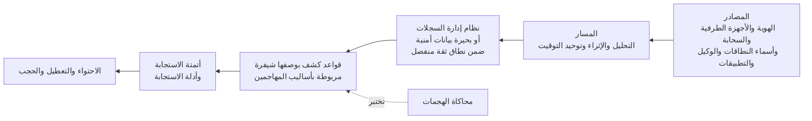

<!-- Generated by scripts/build.mjs from data/patterns/P10.json. Edit the data, then run npm run build. -->

[English](../en/P10-detection-telemetry.md)

# P10 بيانات الرصد ومسار الكشف

> اجمع السجلات التي تجيب عن أسئلة كشف حقيقية، وانقلها عبر مسار موثوق، ثم حوّلها إلى قواعد كشف مُختبرة واستجابات مُتمرَّن عليها، لأنك لا تستطيع الدفاع عما لا تراه.

| المجال | أنماط ذات صلة |
| --- | --- |
| العمليات | [P01 الوصول وفق الثقة الصفرية](P01-zero-trust-access.md)، [P02 الهوية مستوى تحكم](P02-identity-control-plane.md)، [P03 الصلاحيات الهامة والحساسة في طبقات](P03-tiered-privileged-access.md)، [P12 استعادة صامدة أمام برامج الفدية](P12-resilient-recovery.md) |

## المشكلة

تجمع مؤسسات كثيرة كميات هائلة من السجلات ومع ذلك تفوتها الهجمات، لأن المصادر المهمة غائبة والساعات غير متزامنة ولم يكتب أحد قواعد كشف للهجمات التي تخشاها، بينما تصل التنبيهات دون دليل استجابة، كما يستهدف المهاجمون السجلات نفسها فيعطلونها ليختفوا.

## متى تستخدمه

- لن تعرف اليوم إذا استُخدم حساب مسؤول ليلًا من دولة جديدة.
- تبقى السجلات في كل نظام على حدة ولا تُقرأ إلا بعد وقوع حادثة.
- تسألك جهة تنظيمية أو مدقق عن طريقة كشفك للهجمات واستجابتك لها.

## التصميم

انطلق من أسئلة الكشف لا من مصادر البيانات، فاكتب قائمة بالهجمات التي تحتاج أكثر من غيرها إلى كشفها، واربطها بأساليب ATT&CK، ثم اجمع بيانات الرصد التي تكشفها، وهي عادةً سجلات الهوية والدخول وبيانات الكشف والاستجابة على الأجهزة الطرفية وسجلات مستوى التحكم السحابي وسجلات DNS والوكيل وسجلات التطبيقات الحرجة، ثم وحّد التوقيت في كل مكان، وأرسل كل ذلك عبر مسار يحلل البيانات ويثريها قبل وصولها إلى نظام إدارة سجلات الأحداث ومراقبة الأمن السيبراني أو إلى بحيرة بيانات أمنية ضمن نطاق ثقة منفصل.

اكتب قواعد الكشف بوصفها شيفرة، واختبرها بهجمات محاكاة، وامنح كل قاعدة دليل استجابة ومالكًا ودرجة خطورة، ثم أتمت الأجزاء المتكررة من الاستجابة مثل إثراء التنبيه وعزل جهاز وتعطيل حساب، وقِس الوقت المستغرق للكشف والاستجابة.

## الضوابط

### أساسي

- **اجمع المصادر الأساسية:** اجمع مركزيًا سجلات الهوية والدخول وبيانات الكشف والاستجابة على الأجهزة الطرفية وسجلات مستوى التحكم السحابي وسجلات جدران الحماية والوكيل وسجلات استعلامات DNS.
  `NIST AU-2` `NIST AU-12` `NIST SI-4` `CIS 8.2` `CIS 8.6` `CIS 8.7` `CIS 8.9` `ISO A.8.15` `ISO A.8.16`
- **وحّد التوقيت:** اربط كل الأنظمة بمصادر التوقيت الموثوقة نفسها، حتى تتطابق أوقات الأحداث القادمة من أنظمة مختلفة.
  `NIST AU-8` `CIS 8.4` `ISO A.8.17`
- **احمِ السجلات:** احفظ السجلات حيث لا يستطيع مسؤولو الأنظمة المراقَبة تعديلها أو حذفها، واحتفظ بها المدة التي تفرضها التزاماتك على الأقل.
  `NIST AU-9` `NIST AU-9(2)` `NIST AU-11` `CIS 8.3` `CIS 8.10` `ISO A.8.15`
- **انشر الكشف والاستجابة على الأجهزة الطرفية:** شغّل الكشف والاستجابة على الخوادم وأجهزة المستخدمين، مع وصول التنبيهات إلى فريق أمني على مدار الساعة، داخليًا كان أو عبر خدمة مُدارة.
  `NIST SI-4` `NIST SI-3` `CIS 10.1` `CIS 13.2` `ISO A.8.7` `ISO A.8.16`

### معزز

- **اكتب قواعد الكشف انطلاقًا من التهديدات:** ابنِ قواعد كشف للأساليب الواردة في نموذج التهديدات لديك، بدءًا بإساءة استخدام بيانات الاعتماد وتغيير الصلاحيات والعبث بالسجلات، واربط كلًا منها بإطار ATT&CK.
  `NIST SI-4` `NIST AU-6` `CIS 13.1` `CIS 13.11` `ISO A.8.16`
- **اجعل لكل تنبيه دليل استجابة:** وثّق خطوات الفرز والاستجابة لكل قاعدة كشف مع المالكين ومسارات التصعيد، وتمرّن على أهمها.
  `NIST IR-4` `NIST IR-8` `CIS 17.4` `ISO A.5.24` `ISO A.5.26`
- **أطلق تنبيهًا عند تعطل السجلات:** اكشف توقف أي مصدر عن الإرسال أو تغيير إعدادات السجلات أو تعطيل خدمة التدقيق، وتعامل مع ذلك بوصفه حدثًا أمنيًا.
  `NIST AU-5` `NIST SI-4` `ISO A.8.16`

### متقدم

- **اختبر قواعد الكشف بهجمات محاكاة:** نفّذ محاكاة للهجمات وفق جدول زمني وبعد التغييرات، وتابع الأساليب التي تُكتشف أو تُمنع أو تفوتك.
  `NIST CA-8` `NIST CA-7` `ISO A.8.16`
- **أتمت الاحتواء:** أتمت إجراءات الاحتواء التي يمكن التراجع عنها، مثل عزل جهاز أو إلغاء الجلسات، في قواعد الكشف عالية الثقة.
  `NIST IR-4` `ISO A.5.26`

## قرارات يجب توثيقها

- ما الهجمات التي يجب أن تكشفها أولًا، وما مصادر السجلات التي تثبت أنك ستراها؟
- هل يُدار الكشف داخليًا أم عبر خدمة مُدارة أم بالاثنين معًا، ومن المناوب؟
- ما مدة حفظ السجلات جاهزة للبحث، وما مدة أرشفتها لأغراض التحقيق؟

## المفاضلات

- جمع كل شيء مكلف ويُبطئ البحث، بينما يترك جمع القليل مناطق عمياء، لذا اربط كل مصدر بحاجة كشف أو تحقيق.
- تسرّع أتمتة الاحتواء الاستجابة، لكنها قد تعطّل الأعمال عند إنذار خاطئ، لذلك ابدأ بإجراءات يمكن التراجع عنها.
- تضيف الخدمة المُدارة تغطية على مدار الساعة، لكنها تحتاج منك إلى سياق جيد لتحكم على ما هو طبيعي.

## أنماط خاطئة يجب تجنبها

- نظام لإدارة السجلات مليء بالبيانات لا يعمل فيه إلا القواعد الافتراضية للمورد.
- حفظ السجلات في النطاق نفسه الذي سيخترقه المهاجم أولًا.
- تنبيهات لا تصل إلى أحد ليلًا.

## كيف تتحقق منه

- نفّذ محاكاة لهجوم على بيانات الاعتماد مثل رش كلمات المرور على حساب تجريبي، وقِس الوقت حتى صدور التنبيه.
- أوقف تمرير السجلات على خادم تجريبي، وتأكد من صدور تنبيه.
- اختر خمسة تنبيهات عشوائيًا من الشهر الماضي، وتأكد أن لكل منها دليل استجابة ونتيجة موثقة.

## التهديدات التي يتصدى لها

| المرجع | الاسم |
| --- | --- |
| [T1685.002](https://attack.mitre.org/techniques/T1685/002/) | تعطيل الأدوات أو تعديلها، تعطيل السجل السحابي أو تعديله |
| [T1070](https://attack.mitre.org/techniques/T1070/) | إزالة المؤشرات |
| [T1078](https://attack.mitre.org/techniques/T1078/) | الحسابات الصالحة |
| [T1110.003](https://attack.mitre.org/techniques/T1110/003/) | التخمين، رش كلمات المرور |

## المراجع

- [قاعدة معارف MITRE ATT&CK](https://attack.mitre.org/)
- [إطار MITRE D3FEND للأساليب الدفاعية](https://d3fend.mitre.org/)
- [توصيات الاستجابة للحوادث NIST SP 800-61 Rev 3](https://csrc.nist.gov/pubs/sp/800/61/r3/final)
- [أفضل الممارسات لتسجيل الأحداث وكشف التهديدات من CISA وشركائها](https://www.cisa.gov/resources-tools/resources/best-practices-event-logging-and-threat-detection)

