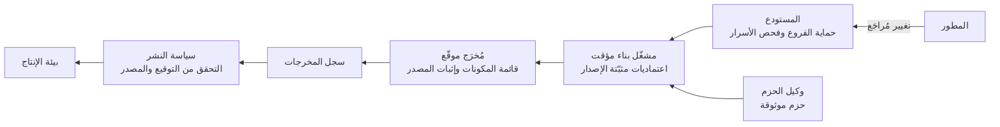

<!-- Generated by scripts/build.mjs from data/patterns/P11.json. Edit the data, then run npm run build. -->

[English](../en/P11-software-supply-chain.md)

# P11 سلسلة إمداد برمجيات موثوقة

> عامل منظومة البناء معاملة بيئة الإنتاج، فاحمِ الشيفرة المصدرية ومسارات النشر، وابنِ على خطوات معزولة قابلة للتكرار، ووقّع ما تبنيه، ووثّق مكوناته، ولا تنشر إلا المخرجات التي تستطيع التحقق من مصدر منشئها.

| المجال | أنماط ذات صلة |
| --- | --- |
| التطبيقات | [P08 الأسرار والمفاتيح وهوية أعباء العمل](P08-secrets-keys-workload-identity.md)، [P16 الضوابط الوقائية لمنصات الحاويات](P16-container-platform-guardrails.md)، [P07 بوابة الواجهات البرمجية والتفويض على مستوى الكائن](P07-api-security.md)، [P28 دورة حياة التطوير الآمن](P28-secure-development.md) |

## المشكلة

يخترق المهاجمون البرمجيات قبل وصولها إليك بصورة متزايدة، عبر حزم مفتوحة المصدر مسمومة أو بيانات اعتماد مسروقة لمطوري الحزم أو لمسارات النشر أو عبر خادم بناء مخترق يدسّ شيفرة في إصدارات موقّعة، ويرث تطبيقك كل ضعف في المكونات والأدوات المستخدمة في بنائه.

## متى تستخدمه

- تبني برمجياتك الخاصة وتنشرها.
- تعتمد تطبيقاتك على حزم كثيرة مفتوحة المصدر.
- تحمل مسارات النشر لديك بيانات اعتماد قادرة على النشر إلى بيئة الإنتاج.

## التصميم

احمِ الشيفرة المصدرية بفرض المراجعة وحماية الفروع الرئيسية وتوقيع الالتزامات في المستودعات الحساسة وفحص كل تغيير بحثًا عن الأسرار والاعتماديات الضعيفة، ثم ابنِ على مشغّلات مؤقتة ومعزولة انطلاقًا من اعتماديات وصور أساسية مثبّتة الإصدار، وامنح مسارات النشر بيانات اعتماد قصيرة الأمد وضيقة النطاق تحصل عليها عبر هوية أعباء العمل بدلًا من الأسرار المخزنة.

وقّع كل مُخرَج وأنشئ له قائمة مكونات البرمجيات وإثبات مصدر البناء واحفظها معًا، ثم لا تقبل عند النشر إلا المخرجات التي وقّعها مسارك والمستوفية للسياسة، واحتفظ بقوائم المكونات حتى تستطيع خلال دقائق تحديد كل نظام متأثر حين يُعلن عن الثغرة الحرجة التالية في إحدى المكتبات.

## الضوابط

### أساسي

- **احمِ الفروع الرئيسية:** اشترط مراجعة طلب الدمج ونجاح الفحوص قبل الدمج، وامنع الدفع القسري، وقيّد من يستطيع تغيير إعدادات المستودع.
  `NIST CM-3` `NIST SA-10` `CIS 16.1` `ISO A.8.4` `ISO A.8.32`
- **افحص الاعتماديات والأسرار في كل تغيير:** شغّل في مسار النشر فحص ثغرات الاعتماديات وفحص الأسرار، وامنع الدمج عند وجود نتائج حرجة.
  `NIST RA-5` `NIST SA-11` `CIS 16.4` `CIS 16.5` `CIS 16.12` `ISO A.8.8` `ISO A.8.28`
- **احتفظ بسجل حصر لمكونات الأطراف الخارجية:** أنشئ قائمة مكونات البرمجيات لكل عملية بناء، واحفظها مع المُخرَج.
  `NIST CM-8` `NIST SR-4` `CIS 16.4` `CIS 2.1` `ISO A.5.21`

### معزز

- **حصّن مسار النشر:** استخدم مشغّلات مؤقتة، وثبّت الإجراءات والصور الأساسية بالبصمة، وامنح المهام رموزًا بأقل الصلاحيات، وافصل صلاحيات البناء عن صلاحيات النشر.
  `NIST SA-15` `NIST AC-6` `ISO A.8.25`
- **وقّع المخرجات ووثّق مصدر منشئها:** وقّع كل مُخرَج إصدار وكل صورة حاوية، وأنشئ إثباتًا لمصدر البناء يصف كيف بُني وممَّ بُني.
  `NIST SI-7` `NIST SR-4` `NIST CM-14` `ISO A.5.21`
- **استخدم مصدرًا موثوقًا للحزم:** اسحب الاعتماديات عبر وكيل أو سجل داخلي يحجب الحزم الضارة المعروفة ولا يقبل الإصدارات المنشورة حديثًا إلا بعد فترة انتظار.
  `NIST SR-3` `NIST SR-11` `CIS 16.5` `ISO A.5.21`

### متقدم

- **تحقق عند النشر:** لا تقبل في بيئة الإنتاج إلا المخرجات الموقّعة ذات الإثبات الصالح لمصدرها من مسارك أنت، على أن تفرض منصة النشر ذلك.
  `NIST CM-14` `NIST SI-7` `CIS 2.5` `ISO A.8.19`
- **ارتقِ إلى مستوى بناء أعلى في SLSA:** انقل عمليات البناء إلى منصة بناء مستضافة ومعزولة تُنشئ إثباتًا لمصدر البناء لا تستطيع عملية البناء تزويره، وتابع مستواك في SLSA لكل منتج.
  `NIST SA-15` `NIST SR-4` `ISO A.8.25`

## قرارات يجب توثيقها

- ما مسارات النشر القادرة على النشر إلى بيئة الإنتاج، وبأي بيانات اعتماد؟
- ما السياسة المتبعة لإضافة اعتماديات جديدة ولإصلاح الضعيفة منها؟
- أين يُتحقق من التواقيع، وماذا يحدث للمخرجات غير الموقّعة؟

## المفاضلات

- تُبطئ البوابات الصارمة التسليم إذا كانت أدوات الفحص كثيرة الضجيج، لذا اضبطها ولا تُفشل البناء إلا بسبب النتائج المهمة.
- يؤخر تثبيت الإصدارات وفترات الانتظار تحديثات الأمن العاجلة ما لم يوجد مسار سريع لها.
- لا ينفع التوقيع إلا إذا فُرض التحقق منه حيث تعمل البرمجيات.

## أنماط خاطئة يجب تجنبها

- مفتاح إدارة سحابي طويل الأمد محفوظ سرًّا في مسار النشر.
- خوادم بناء لا تُحدَّث أبدًا لأنه لا يملكها أحد.
- سحب الاعتماديات من الإنترنت وقت البناء دون تثبيت إصداراتها.

## كيف تتحقق منه

- حاول الدمج في فرع محمي دون مراجعة، وتأكد أن المحاولة تُمنع.
- حاول نشر صورة غير موقّعة، وتأكد أن المنصة ترفضها.
- اختر إحدى المكتبات واستخدم قوائم المكونات لديك لعرض كل منتج يتضمنها.

## التهديدات التي يتصدى لها

| المرجع | الاسم |
| --- | --- |
| [T1195.002](https://attack.mitre.org/techniques/T1195/002/) | اختراق سلسلة الإمداد، اختراق سلسلة إمداد البرمجيات |
| [T1552.001](https://attack.mitre.org/techniques/T1552/001/) | بيانات اعتماد غير مؤمنة، بيانات الاعتماد في الملفات |
| [T1528](https://attack.mitre.org/techniques/T1528/) | سرقة رمز وصول التطبيق |

## المراجع

- [إطار SLSA لمستويات سلامة سلسلة إمداد البرمجيات](https://slsa.dev/)
- [إطار تطوير البرمجيات الآمن NIST SP 800-218](https://csrc.nist.gov/pubs/sp/800/218/final)
- [معيار CycloneDX لقوائم المكونات](https://cyclonedx.org/)
- [مقياس OpenSSF Scorecard](https://securityscorecards.dev/)

