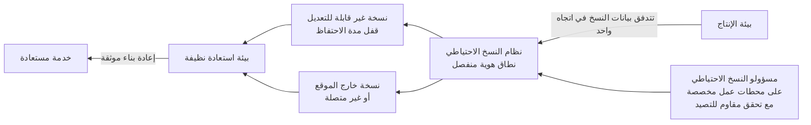

<!-- Generated by scripts/build.mjs from data/patterns/P12.json. Edit the data, then run npm run build. -->

[English](../en/P12-resilient-recovery.md)

# P12 استعادة صامدة أمام برامج الفدية

> صمّم الاستعادة ليوم تكون فيه بيئتك الرئيسية ومسؤولوها مخترقين، فاحتفظ بنسخ غير قابلة للتعديل ومعزولة لا يستطيع مسؤولو الإنتاج حذفها، وأثبت بانتظام أنك تستطيع إعادة البناء منها خلال الوقت الذي تحتاجه الأعمال.

| المجال | أنماط ذات صلة |
| --- | --- |
| العمليات | [P03 الصلاحيات الهامة والحساسة في طبقات](P03-tiered-privileged-access.md)، [P04 العزل والتقسيم الدقيق](P04-segmentation.md)، [P10 بيانات الرصد ومسار الكشف](P10-detection-telemetry.md) |

## المشكلة

يبحث مشغلو برامج الفدية عن النسخ الاحتياطية أولًا، فإذا تشاركت خوادم النسخ الاحتياطي مع بيئة الإنتاج في النطاق وبيانات الاعتماد والشبكة حذفها المهاجم أو شفّرها قبل تشفير كل شيء آخر، كما تفشل خطط الاستعادة التي لم تُختبر قط حين تشتد الحاجة إليها.

## متى تستخدمه

- لا تستطيع الأعمال الاستمرار طويلًا دون أنظمتها.
- تُدار النسخ الاحتياطية بالحسابات نفسها التي تُدار بها بيئة الإنتاج.
- لم يستعد أحد نظامًا كاملًا من النسخ الاحتياطية خلال العام الماضي.

## التصميم

اتبع قاعدة ٣-٢-١-١-٠، أي ثلاث نسخ من البيانات على وسيطين مختلفين، منها نسخة خارج الموقع ونسخة غير قابلة للتعديل أو غير متصلة بالشبكة، مع صفر أخطاء بعد اختبارات استعادة موثقة، ثم ضع نظام النسخ الاحتياطي في نطاق ثقة مستقل بهويات منفصلة وتحقق متعدد العناصر مقاوم للتصيد وإدارة من محطات عمل مخصصة للصلاحيات الهامة، وفعّل خاصية عدم القابلية للتعديل حتى لا يستطيع مسؤولو النظام أنفسهم تقصير مدة الاحتفاظ أو حذف النسخ مبكرًا.

حدّد لكل نظام وقت الاستعادة المستهدف ونقطة الاستعادة المستهدفة، ورتّب الأنظمة بحسب أولوية استعادتها بدءًا بالهوية والبنية التحتية الأساسية، واحتفظ ببيئة استعادة نظيفة تستطيع إعادة البناء فيها دون إعادة المهاجم معك، ثم اختبر الاستعادة الكاملة لا استعادة الملفات فقط وفق جدول زمني وبعد كل تغيير كبير.

## الضوابط

### أساسي

- **انسخ احتياطيًا ما تحتاجه الأعمال:** انسخ الأنظمة والبيانات الحرجة احتياطيًا بصورة آلية، بما في ذلك أنظمة الهوية والإعدادات وشيفرة البنية التحتية، لا مجلدات الملفات المشتركة وقواعد البيانات فقط.
  `NIST CP-9` `CIS 11.1` `CIS 11.2` `ISO A.8.13`
- **احتفظ بنسخة غير قابلة للتعديل أو غير متصلة:** احتفظ بنسخة واحدة على الأقل لا يمكن تعديلها أو حذفها قبل انتهاء مدة الاحتفاظ بها، ولو بأيدي مسؤولي النسخ الاحتياطي.
  `NIST CP-9` `NIST CP-6` `CIS 11.3` `CIS 11.4` `ISO A.8.13`
- **اختبر الاستعادة:** استعد أنظمة كاملة وفق جدول زمني، وسجّل الوقت الذي استغرقته، وقارن النتيجة بأهداف الاستعادة.
  `NIST CP-4` `CIS 11.5` `ISO A.8.13` `ISO A.5.30`

### معزز

- **افصل نطاق الثقة الخاص بالنسخ الاحتياطي:** شغّل البنية التحتية للنسخ الاحتياطي بهويات ومسار إدارة خاصة بها دون ضمها إلى دليل بيئة الإنتاج، مع تحقق متعدد العناصر مقاوم للتصيد لكل مسؤول.
  `NIST AC-6` `NIST CP-9` `NIST IA-2(1)` `CIS 11.3` `CIS 5.4` `ISO A.8.13` `ISO A.8.2`
- **حدّد أهداف الاستعادة وترتيبها:** اتفق مع إدارة الأعمال على وقت الاستعادة المستهدف ونقطتها لكل نظام، ودوّن الترتيب الذي يجب أن تعود به الأنظمة.
  `NIST CP-2` `NIST CP-10` `NIST RA-9` `CIS 11.1` `ISO A.5.30` `ISO A.5.29`
- **أطلق تنبيهًا عند العبث بالنسخ الاحتياطية:** اكشف حذف مهام النسخ الاحتياطي وتغيير مدد الاحتفاظ ومحاولات الحذف الجماعي، وتعامل معها بوصفها حوادث.
  `NIST SI-4` `ISO A.8.16`

### متقدم

- **احتفظ ببيئة استعادة نظيفة:** احتفظ ببيئة معزولة فيها أدوات موثوقة وصور مرجعية نظيفة، يمكن فيها إعادة بناء الأنظمة وفحصها من آثار بقاء المهاجم قبل إعادتها.
  `NIST CP-10` `ISO A.5.30`
- **تمرّن على استعادة كاملة بعد هجوم فدية:** نفّذ تمرينًا يفترض فقدان بيئة الإنتاج ودليلها، وأعد بناء الخدمات الأساسية من النسخ المعزولة.
  `NIST CP-4` `NIST IR-3` `CIS 11.5` `CIS 17.7` `ISO A.5.30` `ISO A.5.24`

## قرارات يجب توثيقها

- ما وقت الاستعادة المستهدف ونقطتها لكل نظام حرج، وهل اعتمدتها إدارة الأعمال؟
- كيف يُعزل نظام النسخ الاحتياطي عن هوية بيئة الإنتاج وشبكاتها؟
- بأي ترتيب تُستعاد الأنظمة، ومن يقرر ذلك أثناء الحادثة؟

## المفاضلات

- تجعل خاصية عدم القابلية للتعديل الأخطاء أيضًا غير قابلة للتعديل، فالبيانات المحفوظة مدة أطول من اللازم أو المنسوخة خطأً لا يمكن إزالتها مبكرًا.
- تضيف الهوية والأدوات المنفصلة للنسخ الاحتياطية تكلفة وجهدًا تشغيليًا.
- تحتاج أهداف الاستعادة القصيرة إلى بنية تحتية وتمرين أكثر، لذا خصّصها للأنظمة التي تحتاجها فعلًا.

## أنماط خاطئة يجب تجنبها

- خوادم نسخ احتياطي منضمة إلى نطاق الإنتاج وتُدار بصلاحيات مسؤول النطاق.
- لقطات لا تُحفظ إلا على مصفوفة التخزين نفسها التي تحفظ بيئة الإنتاج.
- خطة استعادة تفترض أن الدليل والشبكة ما زالا يعملان.

## كيف تتحقق منه

- حاول بصفتك مسؤولًا عن النسخ الاحتياطية حذف نسخة غير قابلة للتعديل أو تقصير مدة احتفاظها، وتأكد أن المحاولة تُرفض.
- استعد تطبيقًا حرجًا بالكامل في البيئة النظيفة، وقِس الوقت المستغرق مقارنة بهدفه.
- تأكد أنه لا يستطيع أي حساب من بيئة الإنتاج، بما فيها حسابات مسؤولي النطاق، الدخول إلى نظام النسخ الاحتياطي.

## التهديدات التي يتصدى لها

| المرجع | الاسم |
| --- | --- |
| [T1486](https://attack.mitre.org/techniques/T1486/) | تشفير البيانات بقصد الإضرار |
| [T1490](https://attack.mitre.org/techniques/T1490/) | منع استعادة النظام |
| [T1485](https://attack.mitre.org/techniques/T1485/) | إتلاف البيانات |

## المراجع

- [دليل CISA لمواجهة برامج الفدية](https://www.cisa.gov/stopransomware/ransomware-guide)
- [دليل التخطيط للطوارئ NIST SP 800-34 Rev 1](https://csrc.nist.gov/pubs/sp/800/34/r1/upd1/final)
- [تطوير أنظمة صامدة سيبرانيًا NIST SP 800-160 Vol 2 Rev 1](https://csrc.nist.gov/pubs/sp/800/160/v2/r1/final)

