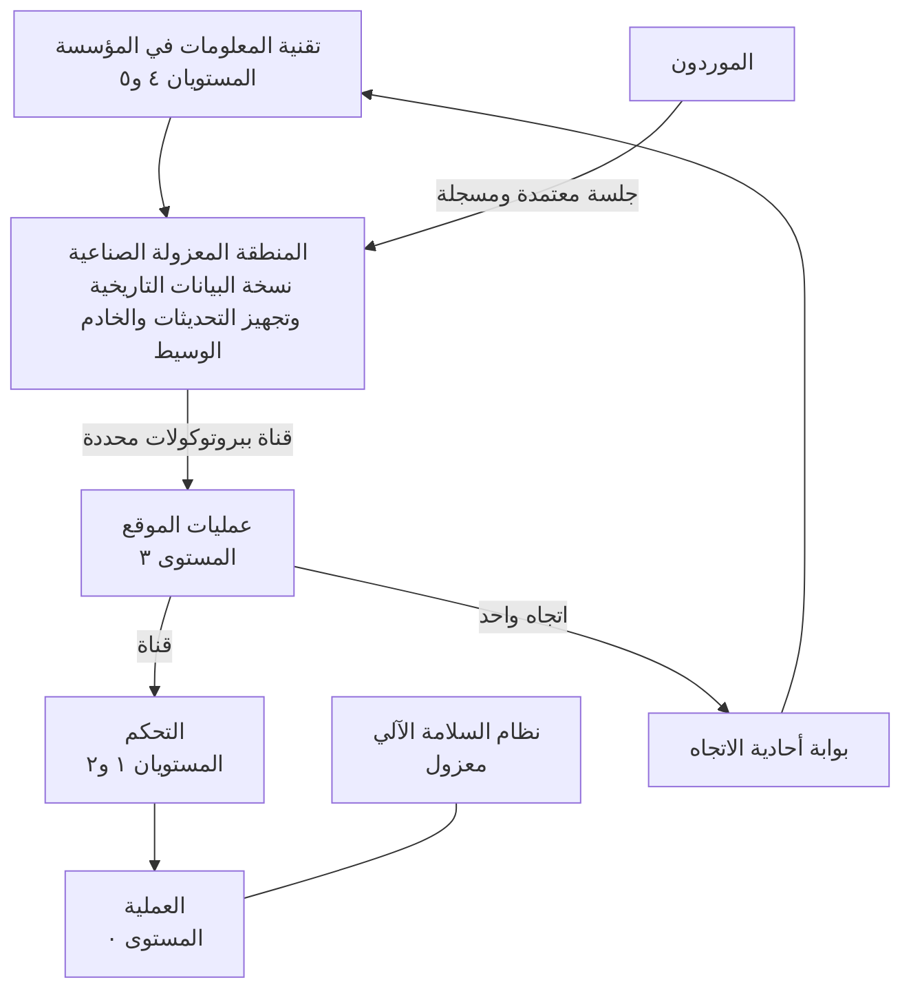

<!-- Generated by scripts/build.mjs from data/patterns/P13.json. Edit the data, then run npm run build. -->

[English](../en/P13-ot-zones-and-conduits.md)

# P13 المناطق والقنوات في التقنيات التشغيلية

> اجمع الأنظمة الصناعية في مناطق بحسب وظيفتها وعواقب تعطلها، ولا تربط المناطق إلا عبر قنوات محددة، وضع منطقة معزولة صناعية بين شبكة المؤسسة والموقع التشغيلي، حتى لا يعبر أي اتصال من تقنية المعلومات إلى أنظمة التحكم مباشرة.

| المجال | أنماط ذات صلة |
| --- | --- |
| التقنيات التشغيلية | [P01 الوصول وفق الثقة الصفرية](P01-zero-trust-access.md)، [P03 الصلاحيات الهامة والحساسة في طبقات](P03-tiered-privileged-access.md)، [P04 العزل والتقسيم الدقيق](P04-segmentation.md)، [P10 بيانات الرصد ومسار الكشف](P10-detection-telemetry.md)، [P12 استعادة صامدة أمام برامج الفدية](P12-resilient-recovery.md) |

## المشكلة

بُنيت أنظمة التحكم لتعمل بموثوقية ولعمر طويل لا لتواجه شبكات معادية، ولا يمكن تحديث كثير منها أو تشغيل برامج أمنية عليها، فإذا أمكن الوصول إلى شبكة الموقع من شبكة المكاتب أو من أدوات الوصول البعيد لدى الموردين وصل برنامج الفدية والمتسللون إلى الأنظمة التي تحرك الصمامات والمحركات، حيث تكون العواقب مادية.

## متى تستخدمه

- تشغّل أنظمة تحكم صناعية أو أنظمة لإدارة المباني أو المرافق.
- يصون الموردون أنظمة التحكم عن بعد.
- ترتبط شبكات المكاتب والموقع التشغيلي دون منطقة معزولة بينهما.

## التصميم

استخدم نموذج Purdue المرجعي خريطةً أولى، ومعيار IEC 62443 لتحديد المناطق والقنوات، فاجمع الأصول التي تتشارك المتطلبات الأمنية نفسها في مناطق، وحدّد لكل منطقة مستوى أمن مستهدفًا انطلاقًا من تقييم للمخاطر، ثم عرّف كل قناة ببروتوكولاتها واتجاهها وضوابطها، وضع منطقة معزولة صناعية بين تقنية المعلومات في المؤسسة والموقع التشغيلي تنتهي فيها كل الاتصالات، إذ تنسخ خوادم البيانات التاريخية بياناتها إلى الخارج، وتُجهَّز الملفات والتحديثات وتُفحص فيها، ويصل المستخدمون البعيدون إلى خادم وسيط لا إلى أنظمة التحكم.

استخدم بوابة أحادية الاتجاه حيث لا تحتاج البيانات إلا إلى الخروج من الموقع، وراقب حركة التقنيات التشغيلية بصورة سلبية بأجهزة استشعار تفهم البروتوكولات الصناعية، واحتفظ بسجل حصر دقيق للأصول، وامنح الموردين جلسات معتمدة ومسجلة ومحددة المدة عبر المنطقة المعزولة، أما أنظمة السلامة الآلية فتبقى معزولة عن كل ما سواها.

## الضوابط

### أساسي

- **احصر أصول التقنيات التشغيلية:** احتفظ بسجل حصر لوحدات التحكم ومحطات العمل وأجهزة الشبكة مع برامجها الثابتة ومالكيها ومناطقها، وابنه بالاكتشاف السلبي حيث يكون الفحص النشط غير آمن.
  `NIST CM-8` `CIS 1.1` `CIS 2.1` `ISO A.5.9`
- **افصل تقنية المعلومات عن التقنيات التشغيلية بمنطقة معزولة صناعية:** أنهِ كل اتصال بين تقنية المعلومات في المؤسسة والموقع التشغيلي داخل منطقة معزولة صناعية، ولا تسمح بأي حركة مباشرة من تقنية المعلومات إلى مستويات التحكم.
  `NIST SC-7` `NIST AC-4` `CIS 12.2` `CIS 13.4` `ISO A.8.22`
- **اضبط الوصول البعيد للموردين:** لا تمنح الموردين الوصول إلا عبر الخادم الوسيط في المنطقة المعزولة، مع تحقق متعدد العناصر وموافقة على كل جلسة وحد زمني وتسجيل، وأوقف هذا الوصول حين لا يكون قيد الاستخدام.
  `NIST AC-17` `NIST MA-4` `NIST IA-2(1)` `CIS 6.4` `CIS 13.5` `ISO A.5.19` `ISO A.5.20`

### معزز

- **عرّف المناطق والقنوات والمستويات المستهدفة:** حدّد لكل منطقة مستوى أمن مستهدفًا بناءً على تقييم للمخاطر، ووثّق كل قناة ببروتوكولاتها واتجاهها وضوابطها.
  `NIST PL-8` `NIST RA-3` `NIST CA-9` `CIS 12.4` `ISO A.8.22` `ISO A.8.27`
- **راقب شبكات التقنيات التشغيلية بصورة سلبية:** انشر في كل منطقة مراقبة سلبية تفهم البروتوكولات الصناعية، وأرسل التنبيهات إلى فريق العمليات الأمنية، واتفق على خطوات الاستجابة مع مهندسي التشغيل.
  `NIST SI-4` `CIS 13.3` `CIS 13.6` `ISO A.8.16`
- **جهّز الملفات والتحديثات وافحصها:** لا تُدخل الملفات والتحديثات إلى الموقع إلا عبر نقطة تجهيز في المنطقة المعزولة تُفحص فيها وتُعتمد.
  `NIST SI-3` `ISO A.8.7` `ISO A.8.19`

### متقدم

- **استخدم البوابات أحادية الاتجاه للبيانات الصادرة:** استبدل الاتصالات ثنائية الاتجاه ببوابات أحادية الاتجاه حيثما لا تحتاج البيانات إلا إلى الخروج من الموقع.
  `NIST AC-4` `NIST SC-7` `CIS 13.4` `ISO A.8.22`
- **تمرّن على الاستجابة لحوادث التقنيات التشغيلية:** تمرّن على السيناريوهات مع فرق التشغيل والسلامة، بما في ذلك تشغيل العملية يدويًا أثناء إعادة بناء الأنظمة.
  `NIST IR-3` `NIST CP-4` `CIS 17.7` `ISO A.5.24` `ISO A.5.29`

## قرارات يجب توثيقها

- ما المناطق ومستويات الأمن المستهدفة لها، ومن اعتمد تقييم المخاطر؟
- ما البيانات التي يجب أن تخرج من الموقع، وهل يمكن أن تخرج في اتجاه واحد فقط؟
- كيف يتصل الموردون، ومن يوافق على كل جلسة، وكيف تُراجع الجلسة؟

## المفاضلات

- يجب ألا تُضعف الضوابط الأمنية السلامة أو التوافرية أبدًا، لذا اختبر كل تغيير في بيئة مماثلة أولًا.
- تتسم البوابات أحادية الاتجاه بقوة عالية، لكنها تُصعّب الدعم عن بعد والتكاملات ثنائية الاتجاه.
- تحتاج الأنظمة القديمة غير القابلة للتحديث إلى ضوابط بديلة حولها، مما يزيد تعقيد المنطقة.

## أنماط خاطئة يجب تجنبها

- محطة هندسية متصلة بشبكة المكتب وشبكة التحكم في آن واحد.
- أدوات وصول بعيد للموردين تبقى مثبتة وتعمل دائمًا.
- تشغيل فحوص ثغرات نشطة على وحدات تحكم تعمل فعليًا.

## كيف تتحقق منه

- حاول من شبكة المؤسسة الوصول إلى عناوين مستوى التحكم، وتأكد أنه لا يستجيب شيء.
- راجع جلسات الموردين خلال الشهر الماضي، وتأكد أن كلًا منها كان معتمدًا ومحدد المدة ومسجلًا.
- قارن قائمة الأصول التي ترصدها أداة المراقبة السلبية بسجل الأصول المعتمد، وعالج الفروقات.

## التهديدات التي يتصدى لها

| المرجع | الاسم |
| --- | --- |
| [T0822](https://attack.mitre.org/techniques/T0822/) | خدمات الوصول البعيد الخارجية في أنظمة التحكم الصناعي |
| [T0886](https://attack.mitre.org/techniques/T0886/) | الخدمات البعيدة في أنظمة التحكم الصناعي |
| [T0883](https://attack.mitre.org/techniques/T0883/) | جهاز يمكن الوصول إليه من الإنترنت |
| [T0859](https://attack.mitre.org/techniques/T0859/) | الحسابات الصالحة في أنظمة التحكم الصناعي |

## المراجع

- [سلسلة معايير ISA/IEC 62443](https://www.isa.org/standards-and-publications/isa-standards/isa-iec-62443-series-of-standards)
- [دليل أمن التقنيات التشغيلية NIST SP 800-82 Rev 3](https://csrc.nist.gov/pubs/sp/800/82/r3/final)
- [مصفوفة MITRE ATT&CK لأنظمة التحكم الصناعي](https://attack.mitre.org/matrices/ics/)

