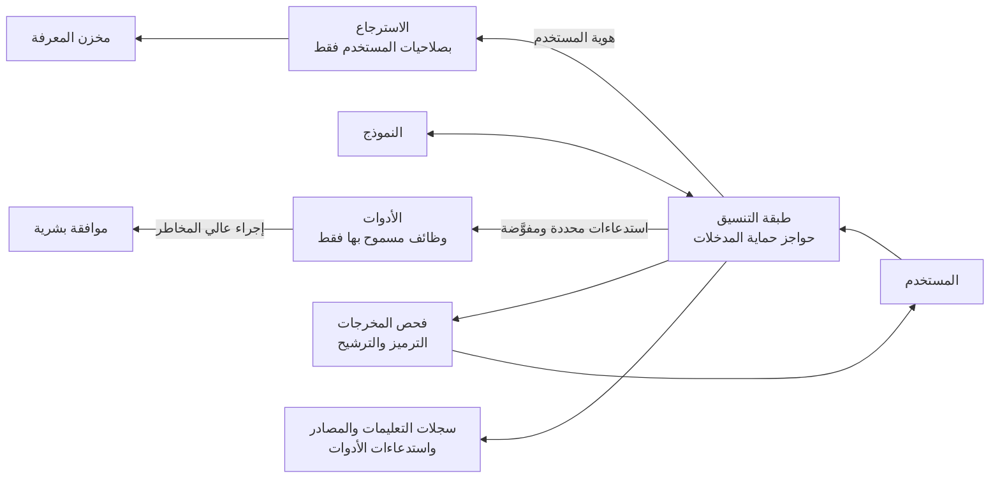

<!-- Generated by scripts/build.mjs from data/patterns/P14.json. Edit the data, then run npm run build. -->

[English](../en/P14-llm-application-guardrails.md)

# P14 حواجز الحماية لتطبيقات النماذج اللغوية والوكلاء الذكيين

> عامل مدخلات النموذج ومخرجاته على أنها غير موثوقة، ولا تمنح النموذج إلا البيانات والأدوات التي يحق للمستخدم الحالي استخدامها، وأحط كل إجراء له عواقب بفحوص حتمية وموافقة بشرية.

| المجال | أنماط ذات صلة |
| --- | --- |
| الذكاء الاصطناعي | [P09 حماية تتمحور حول البيانات](P09-data-centric-protection.md)، [P07 بوابة الواجهات البرمجية والتفويض على مستوى الكائن](P07-api-security.md)، [P02 الهوية مستوى تحكم](P02-identity-control-plane.md)، [P10 بيانات الرصد ومسار الكشف](P10-detection-telemetry.md)، [P29 وكلاء ذكاء اصطناعي يستخدمون الأدوات](P29-ai-agents.md) |

## المشكلة

تتبع النماذج اللغوية الكبيرة التعليمات أينما وجدتها في سياقها، بما في ذلك مستند أو رسالة بريد أو صفحة ويب يتحكم فيها مهاجم، فإذا رُبط النموذج ببيانات المؤسسة وأدواتها أمكن توجيهه إلى كشف معلومات لا يحق للمستخدم رؤيتها أو تنفيذ إجراءات لم يوافق عليها أحد، كما قد تحمل مخرجاته شيفرة محقونة إلى أنظمة أخرى.

## متى تستخدمه

- تبني مساعدًا أو روبوت محادثة أو وكيلًا ذكيًا على نموذج لغوي كبير.
- يستطيع النموذج قراءة مستندات داخلية عبر الاسترجاع.
- يستطيع النموذج استدعاء أدوات تغيّر البيانات أو ترسل الرسائل أو تنفّذ شيفرة.

## التصميم

ضع النموذج خلف طبقة تنسيق تتحكم فيها أنت، بحيث يعمل الاسترجاع بهوية المستخدم النهائي وصلاحياته فلا يرى النموذج إلا المستندات التي يستطيع ذلك المستخدم فتحها، وتُرشَّح البيانات الحساسة قبل دخولها السياق، ثم اجعل كل أداة يستطيع النموذج استدعاءها وظيفة ضيقة ومحددة الأنواع لها تفويضها وحدود معدلها ومعاملاتها المسموح بها، لا واجهة أوامر عامة ولا اتصالًا مفتوحًا بقاعدة بيانات.

افحص المدخلات والمخرجات بحواجز الحماية، ورمّز مخرجات النموذج أو تحقق منها قبل وصولها إلى متصفح أو استعلام أو واجهة أوامر، واشترط أن يؤكد شخص الإجراءات التي تنقل الأموال أو تحذف البيانات أو تتواصل مع أشخاص من خارج المؤسسة، ثم سجّل التعليمات والمصادر المسترجعة واستدعاءات الأدوات والقرارات، وضع حدودًا للتكلفة والاستخدام، واختبر النظام ضد حقن التعليمات قبل الإطلاق وبعده.

## الضوابط

### أساسي

- **استرجع بصلاحيات المستخدم:** شغّل الاسترجاع بهوية المستخدم النهائي، حتى لا يتلقى النموذج إلا المستندات التي يحق لذلك المستخدم فتحها أصلًا.
  `NIST AC-3` `NIST AC-6` `CIS 3.3` `ISO A.5.15` `ISO A.8.3`
- **عامل مخرجات النموذج بوصفها مدخلات غير موثوقة:** تحقق من مخرجات النموذج ورمّزها قبل عرضها أو حفظها أو تمريرها إلى نظام آخر، تمامًا كما تفعل مع مدخلات المستخدم.
  `NIST SI-10` `NIST SI-15` `CIS 16.10` `ISO A.8.26` `ISO A.8.28`
- **اجعل الأدوات ضيقة ومفوَّضة:** لا تكشف للنموذج إلا وظائف محددة ومحددة الأنواع، وتحقق من التفويض في كل استدعاء، ولا تمنحه أبدًا وصولًا عامًا إلى واجهة الأوامر أو الملفات أو قواعد البيانات.
  `NIST AC-6` `NIST CM-7` `ISO A.8.3` `ISO A.8.26`
- **سجّل التفاعل كاملًا:** سجّل التعليمات والمصادر المسترجعة واستدعاءات الأدوات والمخرجات مع هوية المستخدم، مع مراعاة قواعد الخصوصية.
  `NIST AU-2` `NIST AU-12` `CIS 8.5` `ISO A.8.15`

### معزز

- **اشترط موافقة بشرية على الإجراءات ذات العواقب:** اطلب من شخص تأكيد الإجراءات التي تغيّر السجلات أو تنقل الأموال أو تحذف البيانات أو ترسل رسائل إلى خارج المؤسسة.
  `NIST AC-3` `ISO A.8.26`
- **افحص المدخلات والمخرجات:** استخدم فحوص حواجز الحماية لكشف أنماط حقن التعليمات والبيانات الحساسة ومخالفات السياسة في الدخول والخروج.
  `NIST SI-15` `NIST SI-4` `CIS 3.13` `ISO A.8.12`
- **قيّد الاستهلاك:** ضع حدودًا لكل مستخدم ولكل تطبيق على الطلبات والوحدات النصية والتكلفة، وأطلق تنبيهًا عند الاستخدام غير المعتاد.
  `NIST SC-5` `ISO A.8.6`

### متقدم

- **اختبر التطبيق بأسلوب المهاجم:** اختبر النظام بسيناريوهات حقن التعليمات المباشر وغير المباشر وتسريب البيانات وإساءة استخدام الأدوات، قبل الإطلاق وبعد أي تغيير في النموذج أو التعليمات.
  `NIST CA-8` `NIST SA-11` `CIS 16.13` `ISO A.8.29`
- **أدر النماذج والتعليمات بوصفها شيفرة:** أدر إصدارات تعليمات النظام واختيارات النماذج وتعريفات الأدوات وإعدادات حواجز الحماية، وراجع التغييرات، وقيّمها على مجموعة اختبار قبل النشر.
  `NIST CM-3` `NIST SA-10` `ISO A.8.32` `ISO A.8.25`

## قرارات يجب توثيقها

- ما الأدوات التي يجوز للنموذج استدعاؤها، وما الإجراءات التي تحتاج إلى تأكيد شخص؟
- أين يعمل النموذج، وما البيانات التي يجوز إرسالها إليه في ضوء التزامات حماية البيانات لديك؟
- ما مدة الاحتفاظ بالتعليمات والمخرجات، ومن يستطيع قراءتها؟

## المفاضلات

- لا يوجد مرشّح يوقف حقن التعليمات بصورة موثوقة، لذلك يجب أن يأتي الأمان من تقييد ما يستطيع النموذج رؤيته وفعله.
- تقلل الموافقة البشرية المخاطر، لكنها تقلل أيضًا فائدة الأتمتة، لذا خصّصها للإجراءات ذات العواقب الحقيقية.
- تساعد السجلات التفصيلية للتعليمات في التحقيقات، لكنها تحتوي أيضًا على بيانات حساسة، لذا احمِها وحدّد موعدًا لانتهائها.

## أنماط خاطئة يجب تجنبها

- حساب خدمة بصلاحية قراءة واسعة يُستخدم للاسترجاع نيابة عن جميع المستخدمين.
- الاعتماد على تعليمات النظام لحفظ الأسرار أو فرض الصلاحيات.
- وكيل ذكي مسموح له بتنفيذ أي شيفرة أو استعلام في بيئة الإنتاج.

## كيف تتحقق منه

- ضع تعليمات في مستند يستطيع المساعد استرجاعه، وتأكد أنها لا تستطيع تشغيل استدعاء أداة أو تسريب بيانات.
- اطلب من المساعد بصفتك مستخدمًا محدود الصلاحيات مستندًا لا يفتحه إلا أحد التنفيذيين، وتأكد أنه لا يُعاد إليك.
- راجع سجلات محادثة واحدة، وتأكد أنك تستطيع تتبع كل استدعاء أداة إلى مستخدم وموافقة.

## التهديدات التي يتصدى لها

| المرجع | الاسم |
| --- | --- |
| [T1213](https://attack.mitre.org/techniques/T1213/) | بيانات من مستودعات المعلومات |
| [LLM01:2025](https://genai.owasp.org/llmrisk/llm01-prompt-injection/) | حقن التعليمات |
| [LLM02:2025](https://genai.owasp.org/llmrisk/llm022025-sensitive-information-disclosure/) | كشف المعلومات الحساسة |
| [LLM05:2025](https://genai.owasp.org/llmrisk/llm052025-improper-output-handling/) | المعالجة غير السليمة للمخرجات |
| [LLM06:2025](https://genai.owasp.org/llmrisk/llm062025-excessive-agency/) | الصلاحيات المفرطة للوكيل |
| [LLM07:2025](https://genai.owasp.org/llmrisk/llm072025-system-prompt-leakage/) | تسرب تعليمات النظام |
| [LLM08:2025](https://genai.owasp.org/llmrisk/llm082025-vector-and-embedding-weaknesses/) | ضعف المتجهات والتضمينات |
| [LLM10:2025](https://genai.owasp.org/llmrisk/llm102025-unbounded-consumption/) | الاستهلاك غير المحدود |

## المراجع

- [قائمة OWASP لأهم ١٠ مخاطر في تطبيقات النماذج اللغوية الكبيرة لعام ٢٠٢٥](https://genai.owasp.org/llm-top-10/)
- [ملف الذكاء الاصطناعي التوليدي NIST AI 600-1](https://doi.org/10.6028/NIST.AI.600-1)
- [قاعدة معارف MITRE ATLAS](https://atlas.mitre.org/)
- [إطار إدارة مخاطر الذكاء الاصطناعي من NIST](https://www.nist.gov/itl/ai-risk-management-framework)

