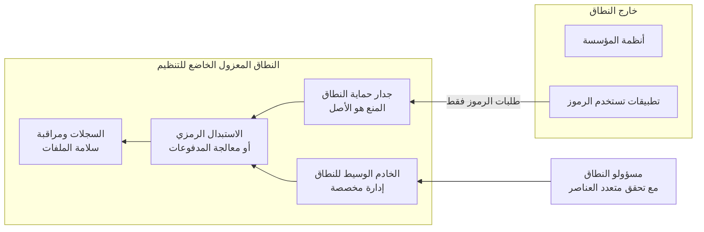

<!-- Generated by scripts/build.mjs from data/patterns/P15.json. Edit the data, then run npm run build. -->

[English](../en/P15-regulated-enclave.md)

# P15 النطاق المعزول الخاضع للتنظيم

> ضع الأنظمة التي تحفظ البيانات الخاضعة للتنظيم أو تعالجها أو تنقلها، مثل بيانات بطاقات الدفع أو رسائل سويفت، في نطاق معزول صغير ومحكم الضبط، لتنطبق أشد الضوابط على نطاق صغير ويبقى كل ما خارجه خارج النطاق.

| المجال | أنماط ذات صلة |
| --- | --- |
| البيانات | [P04 العزل والتقسيم الدقيق](P04-segmentation.md)، [P03 الصلاحيات الهامة والحساسة في طبقات](P03-tiered-privileged-access.md)، [P09 حماية تتمحور حول البيانات](P09-data-centric-protection.md)، [P08 الأسرار والمفاتيح وهوية أعباء العمل](P08-secrets-keys-workload-identity.md) |

## المشكلة

إذا انتشرت البيانات الخاضعة للتنظيم في أنحاء الشبكة دخل في النطاق كل نظام يتعامل معها أو يستطيع الوصول إليها، ووجب تطبيق أشد المتطلبات في كل مكان، وهذا مكلف ونادرًا ما يتحقق، وفي الثغرات المتبقية يجد المهاجمون البيانات.

## متى تستخدمه

- تحفظ بيانات بطاقات الدفع أو تعالجها أو تنقلها.
- تتصل بشبكة سويفت أو بشبكة مدفوعات أخرى عالية القيمة.
- تشترط جهة تنظيمية ضوابط محددة لمجموعة معرّفة من الأنظمة.

## التصميم

ابدأ بالتقليص، فاحذف البيانات الخاضعة للتنظيم التي لا تحتاجها، واستبدل أرقام البطاقات المخزنة برموز من خدمة استبدال رمزي أو من مزود المدفوعات حتى يقل عدد الأنظمة التي ترى البيانات الحقيقية، ثم ابنِ النطاق المعزول بشبكة مقسّمة لها جدران حمايتها وقواعد المنع الافتراضي، وبإدارة لا تتم إلا عبر خوادم وسيطة داخل النطاق، وبهويات منفصلة أو على الأقل بمجموعات صلاحيات هامة منفصلة، مع سجلات خاصة به ومراقبة لسلامة الملفات.

وثّق كل اتصال يدخل النطاق المعزول أو يخرج منه مع مبرره في الأعمال، واختبر التقسيم بانتظام لتثبت أن الأنظمة الخارجة عن النطاق لا تستطيع الوصول إليه فعلًا، وتظهر الفكرة نفسها في سويفت باسم المنطقة الآمنة ضمن إطار الضوابط الأمنية للعملاء، بينما تظهر في بطاقات الدفع باسم بيئة بيانات حاملي البطاقات في PCI DSS.

## الضوابط

### أساسي

- **قلّل البيانات الخاضعة للتنظيم:** توقف عن حفظ البيانات الخاضعة للتنظيم التي لا تحتاجها، واستبدل أرقام البطاقات المخزنة برموز حيثما تسمح عملية الأعمال.
  `NIST SI-12` `CIS 3.1` `ISO A.8.11`
- **اعزل النطاق بالتقسيم:** اعزل أنظمة النطاق في قطاع شبكي خاص بها، مع تصفية قائمة على المنع الافتراضي وقائمة موثقة بالاتصالات المسموح بها.
  `NIST SC-7` `NIST SC-7(5)` `NIST AC-4` `CIS 12.2` `CIS 13.4` `CIS 3.12` `ISO A.8.22`
- **أدر النطاق المعزول بصورة منفصلة:** لا تُدر أنظمة النطاق إلا عبر خوادم وسيطة داخله، مع تحقق متعدد العناصر وحسابات لا تُستخدم لأي غرض آخر.
  `NIST AC-6(5)` `NIST IA-2(1)` `NIST AC-17` `CIS 5.4` `CIS 6.5` `CIS 12.8` `ISO A.8.2`

### معزز

- **راقب السلامة والوصول:** شغّل مراقبة سلامة الملفات على الملفات الحرجة في النطاق، وسجّل كل وصول إلى البيانات الخاضعة للتنظيم، وراجع التنبيهات كل يوم.
  `NIST SI-7` `NIST AU-6` `CIS 3.14` `CIS 8.11` `ISO A.8.15` `ISO A.8.16`
- **اختبر التقسيم:** أثبت وفق جدول ثابت، وبالتكرار الذي تفرضه التزاماتك على الأقل وبعد كل تغيير، أن الأنظمة خارج النطاق لا تستطيع الوصول إليه.
  `NIST CA-8` `CIS 18.1` `ISO A.8.22`
- **حصّن أنظمة النطاق:** طبّق خط أساس للتحصين، وأزل الخدمات غير الضرورية، واقصر البرمجيات على أنظمة النطاق على قائمة سماح.
  `NIST CM-6` `NIST CM-7` `CIS 4.1` `CIS 4.8` `CIS 2.5` `ISO A.8.9` `ISO A.8.19`

### متقدم

- **امنح النطاق هوية خاصة به:** استخدم دليلًا أو مستأجرًا منفصلًا للنطاق، حتى لا يمنح اختراق دليل المؤسسة وصولًا إليه.
  `NIST AC-2` `NIST SC-32` `ISO A.5.16`
- **استخدم مفاتيح محمية بالأجهزة للبيانات الخاضعة للتنظيم:** احمِ مفاتيح البيانات الخاضعة للتنظيم في وحدات أمن الأجهزة، مع رقابة ثنائية على إدارة المفاتيح.
  `NIST SC-12` `NIST AC-5` `CIS 3.11` `ISO A.8.24`

## قرارات يجب توثيقها

- ما الأنظمة الداخلة في النطاق، وما الأنظمة التي خرجت منه بفضل الاستبدال الرمزي أو الإسناد الخارجي؟
- ما الاتصالات التي تعبر حدود النطاق المعزول، وما مبرر كل منها في الأعمال؟
- من يدير النطاق المعزول، ومن أين؟

## المفاضلات

- يكرر النطاق المعزول جزءًا من البنية التحتية مثل الخوادم الوسيطة وأدوات المراقبة، مما يزيد التكلفة.
- يقلص إسناد معالجة البطاقات إلى جهة خارجية النطاق، لكنه ينقل الثقة إلى المزود الذي يجب تقييمه هو أيضًا.
- يُضعف كل اتصال جديد يطلبه مشروع ما الحدود، لذا راجع كل طلب على حدة.

## أنماط خاطئة يجب تجنبها

- رسم حدود النطاق حول مخطط بدلًا من رسمها حول تدفقات البيانات الحقيقية.
- إدارة أنظمة النطاق المعزول من حواسيب محمولة عادية في المؤسسة.
- أرقام بطاقات في ملفات السجلات وتذاكر الدعم خارج النطاق المعزول.

## كيف تتحقق منه

- ابحث في الأنظمة الخارجة عن النطاق وفي السجلات ومجلدات الملفات المشتركة عن أرقام بطاقات وغيرها من البيانات الخاضعة للتنظيم.
- اختبر من كل قطاع خارج النطاق أنه لا يمكن الوصول إلى أنظمة النطاق المعزول.
- قارن الاتصالات الموثقة بقواعد جدار حماية النطاق المعزول، وعالج أي فرق.

## التهديدات التي يتصدى لها

| المرجع | الاسم |
| --- | --- |
| [T1078](https://attack.mitre.org/techniques/T1078/) | الحسابات الصالحة |
| [T1021](https://attack.mitre.org/techniques/T1021/) | الخدمات البعيدة |
| [T1557](https://attack.mitre.org/techniques/T1557/) | الخصم في المنتصف |

## المراجع

- [مكتبة وثائق مجلس معايير أمن صناعة بطاقات الدفع، PCI DSS v4.0.1 وإرشادات تحديد النطاق](https://www.pcisecuritystandards.org/document_library/)
- [برنامج سويفت لأمن العملاء](https://www.swift.com/customer-security-programme-csp)
- [أداة مفتوحة للتقييم وفق إطار الصمود السيبراني والتشغيلي الصادر عن بنك الكويت المركزي](https://github.com/SiteQ8/CORF)

