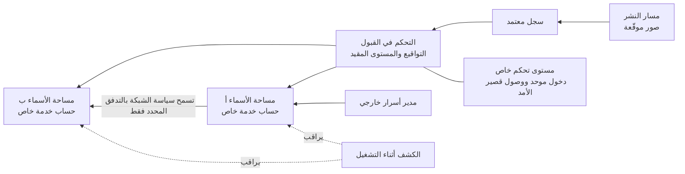

<!-- Generated by scripts/build.mjs from data/patterns/P16.json. Edit the data, then run npm run build. -->

[English](../en/P16-container-platform-guardrails.md)

# P16 الضوابط الوقائية لمنصات الحاويات

> شغّل الحاويات على منصة تحدد ما يُسمح بتشغيله، وتعزل أعباء العمل عن بعضها وعن المضيف، وتراقبها أثناء التشغيل، حتى لا تتحول حاوية واحدة ضعيفة إلى سيطرة على العنقود كله.

| المجال | أنماط ذات صلة |
| --- | --- |
| المنصة | [P06 منطقة هبوط سحابية بضوابط وقائية](P06-cloud-landing-zone.md)، [P08 الأسرار والمفاتيح وهوية أعباء العمل](P08-secrets-keys-workload-identity.md)، [P11 سلسلة إمداد برمجيات موثوقة](P11-software-supply-chain.md)، [P04 العزل والتقسيم الدقيق](P04-segmentation.md) |

## المشكلة

يسمح العنقود بإعداداته الافتراضية لأي عبء عمل بالعمل بصلاحيات الجذر والاتصال بأي حاوية أخرى وربط نظام ملفات المضيف واستخدام حساب خدمة يقرأ الأسرار عبر مساحات الأسماء، فتستطيع حاوية واحدة مستغَلة أو بيانات اعتماد مسروقة من مسار النشر السيطرة على العُقد والعنقود، وغالبًا على الحساب السحابي الذي يقف خلفه.

## متى تستخدمه

- تشغّل أعباء عمل على Kubernetes أو على منصة حاويات أخرى.
- تتشارك فرق أو تطبيقات عدة في عنقود واحد.
- تأتي صور الحاويات من سجلات عامة دون مراجعة.

## التصميم

أبقِ مستوى التحكم خاصًا وأدره عبر مزود الهوية ببيانات اعتماد قصيرة الأمد، وافصل العناقيد أو مجموعات العُقد بحسب مستوى الثقة بدلًا من خلط أعباء العمل المكشوفة على الإنترنت بالحساسة، ثم افرض المستوى المقيد من معايير Pod Security Standards وسياسات قبول لا تسمح إلا بصور موقّعة من سجلات معتمدة، ولا تسمح بالحاويات ذات الصلاحيات الكاملة ولا بربط نظام ملفات المضيف، وتفرض حدودًا للموارد على كل عبء عمل.

تقيّد سياسات الشبكة القائمة على المنع الافتراضي كل عبء عمل باعتمادياته، ويحصل كل عبء عمل على حساب خدمة خاص به لا يُربط به رمز إلا عند الحاجة، وتأتي الأسرار من مدير أسرار خارجي، بينما يراقب الكشف أثناء التشغيل ظهور واجهات أوامر داخل الحاويات والعمليات غير المتوقعة ومحاولات الهروب، وتُعاد بناء العُقد من صور محصّنة بدلًا من تحديثها يدويًا.

## الضوابط

### أساسي

- **أبقِ مستوى التحكم خاصًا:** اقصر الوصول إلى خادم الواجهة البرمجية للعنقود على الشبكات الخاصة أو العناوين المعتمدة، وتحقق من هوية المسؤولين عبر مزود الهوية بتحقق متعدد العناصر.
  `NIST AC-17` `NIST SC-7` `NIST IA-2(1)` `CIS 6.5` `ISO A.8.20` `ISO A.8.5`
- **افرض المستوى المقيد لأمن الحاويات:** طبّق المستوى المقيد من معايير Pod Security Standards على مساحات أسماء التطبيقات، مع توثيق الاستثناءات لكل عبء عمل.
  `NIST CM-6` `NIST CM-7` `NIST AC-6` `CIS 4.1` `CIS 16.7` `ISO A.8.9`
- **استخدم صورًا معتمدة ومفحوصة:** لا تسحب الصور إلا من سجلات معتمدة، وافحصها بحثًا عن الثغرات، وأعد بناءها بانتظام على صور أساسية محدّثة.
  `NIST RA-5` `NIST SI-2` `CIS 16.5` `ISO A.8.8`

### معزز

- **اجعل المنع هو الأصل في حركة الشبكة:** امنع كل الحركة في كل مساحة أسماء افتراضيًا، ولا تسمح إلا بالتدفقات التي يحتاجها كل عبء عمل.
  `NIST AC-4` `NIST SC-7(5)` `CIS 13.4` `ISO A.8.22`
- **امنح كل عبء عمل هوية خاصة به:** أنشئ حساب خدمة لكل عبء عمل بقواعد وصول بأقل الصلاحيات، وأوقف الربط التلقائي للرموز، واستخدم هوية أعباء العمل للوصول إلى الخدمات السحابية.
  `NIST AC-6` `NIST IA-9` `CIS 5.5` `CIS 6.8` `ISO A.5.16`
- **لا تقبل إلا الصور الموقّعة:** تحقق من تواقيع الصور وإثبات مصدرها عند القبول، وارفض الصور التي لا تستوفي السياسة.
  `NIST CM-14` `NIST SI-7` `CIS 2.5` `ISO A.8.19`

### متقدم

- **اكشف التهديدات أثناء التشغيل:** راقب الحاويات لرصد واجهات الأوامر والعمليات غير المتوقعة ورفع الصلاحيات ومحاولات الهروب، وأرسل التنبيهات إلى الفريق الأمني.
  `NIST SI-4` `CIS 13.2` `ISO A.8.16`
- **افصل العناقيد بحسب الثقة:** شغّل أعباء العمل المكشوفة على الإنترنت والداخلية والخاضعة للتنظيم على عناقيد منفصلة أو مجموعات عُقد مخصصة لكل منها سياساتها.
  `NIST SC-32` `NIST SC-7(21)` `CIS 12.2` `CIS 3.12` `ISO A.8.22`

## قرارات يجب توثيقها

- كم عدد العناقيد، وكيف تُفصل أعباء العمل ذات مستويات الثقة المختلفة؟
- ما السجلات والتواقيع الموثوقة، ومن يستطيع منح استثناء؟
- من يعمل مسؤولًا عن العنقود، وكيف يُمنح هذا الوصول؟

## المفاضلات

- تعطّل سياسات القبول الصارمة حزم التثبيت الجاهزة من أطراف خارجية التي تتوقع صلاحيات مرتفعة، لذا خطّط للاستثناءات والبدائل.
- يحسّن فصل العناقيد العزل، لكنه يضاعف العمل التشغيلي والتكلفة.
- يحتاج وكلاء المراقبة أثناء التشغيل إلى وصول عميق إلى المضيف، فيجب أن يكونوا موثوقين وأن يُحدَّثوا باستمرار.

## أنماط خاطئة يجب تجنبها

- خادم واجهة برمجية عام لا يحميه إلا رمز ثابت.
- استخدام جميع أعباء العمل لحساب الخدمة الافتراضي بصلاحية قراءة على مستوى العنقود كله.
- حفظ الأسرار بوصفها أسرار Kubernetes عادية ونسخها بين مساحات الأسماء.

## كيف تتحقق منه

- حاول نشر حاوية بصلاحيات كاملة وصورة غير موقّعة، وتأكد أن كلتيهما تُرفض.
- حاول من حاوية تجريبية الوصول إلى حاويات في مساحة أسماء أخرى وإلى خدمة البيانات الوصفية السحابية، وتأكد أن كليهما محجوب.
- افتح واجهة أوامر في حاوية تجريبية، وتأكد أن الكشف أثناء التشغيل يُطلق تنبيهًا.

## التهديدات التي يتصدى لها

| المرجع | الاسم |
| --- | --- |
| [T1610](https://attack.mitre.org/techniques/T1610/) | نشر حاوية |
| [T1611](https://attack.mitre.org/techniques/T1611/) | الهروب إلى المضيف |
| [T1613](https://attack.mitre.org/techniques/T1613/) | اكتشاف الحاويات والموارد |
| [T1078.004](https://attack.mitre.org/techniques/T1078/004/) | الحسابات الصالحة، الحسابات السحابية |

## المراجع

- [معايير Pod Security Standards في Kubernetes](https://kubernetes.io/docs/concepts/security/pod-security-standards/)
- [دليل أمن حاويات التطبيقات NIST SP 800-190](https://csrc.nist.gov/pubs/sp/800/190/final)
- [معيار CIS Kubernetes Benchmark](https://www.cisecurity.org/benchmark/kubernetes)

