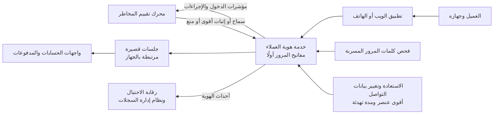

<!-- Generated by scripts/build.mjs from data/patterns/P17.json. Edit the data, then run npm run build. -->

[English](../en/P17-customer-identity.md)

# P17 هوية العملاء وحماية حساباتهم

> مكّن العملاء من الدخول بمفاتيح المرور، وقيّم مخاطر كل دخول وكل إجراء حساس، واجعل استعادة الحساب قوية بقدر قوة الدخول نفسه، حتى لا تكفي كلمات المرور المسروقة والرموز المعترضة للاستيلاء على أي حساب.

| المجال | أنماط ذات صلة |
| --- | --- |
| الهوية | [P02 الهوية مستوى تحكم](P02-identity-control-plane.md)، [P07 بوابة الواجهات البرمجية والتفويض على مستوى الكائن](P07-api-security.md)، [P10 بيانات الرصد ومسار الكشف](P10-detection-telemetry.md)، [P27 حماية تطبيقات الهاتف](P27-mobile-app-protection.md) |

## المشكلة

تتعرض حسابات العملاء لهجمات واسعة ببيانات دخول مسربة من مواقع أخرى، وبصفحات تصيد تمرر الرموز المؤقتة لحظة إدخالها، وبتبديل شرائح الاتصال لتحويل الرسائل النصية، ثم يتحول كل استيلاء ناجح إلى احتيال وشكوى وسؤال من الجهة الرقابية، بينما تدفع الضوابط التي تزعج العملاء الصادقين إلى مراكز الاتصال، حيث تكون استعادة الحساب في الغالب أضعف حلقة.

## متى تستخدمه

- يدخل العملاء إلى خدمة ويب أو تطبيق للهاتف عبر الإنترنت.
- تحفظ الحسابات أموالًا أو بيانات شخصية أو أي شيء يستحق السرقة.
- يكلفك الاحتيال الناتج عن الاستيلاء على الحسابات بالفعل، أو تتوقع الجهة الرقابية تحققًا قويًا من هوية العملاء.

## التصميم

شغّل هوية العملاء خدمة مستقلة عن مزود هوية الموظفين، واجعل مفاتيح المرور الطريقة الافتراضية للدخول مع بديل يقاوم التصيد أيضًا مثل موافقة مرتبطة بالجهاز، ثم قيّم كل دخول وكل إجراء حساس مثل إضافة مستفيد أو تغيير رقم الهاتف بمؤشرات مثل سمعة الجهاز والموقع وتكرار المحاولات وكلمات المرور المعروف تسربها، فتسمح أو تطلب إثباتًا أقوى أو تمنع.

عامل استعادة الحساب وتغيير بيانات التواصل بوصفهما أعلى عمليات الدخول خطورة، فاطلب أقوى عنصر يملكه العميل، وأبلغه عبر بيانات التواصل القديمة، وأوقف الإجراءات عالية القيمة مدة تهدئة، ثم اربط الجلسات بالجهاز واجعلها قصيرة للإجراءات الحساسة، وأرسل أحداث الهوية إلى رقابة الاحتيال ونظام إدارة السجلات، حتى يُوقف الاستيلاء أثناء حدوثه بدلًا من تعويض العميل بعده.

## الضوابط

### أساسي

- **امنع كلمات المرور المعروف تسربها:** افحص كلمات المرور الجديدة والمعدلة مقابل قوائم كلمات المرور المسربة، وحدّد عدد محاولات الدخول لكل حساب ولكل مصدر.
  `NIST IA-5` `NIST AC-7` `ISO A.5.17`
- **قدّم تحققًا قويًا لكل عميل:** قدّم مفاتيح المرور أو الموافقة عبر التطبيق لكل عميل، واشترطها للإجراءات الحساسة مثل الدفع إلى مستفيد جديد.
  `NIST IA-2(1)` `NIST IA-8` `CIS 6.3` `ISO A.8.5`
- **احمِ استعادة الحساب:** اجعل الاستعادة وتغيير بيانات التواصل يتطلبان أقوى عنصر يملكه العميل، وأبلغ العميل عبر القناة القديمة.
  `NIST IA-5` `NIST IA-8` `ISO A.5.17`

### معزز

- **قيّم مخاطر كل دخول:** قيّم مؤشرات الجهاز والموقع والشبكة والسلوك عند كل دخول وكل إجراء حساس، واطلب إثباتًا أقوى أو امنع حين ترتفع المخاطر.
  `NIST IA-11` `NIST SI-4` `ISO A.8.16`
- **اربط الجلسات بالجهاز:** أصدر جلسات قصيرة مرتبطة بالجهاز، وأعد التحقق قبل الإجراءات الحساسة حتى لا يكفي ملف تعريف مسروق.
  `NIST SC-23` `NIST AC-12` `ISO A.8.5`
- **أرسل أحداث الهوية إلى رقابة الاحتيال:** مرّر عمليات الدخول والاستعادة وتغيير بيانات التواصل إلى رقابة الاحتيال ونظام إدارة السجلات، مع قواعد تكشف أنماط الاستيلاء.
  `NIST AU-2` `NIST SI-4` `CIS 8.2` `ISO A.8.15` `ISO A.8.16`

### متقدم

- **اجعل مفاتيح المرور هي الأصل:** سجّل العملاء في مفاتيح المرور افتراضيًا، وأوقف الرموز النصية للإجراءات الحساسة حين يملك عدد كافٍ من العملاء عنصرًا مقاومًا للتصيد.
  `NIST IA-2(1)` `NIST IA-2(2)` `CIS 6.3` `ISO A.8.5`
- **أوقف التغييرات عالية القيمة مدة تهدئة:** أخّر المدفوعات عالية القيمة بعد الاستعادة أو تغيير بيانات التواصل، ومكّن العميل من إلغائها عبر قناة موثوقة.
  `NIST AC-3` `NIST SI-4` `ISO A.5.15`

## قرارات يجب توثيقها

- ما الإجراءات التي تُعد حساسة، وأي قوة في التحقق يحتاجها كل منها؟
- ما البديل المتاح للعملاء الذين لا يملكون مفاتيح مرور، وكيف ستنقلهم بعيدًا عن الرموز النصية؟
- من يملك القرار عند دخول عالي المخاطر، أهي خدمة الهوية أم فريق الاحتيال أم كلاهما؟

## المفاضلات

- تكلّف كل خطوة إضافية عند الدخول خسارة بعض العملاء، لذا يجب أن تُصرف الصعوبة على اللحظات الخطرة لا على كل زيارة.
- يحتاج تقييم المخاطر إلى بيانات عن الأجهزة والسلوك، وهذا يجلب واجبات خاصة بالخصوصية.
- تعتمد مفاتيح المرور على منصة العميل، لذا يحتاج دعم الأجهزة القديمة والمشتركة إلى خطة.

## أنماط خاطئة يجب تجنبها

- الرموز النصية عنصرًا ثانيًا وحيدًا للمدفوعات.
- مركز اتصال يعيد تعيين الحسابات بعد بضعة أسئلة شخصية.
- مزود الهوية نفسه والمسؤولون أنفسهم للعملاء والموظفين.

## كيف تتحقق منه

- أعد تشغيل أداة تصيد حقيقية على حساب اختباري، وتأكد من أن الرمز المُمرَّر لا يمنح جلسة.
- غيّر رقم الهاتف في حساب اختباري، وتأكد من وصول الإشعار إلى الرقم القديم ومن إيقاف المدفوعات.
- نفّذ اختبار حشو بيانات الاعتماد بحجم منخفض، وتأكد من تفعيل الحد من المحاولات والكشف معًا.

## التهديدات التي يتصدى لها

| المرجع | الاسم |
| --- | --- |
| [T1110.004](https://attack.mitre.org/techniques/T1110/004/) | التخمين، حشو بيانات الاعتماد |
| [T1539](https://attack.mitre.org/techniques/T1539/) | سرقة ملف تعريف جلسة الويب |
| [T1111](https://attack.mitre.org/techniques/T1111/) | اعتراض التحقق متعدد العناصر |
| [T1621](https://attack.mitre.org/techniques/T1621/) | إغراق طلبات التحقق متعدد العناصر |
| [API2:2023](https://owasp.org/API-Security/editions/2023/en/0xa2-broken-authentication/) | كسر التحقق من الهوية |

## المراجع

- [تحالف FIDO، مفاتيح المرور](https://fidoalliance.org/passkeys/)
- [إرشادات الهوية الرقمية NIST SP 800-63B للتحقق من الهوية](https://csrc.nist.gov/pubs/sp/800/63/b/4/final)
- [دليل OWASP المختصر للتحقق من الهوية](https://cheatsheetseries.owasp.org/cheatsheets/Authentication_Cheat_Sheet.html)

