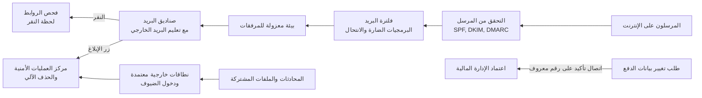

<!-- Generated by scripts/build.mjs from data/patterns/P18.json. Edit the data, then run npm run build. -->

[English](../en/P18-email-and-collaboration.md)

# P18 حماية البريد الإلكتروني وأدوات التعاون

> وثّق نطاقاتك عبر SPF وDKIM وسياسة DMARC بالرفض، وافحص كل رسالة وكل رابط قبل التسليم وبعده، وتحكّم في من يستطيع من الخارج الانضمام إلى محادثاتك وملفاتك المشتركة، لأن البريد وأدوات التعاون هي حيث يبدأ معظم الاختراقات.

| المجال | أنماط ذات صلة |
| --- | --- |
| بيئة العمل | [P02 الهوية مستوى تحكم](P02-identity-control-plane.md)، [P19 أجهزة طرفية مُدارة ومحصّنة](P19-managed-endpoints.md)، [P10 بيانات الرصد ومسار الكشف](P10-detection-telemetry.md) |

## المشكلة

يظل التصيد واختراق البريد التجاري أكثر الخطوات الأولى للاختراق شيوعًا وأغلى أنواع الاحتيال، إذ ينتحل المهاجمون نطاقك أمام عملائك، ويرسلون روابط تجتاز الفلاتر ثم تصبح ضارة بعد ساعات، وينتقلون من صندوق بريد مخترق لدى شريك إلى محادثات حقيقية عن الفواتير، بينما تضيف أدوات التعاون ضيوفًا وروابط مشاركة ورسائل محادثة من الخارج كثيرًا ما تتجاوز الضوابط المبنية للبريد.

## متى تستخدمه

- يستخدم العاملون في المؤسسة البريد والمحادثات للعمل مع العملاء والشركاء والموردين.
- تُطلب المدفوعات أو البيانات الحساسة أو تُعتمد عبر البريد في أي وقت.
- نطاقك علامة يستطيع المجرمون انتحالها أمام عملائك.

## التصميم

انشر SPF وDKIM لكل نطاق يرسل بريدًا بما فيها الخدمات التي ترسل نيابة عنك، ثم انقل DMARC من المراقبة إلى الرفض، واحمِ النطاقات غير المستخدمة التي لا ترسل أبدًا، ومرّر البريد الوارد عبر فلترة تتحقق من هوية المرسل، وتشغّل المرفقات في بيئة معزولة لفحص سلوكها، وتعيد كتابة الروابط وتفحصها مجددًا لحظة النقر عليها، وتُعلِّم الرسائل الواردة من الخارج.

أخضع طلبات الدفع وتغيير البيانات المصرفية الواردة بالبريد لاتصال تأكيد على رقم معروف مهما بدت الرسالة، واسمح في أدوات التعاون بالوصول الخارجي من النطاقات المعتمدة فقط، واشترط دخول الضيوف، واجعل لروابط المشاركة مدة انتهاء، وطبّق على الملفات والرسائل فحوص البرمجيات الضارة ومنع تسرب البيانات نفسها المطبقة على البريد، ثم امنح الناس زرًا واحدًا للإبلاغ عن أي رسالة مريبة، وأرسل البلاغات وبيانات رصد البريد إلى مركز العمليات الأمنية.

## الضوابط

### أساسي

- **وثّق نطاقات الإرسال:** انشر SPF وDKIM لكل نطاق وخدمة ترسل البريد، وسجل DMARC مع التقارير.
  `NIST SI-8` `CIS 9.5` `ISO A.8.21`
- **افحص البريد الوارد ومرفقاته:** افحص البريد الوارد بحثًا عن البرمجيات الضارة والانتحال، وامنع أنواع الملفات التي لا تحتاجها أبدًا، وعلّم الرسائل الواردة من الخارج.
  `NIST SI-3` `NIST SI-8` `CIS 9.6` `CIS 9.7` `ISO A.8.7`
- **تحقق من تغييرات الدفع خارج البريد:** أكّد البيانات المصرفية الجديدة أو المعدلة وطلبات الدفع العاجلة بالاتصال على رقم معروف لا برقم ورد في الرسالة، ودرّب الموظفين على ذلك.
  `NIST AT-2` `CIS 14.2` `ISO A.6.3`

### معزز

- **انقل DMARC إلى الرفض:** انقل DMARC من المراقبة إلى العزل ثم إلى الرفض، وانشر سياسة الرفض للنطاقات التي لا ترسل بريدًا أبدًا.
  `NIST SI-8` `CIS 9.5` `ISO A.8.21`
- **شغّل المرفقات في بيئة معزولة وافحص الروابط عند النقر:** شغّل المرفقات في بيئة معزولة قبل التسليم، وأعد كتابة الروابط حتى تُفحص مجددًا حين ينقر عليها أحد.
  `NIST SC-44` `NIST SI-3` `CIS 9.3` `CIS 10.7` `ISO A.8.7` `ISO A.8.23`
- **تحكّم في الضيوف والمشاركة في أدوات التعاون:** اسمح بالمحادثات الخارجية والضيوف من النطاقات المعتمدة فقط، واشترط دخول الضيوف، واجعل لروابط المشاركة مدة انتهاء.
  `NIST AC-3` `NIST AC-4` `CIS 3.3` `ISO A.5.14` `ISO A.8.12`

### متقدم

- **اجعل الإبلاغ بنقرة واحدة وأغلق الحلقة:** امنح الجميع زرًا للإبلاغ، واحذف الرسائل المبلّغ عنها من كل الصناديق آليًا، وأخبر المبلّغ بما حدث.
  `NIST IR-6` `NIST SI-8` `ISO A.6.8`
- **ابحث عن التهديدات في بيانات البريد والمحادثات:** أرسل أحداث البريد والمحادثات والمشاركة إلى مركز العمليات الأمنية، وابحث عن قواعد صناديق البريد والتحويل غير المعتاد والموافقة على تطبيقات خطرة.
  `NIST SI-4` `NIST AU-6` `CIS 8.2` `CIS 13.1` `ISO A.8.16`

## قرارات يجب توثيقها

- ما الخدمات التي ترسل البريد باسم نطاقاتك، ومن يملك إعدادات SPF وDKIM لكل منها؟
- ما السرعة التي يمكن بها نقل DMARC إلى الرفض دون حجب بريد مشروع؟
- ما الجهات الخارجية التي يجوز لها التحادث والمشاركة مع موظفيك، ومن يعتمد الجهات الجديدة؟

## المفاضلات

- قد تُسقط سياسة DMARC الصارمة بريدًا من خدمات لم تُضبط بطريقة صحيحة أبدًا، لذا تحتاج أولًا إلى حصر لها.
- تضيف البيئة المعزولة وفحص الروابط ثواني من التأخير يلاحظها بعض المستخدمين.
- تبطئ القيود المشددة على التعاون الخارجي العمل مع الشركاء، لذا يجب أن يسهل تحديث القائمة المعتمدة.

## أنماط خاطئة يجب تجنبها

- ترك DMARC في وضع المراقبة لسنوات.
- تغيير بيانات الدفع اعتمادًا على رسالة بريد وحدها.
- محادثات مفتوحة لأي جهة خارجية دون أن يراجع أحد من ينضم إليها.

## كيف تتحقق منه

- أرسل من الخارج رسالة تنتحل نطاقك نفسه، وتأكد من رفضها.
- أرسل مرفقًا اختباريًا يشغّل نصًا برمجيًا غير ضار، وتأكد من أن البيئة المعزولة تكتشفه.
- أبلغ عن رسالة تصيد اختبارية، وتأكد من اختفائها من كل صندوق تلقّاها.

## التهديدات التي يتصدى لها

| المرجع | الاسم |
| --- | --- |
| [T1566.001](https://attack.mitre.org/techniques/T1566/001/) | التصيد، مرفق التصيد الموجّه |
| [T1566.002](https://attack.mitre.org/techniques/T1566/002/) | التصيد، رابط التصيد الموجّه |
| [T1534](https://attack.mitre.org/techniques/T1534/) | التصيد الموجّه الداخلي |
| [T1684.001](https://attack.mitre.org/techniques/T1684/001/) | الهندسة الاجتماعية، انتحال الشخصية |
| [T1114](https://attack.mitre.org/techniques/T1114/) | جمع البريد الإلكتروني |

## المراجع

- [موقع DMARC.org](https://dmarc.org/)
- [المعيار RFC 7489 لسياسة DMARC](https://datatracker.ietf.org/doc/html/rfc7489)
- [الضابط ٩ في CIS Controls v8.1 لحماية البريد ومتصفحات الويب](https://www.cisecurity.org/controls/email-and-web-browser-protections)

