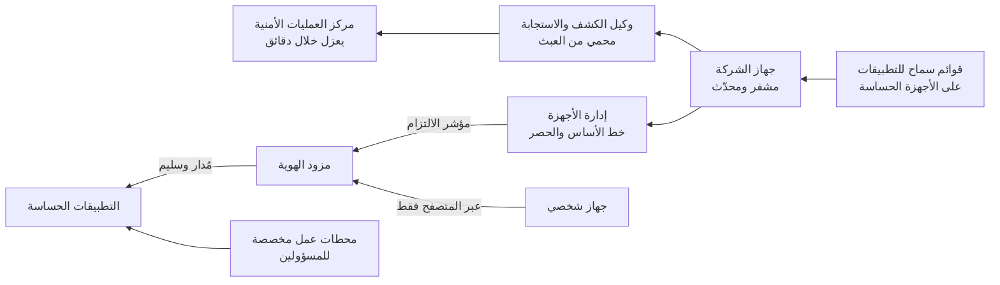

<!-- Generated by scripts/build.mjs from data/patterns/P19.json. Edit the data, then run npm run build. -->

[English](../en/P19-managed-endpoints.md)

# P19 أجهزة طرفية مُدارة ومحصّنة

> امنح الوصول للأجهزة التي تديرها المؤسسة فقط، وأبقها محصّنة ومحدّثة ومشفرة، وأزل صلاحيات المسؤول المحلي، وراقبها بأداة للكشف والاستجابة على الأجهزة الطرفية، لأن الحاسوب المحمول هو حيث يلتقي المستخدمون بالمهاجمين.

| المجال | أنماط ذات صلة |
| --- | --- |
| بيئة العمل | [P01 الوصول وفق الثقة الصفرية](P01-zero-trust-access.md)، [P03 الصلاحيات الهامة والحساسة في طبقات](P03-tiered-privileged-access.md)، [P10 بيانات الرصد ومسار الكشف](P10-detection-telemetry.md) |

## المشكلة

يمس معظم الاختراقات جهازًا طرفيًا، فقد يفتح مستخدم مرفقًا أو يشغّل متصفح تنزيلًا ضارًا أو يبقى في حاسوب مسروق بيانات اعتماد مخزنة، كما تتراكم على الأجهزة التي يديرها مستخدموها بأنفسهم برمجيات غير محدّثة وأدوات تعطل الحماية، بينما تصل الأجهزة الشخصية إلى بيانات الشركة دون أي وسيلة لفحص حالتها أو مسحها.

## متى تستخدمه

- يستخدم الموظفون حواسيب محمولة أو مكتبية أو هواتف للوصول إلى أنظمة الشركة أو بياناتها.
- يعمل الناس عن بعد، أو يستخدمون أجهزتهم الشخصية.
- يستخدم المسؤولون والمطورون محطات عملهم للأعمال ذات الصلاحيات الهامة.

## التصميم

سجّل كل جهاز تملكه الشركة في نظام لإدارة الأجهزة بخط أساس محصّن يشمل تشفير القرص كاملًا وجدار حماية للجهاز والتحديث التلقائي ومنع صلاحيات المسؤول المحلي عن الحسابات اليومية، ثم شغّل أداة للكشف والاستجابة على كل جهاز مع حماية من العبث حتى لا تستطيع البرمجيات الضارة ولا المستخدمون تعطيلها، وأرسل بيانات رصدها إلى مركز العمليات الأمنية.

اجعل قرارات الوصول معتمدة على الجهاز، فيتحقق مزود الهوية من أن الجهاز مُدار وملتزم وسليم قبل أن يمنحه الوصول إلى التطبيقات الحساسة، بينما تحصل الأجهزة الشخصية على وصول عبر المتصفح فقط أو على ملف عمل معزول، ثم تحكّم في ما يعمل على الأجهزة الحساسة بقوائم سماح للتطبيقات، وامنح المسؤولين محطات عمل مخصصة للصلاحيات الهامة.

## الضوابط

### أساسي

- **أدر كل جهاز تملكه الشركة:** سجّل كل جهاز في نظام إدارة الأجهزة، واحتفظ بسجل حصر لها، ولتكن قادرًا على قفل الجهاز المفقود أو مسحه.
  `NIST CM-8` `NIST AC-19` `CIS 1.1` `CIS 4.1` `ISO A.8.1`
- **شفّر كل جهاز وحدّثه:** فعّل تشفير القرص كاملًا، وطبّق تحديثات نظام التشغيل والمتصفح آليًا خلال أيام.
  `NIST SC-28` `NIST SI-2` `CIS 3.6` `CIS 7.3` `ISO A.8.1` `ISO A.8.8`
- **أزل صلاحيات المسؤول المحلي:** اسحب صلاحيات المسؤول المحلي من الحسابات اليومية، وعالج الاستثناءات عبر طلب ينتهي بمدة.
  `NIST AC-6` `NIST CM-11` `CIS 5.4` `ISO A.8.2`

### معزز

- **شغّل الكشف والاستجابة على كل جهاز:** انشر أداة للكشف والاستجابة مع حماية من العبث على كل جهاز، وأرسل تنبيهاتها إلى مركز العمليات الأمنية مع دليل استجابة للعزل.
  `NIST SI-3` `NIST SI-4` `CIS 10.1` `CIS 10.7` `ISO A.8.7` `ISO A.8.16`
- **افحص سلامة الجهاز قبل الوصول:** اجعل مزود الهوية يشترط جهازًا مُدارًا وملتزمًا للتطبيقات الحساسة، وامنح الأجهزة الشخصية وصولًا عبر المتصفح فقط.
  `NIST AC-17` `NIST IA-3` `ISO A.8.1` `ISO A.6.7`
- **حصّن خط الأساس:** طبّق خط أساس مستندًا إلى معيار مرجعي، وفعّل جدار الحماية للجهاز، وامنع وحدات الماكرو القادمة من الإنترنت والنصوص البرمجية غير الموقعة.
  `NIST CM-6` `NIST CM-7` `CIS 4.1` `CIS 4.5` `ISO A.8.9`

### متقدم

- **اسمح بالتطبيقات المعتمدة فقط:** استخدم قوائم السماح للتطبيقات والنصوص البرمجية على محطات عمل المسؤولين والأجهزة الحساسة الأخرى.
  `NIST CM-7` `NIST CM-14` `CIS 2.5` `CIS 2.7` `ISO A.8.19`
- **اعزل الجهاز المخترق خلال دقائق:** مكّن مركز العمليات الأمنية من عزل الجهاز عن الشبكة عن بعد مع إبقائه متاحًا للتحقيق، واختبر ذلك بانتظام.
  `NIST IR-4` `NIST SI-4` `CIS 17.4` `ISO A.5.26`

## قرارات يجب توثيقها

- ما التطبيقات التي تحتاج إلى جهاز مُدار، وما التي يجوز للأجهزة الشخصية الوصول إليها عبر المتصفح؟
- من يجوز له امتلاك صلاحيات المسؤول المحلي، ولأي مدة، ومن يعتمد ذلك؟
- ما السرعة التي يجب أن تصل بها التحديثات الحرجة إلى كل جهاز، وماذا يحدث للأجهزة التي تتأخر عن الموعد؟

## المفاضلات

- تُنشئ إزالة صلاحيات المسؤول المحلي طلبات للبرمجيات، لذا يجب أن يتوفر فهرس للخدمة الذاتية من اليوم الأول.
- تمنع قوائم السماح البرمجيات غير المعروفة بما فيها أدوات يحتاجها المطورون، لذا تناسب بعض الأدوار أكثر من غيرها.
- تحجب فحوص الأجهزة المسافرين حين يخرج جهاز عن الالتزام، لذا يجب أن تكون المعالجة سريعة وواضحة.

## أنماط خاطئة يجب تجنبها

- حسابات يومية تملك صلاحيات المسؤول المحلي.
- وكيل للكشف والاستجابة يستطيع المستخدمون أو البرمجيات الضارة تعطيله.
- أجهزة شخصية تزامن ملفات الشركة دون أي إدارة.

## كيف تتحقق منه

- حاول إيقاف وكيل الكشف والاستجابة بصفتك مستخدمًا محليًا ثم مسؤولًا، وتأكد من أن الحماية من العبث تمنع المحاولتين.
- ادخل إلى تطبيق حساس من جهاز غير مُدار، وتأكد من رفض الوصول أو حصره في المتصفح.
- قارن سجل حصر الأجهزة بسجلات الدخول، وابحث عن أجهزة تدخل دون أن تكون مُدارة.

## التهديدات التي يتصدى لها

| المرجع | الاسم |
| --- | --- |
| [T1204](https://attack.mitre.org/techniques/T1204/) | التنفيذ بيد المستخدم |
| [T1059](https://attack.mitre.org/techniques/T1059/) | مفسّر الأوامر والنصوص البرمجية |
| [T1566.001](https://attack.mitre.org/techniques/T1566/001/) | التصيد، مرفق التصيد الموجّه |
| [T1003](https://attack.mitre.org/techniques/T1003/) | استخراج بيانات الاعتماد من نظام التشغيل |

## المراجع

- [معايير CIS المرجعية للتحصين](https://www.cisecurity.org/cis-benchmarks)
- [إرشادات NIST SP 800-124 Rev 2 لإدارة أمن الأجهزة المحمولة في المؤسسات](https://csrc.nist.gov/pubs/sp/800/124/r2/final)
- [إرشادات أمن الأجهزة من المركز الوطني البريطاني للأمن السيبراني NCSC](https://www.ncsc.gov.uk/collection/device-security-guidance)

