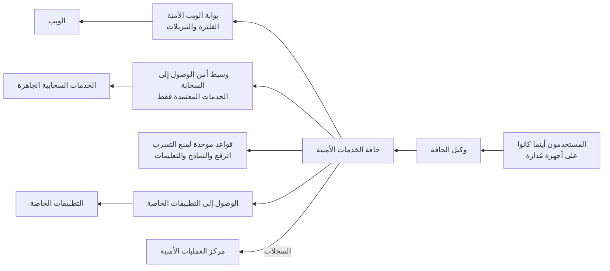

<!-- Generated by scripts/build.mjs from data/patterns/P20.json. Edit the data, then run npm run build. -->

[English](../en/P20-security-service-edge.md)

# P20 حافة الخدمات الأمنية للمستخدمين أينما كانوا

> مرّر حركة المستخدمين إلى الويب والخدمات السحابية الجاهزة عبر حافة أمنية سحابية واحدة تفلتر الويب وتحكم استخدام تلك الخدمات وتفحص تسرب البيانات وتتوسط الوصول إلى التطبيقات الخاصة، حتى تتبع السياسة نفسها الناس أينما عملوا.

| المجال | أنماط ذات صلة |
| --- | --- |
| بيئة العمل | [P01 الوصول وفق الثقة الصفرية](P01-zero-trust-access.md)، [P05 حافة إنترنت محمية وحركة صادرة مضبوطة](P05-internet-edge-and-egress.md)، [P09 حماية تتمحور حول البيانات](P09-data-centric-protection.md) |

## المشكلة

لم يعد المستخدمون خلف جدار الحماية في المكتب، إذ تصل حواسيبهم إلى الإنترنت والخدمات السحابية مباشرة من المنازل والفنادق، فترى الفلترة ومنع تسرب البيانات وفحص البرمجيات الضارة المبنية في مركز البيانات جزءًا متناقصًا من الحركة، بينما يلصق الموظفون البيانات في خدمات تخزين شخصية وأدوات ذكاء اصطناعي جديدة، ويستضيف المهاجمون برمجياتهم الضارة وخوادم التحكم على الخدمات السحابية الشائعة نفسها التي يستخدمها الجميع.

## متى تستخدمه

- يعمل الموظفون من المنزل أو أثناء السفر أو من فروع لا تملك منظومة أمن محلية قوية.
- تعتمد المؤسسة على الخدمات السحابية الجاهزة، ويستطيع الناس الوصول إلى خدمات لم يعتمدها أحد.
- قد تتسرب البيانات الحساسة عبر الويب أو التخزين الشخصي أو أدوات الذكاء الاصطناعي.

## التصميم

ثبّت وكيلًا واحدًا على الأجهزة المُدارة يرسل حركة الويب والخدمات السحابية الجاهزة إلى حافة أمنية سحابية، مع بوابة ويب آمنة تحجب المواقع الضارة وغير المصنفة وتفحص التنزيلات وتفك تشفير الحركة حيث يسمح القانون وسياستك، ثم استخدم الحافة نفسها للتوسط في الوصول إلى التطبيقات الخاصة، حتى يتشارك الوصول البعيد وأمن الويب سياسة واحدة ومجموعة واحدة من السجلات.

احكم استخدام الخدمات السحابية الجاهزة بوسيط أمن للوصول إلى السحابة، فاكتشف الخدمات التي يستخدمها الناس، واعتمد الموافق عليها، واحجب البقية أو قيّدها، واتصل بالواجهات البرمجية للخدمات المعتمدة لتكتشف المشاركة المفرطة والتكاملات الخطرة، ثم طبّق مجموعة واحدة من قواعد منع التسرب على الرفع ونماذج الويب وتعليمات الذكاء الاصطناعي والمشاركة في تلك الخدمات، وابدأ بوضع المراقبة لتتعلم قبل أن تحجب.

## الضوابط

### أساسي

- **افلتر الويب لكل مستخدم:** احجب المواقع الضارة والمسجلة حديثًا وغير المصنفة لكل جهاز مُدار داخل الشبكة وخارجها.
  `NIST SC-7` `NIST SI-3` `CIS 9.2` `CIS 9.3` `ISO A.8.23`
- **اكتشف استخدام الخدمات السحابية الجاهزة:** اعرف الخدمات السحابية الجاهزة التي يستخدمها الناس ومع أي بيانات، وقرّر ما الخدمات المعتمدة.
  `NIST CM-8` `NIST SA-9` `CIS 2.1` `ISO A.5.23`
- **افحص التنزيلات:** افحص الملفات المنزلة بحثًا عن البرمجيات الضارة، واحجب أنواع الملفات التي لا يحتاجها المستخدمون أبدًا.
  `NIST SI-3` `CIS 10.1` `ISO A.8.7`

### معزز

- **احكم الخدمات السحابية بوسيط CASB:** احجب الخدمات غير المعتمدة، وقيّد الإجراءات الخطرة في المعتمدة، واستخدم الاتصال بالواجهات البرمجية لاكتشاف المشاركة المفرطة.
  `NIST AC-4` `NIST SA-9` `CIS 3.3` `ISO A.5.23` `ISO A.8.12`
- **طبّق مجموعة واحدة من قواعد منع التسرب:** طبّق قواعد منع التسرب نفسها على الرفع ونماذج الويب وتعليمات الذكاء الاصطناعي والمشاركة في الخدمات السحابية، بدءًا بوضع المراقبة.
  `NIST AC-4` `NIST SI-4` `CIS 3.13` `ISO A.8.12`
- **توسّط الوصول إلى التطبيقات الخاصة عبر الحافة نفسها:** امنح المستخدمين البعيدين الوصول إلى التطبيقات الخاصة عبر الحافة بدلًا من شبكة افتراضية خاصة، لكل تطبيق ولكل مستخدم.
  `NIST AC-17` `NIST AC-3` `CIS 13.5` `ISO A.6.7` `ISO A.8.20`

### متقدم

- **اعزل التصفح الخطر:** افتح المواقع غير المصنفة والخطرة في عزل المتصفح عن بعد، حتى لا يصل أي محتوى نشط إلى الجهاز.
  `NIST SC-7(21)` `NIST SC-44` `CIS 9.3` `ISO A.8.23`
- **راقب خروج البيانات عبر خدمات الويب:** نبّه عند الرفع الكبير إلى التخزين الشخصي والخدمات الجديدة، واربطه بمخاطر المستخدم في مركز العمليات الأمنية.
  `NIST SI-4(4)` `NIST AU-6` `CIS 13.1` `ISO A.8.16`

## قرارات يجب توثيقها

- ما الحركة التي ستفك تشفيرها، وما الفئات التي تبقى خاصة مثل الصحة والخدمات المصرفية؟
- ما الخدمات السحابية الجاهزة وخدمات الذكاء الاصطناعي المعتمدة، ومن يقرر بشأن الخدمات الجديدة؟
- هل ستنتقل التطبيقات الخاصة من الشبكة الافتراضية الخاصة إلى الحافة، وبأي ترتيب؟

## المفاضلات

- يمنح فك التشفير رؤية لكنه يمس الخصوصية ويعطل بعض التطبيقات، لذا يجب أن تكون الاستثناءات مدروسة.
- يسهل تشغيل مزود واحد للويب والخدمات السحابية والوصول الخاص، لكنه يركّز الاعتماد في مكان واحد.
- يدفع حجب الخدمات غير المعتمدة دون تقديم بدائل جيدة الناس إلى أجهزتهم الشخصية.

## أنماط خاطئة يجب تجنبها

- فلترة للويب لا تعمل إلا في المكتب.
- قواعد لمنع التسرب تُحوَّل إلى الحجب من اليوم الأول ثم تُعطَّل بعد الشكاوى.
- شبكة افتراضية خاصة بنفق كامل بوصفها الضابط الوحيد للمستخدمين البعيدين.

## كيف تتحقق منه

- زر موقعًا ضارًا اختباريًا من حاسوب مُدار في المنزل، وتأكد من حجبه وتسجيله.
- ارفع ملفًا يحوي بيانات حساسة اختبارية إلى خدمة تخزين شخصية، وتأكد من تفعيل قاعدة منع التسرب.
- قارن تقرير اكتشاف الخدمات السحابية بالقائمة المعتمدة، وراجع ما هو جديد.

## التهديدات التي يتصدى لها

| المرجع | الاسم |
| --- | --- |
| [T1189](https://attack.mitre.org/techniques/T1189/) | الاختراق أثناء التصفح |
| [T1567](https://attack.mitre.org/techniques/T1567/) | التسريب عبر خدمة ويب |
| [T1071](https://attack.mitre.org/techniques/T1071/) | بروتوكول طبقة التطبيقات |

## المراجع

- [دليل NIST SP 800-215 لمشهد آمن لشبكات المؤسسات](https://csrc.nist.gov/pubs/sp/800/215/final)
- [معمارية الثقة الصفرية NIST SP 800-207](https://csrc.nist.gov/pubs/sp/800/207/final)
- [الضابط ٣ في CIS Controls v8.1 لحماية البيانات](https://www.cisecurity.org/controls/data-protection)

