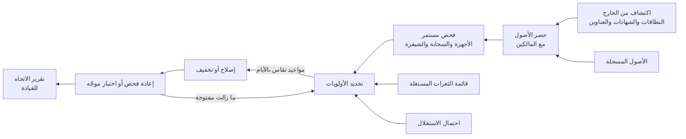

<!-- Generated by scripts/build.mjs from data/patterns/P21.json. Edit the data, then run npm run build. -->

[English](../en/P21-exposure-management.md)

# P21 إدارة مستمرة للانكشاف

> احتفظ بحصر حي لكل ما تكشفه، واكتشف الثغرات وأخطاء الإعداد باستمرار، وأصلح أولًا ما يستغله المهاجمون الآن، وأثبت الإصلاح بالاختبار، بدلًا من ملاحقة كل ملاحظة تظهرها أداة الفحص.

| المجال | أنماط ذات صلة |
| --- | --- |
| العمليات | [P05 حافة إنترنت محمية وحركة صادرة مضبوطة](P05-internet-edge-and-egress.md)، [P11 سلسلة إمداد برمجيات موثوقة](P11-software-supply-chain.md)، [P06 منطقة هبوط سحابية بضوابط وقائية](P06-cloud-landing-zone.md) |

## المشكلة

تنتج أدوات فحص الثغرات آلاف الملاحظات، فتعالجها الفرق حسب درجة الخطورة بينما يستغل المهاجمون مجموعة صغيرة من الثغرات المعروفة خلال أيام من الإعلان عنها في الغالب، كما يكتشف المهاجمون الأنظمة المكشوفة على الإنترنت التي لم يحصها أحد وبيئات الاختبار المنسية والشهادات المنتهية قبل أن تكتشفها المؤسسة نفسها.

## متى تستخدمه

- يمكن الوصول إلى أي نظام من الإنترنت أو من الشركاء.
- يتأخر التحديث، أو تُحدَّد أولوياته بدرجات الخطورة وحدها.
- تستطيع الفرق إنشاء موارد سحابية ونقاط وصول عامة بنفسها.

## التصميم

ابنِ الحصر من الخارج إلى الداخل، فاكتشف نطاقاتك وشهاداتك ونطاقات عناوين IP وحساباتك السحابية كما يفعل المهاجم، وطابقها مع سجل حصر الأصول حتى يصبح الانكشاف غير المعروف ملاحظة قائمة بذاتها، ثم افحص الأصول الداخلية والخارجية باستمرار بما فيها إعدادات السحابة واعتماديات الشيفرة، واربط كل أصل بمالك.

حدّد الأولويات بما يُستغل فعلًا وما هو مكشوف، فتأتي أولًا الثغرات الواردة في فهرس CISA للثغرات المستغلة المعروفة والثغرات عالية احتمال الاستغلال على الأصول المكشوفة للإنترنت، بمواعيد نهائية تقاس بالأيام، ثم تابع المعالجة مقابل تلك المواعيد، واستخدم إجراءات مخففة حين لا يحتمل الإصلاح الانتظار، وتأكد من الإغلاق بإعادة الفحص أو باختبار موجّه لا بحالة التذكرة.

## الضوابط

### أساسي

- **احصر ما تكشفه:** اكتشف النطاقات والعناوين والخدمات المكشوفة للإنترنت باستمرار، وامنح كلًا منها مالكًا.
  `NIST CM-8` `NIST RA-5` `CIS 1.1` `ISO A.5.9`
- **افحص الأصول الداخلية والخارجية:** افحص كل الأصول بحثًا عن الثغرات مرة كل شهر على الأقل، والأصول المكشوفة للإنترنت مرة كل أسبوع على الأقل.
  `NIST RA-5` `CIS 7.1` `CIS 7.6` `ISO A.8.8`
- **أصلح الثغرات المستغلة أولًا:** عالج الثغرات المعروف استغلالها على الأصول المكشوفة خلال أيام، وتابع كل موعد نهائي.
  `NIST SI-2` `NIST SI-5` `CIS 7.2` `CIS 7.7` `ISO A.8.8`

### معزز

- **حدّد الأولويات بمعلومات الاستغلال:** رتّب الملاحظات حسب الاستغلال المعروف واحتمال الاستغلال والانكشاف وقيمة الأصل، لا حسب درجة الخطورة وحدها.
  `NIST RA-3` `NIST RA-7` `CIS 7.2` `ISO A.5.7` `ISO A.8.8`
- **أدخل السحابة والشيفرة في النطاق:** افحص إعدادات السحابة وصور الحاويات واعتماديات الشيفرة، ووجّه الملاحظات إلى الفرق التي تملكها.
  `NIST RA-5` `NIST CM-6` `CIS 16.4` `ISO A.8.8` `ISO A.8.9`
- **استخدم إجراءات مخففة حين يجب أن ينتظر الإصلاح:** طبّق ضوابط تعويضية مثل تعطيل ميزة أو ترقيع افتراضي، مع مالك وتاريخ انتهاء.
  `NIST RA-7` `NIST SI-2` `CIS 7.2` `ISO A.8.8`

### متقدم

- **أثبت الإغلاق بالاختبار:** تأكد من إغلاق مواطن الانكشاف بإعادة الفحص أو باختبار موجّه، ونفّذ اختبارات اختراق خارجية كل عام.
  `NIST CA-8` `NIST RA-5` `CIS 18.2` `ISO A.8.8`
- **قِس الانكشاف بوصفه اتجاهًا:** أبلغ عن الزمن المستغرق لإصلاح الثغرات المستغلة وعدد الأصول المكشوفة غير المعروفة، وراجعهما مع القيادة.
  `NIST CA-7` `NIST RA-3` `CIS 7.1` `ISO A.8.8`

## قرارات يجب توثيقها

- ما المواعيد النهائية للثغرات المستغلة والحرجة وغيرها، على الأصول المكشوفة والداخلية؟
- من يملك كل أصل، وماذا يحدث للأصول التي لا يطالب بها أحد؟
- ما مصادر معلومات الاستغلال التي ستعتمد عليها لتحديد الأولويات؟

## المفاضلات

- تعني المواعيد السريعة للثغرات المستغلة تغييرات طارئة، وهذه تحتاج إلى مسار اعتماد أخف.
- يكشف الاكتشاف من الخارج مفاجآت حقيقية، وبعضها يعود إلى موردين لا تتحكم فيهم.
- يعني المزيد من الفحص المزيد من الملاحظات، فلا يضيف دون تحديد الأولويات سوى الضجيج.

## أنماط خاطئة يجب تجنبها

- المعالجة حسب درجة الخطورة وحدها بينما تنتظر الثغرات المعروف استغلالها في الطابور.
- إغلاق الملاحظات لأن تذكرة أُغلقت دون إعادة الفحص.
- حصر مبني فقط على ما تتذكر الفرق تسجيله.

## كيف تتحقق منه

- اختر ثغرة أُضيفت حديثًا إلى فهرس الثغرات المستغلة المعروفة، وتحقق من المدة التي بقيت فيها مفتوحة على أصولك المكشوفة.
- أعد فحص عينة من الملاحظات المصنفة مُصلحة، وتأكد من أنها مغلقة فعلًا.
- نفّذ اكتشافًا خارجيًا وقارن نتائجه بسجل الحصر، وامنح كل أصل غير معروف مالكًا أو موعدًا لإيقافه.

## التهديدات التي يتصدى لها

| المرجع | الاسم |
| --- | --- |
| [T1595.002](https://attack.mitre.org/techniques/T1595/002/) | الفحص النشط، فحص الثغرات |
| [T1190](https://attack.mitre.org/techniques/T1190/) | استغلال تطبيق مكشوف للعموم |
| [T1133](https://attack.mitre.org/techniques/T1133/) | خدمات الوصول البعيد الخارجية |
| [T1210](https://attack.mitre.org/techniques/T1210/) | استغلال الخدمات البعيدة |

## المراجع

- [فهرس CISA للثغرات المستغلة المعروفة](https://www.cisa.gov/known-exploited-vulnerabilities-catalog)
- [نظام FIRST للتنبؤ باستغلال الثغرات EPSS](https://www.first.org/epss/)
- [دليل NIST SP 800-40 Rev 4 لتخطيط إدارة التحديثات في المؤسسات](https://csrc.nist.gov/pubs/sp/800/40/r4/final)

