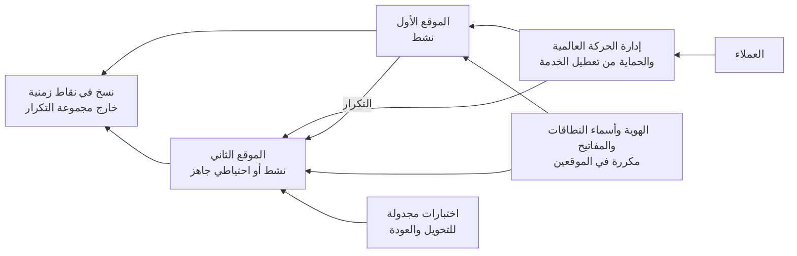

<!-- Generated by scripts/build.mjs from data/patterns/P22.json. Edit the data, then run npm run build. -->

[English](../en/P22-resilient-availability.md)

# P22 توافرية صامدة عبر مواقع متعددة

> صنّف خدماتك حسب المدة التي تحتملها الأعمال دونها، وشغّل الحرجة منها عبر مواقع أو مناطق مستقلة مع تحويل تلقائي مُختبَر، وأزل نقاط الإخفاق الوحيدة في الهوية وأسماء النطاقات والاتصال التي قد توقف كل المواقع دفعة واحدة.

| المجال | أنماط ذات صلة |
| --- | --- |
| العمليات | [P12 استعادة صامدة أمام برامج الفدية](P12-resilient-recovery.md)، [P05 حافة إنترنت محمية وحركة صادرة مضبوطة](P05-internet-edge-and-egress.md)، [P04 العزل والتقسيم الدقيق](P04-segmentation.md) |

## المشكلة

يوجد مركز بيانات ثانٍ أو منطقة سحابية ثانية في الخطة كثيرًا لكن لا وجود لهما عمليًا، إذ لم يُنفَّذ التحويل كاملًا من طرف إلى طرف أبدًا، ويعتمد الموقع الاحتياطي على مزود الهوية أو خدمة أسماء النطاقات أو وصلة الشبكة نفسها التي يعتمد عليها الموقع الرئيسي، بينما ينسخ التكرار الفساد وبرامج الفدية بالأمانة نفسها التي ينسخ بها البيانات السليمة، وتتوقع الجهات الرقابية اليوم أن تبقى الخدمات الحرجة ضمن حدود احتمال التعطل وأن تقدم دليلًا على قدرتها على ذلك.

## متى تستخدمه

- تتوقف الأعمال أو يتضرر العملاء خلال دقائق أو ساعات من التعطل.
- تحدد جهة رقابية حدودًا لاحتمال التعطل، أو تتوقع خطط استمرارية مُختبَرة.
- تعمل الخدمة في موقع واحد أو منطقة واحدة أو لدى مزود واحد.

## التصميم

اتفق مع إدارة الأعمال على وقت الاستعادة المستهدف ونقطة الاستعادة المستهدفة لكل خدمة، وصمّم وفقهما، أي تشغيلًا نشطًا في موقعين أو منطقتين للخدمات الأكثر حرجًا، وموقعًا احتياطيًا جاهزًا للفئة التالية، والاستعادة من النسخ الاحتياطية للبقية، ثم اجعل المواقع مستقلة بطاقتها ومسارات شبكتها وسعتها الخاصة، وتأكد من أن الهوية وخدمة أسماء النطاقات وإدارة المفاتيح والمراقبة تصمد عند فقدان أي من الموقعين.

احمِ التكرار من الإخفاقات التي قد ينشرها، فأضف نسخًا مؤخرة أو في نقاط زمنية حتى يمكن التراجع عن الفساد وبرامج الفدية، واحتفظ بنسخة واحدة خارج مجموعة التكرار، ثم اختبر التحويل والعودة وفق جدول وفي بيئة الإنتاج حيثما أمكن، وقِس أزمنة الاستعادة الفعلية مقابل الأهداف، وأبقِ السعة والحماية من هجمات تعطيل الخدمة كافيتين لوصول الحمل كله إلى موقع واحد.

## الضوابط

### أساسي

- **صنّف الخدمات حسب أهداف الاستعادة:** اتفق مع إدارة الأعمال على وقت الاستعادة ونقطة الاستعادة المستهدفين لكل خدمة، ووثّقهما في خطة الاستمرارية.
  `NIST CP-2` `NIST RA-9` `CIS 11.1` `ISO A.5.30`
- **أزل نقاط الإخفاق الوحيدة المشتركة:** اجعل الهوية وخدمة أسماء النطاقات وإدارة المفاتيح ووصلات الشبكة مكررة، حتى لا يستطيع أي منها إيقاف كل المواقع.
  `NIST CP-8` `NIST SC-36` `ISO A.8.14`
- **احمِ من هجمات تعطيل الخدمة:** استخدم حماية من هجمات تعطيل الخدمة لدى المزود تتسع لذروة حركتك، وحدودًا للمعدل أمام كل خدمة عامة.
  `NIST SC-5` `ISO A.8.20`

### معزز

- **شغّل الخدمات الحرجة في موقعين أو منطقتين:** شغّل الخدمات الأكثر حرجًا تشغيلًا نشطًا مزدوجًا أو مع موقع احتياطي جاهز في موقع أو منطقة مستقلة.
  `NIST CP-7` `NIST CP-6` `ISO A.8.14`
- **احمِ التكرار من الفساد:** احتفظ بنسخ مؤخرة أو في نقاط زمنية إلى جانب التكرار، حتى يمكن التراجع عن الفساد وبرامج الفدية.
  `NIST CP-9` `NIST CP-10` `CIS 11.2` `ISO A.8.13`
- **اختبر التحويل والعودة:** نفّذ التحويل والعودة وفق جدول، وقِس أزمنة الاستعادة الفعلية، وأصلح ما لم يبلغ الأهداف.
  `NIST CP-4` `CIS 11.5` `ISO A.5.30`

### متقدم

- **اصمد أمام فقدان مزود:** أزل للخدمات التي يجب ألا تتوقف الاعتماد على مزود واحد للاستضافة أو أسماء النطاقات أو الاتصال.
  `NIST SC-36` `NIST CP-8` `ISO A.5.30` `ISO A.8.14`
- **تدرّب على سيناريوهات شديدة لكنها ممكنة:** تدرّب على سيناريوهات مثل فقدان موقع بالتزامن مع هجوم سيبراني، وأبلغ عن النتائج مقابل حدود الاحتمال لديك.
  `NIST CP-4` `NIST IR-3` `CIS 17.7` `ISO A.5.29`

## قرارات يجب توثيقها

- ما الخدمات التي تحتاج إلى تشغيل نشط مزدوج، وما التي تحتاج إلى موقع احتياطي جاهز، وما التي تحتمل انتظار الاستعادة؟
- ما المسافة المطلوبة بين المواقع، وهل تتشارك أي مزود أو وصلة أو اعتمادية؟
- كيف ستعود بعد التحويل، ومن يقرر ذلك؟

## المفاضلات

- يكلّف التشغيل النشط المزدوج ما يقارب الضعف ويعقّد اتساق البيانات، لذا احصره في الخدمات التي تحتاجه فعلًا.
- يحمي التكرار المتزامن كل معاملة، لكنه يحد المسافة ويضيف تأخيرًا.
- يثبت الاختبار في بيئة الإنتاج صحة التصميم، لكنه يحمل مخاطر التعطل الذي يتدرب عليه.

## أنماط خاطئة يجب تجنبها

- موقع احتياطي لم يستقبل حركة حقيقية أبدًا.
- موقعان يعتمدان على مزود هوية واحد أو مزود واحد لأسماء النطاقات.
- معاملة التكرار بوصفه نسخة احتياطية.

## كيف تتحقق منه

- حوّل خدمة حرجة إلى الموقع الثاني في ساعات العمل، وقِس الزمن حتى تعود الخدمة إلى العملاء.
- أوقف مزود الهوية الرئيسي في اختبار، وتأكد من أن الدخول ما زال يعمل.
- استعد نسخة من نقطة زمنية تسبق فسادًا محاكى، وتأكد من سلامة البيانات.

## التهديدات التي يتصدى لها

| المرجع | الاسم |
| --- | --- |
| [T1498](https://attack.mitre.org/techniques/T1498/) | تعطيل الخدمة على مستوى الشبكة |
| [T1499](https://attack.mitre.org/techniques/T1499/) | تعطيل خدمة الأنظمة الطرفية |
| [T1485](https://attack.mitre.org/techniques/T1485/) | إتلاف البيانات |

## المراجع

- [دليل NIST SP 800-34 Rev 1 لتخطيط الطوارئ لأنظمة المعلومات](https://csrc.nist.gov/pubs/sp/800/34/r1/upd1/final)
- [دليل NIST SP 800-160 Vol 2 Rev 1 لتطوير أنظمة صامدة سيبرانيًا](https://csrc.nist.gov/pubs/sp/800/160/v2/r1/final)
- [المعيار ISO 22301 لأنظمة إدارة استمرارية الأعمال](https://www.iso.org/standard/75106.html)

