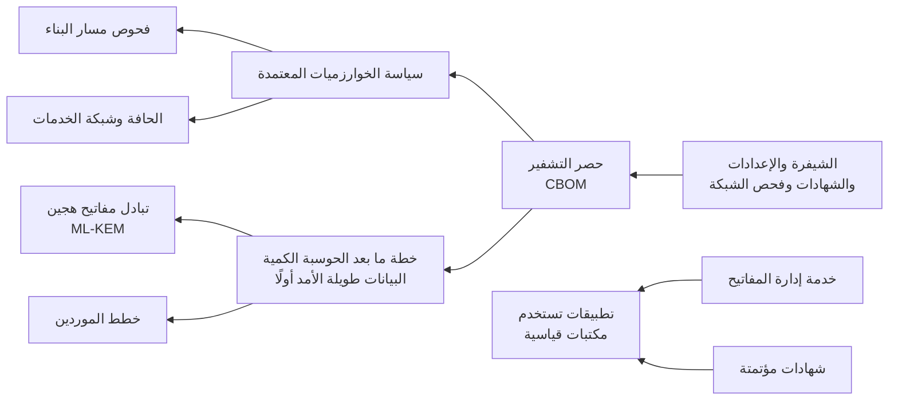

<!-- Generated by scripts/build.mjs from data/patterns/P23.json. Edit the data, then run npm run build. -->

[English](../en/P23-crypto-agility.md)

# P23 مرونة التشفير والجاهزية لما بعد الحوسبة الكمية

> اعرف أين تستخدم التشفير وكيف، واجعله خلف خدمات قليلة مُحكمة الإدارة بدلًا من داخل كل تطبيق، وأتمت الشهادات والمفاتيح، وخطّط للانتقال إلى خوارزميات ما بعد الحوسبة الكمية التي اعتمدها NIST معيارًا، بدءًا بالبيانات التي يجب أن تبقى سرية لسنوات.

| المجال | أنماط ذات صلة |
| --- | --- |
| البيانات | [P08 الأسرار والمفاتيح وهوية أعباء العمل](P08-secrets-keys-workload-identity.md)، [P09 حماية تتمحور حول البيانات](P09-data-centric-protection.md)، [P15 النطاق المعزول الخاضع للتنظيم](P15-regulated-enclave.md) |

## المشكلة

ينتشر التشفير في التطبيقات والأجهزة والمكتبات ومنتجات الموردين دون حصر في العادة، فتُكتشف الخوارزميات الضعيفة والشهادات التي توشك على الانتهاء بالأعطال لا بالخطط، كما سيكسر حاسوب كمي في المستقبل خوارزميات المفتاح العام المستخدمة اليوم، ويستطيع المهاجمون تسجيل الحركة المشفرة الآن لفك تشفيرها لاحقًا، مما يعرّض الأسرار طويلة الأمد للخطر منذ الآن، بينما يصبح تغيير الخوارزميات بطيئًا حين يطبق كل تطبيق التشفير بطريقته الخاصة.

## متى تستخدمه

- يجب أن تبقى البيانات سرية لسنوات طويلة، مثل سجلات العملاء أو الصحة أو الجهات الحكومية.
- تُدار الشهادات والمفاتيح والخوارزميات يدويًا تطبيقًا بعد تطبيق.
- تطلب جهة رقابية أو عميل خطة للتشفير لما بعد الحوسبة الكمية.

## التصميم

ابنِ حصرًا للتشفير من الشيفرة والإعدادات والشهادات وفحص الشبكة، ووثّقه في قائمة مكونات للتشفير تذكر الخوارزميات وأطوال المفاتيح والبروتوكولات والمالكين، ثم ضع سياسة للخوارزميات والبروتوكولات المعتمدة مثل TLS 1.3 على أن يكون TLS 1.2 الحد الأدنى، وافرضها عند الحافة وفي شبكة الخدمات ومسارات البناء، حتى تُكتشف الخيارات الضعيفة قبل إطلاقها.

انقل التشفير إلى خدمات مشتركة، أي خدمة لإدارة المفاتيح وخدمة للشهادات تصدرها وتجددها آليًا ومكتبات قياسية، حتى يصبح تغيير الخوارزمية تغييرًا في الإعدادات لا إعادة كتابة، ثم خطّط للانتقال إلى معايير NIST لما بعد الحوسبة الكمية، أي ML-KEM في FIPS 203 وML-DSA في FIPS 204، بدءًا بتبادل المفاتيح الهجين للحركة التي تحمي بيانات طويلة الأمد، واطلب من الموردين خططهم في ذلك.

## الضوابط

### أساسي

- **احصر استخدامات التشفير:** وثّق مواضع استخدام التشفير مع الخوارزميات وأطوال المفاتيح والشهادات والمالكين في قائمة مكونات للتشفير.
  `NIST CM-8` `NIST SC-13` `ISO A.8.24`
- **ضع سياسة للخوارزميات المعتمدة:** اعتمد الخوارزميات والبروتوكولات، واشترط TLS 1.2 على الأقل وTLS 1.3 حيثما أمكن، وأوقف الضعيف منها وفق جدول.
  `NIST SC-13` `NIST SC-8` `CIS 3.10` `ISO A.8.24`
- **أتمت الشهادات:** أصدر الشهادات وجددها آليًا، ونبّه قبل انتهائها بوقت كافٍ، وأبعد المفاتيح الخاصة عن الشيفرة والتذاكر.
  `NIST SC-17` `NIST SC-12` `ISO A.8.24`

### معزز

- **اجعل التشفير خلف خدمات مشتركة:** استخدم خدمة لإدارة المفاتيح ومكتبات قياسية، حتى تتغير الخوارزميات عبر الإعدادات.
  `NIST SC-12` `NIST SA-15` `ISO A.8.24` `ISO A.8.28`
- **افرض السياسة في مسارات البناء وعند الحافة:** أفشل عمليات البناء التي تضيف خوارزميات ضعيفة، وارفض البروتوكولات الضعيفة في موازنات الحمل وشبكة الخدمات.
  `NIST SA-11` `NIST SC-8` `CIS 16.12` `ISO A.8.24` `ISO A.8.29`
- **رتّب البيانات حسب مدة بقائها سرية:** حدّد البيانات التي يجب أن تبقى سرية بعد العقد القادم، وضع حركتها في مقدمة خطة ما بعد الحوسبة الكمية.
  `NIST RA-3` `NIST SC-8` `CIS 3.7` `ISO A.5.12` `ISO A.8.24`

### متقدم

- **اعتمد تبادل المفاتيح الهجين لما بعد الحوسبة الكمية:** استخدم تبادل مفاتيح هجينًا يجمع خوارزمية تقليدية مع ML-KEM للحركة التي تحمي بيانات طويلة الأمد.
  `NIST SC-8` `NIST SC-13` `CIS 3.10` `ISO A.8.24`
- **ألزم الموردين بخطة لما بعد الحوسبة الكمية:** اسأل الموردين الحرجين متى سيدعمون معايير NIST لما بعد الحوسبة الكمية، واجعل ذلك شرطًا في العقود الجديدة.
  `NIST SR-3` `NIST SA-9` `ISO A.5.20`

## قرارات يجب توثيقها

- ما البيانات التي يجب أن تبقى سرية أكثر من عشر سنوات، وما الأنظمة التي تنقلها؟
- ما الخوارزميات والبروتوكولات المعتمدة، وبأي تاريخ يجب أن يختفي الضعيف منها؟
- هل ستنتقل إلى خوارزميات ما بعد الحوسبة الكمية عبر الأنماط الهجينة أولًا، ومن أين ستبدأ؟

## المفاضلات

- مفاتيح ما بعد الحوسبة الكمية وتواقيعها أكبر حجمًا، مما يؤثر في عرض النطاق والتخزين وبعض الأجهزة القديمة.
- تضيف الأنماط الهجينة تعقيدًا لفترة، مقابل الأمان إذا أخفقت إحدى الخوارزميتين.
- تسهّل خدمات التشفير المركزية التغيير، لكنها تصبح اعتماديات حرجة تحتاج إلى توافرية عالية.

## أنماط خاطئة يجب تجنبها

- شهادات تُتابع في جدول بيانات وتُجدَّد يدويًا.
- اختيار كل تطبيق خوارزمياته وتثبيتها في شيفرته.
- انتظار وصول الحواسيب الكمية قبل بناء الحصر.

## كيف تتحقق منه

- افحص نقاط الوصول الخارجية، وتأكد من أن أيًا منها لا يقبل بروتوكولات أو خوارزميات خارج السياسة.
- اعرض الشهادات التي تنتهي خلال الأيام الثلاثين القادمة، وتأكد من أن كلًا منها سيتجدد آليًا.
- اختر تطبيقًا وغيّر خوارزمية تبادل المفاتيح فيه عبر الإعدادات وحدها في بيئة اختبار.

## التهديدات التي يتصدى لها

| المرجع | الاسم |
| --- | --- |
| [T1040](https://attack.mitre.org/techniques/T1040/) | التنصت على الشبكة |
| [T1557](https://attack.mitre.org/techniques/T1557/) | الخصم في المنتصف |
| [T1552.004](https://attack.mitre.org/techniques/T1552/004/) | بيانات اعتماد غير محمية، المفاتيح الخاصة |

## المراجع

- [المعيار NIST FIPS 203 لآلية تغليف المفاتيح المبنية على الشبكات النمطية](https://csrc.nist.gov/pubs/fips/203/final)
- [التقرير NIST IR 8547 للانتقال إلى معايير التشفير لما بعد الحوسبة الكمية](https://csrc.nist.gov/pubs/ir/8547/ipd)
- [أداة مفتاح لحصر التشفير وإخراج قائمة مكوناته](https://github.com/SiteQ8/miftah)

