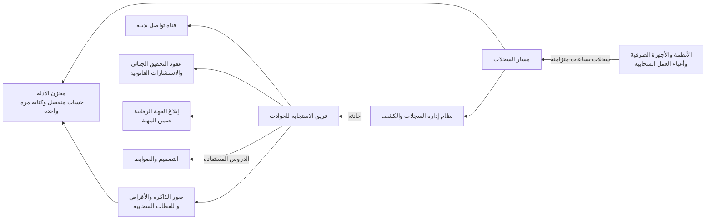

<!-- Generated by scripts/build.mjs from data/patterns/P24.json. Edit the data, then run npm run build. -->

[English](../en/P24-forensic-readiness.md)

# P24 الجاهزية الجنائية والاستجابة للحوادث

> قرّر قبل وقوع الحادثة ما الأدلة التي ستحتاجها، واجمعها واحمها منذ البداية بساعات متزامنة وتخزين يقاوم العبث، وجهّز الأدوات وقنوات التواصل البديلة للمستجيبين، ثم تدرّب، حتى تستطيع الاحتواء والتحقيق والإبلاغ خلال الساعات التي تسمح بها الجهة الرقابية.

| المجال | أنماط ذات صلة |
| --- | --- |
| العمليات | [P10 بيانات الرصد ومسار الكشف](P10-detection-telemetry.md)، [P12 استعادة صامدة أمام برامج الفدية](P12-resilient-recovery.md)، [P03 الصلاحيات الهامة والحساسة في طبقات](P03-tiered-privileged-access.md) |

## المشكلة

حين يُكتشف اختراق تغيب في الغالب الأدلة التي تفسره، فالسجلات لم تُفعَّل أبدًا، أو حُفظت أيامًا بدلًا من شهور، أو حذفها المهاجم بالصلاحيات نفسها التي تدير الأنظمة، بينما يضيع المستجيبون الساعات الأولى في ترتيب الوصول والأدوات والعقود، وقد يقرأ المتسلل البريد والمحادثات، فتمر مهل الإبلاغ التي لا تتجاوز بضع ساعات دون حقائق.

## متى تستخدمه

- تشترط جهة رقابية الإبلاغ عن الحوادث خلال ساعات أو أيام.
- قد تحتاج إلى إثبات ما حدث أمام العملاء أو المحاكم أو شركات التأمين.
- ستقود جهة خارجية الاستجابة، ولم يُتفق معها على شيء بعد.

## التصميم

اكتب الأسئلة التي سيطرحها التحقيق مثل من دخل وما الذي عمل وما الذي خرج، وتأكد من وجود السجلات التي تجيب عنها، ومن أنها تحمل طوابع زمنية متزامنة وتُحفظ سنة على الأقل، ثم احفظ الأدلة حيث لا يستطيع من يديرون الأنظمة تعديلها، أي في حساب أو مستأجر منفصل بحفظ يُكتب مرة واحدة، وجهّز طريقة لالتقاط صور الذاكرة والأقراص من الأجهزة الطرفية وأعباء العمل السحابية.

جهّز الاستجابة نفسها، أي خطة تحدد الأدوار وصلاحيات القرار، وعقودًا مسبقة مع جهات التحقيق الجنائي والاستشارات القانونية، ووصولًا معتمدًا مسبقًا للمستجيبين، وقناة تواصل بديلة حين لا يمكن الوثوق بالبريد والمحادثات، ثم تدرّب بتمارين الطاولة والتمارين التقنية، واحتفظ بنماذج إبلاغ جاهزة لكل جهة رقابية، وأعد الدروس المستفادة إلى التصميم بعد كل حادثة.

## الضوابط

### أساسي

- **سجّل ما يحتاجه التحقيق:** فعّل السجلات التي تُظهر عمليات الدخول وتشغيل العمليات وتدفقات الشبكة والوصول إلى البيانات، مع ساعات متزامنة.
  `NIST AU-2` `NIST AU-8` `CIS 8.2` `CIS 8.4` `ISO A.8.15` `ISO A.8.17`
- **احفظ الأدلة مدة كافية:** احفظ السجلات الأمنية سنة على الأقل، وأطول من ذلك حيث تشترط التشريعات.
  `NIST AU-11` `CIS 8.10` `ISO A.8.15`
- **اكتب خطة للاستجابة للحوادث وحدّد مالكها:** حدّد الأدوار وصلاحيات القرار ومستويات الخطورة وواجبات الإبلاغ، مع بيانات تواصل محدّثة باستمرار.
  `NIST IR-8` `NIST IR-6` `CIS 17.2` `CIS 17.4` `ISO A.5.24`

### معزز

- **احمِ الأدلة من المسؤولين:** احفظ السجلات والأدلة في حساب أو مستأجر منفصل بحفظ يُكتب مرة واحدة لا يستطيع مسؤولو الأنظمة تغييره.
  `NIST AU-9` `NIST AU-9(2)` `CIS 8.9` `ISO A.5.28` `ISO A.8.15`
- **جهّز جمع الأدلة قبل أن تحتاجه:** جهّز الأدوات والصلاحيات لالتقاط الذاكرة والأقراص واللقطات السحابية، مع سلسلة حفظ موثقة.
  `NIST IR-4` `NIST AU-10` `CIS 17.4` `ISO A.5.28`
- **اتفق على المساعدة الخارجية مسبقًا:** احتفظ بعقود مسبقة مع جهات التحقيق الجنائي والاستشارات القانونية، واعتمد وصولها مسبقًا حتى تبدأ خلال ساعات.
  `NIST IR-7` `NIST IR-4` `CIS 17.2` `ISO A.5.24` `ISO A.5.26`

### متقدم

- **احتفظ بقناة تواصل بديلة:** احتفظ بقناة تواصل وحسابات للمستجيبين لا تعتمد على البيئة المخترقة.
  `NIST IR-4` `NIST CP-8` `CIS 17.6` `ISO A.5.26`
- **تدرّب وتعلّم:** نفّذ تمارين طاولة وتمارين تقنية كل عام، وتابع الدروس المستفادة من التمارين والحوادث حتى إغلاقها.
  `NIST IR-3` `NIST IR-4` `CIS 17.7` `CIS 17.8` `ISO A.5.27`

## قرارات يجب توثيقها

- ما الجهات الرقابية التي يجب إبلاغها بأي حوادث، وخلال كم ساعة؟
- ما مدة حفظ كل نوع من السجلات، وأين تُحفظ بعيدًا عن متناول المسؤولين؟
- من يملك قرار عزل نظام حرج أثناء الحادثة حتى لو أوقف ذلك الأعمال؟

## المفاضلات

- يكلّف الحفظ الطويل للسجلات التفصيلية تخزينًا ويرفع واجبات الخصوصية، لذا اجمع ما تستخدمه التحقيقات فعلًا.
- يحد العزل السريع للأنظمة من الضرر لكنه قد يدمر الأدلة المتطايرة، لذا التقطها أولًا حين يكون ذلك آمنًا.
- تكلّف العقود المسبقة مالًا في السنوات التي تخلو من الحوادث.

## أنماط خاطئة يجب تجنبها

- سجلات محفوظة على الأنظمة التي تصفها، حيث يستطيع المهاجم حذفها.
- خطة للحوادث لم يتدرب عليها أحد.
- تنسيق الاستجابة عبر نظام البريد الذي يقرؤه المهاجم.

## كيف تتحقق منه

- اختر حدثًا سابقًا وحاول الإجابة عن من وماذا ومتى ومن أين من السجلات وحدها، ودوّن ما ينقص.
- حاول بصفتك مسؤولًا عن نظام حذف الأدلة المحفوظة أو تعديلها، وتأكد من أنك لا تستطيع.
- نفّذ تمرين طاولة يصل إلى خطوة إبلاغ الجهة الرقابية، وقِس زمن كل قرار.

## التهديدات التي يتصدى لها

| المرجع | الاسم |
| --- | --- |
| [T1685.005](https://attack.mitre.org/techniques/T1685/005/) | تعطيل الأدوات أو تعديلها، مسح سجلات أحداث Windows |
| [T1070](https://attack.mitre.org/techniques/T1070/) | إزالة المؤشرات |
| [T1685.002](https://attack.mitre.org/techniques/T1685/002/) | تعطيل الأدوات أو تعديلها، تعطيل السجل السحابي أو تعديله |

## المراجع

- [توصيات NIST SP 800-61 Rev 3 للاستجابة للحوادث ضمن إدارة مخاطر الأمن السيبراني](https://csrc.nist.gov/pubs/sp/800/61/r3/final)
- [دليل NIST SP 800-86 لدمج أساليب التحقيق الجنائي في الاستجابة للحوادث](https://csrc.nist.gov/pubs/sp/800/86/final)
- [المعيار ISO/IEC 27037 لإرشادات التعامل مع الأدلة الرقمية](https://www.iso.org/standard/44381.html)

