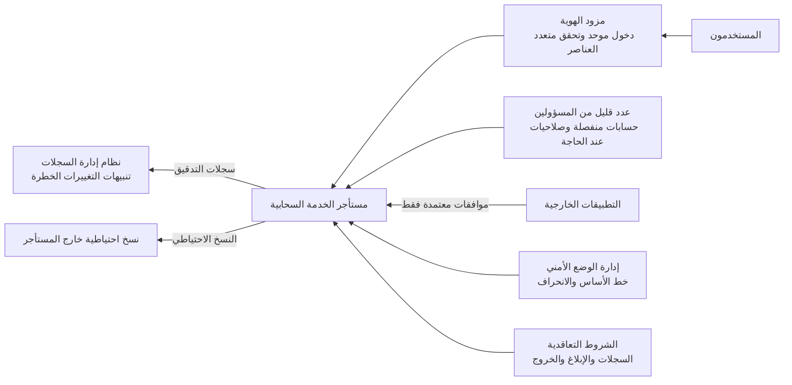

<!-- Generated by scripts/build.mjs from data/patterns/P25.json. Edit the data, then run npm run build. -->

[English](../en/P25-saas-guardrails.md)

# P25 ضوابط مستأجري الخدمات السحابية الجاهزة

> عامل كل مستأجر في خدمة سحابية جاهزة بوصفه منصة تديرها أنت، فحصّن إعداداته وفق خط أساس، وأبقِ الإدارة محدودة وقوية، واحكم التطبيقات والتكاملات الخارجية التي تصل إلى بياناته، وراقب سجلاته، لأن المزود يؤمّن الخدمة بينما تؤمّن أنت طريقة إعدادها.

| المجال | أنماط ذات صلة |
| --- | --- |
| المنصة | [P02 الهوية مستوى تحكم](P02-identity-control-plane.md)، [P06 منطقة هبوط سحابية بضوابط وقائية](P06-cloud-landing-zone.md)، [P20 حافة الخدمات الأمنية للمستخدمين أينما كانوا](P20-security-service-edge.md) |

## المشكلة

لا تنتج معظم اختراقات الخدمات السحابية الجاهزة عن إخفاق المزود بل عن إعدادات العميل، مثل مشاركة مفتوحة لكل من يملك الرابط، وبروتوكولات قديمة تتجاوز التحقق متعدد العناصر، وعدد كبير من المسؤولين العامين، وتطبيقات خارجية مُنحت وصولًا واسعًا بنقرة موافقة واحدة، كما يضم كل منتج مئات الإعدادات التي تنحرف مع الوقت، وسجلات تدقيق معطلة في الغالب أو محفوظة لمدة قصيرة، وبيانات لا ينسخها المزود احتياطيًا بما يناسب احتياجاتك.

## متى تستخدمه

- تعتمد الأعمال على خدمات سحابية جاهزة مثل البريد والتعاون وإدارة علاقات العملاء والموارد البشرية.
- تدير عدة فرق مستأجريها في تلك الخدمات دون خط أساس مشترك.
- يستطيع الموظفون ربط تطبيقات خارجية ببيانات الشركة بأنفسهم.

## التصميم

احتفظ بحصر لكل مستأجر في الخدمات السحابية الجاهزة مع مالك له، واربط كلًا منها بمزود هوية الشركة عبر الدخول الموحد والتحقق متعدد العناصر، وعطّل الحسابات المحلية والبروتوكولات القديمة، ثم عرّف خط أساس للإعدادات لكل مستأجر رئيسي مثل خطوط الأساس في مشروع SCuBA من CISA، وافحص المستأجر مقابله باستمرار بأداة لإدارة الوضع الأمني، وعامل أي انحراف بوصفه ملاحظة لها مالك.

أبقِ عدد المسؤولين قليلًا بحسابات منفصلة ومقاومة للتصيد ورفع للصلاحيات عند الحاجة فقط، ولا تسمح بالتطبيقات الخارجية إلا عبر عملية اعتماد تراجع الصلاحيات التي تطلبها، ثم أرسل سجلات تدقيق المستأجر إلى نظام إدارة السجلات مع مدة حفظ تكفي للتحقيقات، ونبّه عند التغييرات الخطرة مثل قواعد التحويل الجديدة أو المشاركة الواسعة، وانسخ احتياطيًا البيانات التي لا تحتمل فقدانها إلى مكان لا يستطيع مسؤولو المستأجر حذفه.

## الضوابط

### أساسي

- **احصر المستأجرين وامنح كلًا منهم مالكًا:** وثّق كل مستأجر تستخدمه المؤسسة في الخدمات السحابية الجاهزة، مع مالكه وبياناته ومسؤوليه.
  `NIST CM-8` `NIST SA-9` `CIS 15.1` `ISO A.5.23`
- **اجعل الدخول عبر مزود الهوية وحده:** افرض الدخول الموحد والتحقق متعدد العناصر لكل مستخدم، وعطّل الحسابات المحلية والبروتوكولات القديمة التي تتجاوزهما.
  `NIST IA-2` `NIST IA-2(1)` `CIS 6.3` `CIS 6.5` `ISO A.8.5`
- **أبقِ المسؤولين قلة وبحسابات منفصلة:** احصر المسؤولين العامين في عدد قليل من الحسابات المنفصلة، واستخدم أدوارًا أضيق للإدارة اليومية.
  `NIST AC-6` `NIST AC-6(5)` `CIS 5.4` `ISO A.8.2`

### معزز

- **افحص المستأجرين مقابل خط أساس باستمرار:** عرّف خط أساس آمنًا للإعدادات لكل مستأجر رئيسي، واستخدم أداة إدارة الوضع الأمني لاكتشاف الانحراف وإصلاحه.
  `NIST CM-2` `NIST CM-6` `CIS 4.1` `ISO A.8.9`
- **احكم التطبيقات الخارجية والموافقات:** امنع موافقة المستخدمين على التطبيقات التي تطلب صلاحيات واسعة، وراجع التكاملات بانتظام، واحذف غير المستخدم منها.
  `NIST AC-3` `NIST CM-7` `CIS 2.1` `ISO A.5.19` `ISO A.5.23`
- **سجّل التغييرات الخطرة ونبّه عندها:** أرسل سجلات تدقيق المستأجر إلى نظام إدارة السجلات، واحفظها مدة تكفي للتحقيقات، ونبّه عند قواعد التحويل والمشاركة الواسعة وإضافة المسؤولين.
  `NIST AU-2` `NIST AU-6` `CIS 8.2` `CIS 8.9` `ISO A.8.15` `ISO A.8.16`

### متقدم

- **انسخ بيانات الخدمات السحابية احتياطيًا خارج المستأجر:** انسخ بيانات الخدمات السحابية الحرجة احتياطيًا إلى مخزن لا يستطيع مسؤولو المستأجر حذفه، واختبر الاستعادة.
  `NIST CP-9` `NIST CP-10` `CIS 11.2` `CIS 11.5` `ISO A.8.13`
- **ألزم مزودي الخدمات السحابية بشروط أمنية:** اشترط في العقود شروطًا أمنية مثل الوصول إلى السجلات والإبلاغ عن الاختراق وموقع البيانات والخروج من الخدمة، وراجعها كل عام.
  `NIST SA-9` `NIST SR-3` `CIS 15.4` `ISO A.5.20` `ISO A.5.22`

## قرارات يجب توثيقها

- ما المستأجرون الذين يحتفظون ببيانات حساسة، ومن يملك كلًا منهم؟
- ما خط الأساس المطبق على كل مستأجر، ومن يعتمد الاستثناءات؟
- ما التطبيقات الخارجية التي يجوز للمستخدمين اعتمادها بأنفسهم، وما التي تحتاج إلى مراجعة؟

## المفاضلات

- يبطئ منع موافقة المستخدمين الفرق التي تعتمد على التكاملات، لذا يجب أن تكون المراجعات سريعة.
- تضيف إطالة حفظ السجلات والنسخ الاحتياطي لدى طرف ثالث تكاليف تراخيص وتخزين.
- قد يعطّل خط الأساس الصارم ميزات تعتمد عليها بعض الفرق.

## أنماط خاطئة يجب تجنبها

- عشرات المسؤولين العامين، بعضهم بحسابات مشتركة أو متزامنة من البيئة المحلية.
- روابط مشاركة مفتوحة لأي شخص دون مدة انتهاء.
- الاعتماد على سلة المحذوفات لدى المزود بوصفها النسخة الاحتياطية الوحيدة.

## كيف تتحقق منه

- افحص كل مستأجر رئيسي مقابل خط أساسه، وتأكد من أن لكل انحراف مالكًا أو استثناءً معتمدًا.
- اعرض التطبيقات الخارجية التي تصل إلى البريد أو الملفات، وتأكد من أن كلًا منها معتمد وما زال مستخدمًا.
- حاول الدخول ببروتوكول قديم، وتأكد من رفضه.

## التهديدات التي يتصدى لها

| المرجع | الاسم |
| --- | --- |
| [T1528](https://attack.mitre.org/techniques/T1528/) | سرقة رمز وصول التطبيق |
| [T1550.001](https://attack.mitre.org/techniques/T1550/001/) | استخدام مواد تحقق بديلة، رمز وصول التطبيق |
| [T1078.004](https://attack.mitre.org/techniques/T1078/004/) | الحسابات الصالحة، الحسابات السحابية |
| [T1098](https://attack.mitre.org/techniques/T1098/) | التلاعب بالحسابات |

## المراجع

- [مشروع CISA لتأمين تطبيقات الأعمال السحابية SCuBA](https://www.cisa.gov/resources-tools/services/secure-cloud-business-applications-scuba-project)
- [مصفوفة الضوابط السحابية من تحالف أمن السحابة](https://cloudsecurityalliance.org/research/cloud-controls-matrix)
- [إرشادات NIST SP 800-210 العامة للتحكم في الوصول في الأنظمة السحابية](https://csrc.nist.gov/pubs/sp/800/210/final)

