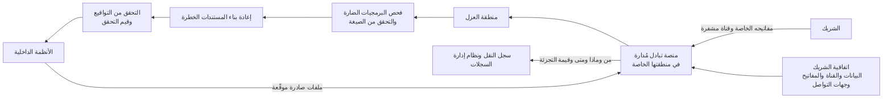

<!-- Generated by scripts/build.mjs from data/patterns/P26.json. Edit the data, then run npm run build. -->

[English](../en/P26-partner-data-exchange.md)

# P26 تبادل آمن للبيانات مع الشركاء

> انقل الملفات والبيانات من الشركاء وإليهم عبر منصة تبادل مُدارة واحدة تتحقق من هوية كل شريك، وتشفّر ما ينتقل وتوقّعه، وتفحص ما يصل وتنظّفه، وتحتفظ بسجل لا يستطيع أي طرف إنكاره.

| المجال | أنماط ذات صلة |
| --- | --- |
| البيانات | [P15 النطاق المعزول الخاضع للتنظيم](P15-regulated-enclave.md)، [P09 حماية تتمحور حول البيانات](P09-data-centric-protection.md)، [P07 بوابة الواجهات البرمجية والتفويض على مستوى الكائن](P07-api-security.md) |

## المشكلة

تتبادل المؤسسات ملفات المدفوعات والكشوف وبيانات العملاء مع البنوك والموردين والجهات الرقابية عبر خليط من خوادم SFTP وصناديق بريد مشتركة ونصوص برمجية لا يملكها أحد، فتُشارك بيانات الاعتماد ولا تُغيَّر أبدًا، وتصل الملفات دون فحص لتدخل الأنظمة الأساسية مباشرة، وحين يُعدَّل ملف مدفوعات أثناء نقله أو يُخترق شريك لا يوجد سجل يبيّن ما الذي أُرسل ومن أرسله وهل تغيّر.

## متى تستخدمه

- ترسل الملفات أو البيانات المجمعة إلى الشركاء أو الموردين أو الجهات الرقابية أو تستقبلها منهم.
- تنتقل تعليمات الدفع أو الكشوف أو سجلات العملاء في صورة ملفات.
- تعمل عمليات التبادل على خوادم ونصوص برمجية لا يملكها فريق بعينه.

## التصميم

مرّر كل تبادل للملفات عبر منصة مُدارة واحدة في منطقتها الخاصة، تنهي اتصالات الشركاء، وتتحقق من هوية كل شريك بمفاتيحه أو شهاداته الخاصة، وتحتجز الملفات في منطقة عزل حتى تجتاز الفحوص، ثم شفّر البيانات أثناء النقل وعند الحفظ، ووقّع الملفات حيث تعتمد الأعمال على سلامتها مثل تعليمات الدفع، وتحقق من التواقيع وقيم التحقق قبل إطلاق أي ملف إلى الأنظمة الداخلية.

افحص كل ما يصل بحثًا عن البرمجيات الضارة، وتحقق من مطابقته للصيغة المتوقعة، وأعد بناء أنواع المستندات الخطرة بتقنية نزع المحتوى وإعادة بنائه، حتى لا تنتقل إلى الداخل إلا بيانات نظيفة سليمة البنية، ثم أدخل كل شريك باتفاقية تحدد البيانات والقناة والمفاتيح وجهات التواصل، وغيّر المفاتيح وفق جدول، وسجّل كل عملية نقل بمن وماذا ومتى مع قيمة تجزئة، حتى تجد النزاعات والتحقيقات دليلًا.

## الضوابط

### أساسي

- **استخدم منصة تبادل مُدارة واحدة:** أوقف خوادم SFTP العشوائية وصناديق البريد المشتركة والنصوص البرمجية، وانقل كل تبادل مع الشركاء إلى منصة واحدة لها مالك.
  `NIST CA-3` `NIST AC-4` `CIS 12.2` `ISO A.5.14`
- **تحقق من هوية كل شريك على حدة:** امنح كل شريك مفاتيحه أو شهاداته الخاصة لا كلمات مرور مشتركة، وغيّرها وفق جدول.
  `NIST IA-9` `NIST IA-5` `ISO A.5.17`
- **شفّر البيانات أثناء النقل وعند الحفظ:** شفّر كل عملية نقل وكل ملف محفوظ في منصة التبادل، بمفاتيح تُدار خارجها.
  `NIST SC-8` `NIST SC-28` `CIS 3.10` `CIS 3.11` `ISO A.8.24`

### معزز

- **اعزل ما يصل وافحصه:** احتجز الملفات الواردة في منطقة عزل، وافحصها بحثًا عن البرمجيات الضارة، وتحقق من مطابقتها للصيغة المتوقعة قبل إطلاقها.
  `NIST SI-3` `NIST SI-10` `CIS 10.1` `ISO A.8.7`
- **وقّع ما تعتمد عليه الأعمال:** وقّع تعليمات الدفع وغيرها من الملفات الحرجة، وتحقق من التواقيع وقيم التحقق قبل وصولها إلى الأنظمة الداخلية.
  `NIST SI-7` `NIST AU-10` `ISO A.8.24`
- **سجّل كل عملية نقل مع قيمة تجزئة:** وثّق من أرسل ماذا ومتى وقيمة تجزئة كل ملف، وأرسل السجلات إلى نظام إدارة السجلات.
  `NIST AU-2` `NIST AU-10` `CIS 3.14` `CIS 8.2` `ISO A.8.15`

### متقدم

- **أعد بناء المستندات الخطرة:** استخدم تقنية نزع المحتوى وإعادة بنائه لمستندات المكتب وملفات PDF الواردة من الشركاء، حتى لا يصل أي محتوى نشط إلى المستخدمين.
  `NIST SI-3` `NIST SC-44` `CIS 9.6` `ISO A.8.7`
- **احكم كل تبادل باتفاقية:** وثّق لكل شريك البيانات والقناة والمفاتيح وجهات التواصل وواجبات الحوادث في اتفاقية، وراجعها كل عام.
  `NIST CA-3` `NIST SA-9` `CIS 15.4` `ISO A.5.14` `ISO A.5.20`

## قرارات يجب توثيقها

- ما عمليات التبادل التي تنقل مدفوعات أو بيانات عملاء، وأي منها يحتاج إلى توقيع؟
- من يملك منصة التبادل، ومن يعتمد إضافة شريك جديد؟
- ما أنواع الملفات التي ستقبلها من الشركاء، وماذا يحدث لبقيتها؟

## المفاضلات

- يتطلب نقل الشركاء إلى منصة واحدة تنسيقًا مع كل منهم، لذا يحدث على مراحل.
- تزيل إعادة بناء المستندات وحدات الماكرو والمحتوى النشط الذي يعتمد عليه بعض الشركاء.
- يضيف التوقيع وتغيير المفاتيح عملًا على الشركاء الذين يملكون فرقًا تقنية صغيرة.

## أنماط خاطئة يجب تجنبها

- حساب SFTP واحد وكلمة مرور واحدة يتشاركهما كل الشركاء.
- ملفات واردة تُلقى مباشرة في المجلد الذي تقرأ منه الأنظمة الأساسية.
- تبادل ملفات المدفوعات عبر البريد.

## كيف تتحقق منه

- أرسل ملفًا اختباريًا يحمل توقيع برمجية ضارة غير مؤذٍ، وتأكد من بقائه في منطقة العزل.
- غيّر بايتًا واحدًا في ملف مدفوعات اختباري موقّع، وتأكد من رفضه قبل إطلاقه.
- اختر عملية نقل من الشهر الماضي، وتأكد من أن السجلات تُظهر من أرسلها ومتى وقيمة تجزئتها.

## التهديدات التي يتصدى لها

| المرجع | الاسم |
| --- | --- |
| [T1199](https://attack.mitre.org/techniques/T1199/) | العلاقة الموثوقة |
| [T1565.002](https://attack.mitre.org/techniques/T1565/002/) | التلاعب بالبيانات، التلاعب بالبيانات المنقولة |
| [T1105](https://attack.mitre.org/techniques/T1105/) | نقل الأدوات إلى الداخل |
| [T1048](https://attack.mitre.org/techniques/T1048/) | التسريب عبر بروتوكول بديل |

## المراجع

- [إرشادات NIST SP 800-47 Rev 1 لإدارة أمن تبادل المعلومات](https://csrc.nist.gov/pubs/sp/800/47/r1/final)
- [نمط الاستيراد الآمن للبيانات من المركز الوطني البريطاني للأمن السيبراني NCSC](https://www.ncsc.gov.uk/guidance/pattern-safely-importing-data)
- [المعيار RFC 4130 لتبادل بيانات الأعمال الآمن عبر HTTP، ويُعرف باسم AS2](https://datatracker.ietf.org/doc/html/rfc4130)

