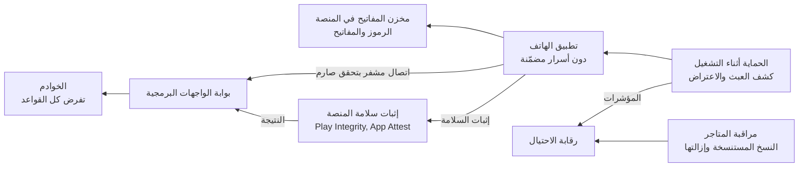

<!-- Generated by scripts/build.mjs from data/patterns/P27.json. Edit the data, then run npm run build. -->

[English](../en/P27-mobile-app-protection.md)

# P27 حماية تطبيقات الهاتف

> افترض أن التطبيق يعمل على جهاز وبين أيدٍ لا تتحكم فيها، فأبعد الأسرار عن الجهاز، ودع الخوادم تتحقق من أن الطلبات تأتي من تطبيقك الأصلي غير المعدَّل، واحمِ البيانات التي يحفظها التطبيق ويرسلها، وابنِ التطبيق وفق معيار OWASP MASVS.

| المجال | أنماط ذات صلة |
| --- | --- |
| التطبيقات | [P17 هوية العملاء وحماية حساباتهم](P17-customer-identity.md)، [P07 بوابة الواجهات البرمجية والتفويض على مستوى الكائن](P07-api-security.md)، [P11 سلسلة إمداد برمجيات موثوقة](P11-software-supply-chain.md) |

## المشكلة

تطبيق الهاتف برنامج تسلّمه للمهاجم بنفسك، إذ يمكن تفكيكه لاستخراج مفاتيح الواجهات البرمجية ونقاط الوصول المخفية، وإعادة تغليفه ببرمجية ضارة ونشره باسمك، وتشغيله على أجهزة مكسورة الحماية بأدوات اعتراض تتجاوز فحوصه، واستهدافه ببرمجيات تراكب وبرمجيات تستغل خدمات إمكانية الوصول لقراءة الرموز المؤقتة، بينما تحوّل الخوادم التي تثق بكل ما يرسله التطبيق والتطبيقات التي تحفظ الرموز أو البيانات في ملفات مكشوفة كل ذلك إلى احتيال.

## متى تستخدمه

- يستخدم العملاء تطبيقًا للهاتف للوصول إلى الحسابات أو المدفوعات أو البيانات الشخصية.
- يتصل التطبيق بواجهات برمجية يمكن الوصول إليها من الإنترنت أيضًا.
- يصل الاحتيال عبر البرمجيات الضارة أو التطبيقات المستنسخة إلى عملائك أو قطاعك بالفعل.

## التصميم

أبقِ الأسرار والقرارات في الخوادم، فلا يحمل التطبيق مفاتيح مشتركة للواجهات البرمجية، ويحمل كل طلب رمزًا قصير العمر مرتبطًا بالجهاز، وتفرض الخوادم التفويض والحدود كأن التطبيق غير موجود، ثم استخدم إثبات سلامة المنصة مثل Play Integrity وApp Attest حتى تميّز الخوادم تطبيقك الأصلي على جهاز سليم من نص برمجي أو نسخة معدّلة، فتطلب إثباتًا أقوى أو ترفض حين يتعذر ذلك.

احمِ ما يحفظه التطبيق وما يرسله، فاحفظ الرموز والمفاتيح في مخزن المفاتيح الخاص بالمنصة، وأبعد البيانات الحساسة عن التخزين المشترك والسجلات ولقطات الشاشة، واستخدم TLS مع تحقق صارم، ثم حصّن التطبيق نفسه بالتعمية وكشف العبث والاعتراض والحماية أثناء التشغيل للعمليات الحساسة، واختبره وفق معيار OWASP MASVS قبل كل إصدار رئيسي، وراقب المتاجر بحثًا عن نسخ مستنسخة تنتحل علامتك.

## الضوابط

### أساسي

- **أبعد الأسرار عن الجهاز:** لا تضمّن التطبيق مفاتيح أو بيانات اعتماد مشتركة للواجهات البرمجية، وأصدر بدلًا منها رموزًا قصيرة العمر لكل مستخدم ولكل جهاز.
  `NIST IA-5` `NIST SC-12` `ISO A.8.28`
- **احفظ البيانات في مخزن المفاتيح الخاص بالمنصة:** احفظ الرموز والمفاتيح في مخزن المفاتيح الخاص بالمنصة، وأبعد البيانات الحساسة عن التخزين المشترك والسجلات والنسخ الاحتياطية.
  `NIST SC-28` `NIST SC-12` `CIS 3.11` `ISO A.8.24`
- **افرض كل القواعد في الخوادم:** اجعل الخوادم تفرض التفويض والحدود وقواعد العمل مهما ادّعى التطبيق.
  `NIST AC-3` `NIST SI-10` `CIS 16.10` `ISO A.8.26`

### معزز

- **أثبت سلامة التطبيق والجهاز:** استخدم إثبات سلامة المنصة، حتى تميّز الخوادم التطبيق الأصلي على جهاز سليم من النصوص البرمجية والنسخ المعدّلة.
  `NIST IA-3` `NIST SI-7` `ISO A.8.5`
- **تحقق من TLS بصرامة:** استخدم TLS مع تحقق صارم من الشهادات، ولا تثبّت الشهادات إلا مع خطة مُختبَرة لتغييرها.
  `NIST SC-8` `NIST SC-17` `CIS 3.10` `ISO A.8.24`
- **اختبر وفق معيار MASVS:** اختبر كل إصدار رئيسي وفق معيار OWASP MASVS، بما في ذلك اختبار اختراق للتطبيق وواجهاته البرمجية.
  `NIST SA-11` `NIST CA-8` `CIS 16.13` `ISO A.8.29`

### متقدم

- **اكشف العبث والاعتراض أثناء التشغيل:** طبّق التعمية على شيفرة التطبيق، واكشف العبث والاعتراض والتراكب أثناء العمليات الحساسة، وأرسل المؤشرات إلى الخوادم.
  `NIST SI-7` `NIST SI-4` `ISO A.8.26`
- **راقب المتاجر بحثًا عن النسخ المستنسخة:** راقب متاجر التطبيقات والويب بحثًا عن تطبيقات تنتحل علامتك، وجهّز إجراءً لإزالتها.
  `NIST SI-4` `NIST IR-4` `ISO A.5.7`

## قرارات يجب توثيقها

- ما الإجراءات في التطبيق التي تبلغ حساسيتها حد الحاجة إلى إثبات السلامة أو إثبات أقوى؟
- ماذا ستفعل الخوادم حين يخفق إثبات السلامة، أترفض أم تطلب إثباتًا أقوى أم تسمح بحدود؟
- هل ستثبّت الشهادات، وكيف ستغيّرها دون أن تمنع العملاء من الدخول؟

## المفاضلات

- يحجب إثبات السلامة وكشف كسر الحماية بعض العملاء الشرعيين على أجهزة قديمة أو معدّلة.
- ترفع الحماية أثناء التشغيل كلفة الهجوم، لكنها لا تجعل التطبيق جديرًا بالثقة وحدها أبدًا.
- يمنع تثبيت الشهادات الاعتراض، لكنه قد يعطّل التطبيق حين تتغير الشهادات فجأة.

## أنماط خاطئة يجب تجنبها

- مفاتيح واجهات برمجية أو أسرار توقيع مضمّنة في التطبيق.
- قواعد عمل تُفحص في التطبيق وحده وتثق بها الخوادم.
- رموز محفوظة في ملفات مكشوفة أو في إعدادات التطبيق المشتركة.

## كيف تتحقق منه

- فكّك نسخة الإصدار، وتأكد من خلوها من المفاتيح والأسرار ونقاط الوصول المخفية.
- استدعِ الواجهات البرمجية من نص برمجي برمز مستخدم صالح، وتأكد من أن إخفاق إثبات السلامة يطلق الاستجابة المتفق عليها.
- شغّل التطبيق على جهاز اختباري مكسور الحماية مع أداة اعتراض، وتأكد من حماية العمليات الحساسة والإبلاغ عنها.

## التهديدات التي يتصدى لها

| المرجع | الاسم |
| --- | --- |
| [T1111](https://attack.mitre.org/techniques/T1111/) | اعتراض التحقق متعدد العناصر |
| [M1:2024](https://github.com/OWASP/www-project-mobile-top-10/blob/master/2023-risks/m1-improper-credential-usage.md) | الاستخدام غير السليم لبيانات الاعتماد |
| [M3:2024](https://github.com/OWASP/www-project-mobile-top-10/blob/master/2023-risks/m3-insecure-authentication-authorization.md) | ضعف التحقق من الهوية والتفويض |
| [M5:2024](https://github.com/OWASP/www-project-mobile-top-10/blob/master/2023-risks/m5-insecure-communication.md) | الاتصال غير الآمن |
| [M7:2024](https://github.com/OWASP/www-project-mobile-top-10/blob/master/2023-risks/m7-insufficient-binary-protection.md) | ضعف حماية الملف التنفيذي |
| [M9:2024](https://github.com/OWASP/www-project-mobile-top-10/blob/master/2023-risks/m9-insecure-data-storage.md) | التخزين غير الآمن للبيانات |

## المراجع

- [معيار OWASP للتحقق من أمن تطبيقات الهاتف MASVS](https://mas.owasp.org/MASVS/)
- [قائمة OWASP Mobile Top 10 لمخاطر تطبيقات الهاتف](https://owasp.org/www-project-mobile-top-10/)
- [إرشادات NIST SP 800-163 Rev 1 لفحص أمن تطبيقات الهاتف](https://csrc.nist.gov/pubs/sp/800/163/r1/final)

