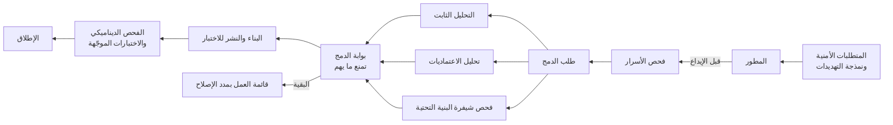

<!-- Generated by scripts/build.mjs from data/patterns/P28.json. Edit the data, then run npm run build. -->

[English](../en/P28-secure-development.md)

# P28 دورة حياة التطوير الآمن

> ادمج الأمن في طريقة صنع البرمجيات، فاتفق على المتطلبات والتهديدات عند التصميم، وافحص كل تغيير آليًا بحثًا عن الشيفرة الضعيفة والاعتماديات والأسرار والبنية التحتية المضبوطة بطريقة خاطئة، واختبر التطبيقات أثناء تشغيلها قبل الإطلاق، وأصلح ما يُكتشف خلال مدد متفق عليها، وفق إطار NIST لتطوير البرمجيات الآمنة.

| المجال | أنماط ذات صلة |
| --- | --- |
| التطبيقات | [P11 سلسلة إمداد برمجيات موثوقة](P11-software-supply-chain.md)، [P07 بوابة الواجهات البرمجية والتفويض على مستوى الكائن](P07-api-security.md)، [P21 إدارة مستمرة للانكشاف](P21-exposure-management.md) |

## المشكلة

يكتشف اختبار الأمن الذي يُجرى مرة واحدة قبيل الإطلاق المشكلات حين يكون إصلاحها في أعلى كلفة، فتتعلم الفرق معاملته بوصفه عقبة، بينما يضيف المطورون كل يوم أسرارًا إلى الشيفرة، ويستخدمون مكتبات ضعيفة، ويكتبون شيفرة البنية التحتية بتخزين مفتوح وصلاحيات واسعة، فتتراكم الملاحظات في تقارير لا يملكها أحد.

## متى تستخدمه

- تكتب فرقك البرمجيات أو تخصّصها، بما فيها شيفرة البنية التحتية.
- تتكرر الإصدارات، ولا تستطيع مراجعات الأمن اليدوية مواكبتها.
- تواصل اختبارات الاختراق اكتشاف أنواع الضعف نفسها.

## التصميم

ابدأ من التصميم، فوثّق المتطلبات الأمنية لكل تطبيق، ونمذج التهديدات للميزات الجديدة والتغييرات الكبرى، واستخدم مكونات وأنماطًا معتمدة حتى لا تحل الفرق المشكلات نفسها بطرق مختلفة، ثم ضع الفحوص حيث يعمل المطورون، أي فحص الأسرار قبل الإيداع، والتحليل الثابت، وتحليل الاعتماديات، وفحص شيفرة البنية التحتية عند كل طلب دمج، مع عرض النتائج في المراجعة نفسها لا في بوابة منفصلة.

امنع الدمج فقط عند الملاحظات المهمة مثل الأسرار المسربة والثغرات الحرجة والاعتماديات القابلة للاستغلال، وأرسل البقية إلى قائمة العمل مع مدد إصلاح حسب الخطورة، ثم اختبر التطبيقات أثناء تشغيلها بالفحص الديناميكي واختبارات الاختراق الموجّهة قبل الإصدارات الرئيسية، ودرّب المطورين على أنواع الضعف التي تكتشفها فعلًا، وامنح كل فريق ممثلًا للأمن يعرف متى يطلب المساعدة.

## الضوابط

### أساسي

- **افحص الأسرار قبل إيداعها:** امنع الإيداعات التي تحوي أسرارًا، وافحص المستودعات الحالية، وغيّر أي سر انكشف في أي وقت.
  `NIST IA-5` `NIST SA-11` `CIS 16.12` `ISO A.8.28`
- **افحص الاعتماديات في كل عملية بناء:** حلّل المكونات الخارجية بحثًا عن الثغرات المعروفة والتراخيص في كل عملية بناء، وأبقها محدّثة.
  `NIST RA-5` `NIST SA-11` `CIS 16.4` `CIS 16.5` `ISO A.8.8` `ISO A.8.28`
- **وثّق المتطلبات الأمنية لكل تطبيق:** اتفق على المتطلبات الأمنية لكل تطبيق عند التصميم، بناءً على بياناته وانكشافه.
  `NIST SA-3` `NIST SA-8` `CIS 16.1` `ISO A.8.25` `ISO A.8.26`

### معزز

- **حلّل الشيفرة والبنية التحتية عند كل طلب دمج:** شغّل التحليل الثابت وفحص شيفرة البنية التحتية عند كل طلب دمج، واعرض النتائج في المراجعة.
  `NIST SA-11` `NIST CM-3` `CIS 16.7` `CIS 16.12` `ISO A.8.28` `ISO A.8.29`
- **نمذج التهديدات للميزات الجديدة:** نمذج التهديدات للميزات الجديدة والتغييرات الكبرى، وحوّل النتائج إلى متطلبات واختبارات.
  `NIST SA-8` `NIST RA-3` `CIS 16.14` `ISO A.8.27`
- **أصلح الملاحظات خلال مدد متفق عليها:** صنّف ثغرات التطبيقات حسب الخطورة، وحدّد مدد الإصلاح لكل مستوى، وتابعها حتى إغلاقها.
  `NIST SI-2` `NIST RA-5` `CIS 16.2` `CIS 16.6` `ISO A.8.8`

### متقدم

- **اختبر التطبيقات أثناء تشغيلها قبل الإطلاق:** شغّل الفحص الديناميكي في المسار، واختبارات الاختراق الموجّهة قبل الإصدارات الرئيسية.
  `NIST SA-11` `NIST CA-8` `CIS 16.13` `ISO A.8.29`
- **درّب المطورين وسمِّ ممثلين للأمن:** درّب المطورين على أنواع الضعف التي تكتشفها فعلًا، وامنح كل فريق ممثلًا للأمن يملك وقتًا لأداء دوره.
  `NIST AT-3` `CIS 16.9` `ISO A.6.3`

## قرارات يجب توثيقها

- ما الملاحظات التي تمنع الدمج، وما التي تذهب إلى قائمة العمل؟
- ما مدد الإصلاح لكل مستوى خطورة، ومن يستطيع قبول المخاطر بدلًا من ذلك؟
- ما التطبيقات التي تحتاج إلى نمذجة للتهديدات واختبار اختراق قبل كل إصدار رئيسي؟

## المفاضلات

- يبطئ المنع عند كل ملاحظة التسليم ويعلّم الفرق إخفاء النتائج، لذا يجب أن تكون البوابات قليلة وموثوقة.
- تنتج أدوات الفحص نتائج خاطئة تستهلك وقت المطورين حتى تُضبط.
- يحتاج ممثلو الأمن إلى وقت من فرقهم، وهذا ينافس العمل على الميزات.

## أنماط خاطئة يجب تجنبها

- اختبار اختراق واحد قبل الإطلاق بوصفه النشاط الأمني الوحيد.
- نتائج فحص تُرسل إلى بوابة لا يفتحها المطورون أبدًا.
- أسرار تُحذف من الشيفرة لكنها لا تُغيَّر أبدًا.

## كيف تتحقق منه

- أودع سرًا اختباريًا في فرع، وتأكد من منعه قبل وصوله إلى المستودع.
- أضف اعتمادية بها ثغرة حرجة معروفة، وتأكد من منع طلب الدمج.
- قارن ملاحظات آخر اختبار اختراق بنتائج المسار، وأضف فحوصًا لما فات المسار.

## التهديدات التي يتصدى لها

| المرجع | الاسم |
| --- | --- |
| [T1552.001](https://attack.mitre.org/techniques/T1552/001/) | بيانات اعتماد غير مؤمنة، بيانات الاعتماد في الملفات |
| [T1195.002](https://attack.mitre.org/techniques/T1195/002/) | اختراق سلسلة الإمداد، اختراق سلسلة إمداد البرمجيات |
| [T1213.003](https://attack.mitre.org/techniques/T1213/003/) | بيانات من مستودعات المعلومات، مستودعات الشيفرة |
| [T1190](https://attack.mitre.org/techniques/T1190/) | استغلال تطبيق مكشوف للعموم |

## المراجع

- [إطار NIST SP 800-218 لتطوير البرمجيات الآمنة SSDF](https://csrc.nist.gov/pubs/sp/800/218/final)
- [نموذج OWASP لنضج ضمان البرمجيات SAMM](https://owaspsamm.org/)
- [مبادرة CISA للأمن منذ التصميم](https://www.cisa.gov/securebydesign)

