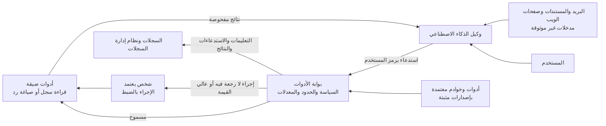

<!-- Generated by scripts/build.mjs from data/patterns/P29.json. Edit the data, then run npm run build. -->

[English](../en/P29-ai-agents.md)

# P29 وكلاء ذكاء اصطناعي يستخدمون الأدوات

> لا تسمح لوكلاء الذكاء الاصطناعي بالتصرف إلا بصلاحيات المستخدم الذي يخدمونه، عبر بوابة تفحص كل استدعاء للأدوات مقابل السياسة، وتحد ما يفعله كل استدعاء وعدد مراته، وتطلب موافقة شخص على الإجراءات التي لا يمكن التراجع عنها، وتسجل كل شيء، لأن الوكيل قد يُوجَّه بأي نص يقرؤه.

| المجال | أنماط ذات صلة |
| --- | --- |
| الذكاء الاصطناعي | [P14 حواجز الحماية لتطبيقات النماذج اللغوية والوكلاء الذكيين](P14-llm-application-guardrails.md)، [P02 الهوية مستوى تحكم](P02-identity-control-plane.md)، [P08 الأسرار والمفاتيح وهوية أعباء العمل](P08-secrets-keys-workload-identity.md) |

## المشكلة

لا يكتفي الوكلاء بالإجابة عن الأسئلة، بل يقرؤون البريد والمستندات، ويستدعون الواجهات البرمجية، ويشغّلون الشيفرة، ويعدّلون السجلات، وقد يحمل أي نص يقرؤونه مثل رسالة بريد أو صفحة ويب أو مستند في مجلد مشترك تعليمات ينفذها النموذج، كما يُربط الوكلاء في الغالب ببيانات اعتماد خدمية واسعة تسمح لتعليمة واحدة مدسوسة بتحويل أموال أو تسريب بيانات أو حذف سجلات، بينما تجلب الأدوات والخوادم المضافة عبر بروتوكولات مثل MCP شيفرتها وصلاحياتها الخاصة، وكثيرًا ما يحدث ذلك دون مراجعة.

## متى تستخدمه

- يستطيع مساعد الذكاء الاصطناعي استدعاء الأدوات أو الواجهات البرمجية أو الأنظمة الأخرى، لا الإجابة عن الأسئلة فقط.
- يقرأ الوكلاء محتوى من الخارج مثل البريد وصفحات الويب والمستندات المشتركة.
- تضيف الفرق أدوات أو خوادم MCP إلى الوكلاء بنفسها.

## التصميم

ضع بوابة للأدوات بين الوكلاء وكل ما يمكنهم الوصول إليه، فيحمل كل استدعاء هوية المستخدم الذي يخدمه الوكيل برمز محدود النطاق قصير العمر لا بحساب خدمي واسع، وتفحص البوابة الاستدعاء مقابل السياسة، أي الأدوات المسموحة لهذا الوكيل، وعلى أي بيانات، وبأي حدود للكمية والمعدل، ثم اجعل الأدوات ضيقة مثل قراءة سجل واحد أو صياغة رد واحد، بدلًا من أدوات عامة مثل تشغيل أي استعلام أو إرسال أي بريد.

عامل كل ما يقرؤه الوكيل بوصفه مدخلات غير موثوقة، ولا تسمح له أبدًا بمنح صلاحيات جديدة، فالنص الوارد في مستند لا يعتمد دفعة، ثم اشترط موافقة شخص على الإجراءات التي لا يمكن التراجع عنها أو عالية القيمة مع عرض ما سيحدث بالضبط، وتحقق من مخرجات الأدوات قبل وصولها إلى أنظمة أخرى، واعتمد كل أداة وكل خادم MCP وثبّت إصداره كأي اعتمادية برمجية أخرى، وسجّل كل تعليمة واستدعاء ونتيجة حتى يمكن تتبع الحوادث.

## الضوابط

### أساسي

- **تصرّف بصلاحيات المستخدم:** امنح الوكلاء رموزًا محدودة النطاق قصيرة العمر نيابة عن المستخدم الذي يخدمونه، لا حسابات خدمية واسعة أبدًا.
  `NIST AC-6` `NIST IA-9` `CIS 6.8` `ISO A.5.15` `ISO A.8.2`
- **اجعل الأدوات ضيقة:** وفّر أدوات صغيرة محددة بمعاملات ثابتة بدلًا من أدوات عامة تستطيع تشغيل أي استعلام أو أمر.
  `NIST CM-7` `NIST AC-3` `ISO A.8.26`
- **سجّل كل تعليمة واستدعاء ونتيجة:** وثّق كل تعليمة واستدعاء للأدوات ونتيجته مع هوية المستخدم والوكيل، وأرسلها إلى نظام إدارة السجلات.
  `NIST AU-2` `NIST AU-12` `CIS 8.2` `ISO A.8.15`

### معزز

- **افحص كل استدعاء للأدوات عند بوابة:** مرّر استدعاءات الأدوات عبر بوابة تفرض الأدوات والبيانات والمبالغ والمعدلات المسموحة لكل وكيل.
  `NIST AC-24` `NIST AC-4` `ISO A.5.15` `ISO A.8.26`
- **اطلب موافقة شخص قبل الإجراءات التي لا رجعة فيها:** اشترط موافقة صريحة تعرض ما سيحدث بالضبط للمدفوعات والحذف والرسائل المرسلة إلى الخارج.
  `NIST AC-3` `NIST IA-11` `ISO A.8.26`
- **تحقق مما تعيده الأدوات:** عامل مخرجات الأدوات والمحتوى المسترجع بوصفها غير موثوقة، وتحقق منها قبل وصولها إلى أنظمة أخرى أو إلى المستخدمين.
  `NIST SI-10` `NIST SI-15` `ISO A.8.26`

### متقدم

- **اعتمد الأدوات وخوادم MCP وثبّت إصداراتها:** راجع كل أداة وكل خادم MCP قبل الاستخدام، وثبّت إصداره، وراقب تغيّره كأي اعتمادية أخرى.
  `NIST SR-3` `NIST CM-7` `CIS 2.1` `CIS 16.4` `ISO A.5.21` `ISO A.8.19`
- **اختبر الوكيل بفريق هجومي:** اختبر الوكلاء بحقن التعليمات غير المباشر عبر المستندات والبريد وصفحات الويب قبل الإطلاق وبعد كل تغيير في الأدوات.
  `NIST CA-8` `NIST SA-11` `CIS 16.13` `ISO A.8.29`

## قرارات يجب توثيقها

- ما الإجراءات التي يجوز للوكيل تنفيذها وحده، وما التي تحتاج إلى موافقة شخص؟
- بصلاحيات من يتصرف كل وكيل، وكيف تُحدّ؟
- من يعتمد الأدوات وخوادم MCP الجديدة، وكيف تُراجع؟

## المفاضلات

- تبطئ الموافقات عمل الوكيل، لذا يجب أن تقتصر على الإجراءات المهمة.
- تحتاج الأدوات الضيقة إلى هندسة أكثر من أداة عامة واحدة، لكنها تحد ما تستطيع التعليمة المدسوسة فعله.
- تحتفظ السجلات الكاملة للتعليمات والنتائج ببيانات حساسة، لذا تحتاج السجلات إلى الحماية نفسها التي تحتاجها البيانات.

## أنماط خاطئة يجب تجنبها

- وكيل مربوط بحساب مسؤول أو بحساب خدمي واسع.
- أداة تشغّل أي استعلام SQL أو أي أمر يكتبه النموذج.
- خوادم MCP مثبتة من الإنترنت دون مراجعة أو تثبيت للإصدار.

## كيف تتحقق منه

- ضع تعليمات في مستند سيقرؤه الوكيل، وتأكد من أنه لا ينفذها.
- اطلب من الوكيل التصرف في بيانات لا يصل إليها المستخدم، وتأكد من أن البوابة ترفض.
- تتبّع جلسة وكيل واحدة كاملة في السجلات، من التعليمة إلى كل استدعاء للأدوات ونتيجته.

## التهديدات التي يتصدى لها

| المرجع | الاسم |
| --- | --- |
| [LLM01:2025](https://genai.owasp.org/llmrisk/llm01-prompt-injection/) | حقن التعليمات |
| [LLM06:2025](https://genai.owasp.org/llmrisk/llm062025-excessive-agency/) | الصلاحيات المفرطة للوكيل |
| [LLM05:2025](https://genai.owasp.org/llmrisk/llm052025-improper-output-handling/) | المعالجة غير السليمة للمخرجات |
| [LLM02:2025](https://genai.owasp.org/llmrisk/llm022025-sensitive-information-disclosure/) | كشف المعلومات الحساسة |
| [LLM10:2025](https://genai.owasp.org/llmrisk/llm102025-unbounded-consumption/) | الاستهلاك غير المحدود |

## المراجع

- [قائمة OWASP Top 10 لتطبيقات النماذج اللغوية الكبيرة](https://genai.owasp.org/llm-top-10/)
- [مخاطر الذكاء الاصطناعي الوكيل وطرق تخفيفها من OWASP](https://genai.owasp.org/resource/agentic-ai-threats-and-mitigations/)
- [أفضل الممارسات الأمنية لبروتوكول سياق النموذج MCP](https://modelcontextprotocol.io/specification/2025-06-18/basic/security_best_practices)

