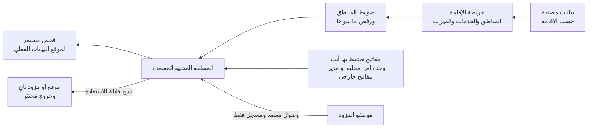

<!-- Generated by scripts/build.mjs from data/patterns/P30.json. Edit the data, then run npm run build. -->

[English](../en/P30-sovereign-cloud.md)

# P30 السحابة السيادية وإقامة البيانات

> أبقِ البيانات المنظمة حيث يشترط القانون وتحت سيطرتك حين تعمل في السحابة، فاختر المناطق والخدمات حسب تصنيف البيانات، واحتفظ بمفاتيح التشفير بنفسك، وتحكّم في كل وصول يجريه موظفو المزود وسجّله، واحتفظ بخطة خروج قابلة للتنفيذ.

| المجال | أنماط ذات صلة |
| --- | --- |
| المنصة | [P06 منطقة هبوط سحابية بضوابط وقائية](P06-cloud-landing-zone.md)، [P08 الأسرار والمفاتيح وهوية أعباء العمل](P08-secrets-keys-workload-identity.md)، [P23 مرونة التشفير والجاهزية لما بعد الحوسبة الكمية](P23-crypto-agility.md) |

## المشكلة

تشترط الجهات الرقابية في الخليج أن تبقى البيانات المنظمة والحكومية داخل الدولة، ففي الكويت مثلًا يشترط الإطار التنظيمي للحوسبة السحابية الصادر عن هيئة الاتصالات وتقنية المعلومات أن تُستضاف بيانات المستويين الثالث والرابع في تصنيفها داخل الدولة لدى مزودين مرخصين، بينما تنسخ الخدمات السحابية البيانات إلى مناطق أخرى لأغراض النسخ الاحتياطي والدعم والتحليل وميزات الذكاء الاصطناعي، ويستطيع موظفو المزود الوصول إلى بيئات العملاء لتقديم الدعم، وتجعل المفاتيح التي يحتفظ بها المزود المؤسسة عاجزة عن إثبات من يستطيع قراءة بياناتها، كما نادرًا ما تذكر العقود طريقة الخروج، فيصبح الاعتماد على مزود واحد دائمًا.

## متى تستخدمه

- تحدد التشريعات أو العقود أين يجب حفظ بيانات معينة أو معالجتها.
- تنتقل بيانات حكومية أو مالية أو شخصية إلى السحابة.
- يجب أن تبيّن للجهة الرقابية من يستطيع الوصول إلى البيانات، بما في ذلك المزود.

## التصميم

صنّف البيانات حسب متطلبات إقامتها، واربط كل فئة بالمناطق والخدمات والميزات المسموح لها بحفظها أو معالجتها، بما فيها النسخ الاحتياطية والسجلات وتذاكر الدعم وميزات الذكاء الاصطناعي التي قد ترسل البيانات إلى مكان آخر، ثم افرض هذا الربط بضوابط سياسات ترفض الموارد خارج المناطق المعتمدة، وتحقق من موقع البيانات الفعلي باستمرار لا عند التصميم فقط.

احتفظ بنفسك بمفاتيح البيانات المنظمة في وحدة أمن للأجهزة محلية أو في مدير مفاتيح خارجي، حتى لا يستطيع المزود قراءة البيانات دونك، واستخدم الحوسبة السرية حيث يجب حماية البيانات أثناء معالجتها، ثم اشترط الموافقة والتسجيل لأي وصول يجريه موظفو المزود، واحتفظ بنسخ يمكنك استعادتها في موقع آخر أو لدى مزود آخر، واختبر خطة الخروج قبل أن تحتاج إليها.

## الضوابط

### أساسي

- **صنّف البيانات حسب إقامتها:** وثّق لكل فئة من البيانات أين يجوز حفظها ومعالجتها، بما فيها النسخ الاحتياطية والسجلات ونسخ الدعم.
  `NIST SA-9(5)` `NIST RA-2` `CIS 3.2` `CIS 3.7` `ISO A.5.12` `ISO A.5.31`
- **اسمح بالمناطق المعتمدة فقط:** ارفض إنشاء الموارد والنسخ المتكررة خارج المناطق المعتمدة بسياسة تشمل المؤسسة كلها.
  `NIST SA-9(5)` `NIST CM-7` `ISO A.5.23`
- **ضمّن الإقامة في العقد:** اشترط في عقد السحابة موقع البيانات ووصول المزود والإبلاغ عن الاختراق وشروط الخروج.
  `NIST SA-9` `NIST SR-3` `CIS 15.4` `ISO A.5.20` `ISO A.5.23`

### معزز

- **احتفظ بمفاتيحك بنفسك:** احتفظ بمفاتيح البيانات المنظمة في وحدة أمن للأجهزة محلية أو في مدير مفاتيح خارجي لا يستطيع المزود استخدامه دونك.
  `NIST SC-12` `NIST SC-28` `CIS 3.11` `ISO A.8.24`
- **تحكّم في وصول المزود:** اشترط موافقتك على أي وصول يجريه موظفو المزود، وسجّل كل جلسة.
  `NIST MA-4` `NIST AC-6` `ISO A.5.22`
- **تحقق من موقع البيانات الفعلي:** افحص الموارد والنسخ الاحتياطية والنسخ المتكررة باستمرار، ونبّه عند وجود أي نسخة خارج المناطق المعتمدة.
  `NIST CM-8` `NIST CA-7` `CIS 3.2` `ISO A.5.23`

### متقدم

- **احمِ البيانات أثناء المعالجة:** استخدم الحوسبة السرية للمعالجة الأشد حساسية، حتى تبقى البيانات مشفرة في الذاكرة.
  `NIST SC-28` `NIST SC-13` `ISO A.8.24`
- **اختبر الخروج:** احتفظ بنسخ قابلة للاستعادة في موقع آخر أو لدى مزود آخر، وتدرّب على نقل خدمة حرجة.
  `NIST CP-9` `NIST CP-7` `CIS 11.4` `ISO A.5.30` `ISO A.8.13`

## قرارات يجب توثيقها

- ما فئات البيانات التي يجب أن تبقى داخل الدولة، ومن يقرر ذلك؟
- ما ميزات السحابة الممنوعة لأنها تنقل البيانات أو تنسخها إلى مكان آخر؟
- أين ستُحفظ المفاتيح، وماذا يحدث إذا تعطلت خدمة المفاتيح؟

## المفاضلات

- يضيف حفظ المفاتيح خارج المزود اعتمادية حرجة يجب أن تكون عالية التوافر.
- تقدم المناطق المحلية في الغالب خدمات وميزات أقل، وتصل إليها الجديدة متأخرة.
- يكلّف خيار الخروج الحقيقي مالًا في السنوات التي لا تستخدمه فيها.

## أنماط خاطئة يجب تجنبها

- التحقق من إقامة قاعدة البيانات الرئيسية دون النسخ الاحتياطية والسجلات ونسخ الدعم.
- مفاتيح يديرها المزود لبيانات يجب إثبات خضوعها لسيطرتك.
- خطة خروج لا وجود لها إلا بندًا في العقد.

## كيف تتحقق منه

- حاول إنشاء حساب تخزين في منطقة غير معتمدة، وتأكد من أن السياسة ترفضه.
- اعرض أماكن حفظ النسخ الاحتياطية والسجلات الفعلية لخدمة منظمة، وقارنها بخريطة الإقامة.
- عطّل المفتاح الخارجي لمجموعة بيانات اختبارية، وتأكد من أن المزود لم يعد يستطيع قراءتها.

## التهديدات التي يتصدى لها

| المرجع | الاسم |
| --- | --- |
| [T1199](https://attack.mitre.org/techniques/T1199/) | العلاقة الموثوقة |
| [T1530](https://attack.mitre.org/techniques/T1530/) | بيانات من التخزين السحابي |
| [T1537](https://attack.mitre.org/techniques/T1537/) | نقل البيانات إلى حساب سحابي |

## المراجع

- [إدارة التجارة الدولية الأمريكية، تخزين البيانات السحابية في الكويت](https://www.trade.gov/market-intelligence/kuwait-cloud-storage)
- [التقرير NIST IR 8320 للأمن المدعوم بالعتاد في الحوسبة السحابية والطرفية](https://csrc.nist.gov/pubs/ir/8320/final)
- [اتحاد الحوسبة السرية](https://confidentialcomputing.io/)

