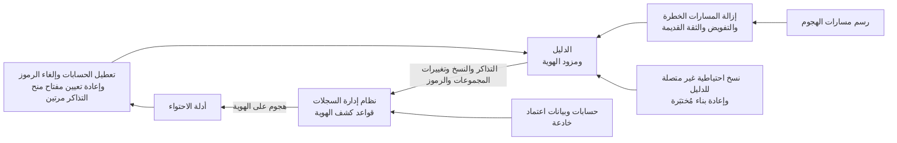

<!-- Generated by scripts/build.mjs from data/patterns/P31.json. Edit the data, then run npm run build. -->

[English](../en/P31-identity-threat-detection.md)

# P31 رصد تهديدات الهوية والاستجابة لها

> راقب أنظمة الهوية نفسها لرصد الهجمات التي تحوّل بيانات الاعتماد المسروقة إلى سيطرة كاملة مثل Kerberoasting وDCSync والرموز المزوّرة، وقلّص ما تستطيع تلك الهجمات بلوغه، واستعد لاحتوائها خلال دقائق بإلغاء الجلسات وإعادة ضبط الثقة.

| المجال | أنماط ذات صلة |
| --- | --- |
| الهوية | [P02 الهوية مستوى تحكم](P02-identity-control-plane.md)، [P03 الصلاحيات الهامة والحساسة في طبقات](P03-tiered-privileged-access.md)، [P10 بيانات الرصد ومسار الكشف](P10-detection-telemetry.md) |

## المشكلة

ينتهي معظم الاختراقات في الدليل، إذ يجمع المهاجمون الذين يحصلون على موطئ قدم تذاكر حسابات الخدمة، وينسخون قيم تجزئة كلمات المرور من وحدات التحكم بالنطاق، ويضيفون أنفسهم إلى المجموعات ذات الصلاحيات الهامة، أو يزوّرون رموزًا يقبلها مزود الهوية السحابي، بينما لا ترى أدوات الأجهزة الطرفية والشبكة من ذلك إلا القليل لأنه يستخدم بروتوكولات وحسابات صالحة، فلا تكتشفه الفرق إلا حين تعمل برامج الفدية، ثم يعني التعافي إعادة بناء الثقة في كل هوية دفعة واحدة.

## متى تستخدمه

- يدير Active Directory أو إعداد هوية هجين عمل المؤسسة.
- نمت حسابات الخدمة والتفويض وعلاقات الثقة على مدى سنوات طويلة.
- تقع برامج الفدية أو اختراق الدليل ضمن أعلى المخاطر لديك.

## التصميم

قلّص ما تستطيع هجمات الهوية بلوغه قبل أن تحاول رصدها، فاكتشف مسارات الهجوم إلى المجموعات ذات الصلاحيات الهامة وأصلحها، وامنح حسابات الخدمة كلمات مرور طويلة عشوائية أو هويات مُدارة، وأزل التفويض غير المقيد وعلاقات الثقة القديمة، وأبقِ وحدات التحكم بالنطاق ومزود الهوية في أعلى طبقة إدارية، ثم قيّم الدليل بانتظام بأدوات ترسم هذه المسارات، وتابع ما تكتشفه كما تتابع الثغرات.

اجمع المؤشرات التي تكشف هجمات الهوية مثل طلبات التذاكر ونسخ الدليل وتغييرات المجموعات وتغييرات الاتحاد وتوقيع الرموز وعمليات الدخول الخطرة، واكتب لها قواعد كشف في نظام إدارة السجلات، ثم ازرع حسابات وبيانات اعتماد خادعة لا ينبغي أن يستخدمها أحد أبدًا، وجهّز أدلة استجابة تعطّل الحسابات، وتلغي الجلسات والرموز، وتعيد تعيين مفتاح منح التذاكر في Kerberos مرتين، وتغيّر شهادات توقيع الرموز، وتدرّب عليها قبل الحاجة إليها.

## الضوابط

### أساسي

- **اكتشف مسارات الهجوم وأصلحها:** ارسم المسارات من الحسابات العادية إلى المجموعات ذات الصلاحيات الهامة، وأزل الصلاحيات والعضويات التي تنشئها.
  `NIST AC-6` `NIST AC-2` `CIS 5.1` `CIS 6.8` `ISO A.5.18` `ISO A.8.2`
- **احمِ حسابات الخدمة:** امنح حسابات الخدمة كلمات مرور طويلة عشوائية أو هويات مُدارة، وامنعها من الدخول التفاعلي.
  `NIST IA-5` `NIST AC-2` `CIS 5.5` `ISO A.5.17`
- **سجّل ما تتركه هجمات الهوية:** اجمع أحداث الدليل والتذاكر والنسخ وتغييرات المجموعات وعمليات الدخول، وأرسلها إلى نظام إدارة السجلات.
  `NIST AU-2` `NIST AU-12` `CIS 8.2` `CIS 8.5` `ISO A.8.15`

### معزز

- **اكشف هجمات الهوية:** اكتب قواعد كشف لهجمات Kerberoasting، ونسخ الدليل من أجهزة ليست وحدات تحكم بالنطاق، وتغييرات المجموعات ذات الصلاحيات الهامة، والرموز المزوّرة.
  `NIST SI-4` `NIST AC-2(12)` `CIS 8.11` `CIS 13.1` `ISO A.8.16`
- **أزل التفويض والثقة الخطرين:** أزل التفويض غير المقيد وعلاقات الثقة القديمة والتحقق القديم، وراجع ما يتبقى كل عام.
  `NIST CM-7` `NIST AC-3` `CIS 4.8` `ISO A.8.9`
- **جهّز أدلة احتواء الهوية:** تدرّب على تعطيل الحسابات، وإلغاء الجلسات والرموز، وإعادة تعيين مفتاح منح التذاكر في Kerberos مرتين، وتغيير شهادات توقيع الرموز.
  `NIST IR-4` `NIST AC-2` `CIS 17.4` `ISO A.5.26`

### متقدم

- **ازرع هويات خادعة:** أنشئ حسابات وبيانات اعتماد خادعة لا ينبغي أن يستخدمها أحد، ونبّه عند أي محاولة لاستخدامها.
  `NIST SI-4` `NIST AC-2(12)` `ISO A.8.16`
- **احتفظ بمسار نظيف لتعافي الهوية:** احتفظ بنسخ احتياطية غير متصلة من الدليل وبخطة مُختبَرة لإعادة بنائه في بيئة معزولة.
  `NIST CP-9` `NIST CP-10` `CIS 11.4` `ISO A.8.13`

## قرارات يجب توثيقها

- ما الحسابات والأنظمة الواقعة في الطبقة العليا، ومن يستطيع إدارتها؟
- من يجوز له تعطيل الحسابات أو إعادة ضبط الثقة أثناء الحادثة حتى لو أوقف ذلك الأعمال؟
- كيف ستعيد بناء الدليل إذا لم تعد تستطيع الوثوق به؟

## المفاضلات

- تكسر إزالة التفويض وعلاقات الثقة القديمة اعتماديات منسية، لذا تحتاج التغييرات إلى اختبار وطريق للعودة.
- تكثر إنذارات قواعد كشف الهوية في البداية، لأن الأدوات المشروعة تتصرف كالهجمات.
- تعطّل إعادة تعيين مفتاح منح التذاكر وشهادات التوقيع عمليات الدخول، لذا يجب التخطيط لتوقيتها.

## أنماط خاطئة يجب تجنبها

- حسابات خدمة بكلمات مرور قديمة لا تنتهي وصلاحيات مسؤولي النطاق.
- أحداث دليل تُجمع دون أن تُكتب لها قواعد كشف.
- خطط تعافٍ تستعيد الدليل المخترق نفسه.

## كيف تتحقق منه

- شغّل أداة ترسم مسارات الهجوم، وتأكد من أن أي حساب عادي لا يستطيع بلوغ مجموعة ذات صلاحيات هامة.
- اطلب تذكرة خدمة لحساب خادع، وتأكد من تفعيل التنبيه خلال دقائق.
- نفّذ دليل الاحتواء في نطاق اختباري، وقِس زمن كل خطوة.

## التهديدات التي يتصدى لها

| المرجع | الاسم |
| --- | --- |
| [T1558.003](https://attack.mitre.org/techniques/T1558/003/) | سرقة تذاكر Kerberos أو تزويرها، Kerberoasting |
| [T1003.006](https://attack.mitre.org/techniques/T1003/006/) | استخراج بيانات الاعتماد من نظام التشغيل، DCSync |
| [T1606.002](https://attack.mitre.org/techniques/T1606/002/) | تزوير بيانات اعتماد الويب، رموز SAML |
| [T1098](https://attack.mitre.org/techniques/T1098/) | التلاعب بالحسابات |

## المراجع

- [تكتيك الوصول إلى بيانات الاعتماد في MITRE ATT&CK](https://attack.mitre.org/tactics/TA0006/)
- [إطار MITRE D3FEND لأساليب الدفاع](https://d3fend.mitre.org/)
- [التنبيه CISA AA21-008A لكشف نشاط المهاجمين بعد الاختراق في البيئات السحابية من Microsoft](https://www.cisa.gov/news-events/cybersecurity-advisories/aa21-008a)

