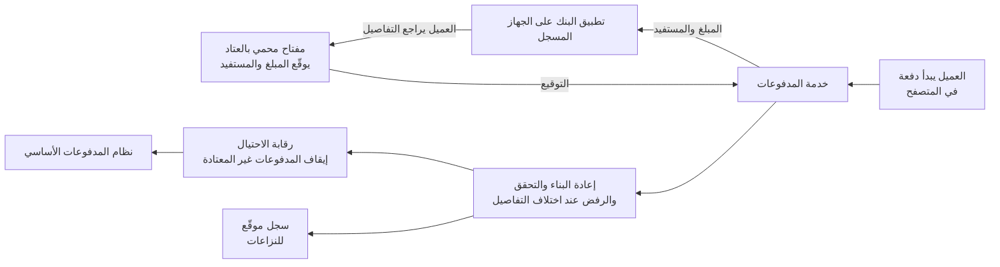

<!-- Generated by scripts/build.mjs from data/patterns/P32.json. Edit the data, then run npm run build. -->

[English](../en/P32-transaction-signing.md)

# P32 توقيع المعاملات في المدفوعات

> أكّد كل معاملة حساسة بتفاصيلها نفسها، أي المبلغ والمستفيد، بعنصر لا يستطيع المهاجم في المتصفح أو الهاتف تغييره، وتحقق في الخوادم من التفاصيل الموقّعة، حتى لا تستطيع جلسة مختطفة تحويل الأموال إلى وجهة أخرى.

| المجال | أنماط ذات صلة |
| --- | --- |
| التطبيقات | [P17 هوية العملاء وحماية حساباتهم](P17-customer-identity.md)، [P27 حماية تطبيقات الهاتف](P27-mobile-app-protection.md)، [P15 النطاق المعزول الخاضع للتنظيم](P15-regulated-enclave.md) |

## المشكلة

لا يحمي الدخول القوي دفعة تُجرى بعد الدخول، إذ تستطيع برمجية ضارة في المتصفح أو الهاتف تغيير المستفيد والمبلغ بعد أن يدخلهما العميل، وعرض التفاصيل الأصلية عليه، وتمرير الرمز المؤقت، كما يستطيع وكيل تصيد فعل الشيء نفسه بجلسة حية، بينما تعتمد الرموز غير المرتبطة بالمعاملة أي شيء يرسله المهاجم، فيرى فريق الاحتيال دفعة تحقق منها النظام بطريقة صحيحة.

## متى تستخدمه

- ينقل العملاء أو الموظفون الأموال، أو يضيفون مستفيدين، أو يعتمدون مدفوعات عبر الإنترنت.
- تشترط التشريعات تحققًا قويًا من هوية العميل يرتبط بالمعاملة.
- يصل الاحتيال عبر البرمجيات الضارة أو التصيد اللحظي إلى عملائك بالفعل.

## التصميم

اعرض المبلغ والمستفيد عبر قناة لا يستطيع المهاجم تغييرها، مثل تطبيق البنك على جهاز مسجل أو جهاز توقيع، واجعل العميل يعتمد تلك التفاصيل نفسها بمفتاح يوقّعها، ثم تعيد الخوادم بناء المعاملة مما استلمته، وتتحقق من التوقيع مقابل تلك التفاصيل، وترفض أي دفعة تختلف تفاصيلها عما وُقّع.

طبّق التوقيع حسب المخاطر، فالمستفيدون الجدد والمبالغ الكبيرة وتغيير الحدود وتغيير بيانات التواصل تحتاج إليه دائمًا، بينما قد لا تحتاج إليه المدفوعات الصغيرة إلى مستفيدين موثوقين، ثم أرسل نتائج التوقيع ومؤشرات الأجهزة إلى رقابة الاحتيال، وأوقف المدفوعات غير المعتادة للمراجعة، واستخدم معايير مثل تأكيد الدفع المبني على FIDO حيث تدعمها منصة العميل.

## الضوابط

### أساسي

- **اربط الاعتماد بالمعاملة:** اجعل كل رمز اعتماد أو توقيع معتمدًا على المبلغ والمستفيد، حتى لا يعتمد أي شيء آخر.
  `NIST IA-11` `NIST AU-10` `ISO A.8.5`
- **اعرض التفاصيل عبر قناة منفصلة:** اعرض المبلغ والمستفيد في التطبيق المسجل أو على جهاز التوقيع، لا في المتصفح الذي بدأ الدفعة فقط.
  `NIST SC-37` `NIST IA-11` `ISO A.8.5`
- **تحقق من التفاصيل الموقّعة في الخوادم:** أعد بناء المعاملة في الخوادم، وتحقق من التوقيع مقابلها، وارفض أي دفعة تختلف تفاصيلها.
  `NIST SI-7` `NIST SI-10` `CIS 16.10` `ISO A.8.26`

### معزز

- **وقّع حسب المخاطر:** اشترط التوقيع للمستفيدين الجدد والمبالغ الكبيرة وتغيير الحدود أو بيانات التواصل، ولا تسمح بالاستثناءات إلا وفق قاعدة.
  `NIST IA-11` `NIST AC-3` `ISO A.5.15`
- **أرسل مؤشرات التوقيع والأجهزة إلى رقابة الاحتيال:** اجمع نتائج التوقيع مع مؤشرات الأجهزة والسلوك، وأوقف المدفوعات غير المعتادة للمراجعة.
  `NIST SI-4` `NIST AU-6` `CIS 13.1` `ISO A.8.16`
- **احتفظ بسجل لا يمكن إنكاره:** احفظ كل اعتماد موقّع مع تفاصيله وجهازه محميًا من التعديل، للنزاعات وللجهات الرقابية.
  `NIST AU-10` `NIST AU-9` `CIS 8.10` `ISO A.8.15`

### متقدم

- **استخدم مفاتيح محمية بالعتاد للتوقيع:** احفظ مفاتيح التوقيع في العتاد الآمن للجهاز أو في أدوات تحقق FIDO، مرتبطة بالجهاز المسجل.
  `NIST SC-12` `NIST IA-5` `ISO A.8.24`
- **احمِ تسجيل أجهزة التوقيع:** عامل تسجيل جهاز توقيع جديد بوصفه تغييرًا عالي المخاطر، مع فحوص قوية وإشعار ومهلة قبل أول استخدام.
  `NIST IA-3` `NIST IA-5` `ISO A.5.17`

## قرارات يجب توثيقها

- ما المعاملات التي تحتاج إلى التوقيع دائمًا، وما الاستثناءات التي ستسمح بها؟
- ما القناة التي تعرض التفاصيل التي يعتمدها العميل، وماذا يحدث حين لا يملك العميل جهازًا مسجلًا؟
- ما مدة حفظ الاعتمادات الموقّعة، ومن يستطيع قراءتها عند النزاع؟

## المفاضلات

- يضيف توقيع كل دفعة صعوبة، لذا يجب تعريف الاستثناءات منخفضة المخاطر بعناية.
- يحتاج العملاء الذين لا يملكون هاتفًا ذكيًا أو جهاز توقيع إلى قناة آمنة أخرى، وتشغيلها أعلى كلفة.
- يحتاج التحقق في الخوادم إلى صيغة المعاملة نفسها في كل قناة، وهذا يمس الأنظمة الأساسية.

## أنماط خاطئة يجب تجنبها

- رمز مؤقت يُرسل دون ذكر المبلغ أو المستفيد في الرسالة.
- تفاصيل معاملة تُعرض وتُعتمد في المتصفح الذي أرسلها فقط.
- اعتمادات يفحصها التطبيق على الجهاز وتثق بها الخوادم.

## كيف تتحقق منه

- غيّر المستفيد في دفعة اختبارية بعد اعتمادها، وتأكد من أن الخوادم ترفضها.
- أعد استخدام اعتماد دفعة في دفعة أخرى، وتأكد من إخفاقه.
- سجّل جهاز توقيع جديدًا في حساب اختباري، وتأكد من الإشعار ومن المهلة قبل أول استخدام.

## التهديدات التي يتصدى لها

| المرجع | الاسم |
| --- | --- |
| [T1185](https://attack.mitre.org/techniques/T1185/) | اختطاف جلسة المتصفح |
| [T1557](https://attack.mitre.org/techniques/T1557/) | الخصم في المنتصف |
| [T1565.002](https://attack.mitre.org/techniques/T1565/002/) | التلاعب بالبيانات، التلاعب بالبيانات المنقولة |
| [T1111](https://attack.mitre.org/techniques/T1111/) | اعتراض التحقق متعدد العناصر |

## المراجع

- [دليل OWASP المختصر لتفويض المعاملات](https://cheatsheetseries.owasp.org/cheatsheets/Transaction_Authorization_Cheat_Sheet.html)
- [معيار W3C لتأكيد الدفع الآمن](https://www.w3.org/TR/secure-payment-confirmation/)
- [اللائحة الأوروبية المفوضة رقم ٢٠١٨/٣٨٩ بشأن التحقق القوي من هوية العميل](https://eur-lex.europa.eu/eli/reg_del/2018/389/oj)

