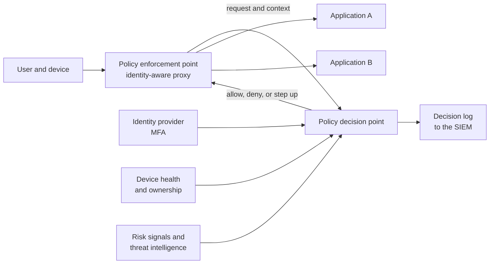

<!-- Generated by scripts/build.mjs from data/patterns/P01.json. Edit the data, then run npm run build. -->

[العربية](../ar/P01-zero-trust-access.md)

# P01 Zero trust access

> Grant access to each application per request, based on who the user is, the state of their device, and the sensitivity of what they ask for, instead of trusting anyone because of the network they are on.

| Domain | Related patterns |
| --- | --- |
| Identity | [P02 Identity as the control plane](P02-identity-control-plane.md), [P03 Tiered privileged access](P03-tiered-privileged-access.md), [P04 Segmentation and micro-segmentation](P04-segmentation.md), [P10 Security telemetry and detection pipeline](P10-detection-telemetry.md) |

## The problem

A VPN or an office network puts a user on the inside, and the inside is usually wide open. Once connected, a stolen account or an infected laptop can reach far more than the one application the user needed, which is why valid accounts and external remote services are among the most common ways attackers get in.

## Use it when

- Staff, contractors, or vendors reach internal applications from outside the office.
- You still rely on a VPN that lands users on a broad internal network.
- You need to prove who accessed which application, and from which device.

## The design

Put a policy enforcement point in front of every application: an identity-aware proxy for web applications, and a connector that dials out from the application zone for everything else, so that nothing listens on the internet. Each request goes to a policy decision point, which weighs the user's identity and authentication strength, the device's health and ownership, the application's sensitivity, and signals such as location and risk, then allows, denies, or asks for stronger proof.

Access is to one application, never to a network segment. Sessions are short, decisions are re-evaluated when signals change, and every decision is logged with the reason it was made.

## Controls

### Foundation

- **Put applications behind an enforcement point:** Publish internal applications only through an identity-aware proxy or access broker, and remove direct inbound access from the internet and from the VPN pool.
  `NIST AC-3` `NIST AC-17` `NIST SC-7` `CIS 13.5` `CIS 6.7` `ISO A.5.15` `ISO A.8.20`
- **Require MFA on every access decision:** Require multi-factor authentication for every application behind the broker, with phishing-resistant methods for administrators and remote access.
  `NIST IA-2(1)` `NIST IA-2(2)` `CIS 6.3` `CIS 6.4` `CIS 6.5` `ISO A.8.5`
- **Log every decision:** Send every allow and deny decision, with user, device, application, and reason, to the central log platform.
  `NIST AU-2` `NIST AU-12` `CIS 8.2` `CIS 8.5` `ISO A.8.15`

### Enhanced

- **Make device health a condition:** Admit only managed devices that meet a health baseline, such as disk encryption, a running endpoint agent, and a supported operating system, and give unmanaged devices browser-only access to low-sensitivity applications.
  `NIST IA-3` `NIST CM-6` `CIS 13.5` `ISO A.8.1`
- **Retire network-wide VPN access:** Move applications behind the broker one group at a time, starting with the most sensitive, and shrink the VPN to the few protocols that still need it.
  `NIST AC-17` `NIST SC-7` `CIS 13.5` `ISO A.8.20` `ISO A.8.22`
- **Give vendors brokered, recorded sessions:** Give third parties access to named systems only, through the broker, with approval per session, a time limit, and session recording.
  `NIST MA-4` `NIST AC-17` `NIST AU-14` `CIS 13.5` `ISO A.5.19` `ISO A.5.20`

### Advanced

- **Evaluate risk continuously:** Re-evaluate sessions when risk signals change, such as impossible travel, a new device, or a threat intelligence hit, and end the session or ask for stronger proof without waiting for it to expire.
  `NIST AC-12` `NIST IA-11` `NIST SI-4` `ISO A.8.16`
- **Carry identity into the application:** Pass verified identity and context to the application so it can authorize each action, and keep authorization data in one place rather than copied into every application.
  `NIST AC-3` `NIST AC-6` `NIST AC-24` `CIS 6.8` `ISO A.5.15` `ISO A.8.3`

## Decisions to record

- Which applications move behind the broker first, and what is the plan and deadline for retiring network-wide VPN access?
- What happens when the policy decision point is unavailable: which applications fail closed, and is there a controlled emergency path?
- Which device states are allowed, and what can an unmanaged device reach?

## Trade-offs

- The policy decision point becomes critical infrastructure, so design it for high availability and decide in advance how each application behaves when it is down.
- Legacy protocols such as thick clients and file shares are harder to broker than web applications, so migration is uneven.
- Strict device checks can lock out legitimate users during an incident or an outage of the device management service.

## Anti-patterns to avoid

- Renaming the VPN to zero trust while users still land on a flat internal network.
- Checking identity once at sign-in and trusting the session for days.
- Exempting executives, vendors, or the service desk from the policy because it is inconvenient.

## How to verify it

- From an unmanaged device and from the old VPN pool, try to reach an application directly, and confirm the attempt fails.
- Disable a user in the identity provider and confirm that open sessions end within the target time.
- Scan your external address space and confirm that no internal application answers on the internet.
- Sample the decision log and check that each entry names the user, device, application, decision, and reason.

## Threats it addresses

| Reference | Name |
| --- | --- |
| [T1078](https://attack.mitre.org/techniques/T1078/) | Valid Accounts |
| [T1133](https://attack.mitre.org/techniques/T1133/) | External Remote Services |
| [T1021](https://attack.mitre.org/techniques/T1021/) | Remote Services |
| [T1199](https://attack.mitre.org/techniques/T1199/) | Trusted Relationship |

## References

- [NIST SP 800-207, Zero Trust Architecture](https://csrc.nist.gov/pubs/sp/800/207/final)
- [CISA Zero Trust Maturity Model, version 2.0](https://www.cisa.gov/zero-trust-maturity-model)
- [UK NCSC, zero trust architecture design principles](https://www.ncsc.gov.uk/collection/zero-trust-architecture)
- [NIST SP 1800-35, Implementing a Zero Trust Architecture](https://csrc.nist.gov/pubs/sp/1800/35/final)
