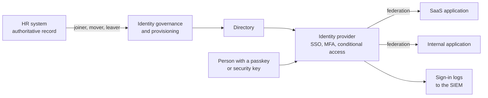

<!-- Generated by scripts/build.mjs from data/patterns/P02.json. Edit the data, then run npm run build. -->

[العربية](../ar/P02-identity-control-plane.md)

# P02 Identity as the control plane

> Make one identity provider the authority for every person, and make phishing-resistant authentication the normal way in, because identity is the perimeter that attackers test first.

| Domain | Related patterns |
| --- | --- |
| Identity | [P01 Zero trust access](P01-zero-trust-access.md), [P03 Tiered privileged access](P03-tiered-privileged-access.md), [P10 Security telemetry and detection pipeline](P10-detection-telemetry.md), [P17 Customer identity and account protection](P17-customer-identity.md), [P31 Identity threat detection and response](P31-identity-threat-detection.md) |

## The problem

Accounts spread across many directories, local accounts, shared logins, and legacy protocols give attackers too many doors, and one password that is phished or sprayed is often enough. When joiners, movers, and leavers are handled by email, access stays behind long after it should have gone.

## Use it when

- People sign in to many applications with different accounts or passwords.
- Passwords, SMS codes, or push approvals are still the main authentication methods.
- Access is granted and removed by hand, without a link to HR records.

## The design

Choose one identity provider as the source of authentication for workforce applications, federate every application to it with SAML or OpenID Connect, and turn off legacy protocols that cannot do multi-factor authentication. Drive the account lifecycle from the HR system, so that joining, moving, and leaving change access automatically.

Make phishing-resistant authenticators the default, such as FIDO2 security keys, passkeys, or smart cards, and use conditional access to require them for administrators, remote access, and sensitive applications. Treat service accounts as identities too, each with an owner, a record in the inventory, and no shared password.

## Controls

### Foundation

- **Federate every application to one identity provider:** Connect workforce applications to the identity provider with single sign-on, and keep a list of the ones that cannot be connected yet, with a plan for each.
  `NIST IA-2` `NIST AC-2` `CIS 5.6` `CIS 6.6` `CIS 6.7` `ISO A.5.16` `ISO A.8.5`
- **Require MFA everywhere, starting with administrators:** Require multi-factor authentication for all users, with phishing-resistant methods for administrators and for externally exposed applications first.
  `NIST IA-2(1)` `NIST IA-2(2)` `CIS 6.3` `CIS 6.4` `CIS 6.5` `ISO A.8.5`
- **Block legacy authentication:** Disable protocols that bypass multi-factor authentication, such as basic authentication for mail and old directory binds, and alert on any attempt to use them.
  `NIST IA-2` `NIST CM-7` `CIS 4.8` `ISO A.8.5`
- **Automate joiners, movers, and leavers:** Create, change, and disable accounts from HR events, and disable dormant accounts after a defined period.
  `NIST AC-2` `NIST AC-2(3)` `CIS 5.3` `CIS 6.1` `CIS 6.2` `ISO A.5.16` `ISO A.5.18`

### Enhanced

- **Use conditional access:** Decide access from user risk, device state, location, and application sensitivity, and require stronger authentication when the risk is higher.
  `NIST AC-3` `NIST IA-2` `CIS 6.7` `ISO A.5.15` `ISO A.8.5`
- **Govern service accounts:** Keep an inventory of service accounts with an owner and a purpose for each, block interactive sign-in for them, and rotate or replace their credentials.
  `NIST AC-2` `NIST IA-5` `CIS 5.5` `ISO A.5.16` `ISO A.5.17`
- **Review access on a schedule:** Have owners confirm access to sensitive applications on a fixed schedule, and remove anything they do not confirm.
  `NIST AC-2` `CIS 6.2` `ISO A.5.18`

### Advanced

- **Go passwordless:** Move users to passkeys or security keys as their only authenticator, and remove passwords from accounts that no longer need them.
  `NIST IA-2` `NIST IA-5` `ISO A.8.5`
- **Protect the identity provider as tier zero:** Administer the identity provider only from privileged access workstations, watch its configuration for changes, and alert on new federation trusts or token signing keys.
  `NIST AC-6(5)` `NIST CM-3` `NIST SI-4` `CIS 5.4` `CIS 12.8` `ISO A.8.2` `ISO A.8.9`

## Decisions to record

- Which identity provider is authoritative, and how do other directories synchronise with it?
- Which authenticators are allowed for which users, and what is the recovery process when one is lost?
- Which applications cannot federate, and what compensating controls apply to them?

## Trade-offs

- A single identity provider concentrates risk, since an outage or compromise affects everything, so it needs its own resilience plan and the strongest administrative protection.
- Phishing-resistant authenticators cost money and training, and recovery flows must be as strong as the authenticator or attackers will target them instead.
- An automated lifecycle depends on accurate HR data, so errors in HR become access errors.

## Anti-patterns to avoid

- SMS codes or simple push approvals as the only second factor for administrators.
- Shared accounts for teams, vendors, or the service desk.
- A service desk that resets MFA on a phone call without verifying the caller.

## How to verify it

- List all applications and confirm each one uses single sign-on or has a documented exception.
- Attempt a sign-in over a legacy protocol and confirm it is blocked and alerted.
- Mark a test employee as leaving in HR and measure how long it takes until every account is disabled.
- Run a phishing exercise against administrators and confirm that their authenticators cannot be relayed.

## Threats it addresses

| Reference | Name |
| --- | --- |
| [T1078](https://attack.mitre.org/techniques/T1078/) | Valid Accounts |
| [T1110.003](https://attack.mitre.org/techniques/T1110/003/) | Brute Force: Password Spraying |
| [T1110.004](https://attack.mitre.org/techniques/T1110/004/) | Brute Force: Credential Stuffing |
| [T1566](https://attack.mitre.org/techniques/T1566/) | Phishing |
| [T1621](https://attack.mitre.org/techniques/T1621/) | Multi-Factor Authentication Request Generation |
| [T1556](https://attack.mitre.org/techniques/T1556/) | Modify Authentication Process |

## References

- [NIST SP 800-63-4, Digital Identity Guidelines](https://pages.nist.gov/800-63-4/)
- [CISA, implementing phishing-resistant MFA](https://www.cisa.gov/sites/default/files/publications/fact-sheet-implementing-phishing-resistant-mfa-508c.pdf)
- [FIDO Alliance, passkeys](https://fidoalliance.org/passkeys/)
