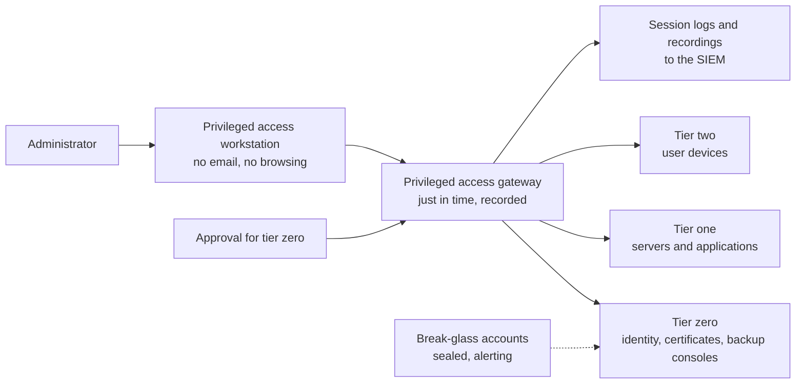

<!-- Generated by scripts/build.mjs from data/patterns/P03.json. Edit the data, then run npm run build. -->

[العربية](../ar/P03-tiered-privileged-access.md)

# P03 Tiered privileged access

> Separate the accounts, devices, and paths used for administration from those used for daily work, and grant privilege only when it is needed, so that one compromised laptop or mailbox cannot become control of everything.

| Domain | Related patterns |
| --- | --- |
| Identity | [P02 Identity as the control plane](P02-identity-control-plane.md), [P04 Segmentation and micro-segmentation](P04-segmentation.md), [P12 Ransomware-resilient recovery](P12-resilient-recovery.md), [P10 Security telemetry and detection pipeline](P10-detection-telemetry.md), [P31 Identity threat detection and response](P31-identity-threat-detection.md) |

## The problem

Most breaches reach their worst when the attacker reaches an administrator. Administrators who read email and browse the web with the same account and laptop they use to manage servers hand their credentials to the first phishing email or malicious site, and standing privilege means those credentials work at any hour.

## Use it when

- Administrators use the same account for daily work and for administration.
- Admin rights are permanent rather than granted for a task.
- Vendors or outsourced teams administer your systems.

## The design

Group systems into tiers by what they control. Tier zero holds identity and security infrastructure such as the identity provider, the directory, the certificate authority, and the backup and management consoles; tier one holds servers and applications; tier two holds user devices. An account administers one tier only and never signs in to a lower one, which stops credentials from flowing up the chain.

Administrators work from privileged access workstations that cannot browse the web or read email, reach systems through a privileged access management gateway that brokers and records sessions, and receive privilege just in time, for a task, with approval for tier zero. Break-glass accounts exist for emergencies, are sealed offline, and alert when used.

## Controls

### Foundation

- **Separate admin accounts:** Give each administrator a dedicated admin account, separate from their daily account, and never give admin accounts a mailbox or web access.
  `NIST AC-6(2)` `NIST AC-6(5)` `CIS 5.4` `ISO A.8.2`
- **Require phishing-resistant MFA for all admin access:** Require phishing-resistant multi-factor authentication for every administrative sign-in, including cloud consoles and network devices.
  `NIST IA-2(1)` `CIS 6.5` `ISO A.8.5`
- **Inventory privileged accounts:** Keep an inventory of every privileged account, human and service, with an owner, and remove the ones nobody can justify.
  `NIST AC-2` `CIS 5.1` `CIS 5.5` `ISO A.8.2` `ISO A.5.16`

### Enhanced

- **Use privileged access workstations:** Perform administration only from hardened workstations with no email or web browsing, and restrict admin sign-in to those devices.
  `NIST AC-6` `NIST CM-6` `CIS 12.8` `ISO A.8.2` `ISO A.8.1`
- **Broker and record sessions:** Route privileged sessions through a privileged access management gateway that injects credentials, so administrators never see them, and records what was done.
  `NIST AC-6(9)` `NIST AU-14` `CIS 8.5` `ISO A.8.2` `ISO A.8.15`
- **Grant privilege just in time:** Remove standing admin rights and grant them for a task and a time window, with approval for tier zero.
  `NIST AC-2` `NIST AC-6` `CIS 6.1` `ISO A.8.2` `ISO A.5.18`

### Advanced

- **Enforce tier separation technically:** Block tier zero and tier one accounts from signing in to lower tiers with sign-in restrictions, and alert on any attempt.
  `NIST AC-3` `NIST AC-6` `CIS 5.4` `ISO A.8.2` `ISO A.8.3`
- **Seal and test break-glass accounts:** Keep two emergency accounts with credentials sealed offline under dual control, alert on any use, and test them on a schedule.
  `NIST AC-2` `NIST AU-6` `ISO A.8.2`

## Decisions to record

- Which systems are tier zero in your environment, and who may administer them?
- How are vendors and outsourced administrators given access, and how is their work reviewed?
- Where are break-glass credentials kept, and who can open them?

## Trade-offs

- Workstations, gateways, and approvals slow administrators down, so keep common tasks quick or people will find workarounds.
- The privileged access management gateway becomes a tier zero system itself, and must be protected and made resilient like one.
- Just-in-time access needs a fast emergency route for incidents, or it will be bypassed when it matters most.

## Anti-patterns to avoid

- Domain or global admin rights used for routine work such as installing software on laptops.
- Admin passwords in spreadsheets, scripts, or a shared folder in a password manager.
- A backup console administered with the same accounts as the servers it protects.

## How to verify it

- List everyone with standing privileged access and compare it with the list of people who should have it.
- Try to sign in with a tier zero account on an ordinary workstation, and confirm it is blocked and alerted.
- Pick a recorded privileged session and confirm you can see who did what, on which system, and when.

## Threats it addresses

| Reference | Name |
| --- | --- |
| [T1078](https://attack.mitre.org/techniques/T1078/) | Valid Accounts |
| [T1003](https://attack.mitre.org/techniques/T1003/) | OS Credential Dumping |
| [T1550](https://attack.mitre.org/techniques/T1550/) | Use Alternate Authentication Material |
| [T1021](https://attack.mitre.org/techniques/T1021/) | Remote Services |
| [T1098](https://attack.mitre.org/techniques/T1098/) | Account Manipulation |

## References

- [Microsoft, the enterprise access model](https://learn.microsoft.com/en-us/security/privileged-access-workstations/privileged-access-access-model)
- [NIST SP 800-53 Rev 5, security and privacy controls](https://csrc.nist.gov/pubs/sp/800/53/r5/upd1/final)
- [UK NCSC, secure system administration](https://www.ncsc.gov.uk/collection/secure-system-administration)
