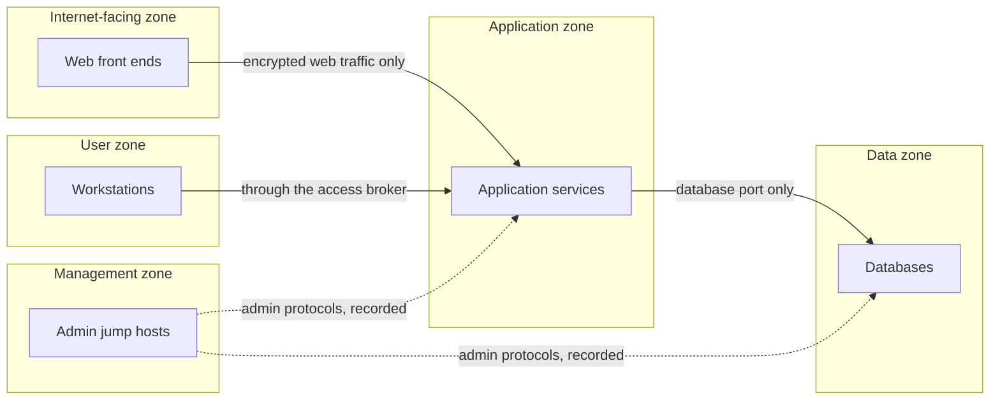

<!-- Generated by scripts/build.mjs from data/patterns/P04.json. Edit the data, then run npm run build. -->

[العربية](../ar/P04-segmentation.md)

# P04 Segmentation and micro-segmentation

> Divide the environment into zones by function and trust, allow only the flows each zone needs, and deny everything else between them, so that one compromised system does not open the way to the rest.

| Domain | Related patterns |
| --- | --- |
| Network | [P01 Zero trust access](P01-zero-trust-access.md), [P03 Tiered privileged access](P03-tiered-privileged-access.md), [P15 Regulated enclave](P15-regulated-enclave.md), [P13 OT zones and conduits](P13-ot-zones-and-conduits.md) |

## The problem

In a flat network every system can talk to every other system, so ransomware and intruders move from the first foothold to the most valuable assets with ordinary tools. The blast radius of any compromise is the whole network.

## Use it when

- Servers, user devices, and management interfaces share networks.
- You cannot say which systems are allowed to talk to your databases.
- A regulation requires you to isolate a regulated environment.

## The design

Define zones from the data flows, not from the org chart. User devices, internet-facing services, application services, data stores, management, and security tooling are the usual starting set, with regulated systems in an enclave of their own. Between zones, allow only named flows, written as source, destination, port, and purpose, and deny everything else, including traffic between user devices.

Micro-segmentation takes the same idea down to the workload. Host firewalls or network policies that follow each workload's identity allow only the connections that workload needs, which contains lateral movement even inside a zone. Start with the most valuable zones, and learn what normal looks like from flow logs before you enforce.

## Controls

### Foundation

- **Draw and maintain the zone map:** Keep a current diagram of zones and of the flows allowed between them, and review it whenever the architecture changes.
  `NIST PL-8` `NIST CA-9` `CIS 12.4` `CIS 3.8` `ISO A.8.22` `ISO A.8.27`
- **Deny by default between zones:** Filter traffic between zones on an allow list of named flows, and deny and log everything else.
  `NIST SC-7` `NIST SC-7(5)` `NIST AC-4` `CIS 13.4` `CIS 12.2` `ISO A.8.20` `ISO A.8.22`
- **Isolate management interfaces:** Put the management interfaces of servers, network devices, and hypervisors in a management zone that only administrative jump hosts can reach.
  `NIST SC-7` `NIST SC-2` `CIS 12.3` `CIS 12.8` `ISO A.8.22`

### Enhanced

- **Block traffic between user devices:** Prevent workstations from talking to each other directly, which removes a common path for lateral movement.
  `NIST SC-7` `NIST AC-4` `CIS 4.5` `CIS 13.4` `ISO A.8.22`
- **Collect flow logs at zone boundaries:** Record network flows between zones, feed them to detection, and use them to tighten the rules.
  `NIST AU-12` `NIST SI-4` `CIS 13.6` `ISO A.8.16`
- **Review rules on a schedule:** Give every rule an owner and a review date, and remove rules that no longer carry traffic.
  `NIST CM-6` `NIST SC-7` `CIS 4.2` `ISO A.8.20`

### Advanced

- **Micro-segment critical workloads:** Enforce per-workload policies based on workload identity for the most valuable systems, so that each can reach only its named dependencies.
  `NIST AC-4` `NIST SC-7(21)` `CIS 13.4` `CIS 3.12` `ISO A.8.22`
- **Test segmentation like an attacker:** Test from each zone that disallowed paths are really closed, at least every six months and after every significant change.
  `NIST CA-8` `CIS 18.1` `ISO A.8.22`

## Decisions to record

- What are the zones, and which flows between them are allowed, and why?
- Where is segmentation enforced: network firewalls, host firewalls, cloud security groups, or several of them?
- Who approves a new flow, and how long does an exception last?

## Trade-offs

- Every boundary adds rules to maintain, and badly managed rule sets drift back towards allowing everything.
- Enforcing too early breaks applications with undocumented dependencies, so learn from flow logs first.
- Micro-segmentation tools add agents or platform dependencies that must themselves be secured.

## Anti-patterns to avoid

- VLANs that separate traffic but allow any connection between them.
- A rule opened for a project and never closed.
- Management interfaces reachable from the user network.

## How to verify it

- From a user workstation, scan the data and management zones, and confirm nothing answers.
- Compare firewall rules with the documented flows, and list every rule with no owner or purpose.
- Simulate lateral movement from one workstation to another, and confirm it is blocked and detected.

## Threats it addresses

| Reference | Name |
| --- | --- |
| [T1021](https://attack.mitre.org/techniques/T1021/) | Remote Services |
| [T1210](https://attack.mitre.org/techniques/T1210/) | Exploitation of Remote Services |
| [T1046](https://attack.mitre.org/techniques/T1046/) | Network Service Discovery |
| [T1486](https://attack.mitre.org/techniques/T1486/) | Data Encrypted for Impact |

## References

- [CIS Critical Security Controls v8.1](https://www.cisecurity.org/controls/v8-1)
- [UK NCSC, preventing lateral movement](https://www.ncsc.gov.uk/guidance/preventing-lateral-movement)
- [NIST SP 800-41 Rev 1, guidelines on firewalls and firewall policy](https://csrc.nist.gov/pubs/sp/800/41/r1/final)
