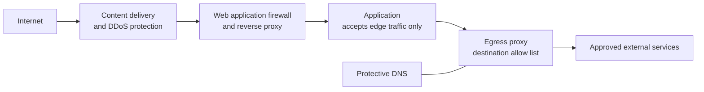

<!-- Generated by scripts/build.mjs from data/patterns/P05.json. Edit the data, then run npm run build. -->

[العربية](../ar/P05-internet-edge-and-egress.md)

# P05 Protected internet edge and controlled egress

> Terminate every internet-facing service at a hardened edge that absorbs attacks before they reach the application, and let systems reach the internet only through controlled, logged paths.

| Domain | Related patterns |
| --- | --- |
| Network | [P07 API gateway and object level authorization](P07-api-security.md), [P04 Segmentation and micro-segmentation](P04-segmentation.md), [P10 Security telemetry and detection pipeline](P10-detection-telemetry.md), [P09 Data-centric protection](P09-data-centric-protection.md) |

## The problem

Exploiting public-facing applications is one of the most common ways in, and servers that can reach any address on the internet give malware a free channel to download tools and send data out. Many breaches are noticed only after the data has left.

## Use it when

- You publish web applications or APIs to the internet.
- Your servers can open connections to any address on the internet.
- Your services must stay available during denial of service attacks.

## The design

Inbound, place a content delivery and DDoS protection layer in front, then a web application firewall and reverse proxy that terminate TLS and normalise requests, and only then the application, which accepts traffic from the edge alone. Keep the origin's addresses private so that the edge cannot be bypassed.

Outbound, deny direct internet access from servers, and send what is needed through an egress proxy or firewall with an allow list of destinations, DNS filtering, and logging. User traffic goes through a secure web gateway, whether users are in the office or remote.

## Controls

### Foundation

- **Put every public service behind the edge:** Publish internet-facing applications only through the web application firewall and reverse proxy, and restrict origins to accept traffic from the edge alone.
  `NIST SC-7` `CIS 13.10` `CIS 12.2` `ISO A.8.20` `ISO A.8.21`
- **Deny direct outbound access from servers:** Block servers from reaching the internet directly, and allow required destinations through an egress proxy with an allow list.
  `NIST SC-7` `NIST SC-7(5)` `NIST AC-4` `CIS 4.4` `ISO A.8.20` `ISO A.8.23`
- **Use protective DNS:** Resolve names through filtering resolvers that block known malicious domains, and log every query.
  `NIST SC-7` `NIST SI-4` `CIS 9.2` `CIS 8.6` `CIS 4.9` `ISO A.8.23` `ISO A.8.16`

### Enhanced

- **Absorb denial of service:** Use a provider-grade DDoS protection service sized for your peak traffic, with per-client rate limits at the edge.
  `NIST SC-5` `ISO A.8.6` `ISO A.8.14`
- **Tune the web application firewall to the application:** Run managed rule sets in blocking mode, add rules for the application's own paths and parameters, and review false positives every week.
  `NIST SC-7` `NIST SI-4` `CIS 13.10` `ISO A.8.26`
- **Log and inspect outbound traffic:** Log every outbound connection with source, destination, and bytes, and alert on large or unusual transfers.
  `NIST SI-4(4)` `NIST AU-12` `CIS 13.6` `CIS 8.7` `ISO A.8.16`

### Advanced

- **Add bot and abuse controls:** Detect credential stuffing, scraping, and automated abuse at the edge with behavioural signals, and challenge or block automated clients on sensitive flows.
  `NIST SI-4` `NIST SC-5` `CIS 13.10` `ISO A.8.16`
- **Inspect encrypted outbound traffic selectively:** Inspect encrypted outbound traffic from servers and high-risk users where law and policy allow, and exempt categories such as banking and health for privacy.
  `NIST SI-4(4)` `NIST SC-7` `ISO A.8.23`

## Decisions to record

- Which provider or products form the edge, and how do you stop traffic from bypassing it?
- Which destinations may servers reach, and who approves additions to the list?
- Where is TLS terminated, and how are certificates and keys protected there?

## Trade-offs

- A cloud edge sees decrypted traffic, which raises data residency and privacy questions for regulated data.
- Egress allow lists break software updates and integrations until they are complete, so start in monitoring mode.
- A web application firewall reduces risk but does not fix vulnerable code, and aggressive rules block real customers.

## Anti-patterns to avoid

- Origin servers that still accept traffic from any address.
- Allowing any outbound traffic from the server network.
- A web application firewall left in monitoring mode for years.

## How to verify it

- Send requests directly to the origin's address, and confirm they are refused.
- From a server, try to reach an address that is not on the allow list, and confirm it is blocked and logged.
- Resolve a known malicious test domain, and confirm protective DNS blocks it.

## Threats it addresses

| Reference | Name |
| --- | --- |
| [T1190](https://attack.mitre.org/techniques/T1190/) | Exploit Public-Facing Application |
| [T1498](https://attack.mitre.org/techniques/T1498/) | Network Denial of Service |
| [T1071](https://attack.mitre.org/techniques/T1071/) | Application Layer Protocol |
| [T1567](https://attack.mitre.org/techniques/T1567/) | Exfiltration Over Web Service |
| [T1105](https://attack.mitre.org/techniques/T1105/) | Ingress Tool Transfer |

## References

- [OWASP Core Rule Set for web application firewalls](https://coreruleset.org/)
- [UK NCSC, denial of service guidance](https://www.ncsc.gov.uk/collection/denial-service-dos-guidance-collection)
- [NIST SP 800-41 Rev 1, guidelines on firewalls and firewall policy](https://csrc.nist.gov/pubs/sp/800/41/r1/final)
