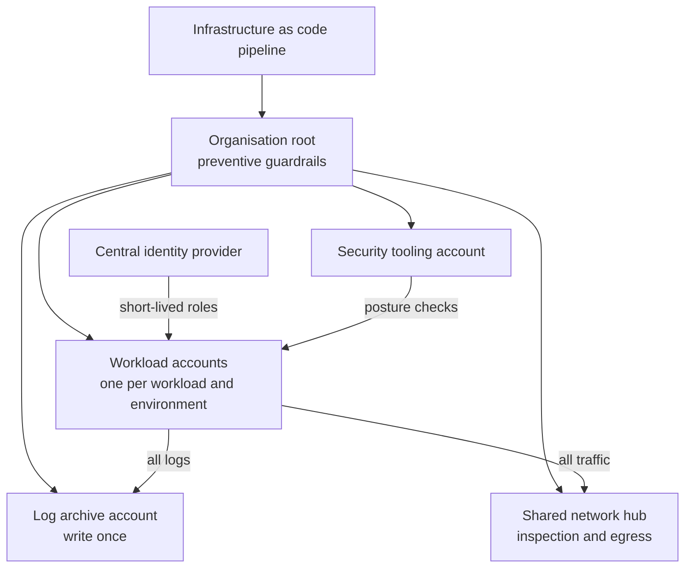

<!-- Generated by scripts/build.mjs from data/patterns/P06.json. Edit the data, then run npm run build. -->

[العربية](../ar/P06-cloud-landing-zone.md)

# P06 Cloud landing zone with guardrails

> Build every cloud workload on a prepared foundation of separate accounts, central identity, organisation-wide guardrails, shared networking, and logging that workload teams cannot switch off.

| Domain | Related patterns |
| --- | --- |
| Platform | [P02 Identity as the control plane](P02-identity-control-plane.md), [P08 Secrets, keys, and workload identity](P08-secrets-keys-workload-identity.md), [P10 Security telemetry and detection pipeline](P10-detection-telemetry.md), [P16 Container platform guardrails](P16-container-platform-guardrails.md) |

## The problem

Cloud makes it easy to create resources and just as easy to expose them. Without a foundation, teams share accounts, grant wide permissions, open storage to the internet by mistake, and switch off the logs that would have shown it.

## Use it when

- You run, or are about to run, workloads in a public cloud.
- Several teams deploy to the cloud independently.
- Production and non-production share accounts or subscriptions.

## The design

Use the provider's organisation structure to separate accounts, subscriptions, or projects by workload and environment, with dedicated accounts for security tooling, the log archive, shared networking, and identity. Apply guardrails at the organisation level: preventive policies that forbid what must never happen, such as public storage, disabled logging, or unapproved regions, and detective rules that flag drift from the baseline.

People sign in through the central identity provider with short-lived role sessions, never with long-lived user keys. Traffic between workloads and to the internet passes through a shared hub where it can be inspected, and the whole foundation is defined as code, reviewed, and deployed through a pipeline, so that it can be rebuilt and audited.

## Controls

### Foundation

- **Separate accounts by workload and environment:** Give each workload and each environment its own account or subscription, and keep production apart from everything else.
  `NIST SC-32` `CIS 16.8` `CIS 12.2` `ISO A.8.31` `ISO A.5.23`
- **Centralise identity with short-lived access:** Sign people in through the central identity provider with role sessions, remove long-lived access keys for people, and protect the root or global administrator accounts with phishing-resistant MFA.
  `NIST IA-2(1)` `NIST AC-2` `NIST IA-5` `CIS 6.5` `CIS 5.6` `ISO A.5.17` `ISO A.8.5`
- **Turn on organisation-wide logging:** Enable control plane logs in every account and region, send them to a separate log archive account that workload teams cannot modify, and keep them for the retention your obligations require.
  `NIST AU-2` `NIST AU-9(2)` `NIST AU-11` `CIS 8.2` `CIS 8.9` `CIS 8.10` `CIS 8.12` `ISO A.8.15`

### Enhanced

- **Enforce preventive guardrails:** Apply organisation policies that block public storage, the disabling of logs or security services, unapproved regions, and unencrypted resources.
  `NIST CM-6` `NIST CM-7` `CIS 4.1` `CIS 3.3` `ISO A.8.9` `ISO A.5.23`
- **Monitor posture continuously:** Run cloud security posture checks across all accounts against a benchmark, and route findings to the owning team with a deadline by severity.
  `NIST CA-7` `NIST RA-5` `NIST CM-6` `CIS 4.1` `CIS 7.1` `ISO A.8.8` `ISO A.8.9`
- **Route traffic through a shared hub:** Send traffic between workloads and to the internet through a shared network hub with firewalls and egress control, and give workloads private endpoints to cloud services.
  `NIST SC-7` `NIST AC-4` `CIS 12.2` `CIS 13.4` `ISO A.8.20` `ISO A.8.22`

### Advanced

- **Define the landing zone as code:** Keep every account, policy, and network definition in version control, review changes, deploy through a pipeline, and alert on changes made outside it.
  `NIST CM-2` `NIST CM-3` `NIST SA-10` `CIS 4.1` `ISO A.8.9` `ISO A.8.32`
- **Remediate critical drift automatically:** Automatically revert critical drift, such as a storage bucket made public, and notify the owner.
  `NIST CM-6` `NIST SI-4` `CIS 4.1` `ISO A.8.9`

## Decisions to record

- How are accounts or subscriptions structured, and who may create new ones?
- Which guardrails are preventive and which are detective, and how are exceptions granted?
- Which regions are allowed, given your data residency obligations?

## Trade-offs

- Strong guardrails slow down teams that need something unusual, so exceptions need a fast, recorded path.
- A shared network hub simplifies inspection, but adds cost and a central point that must be highly available.
- Multi-cloud doubles the guardrail work, because each provider's controls differ.

## Anti-patterns to avoid

- One account for everything, with production next to experiments.
- Long-lived access keys on developer laptops and in code repositories.
- Logs kept in the same account as the workload, where an attacker with admin rights can delete them.

## How to verify it

- Try to create a public storage bucket in a workload account, and confirm the guardrail blocks it.
- List every long-lived access key and the person or system behind it.
- As a workload administrator, try to stop logging, and confirm it is denied and alerted.

## Threats it addresses

| Reference | Name |
| --- | --- |
| [T1078.004](https://attack.mitre.org/techniques/T1078/004/) | Valid Accounts: Cloud Accounts |
| [T1530](https://attack.mitre.org/techniques/T1530/) | Data from Cloud Storage |
| [T1537](https://attack.mitre.org/techniques/T1537/) | Transfer Data to Cloud Account |
| [T1685.002](https://attack.mitre.org/techniques/T1685/002/) | Disable or Modify Tools: Disable or Modify Cloud Log |

## References

- [Cloud Security Alliance, Cloud Controls Matrix](https://cloudsecurityalliance.org/research/cloud-controls-matrix)
- [CIS Benchmarks for cloud providers](https://www.cisecurity.org/cis-benchmarks)
- [NIST SP 800-210, access control guidance for cloud systems](https://csrc.nist.gov/pubs/sp/800/210/final)
