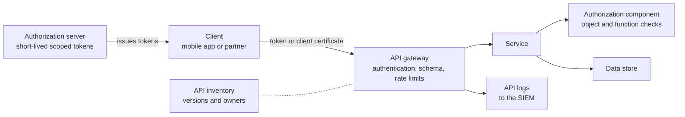

<!-- Generated by scripts/build.mjs from data/patterns/P07.json. Edit the data, then run npm run build. -->

[العربية](../ar/P07-api-security.md)

# P07 API gateway and object level authorization

> Expose APIs only through a gateway that authenticates every caller and enforces limits, and make the API itself check, for every object, that the caller is allowed to touch it.

| Domain | Related patterns |
| --- | --- |
| Application | [P05 Protected internet edge and controlled egress](P05-internet-edge-and-egress.md), [P02 Identity as the control plane](P02-identity-control-plane.md), [P08 Secrets, keys, and workload identity](P08-secrets-keys-workload-identity.md), [P11 Trusted software supply chain](P11-software-supply-chain.md) |

## The problem

APIs expose business logic directly, and the most damaging API flaws are authorization flaws, such as changing an account number in a request and receiving someone else's data. Gateways catch unauthenticated and abusive traffic, but only the service knows who owns each object.

## Use it when

- Mobile apps, partners, or other systems consume your APIs.
- Your APIs return or change customer, account, or payment data.
- You do not have a complete inventory of your APIs and their versions.

## The design

Publish APIs through a gateway that validates OAuth 2.0 access tokens or mutual TLS client certificates, rejects requests that do not match the API schema, and applies rate and quota limits per client. Issue tokens from an authorization server with short lifetimes, narrow scopes, and audience restrictions, and bind them to the client where you can.

Inside the service, authorize every request at the object and function level against the caller's identity, using one shared authorization component rather than checks scattered through the code. Keep an inventory of every API, version, and environment, and retire old versions on a schedule.

## Controls

### Foundation

- **Authenticate every call at the gateway:** Reject any API request without a valid token or client certificate, and never rely on API keys alone for sensitive data.
  `NIST IA-2` `NIST IA-9` `NIST AC-3` `CIS 16.11` `ISO A.8.5` `ISO A.8.26`
- **Authorize every object and function:** Check in the service, for every request, that the caller may access the specific object and perform the specific function, and cover this with automated tests.
  `NIST AC-3` `NIST AC-6` `CIS 16.10` `CIS 16.12` `ISO A.8.26` `ISO A.8.28`
- **Validate input against the schema:** Validate requests against the API specification at the gateway and in the service, and reject unknown fields and oversized payloads.
  `NIST SI-10` `CIS 16.12` `ISO A.8.26` `ISO A.8.28`
- **Keep an API inventory:** Record every API with its owner, version, environment, data classification, and consumers, and generate the record from the gateway where you can.
  `NIST CM-8` `ISO A.5.9`

### Enhanced

- **Limit rate and consumption:** Apply rate limits, quotas, and payload size limits per client and per endpoint, with tighter limits on expensive or sensitive operations.
  `NIST SC-5` `ISO A.8.6`
- **Issue short-lived, scoped tokens:** Use access tokens that expire in minutes, carry only the scopes needed, and are restricted to the intended API audience.
  `NIST IA-5` `NIST SC-23` `CIS 16.11` `ISO A.8.5`
- **Use mutual TLS for partners:** Authenticate partner and system-to-system calls with mutual TLS or certificate-bound tokens, with certificates issued and rotated automatically.
  `NIST IA-9` `NIST SC-8` `CIS 3.10` `ISO A.8.24` `ISO A.5.14`

### Advanced

- **Protect sensitive business flows:** Detect and limit automated abuse of flows such as account opening, payments, or one-time password requests, with per-flow limits, behavioural signals, and stronger authentication when risk rises.
  `NIST SI-4` `NIST AC-3` `ISO A.8.16` `ISO A.8.26`
- **Test authorization continuously:** Run automated tests in the pipeline that call every endpoint as other users and roles, and fail the build when one of those calls succeeds.
  `NIST SA-11` `NIST CA-8` `CIS 16.12` `CIS 16.13` `ISO A.8.29`

## Decisions to record

- Which authorization server issues tokens, and what are the token lifetimes and scopes for each API?
- Where does object level authorization live: in each service, in a shared library, or in a central policy engine?
- How are partner clients onboarded, given credentials, and offboarded?

## Trade-offs

- A central policy engine makes authorization consistent and auditable, but adds latency and a dependency to every request.
- Short token lifetimes improve safety, but increase load on the authorization server and complexity for clients.
- Strict schema validation catches attacks and also breaks clients that send unexpected fields, so version your APIs.

## Anti-patterns to avoid

- Trusting an object identifier because the caller is authenticated.
- Long-lived API keys sent to partners by email.
- Old API versions left running without the controls added to newer ones.

## How to verify it

- Call each endpoint with a second user's token and the first user's object identifiers, and confirm every call is denied.
- Compare the gateway's route list with the inventory, and investigate anything missing from either.
- Send requests above the rate limit and with unknown fields, and confirm they are rejected.

## Threats it addresses

| Reference | Name |
| --- | --- |
| [T1190](https://attack.mitre.org/techniques/T1190/) | Exploit Public-Facing Application |
| [T1528](https://attack.mitre.org/techniques/T1528/) | Steal Application Access Token |
| [API1:2023](https://owasp.org/API-Security/editions/2023/en/0xa1-broken-object-level-authorization/) | Broken Object Level Authorization |
| [API2:2023](https://owasp.org/API-Security/editions/2023/en/0xa2-broken-authentication/) | Broken Authentication |
| [API3:2023](https://owasp.org/API-Security/editions/2023/en/0xa3-broken-object-property-level-authorization/) | Broken Object Property Level Authorization |
| [API4:2023](https://owasp.org/API-Security/editions/2023/en/0xa4-unrestricted-resource-consumption/) | Unrestricted Resource Consumption |
| [API5:2023](https://owasp.org/API-Security/editions/2023/en/0xa5-broken-function-level-authorization/) | Broken Function Level Authorization |
| [API6:2023](https://owasp.org/API-Security/editions/2023/en/0xa6-unrestricted-access-to-sensitive-business-flows/) | Unrestricted Access to Sensitive Business Flows |
| [API9:2023](https://owasp.org/API-Security/editions/2023/en/0xa9-improper-inventory-management/) | Improper Inventory Management |

## References

- [OWASP API Security Top 10 2023](https://owasp.org/API-Security/editions/2023/en/0x11-t10/)
- [OWASP Application Security Verification Standard 5.0](https://github.com/OWASP/ASVS)
- [RFC 9700, Best Current Practice for OAuth 2.0 Security](https://datatracker.ietf.org/doc/rfc9700/)
