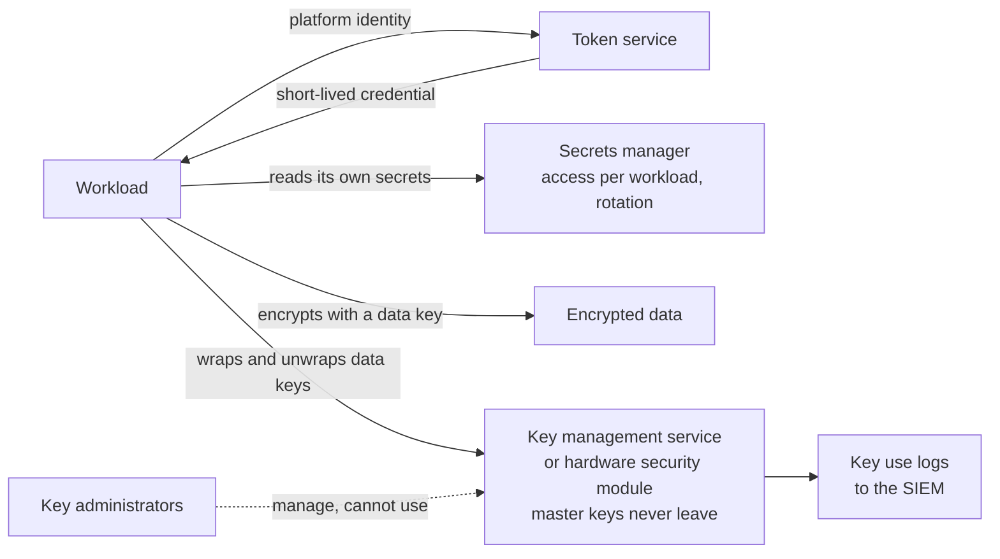

<!-- Generated by scripts/build.mjs from data/patterns/P08.json. Edit the data, then run npm run build. -->

[العربية](../ar/P08-secrets-keys-workload-identity.md)

# P08 Secrets, keys, and workload identity

> Keep secrets out of code, give every workload its own identity instead of a shared password, and hold encryption keys in a key management service, with the people who manage keys kept apart from the systems that use them.

| Domain | Related patterns |
| --- | --- |
| Platform | [P06 Cloud landing zone with guardrails](P06-cloud-landing-zone.md), [P09 Data-centric protection](P09-data-centric-protection.md), [P11 Trusted software supply chain](P11-software-supply-chain.md), [P16 Container platform guardrails](P16-container-platform-guardrails.md) |

## The problem

Passwords, API keys, and certificates end up in source code, configuration files, pipeline variables, and chat messages, where they are copied, leaked, and rarely rotated. One leaked cloud key or database password can be enough for a breach, and encryption is only as strong as the protection of its keys.

## Use it when

- Applications connect to databases, queues, or APIs with stored credentials.
- You encrypt data and need to decide who controls the keys.
- Secret scanning finds credentials in your repositories.

## The design

Give workloads identities issued by the platform, such as cloud workload identities, Kubernetes service account tokens, or SPIFFE certificates, and use them to obtain short-lived credentials at runtime. Where a static secret cannot be avoided, keep it in a secrets manager, let each workload read only its own secrets, rotate automatically, and never write secrets to code, images, or logs.

Encrypt data with keys held in a key management service or hardware security module, using envelope encryption so that data keys are wrapped by master keys that never leave the service. Separate the roles that administer keys from the roles that use them, log every use of a key, and plan how you would rotate or revoke each key, including those of your certificate authority.

## Controls

### Foundation

- **Scan for secrets and block them:** Scan repositories, pipelines, and images for secrets, block commits that contain them, and rotate any secret that was ever exposed.
  `NIST IA-5` `CIS 16.12` `ISO A.5.17` `ISO A.8.28`
- **Use a secrets manager:** Store application secrets in a secrets manager with access per workload, audit logging, and automatic rotation where the target system supports it.
  `NIST IA-5` `NIST SC-28` `ISO A.5.17` `ISO A.8.24`
- **Keep keys in a key management service:** Generate and hold encryption keys in a key management service or hardware security module, not in files or application configuration.
  `NIST SC-12` `NIST SC-13` `CIS 3.11` `ISO A.8.24`

### Enhanced

- **Replace static secrets with workload identity:** Authenticate workloads to cloud services and to each other with platform-issued identities and short-lived credentials.
  `NIST IA-9` `NIST IA-5` `ISO A.8.5`
- **Separate key administration from key use:** Give different roles the right to manage keys and the right to use them for encryption, and require two people for destructive key operations.
  `NIST AC-5` `NIST SC-12` `ISO A.5.3` `ISO A.8.24`
- **Automate the certificate lifecycle:** Issue and renew certificates automatically, keep an inventory with expiry dates, and alert well before expiry.
  `NIST SC-12` `NIST SC-17` `ISO A.8.24`

### Advanced

- **Use keys you control for regulated data:** Protect regulated data with keys you control in a hardware security module, with an exit plan if the provider relationship ends.
  `NIST SC-12` `NIST SC-13` `CIS 3.11` `ISO A.8.24` `ISO A.5.23`
- **Plan for crypto agility:** Keep an inventory of algorithms, key sizes, and where each is used, so that you can move to post-quantum algorithms without a redesign.
  `NIST SC-13` `NIST CM-8` `ISO A.8.24`

## Decisions to record

- Which secrets manager and key management service are standard, and who operates them?
- Which data needs keys you control, or a hardware security module?
- What is the rotation period for each type of secret and key, and how is rotation tested?

## Trade-offs

- A secrets manager is a high-value target and a dependency at startup, so it must be highly available and tightly administered.
- Hardware security modules add cost and demand operational skill, and a lost key means lost data.
- Aggressive rotation breaks systems that cache credentials, so rotate with an overlap.

## Anti-patterns to avoid

- Secrets in environment files committed to the repository.
- One service account password shared by many applications and never changed.
- Encryption keys stored on the same server as the data they protect.

## How to verify it

- Run a secret scanner across all repositories, including their history, and confirm that findings are zero or already rotated.
- Pick a workload and list every credential it can obtain, and confirm that each one is necessary and short-lived.
- Confirm that a key administrator cannot decrypt data and a key user cannot delete keys.

## Threats it addresses

| Reference | Name |
| --- | --- |
| [T1552.001](https://attack.mitre.org/techniques/T1552/001/) | Unsecured Credentials: Credentials In Files |
| [T1528](https://attack.mitre.org/techniques/T1528/) | Steal Application Access Token |
| [T1078.004](https://attack.mitre.org/techniques/T1078/004/) | Valid Accounts: Cloud Accounts |

## References

- [NIST SP 800-57 Part 1 Rev 5, recommendation for key management](https://csrc.nist.gov/pubs/sp/800/57/pt1/r5/final)
- [OWASP Secrets Management Cheat Sheet](https://cheatsheetseries.owasp.org/cheatsheets/Secrets_Management_Cheat_Sheet.html)
- [SPIFFE, workload identity standard](https://spiffe.io/)
- [Miftah, cryptographic inventory and post-quantum readiness](https://github.com/SiteQ8/miftah)
