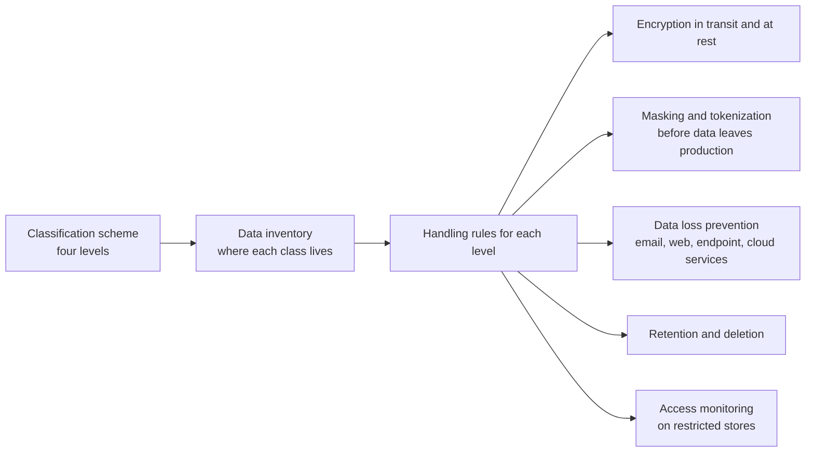

<!-- Generated by scripts/build.mjs from data/patterns/P09.json. Edit the data, then run npm run build. -->

[العربية](../ar/P09-data-centric-protection.md)

# P09 Data-centric protection

> Classify data, then let the classification decide how it is stored, encrypted, masked, shared, kept, and monitored, so that protection follows the data wherever it goes.

| Domain | Related patterns |
| --- | --- |
| Data | [P08 Secrets, keys, and workload identity](P08-secrets-keys-workload-identity.md), [P05 Protected internet edge and controlled egress](P05-internet-edge-and-egress.md), [P15 Regulated enclave](P15-regulated-enclave.md), [P14 Guardrails for LLM applications and agents](P14-llm-application-guardrails.md), [P26 Secure data exchange with partners](P26-partner-data-exchange.md) |

## The problem

Controls built around systems miss the fact that data moves. Copies land in test environments, analytics platforms, spreadsheets, and SaaS tools that were never meant to hold them, and you cannot protect what you have not found or set priorities without knowing what matters most.

## Use it when

- You hold personal, financial, or health data.
- Production data is copied to test, to analytics, or to partners.
- A data protection law or a regulator requires you to know where personal data lives.

## The design

Start with a short classification scheme, typically four levels such as public, internal, confidential, and restricted, and a data inventory that records where each class lives and flows. Then attach handling rules to each level: encryption in transit everywhere, encryption at rest with keys scoped by sensitivity, masking or tokenization before data leaves production, and limits on how long it is kept.

Enforce the rules where data moves: monitor database activity on restricted stores, run data loss prevention on the email, web, endpoint, and SaaS channels people use, and have data owners review who has access. Collect and keep as little as you can, because the safest data is data you do not hold.

## Controls

### Foundation

- **Define a classification scheme:** Adopt a short classification scheme with clear examples and handling rules for each level, and assign an owner to each major data set.
  `NIST RA-2` `CIS 3.7` `ISO A.5.12` `ISO A.5.13`
- **Build a data inventory:** Record where each class of data is stored and processed, including SaaS and backups, and document the main data flows.
  `NIST CM-8` `CIS 3.2` `CIS 3.8` `ISO A.5.9`
- **Encrypt in transit and at rest:** Use TLS 1.2 or later for all traffic that carries non-public data, and encrypt every store that holds confidential or restricted data.
  `NIST SC-8` `NIST SC-28` `CIS 3.10` `CIS 3.11` `ISO A.8.24`

### Enhanced

- **Mask or tokenize outside production:** Replace sensitive fields with masked or tokenized values before data reaches test, analytics, or partners.
  `NIST SI-19` `ISO A.8.11` `ISO A.8.33`
- **Run data loss prevention on the main channels:** Monitor, and where clear enough block, restricted data leaving through email, web uploads, external storage media, and sanctioned SaaS.
  `NIST AC-4` `NIST SC-7` `CIS 3.13` `ISO A.8.12`
- **Log access to restricted data:** Record who read or changed restricted data, and alert on unusual volumes or on access with no business need.
  `NIST AU-2` `NIST AU-12` `CIS 3.14` `ISO A.8.15`

### Advanced

- **Scope keys to data sensitivity:** Use separate keys per data class and per tenant or business unit, so that one compromised key exposes as little data as possible.
  `NIST SC-12` `CIS 3.11` `ISO A.8.24`
- **Enforce retention and deletion:** Delete data automatically at the end of its retention period, including from analytics and backups where the law allows.
  `NIST SI-12` `CIS 3.4` `CIS 3.5` `ISO A.8.10` `ISO A.5.33`

## Decisions to record

- What are the classification levels, and who owns each major data set?
- Which data may leave production, and in what form?
- How long is each class of data kept, and how is deletion proven?

## Trade-offs

- Data loss prevention produces false positives that frustrate people, so start by monitoring and block only the clearest cases.
- Tokenization reduces exposure, but adds a critical service that must be available and protected.
- Too many classification levels confuse people, and confused people misclassify.

## Anti-patterns to avoid

- Production databases copied to test environments with real customer data.
- Encryption at rest presented as the answer to every data risk.
- A classification policy that no system enforces.

## How to verify it

- Search test and analytics environments for real customer identifiers.
- Send a test document marked restricted through email and through a web upload, and confirm it is blocked or alerted.
- Pick a restricted data set and confirm you can list everyone who accessed it last month.

## Threats it addresses

| Reference | Name |
| --- | --- |
| [T1530](https://attack.mitre.org/techniques/T1530/) | Data from Cloud Storage |
| [T1567](https://attack.mitre.org/techniques/T1567/) | Exfiltration Over Web Service |
| [T1048](https://attack.mitre.org/techniques/T1048/) | Exfiltration Over Alternative Protocol |
| [T1213](https://attack.mitre.org/techniques/T1213/) | Data from Information Repositories |

## References

- [NIST Privacy Framework](https://www.nist.gov/privacy-framework)
- [NIST SP 800-188, de-identifying government datasets](https://csrc.nist.gov/pubs/sp/800/188/final)
- [OWASP Cryptographic Storage Cheat Sheet](https://cheatsheetseries.owasp.org/cheatsheets/Cryptographic_Storage_Cheat_Sheet.html)
