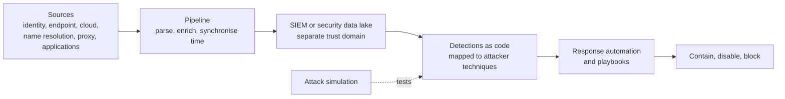

<!-- Generated by scripts/build.mjs from data/patterns/P10.json. Edit the data, then run npm run build. -->

[العربية](../ar/P10-detection-telemetry.md)

# P10 Security telemetry and detection pipeline

> Collect the logs that answer real detection questions, move them through a pipeline you can trust, and turn them into tested detections and practised responses, because you cannot defend what you cannot see.

| Domain | Related patterns |
| --- | --- |
| Operations | [P01 Zero trust access](P01-zero-trust-access.md), [P02 Identity as the control plane](P02-identity-control-plane.md), [P03 Tiered privileged access](P03-tiered-privileged-access.md), [P12 Ransomware-resilient recovery](P12-resilient-recovery.md) |

## The problem

Many organisations collect huge volumes of logs and still miss attacks, because the sources that matter are absent, clocks disagree, nobody wrote detections for the attacks they fear, and alerts arrive with no playbook. Attackers also go after logging itself, and switch it off to hide.

## Use it when

- Today you would not know if an administrator account was used at night from a new country.
- Logs stay in each system and are read only after an incident.
- A regulator or auditor asks how you detect and respond to attacks.

## The design

Start from detection questions, not from data sources. List the attacks you most need to catch, map them to ATT&CK techniques, and collect the telemetry that reveals them, which usually means identity and sign-in logs, endpoint detection and response, cloud control plane logs, DNS and proxy logs, and the logs of critical applications. Synchronise time everywhere, and send everything through a pipeline that parses and enriches it before it reaches a SIEM or security data lake held in a separate trust domain.

Write detections as code, test them against simulated attacks, and give each one a playbook, an owner, and a severity. Automate the repetitive parts of response, such as enriching an alert, isolating a device, or disabling an account, and measure how long it takes to detect and to respond.

## Controls

### Foundation

- **Collect the core sources:** Centralise identity and sign-in logs, endpoint detection and response telemetry, cloud control plane logs, firewall and proxy logs, and DNS query logs.
  `NIST AU-2` `NIST AU-12` `NIST SI-4` `CIS 8.2` `CIS 8.6` `CIS 8.7` `CIS 8.9` `ISO A.8.15` `ISO A.8.16`
- **Synchronise time:** Point every system at the same trusted time sources, so that events from different systems line up.
  `NIST AU-8` `CIS 8.4` `ISO A.8.17`
- **Protect the logs:** Store logs where the administrators of monitored systems cannot change or delete them, and keep them for at least the period your obligations require.
  `NIST AU-9` `NIST AU-9(2)` `NIST AU-11` `CIS 8.3` `CIS 8.10` `ISO A.8.15`
- **Deploy endpoint detection and response:** Run endpoint detection and response on servers and user devices, with alerts reaching a security team around the clock, in house or through a managed service.
  `NIST SI-4` `NIST SI-3` `CIS 10.1` `CIS 13.2` `ISO A.8.7` `ISO A.8.16`

### Enhanced

- **Write detections from threats:** Build detections for the techniques in your threat model, starting with credential abuse, privilege changes, and log tampering, and map each one to ATT&CK.
  `NIST SI-4` `NIST AU-6` `CIS 13.1` `CIS 13.11` `ISO A.8.16`
- **Give every alert a playbook:** Document triage and response steps for each detection, with owners and escalation paths, and exercise the main ones.
  `NIST IR-4` `NIST IR-8` `CIS 17.4` `ISO A.5.24` `ISO A.5.26`
- **Alert on logging failures:** Detect when a source stops sending, a log setting changes, or an audit service is disabled, and treat it as a security event.
  `NIST AU-5` `NIST SI-4` `ISO A.8.16`

### Advanced

- **Test detections with simulated attacks:** Run attack simulations on a schedule and after changes, and track which techniques are detected, prevented, or missed.
  `NIST CA-8` `NIST CA-7` `ISO A.8.16`
- **Automate containment:** Automate containment actions that can be reversed, such as isolating a device or revoking sessions, for high-confidence detections.
  `NIST IR-4` `ISO A.5.26`

## Decisions to record

- Which attacks must you detect first, and which log sources prove you would see them?
- Is detection run in house, by a managed service, or by both, and who is on call?
- How long are logs kept ready for search, and how long are they archived for investigations?

## Trade-offs

- Collecting everything is expensive and slows searches, while collecting too little leaves blind spots, so tie each source to a detection or investigation need.
- Automated containment speeds up response but can disrupt the business on a false positive, so start with actions that can be reversed.
- A managed service adds round-the-clock coverage, but needs good context from you to judge what is normal.

## Anti-patterns to avoid

- A SIEM full of data, running only the vendor's default rules.
- Logs kept in the same domain that an attacker would compromise first.
- Alerts that reach nobody at night.

## How to verify it

- Run a simulated credential attack, such as a password spray against a test account, and measure the time until the alert.
- Stop log forwarding on a test server, and confirm an alert fires.
- Pick five alerts at random from last month, and confirm each had a playbook and a documented outcome.

## Threats it addresses

| Reference | Name |
| --- | --- |
| [T1685.002](https://attack.mitre.org/techniques/T1685/002/) | Disable or Modify Tools: Disable or Modify Cloud Log |
| [T1070](https://attack.mitre.org/techniques/T1070/) | Indicator Removal |
| [T1078](https://attack.mitre.org/techniques/T1078/) | Valid Accounts |
| [T1110.003](https://attack.mitre.org/techniques/T1110/003/) | Brute Force: Password Spraying |

## References

- [MITRE ATT&CK](https://attack.mitre.org/)
- [MITRE D3FEND, a knowledge graph of defensive techniques](https://d3fend.mitre.org/)
- [NIST SP 800-61 Rev 3, incident response recommendations](https://csrc.nist.gov/pubs/sp/800/61/r3/final)
- [CISA and partners, best practices for event logging and threat detection](https://www.cisa.gov/resources-tools/resources/best-practices-event-logging-and-threat-detection)
