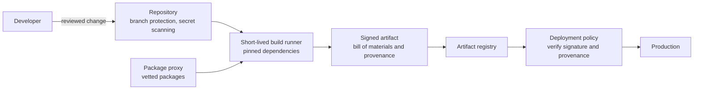

<!-- Generated by scripts/build.mjs from data/patterns/P11.json. Edit the data, then run npm run build. -->

[العربية](../ar/P11-software-supply-chain.md)

# P11 Trusted software supply chain

> Treat the build system as production: protect source code and pipelines, build in isolated and repeatable steps, sign what you build, record what went into it, and deploy only artifacts whose origin you can verify.

| Domain | Related patterns |
| --- | --- |
| Application | [P08 Secrets, keys, and workload identity](P08-secrets-keys-workload-identity.md), [P16 Container platform guardrails](P16-container-platform-guardrails.md), [P07 API gateway and object level authorization](P07-api-security.md) |

## The problem

Attackers increasingly compromise software before it reaches you, through poisoned open-source packages, stolen maintainer or pipeline credentials, or a compromised build server that slips code into signed releases. Your application inherits every weakness in the components and tools used to build it.

## Use it when

- You build and deploy your own software.
- Your applications depend on many open-source packages.
- Your pipelines hold credentials that can deploy to production.

## The design

Protect the source by requiring review and branch protection on main branches, signing commits in sensitive repositories, and scanning every change for secrets and vulnerable dependencies. Build on short-lived, isolated runners from pinned dependencies and base images, and give pipelines short-lived, narrowly scoped credentials obtained through workload identity rather than stored secrets.

Sign each artifact, generate a software bill of materials and build provenance for it, and store them together. At deployment, admit only artifacts that your pipeline signed and that meet policy, and keep the bills of materials so that when the next critical library vulnerability is announced you can find every affected system in minutes.

## Controls

### Foundation

- **Protect main branches:** Require pull request review and passing checks before merge, block force pushes, and limit who can change repository settings.
  `NIST CM-3` `NIST SA-10` `CIS 16.1` `ISO A.8.4` `ISO A.8.32`
- **Scan dependencies and secrets on every change:** Run dependency vulnerability scanning and secret scanning in the pipeline, and block merges on critical findings.
  `NIST RA-5` `NIST SA-11` `CIS 16.4` `CIS 16.5` `CIS 16.12` `ISO A.8.8` `ISO A.8.28`
- **Keep an inventory of third-party components:** Generate a software bill of materials for every build, and keep it with the artifact.
  `NIST CM-8` `NIST SR-4` `CIS 16.4` `CIS 2.1` `ISO A.5.21`

### Enhanced

- **Harden the pipeline:** Use short-lived runners, pin actions and base images to digests, give jobs least-privilege tokens, and separate build permissions from deploy permissions.
  `NIST SA-15` `NIST AC-6` `ISO A.8.25`
- **Sign artifacts and record provenance:** Sign every release artifact and container image, and produce build provenance that describes how it was built and from what.
  `NIST SI-7` `NIST SR-4` `NIST CM-14` `ISO A.5.21`
- **Use a vetted package source:** Pull dependencies through an internal proxy or registry that blocks known malicious packages and admits newly published versions only after a waiting period.
  `NIST SR-3` `NIST SR-11` `CIS 16.5` `ISO A.5.21`

### Advanced

- **Verify at deployment:** Admit to production only signed artifacts with valid provenance from your own pipeline, enforced by the deployment platform.
  `NIST CM-14` `NIST SI-7` `CIS 2.5` `ISO A.8.19`
- **Reach a higher SLSA build level:** Move builds to a hosted, isolated build platform that generates provenance a build cannot forge, and track your SLSA level for each product.
  `NIST SA-15` `NIST SR-4` `ISO A.8.25`

## Decisions to record

- Which pipelines can deploy to production, and with what credentials?
- What is the policy for adding new dependencies and for fixing vulnerable ones?
- Where are signatures verified, and what happens to unsigned artifacts?

## Trade-offs

- Strict gates slow delivery when scanners are noisy, so tune them and fail builds only on findings that matter.
- Pinning and waiting periods delay urgent security updates unless there is a fast path for them.
- Signing helps only if verification is enforced where the software runs.

## Anti-patterns to avoid

- A long-lived cloud admin key stored as a pipeline secret.
- Build servers that are never patched because nobody owns them.
- Dependencies pulled from the internet at build time without pinned versions.

## How to verify it

- Try to merge to a protected branch without review, and confirm it is blocked.
- Try to deploy an unsigned image, and confirm the platform rejects it.
- Pick a library and use your bills of materials to list every product that includes it.

## Threats it addresses

| Reference | Name |
| --- | --- |
| [T1195.002](https://attack.mitre.org/techniques/T1195/002/) | Supply Chain Compromise: Compromise Software Supply Chain |
| [T1552.001](https://attack.mitre.org/techniques/T1552/001/) | Unsecured Credentials: Credentials In Files |
| [T1528](https://attack.mitre.org/techniques/T1528/) | Steal Application Access Token |

## References

- [SLSA, supply-chain levels for software artifacts](https://slsa.dev/)
- [NIST SP 800-218, Secure Software Development Framework](https://csrc.nist.gov/pubs/sp/800/218/final)
- [CycloneDX, bill of materials standard](https://cyclonedx.org/)
- [OpenSSF Scorecard](https://securityscorecards.dev/)
