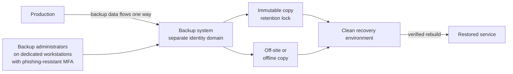

<!-- Generated by scripts/build.mjs from data/patterns/P12.json. Edit the data, then run npm run build. -->

[العربية](../ar/P12-resilient-recovery.md)

# P12 Ransomware-resilient recovery

> Design recovery for the day your main environment and its administrators are compromised: keep immutable, isolated copies that production administrators cannot delete, and prove regularly that you can rebuild from them in the time the business needs.

| Domain | Related patterns |
| --- | --- |
| Operations | [P03 Tiered privileged access](P03-tiered-privileged-access.md), [P04 Segmentation and micro-segmentation](P04-segmentation.md), [P10 Security telemetry and detection pipeline](P10-detection-telemetry.md), [P22 Resilient availability across sites](P22-resilient-availability.md) |

## The problem

Ransomware operators look for backups first. When backup servers share the domain, credentials, and network with production, the attacker deletes or encrypts the backups before encrypting everything else, and recovery plans that were never tested fail when they are needed.

## Use it when

- The business cannot run for long without its systems.
- Backups are administered with the same accounts as production.
- Nobody has restored a complete system from backup in the last year.

## The design

Follow the 3-2-1-1-0 rule: three copies of data, on two different media, one of them off site, one immutable or offline, and zero errors after verified restore tests. Put the backup system in its own trust domain, with separate identities, phishing-resistant MFA, and administration from privileged access workstations, and turn on immutability so that even its administrators cannot shorten retention or delete copies early.

Set recovery time and recovery point objectives for each system, rank systems by recovery order with identity and core infrastructure first, and keep a clean recovery environment where you can rebuild without bringing the attacker back. Test full restores, not only file restores, on a schedule and after major changes.

## Controls

### Foundation

- **Back up what the business needs:** Back up critical systems and data automatically, including identity systems, configurations, and infrastructure code, not only file shares and databases.
  `NIST CP-9` `CIS 11.1` `CIS 11.2` `ISO A.8.13`
- **Keep an immutable or offline copy:** Keep at least one copy that cannot be changed or deleted before its retention ends, even by backup administrators.
  `NIST CP-9` `NIST CP-6` `CIS 11.3` `CIS 11.4` `ISO A.8.13`
- **Test restores:** Restore complete systems on a schedule, record how long it took, and compare the result with the recovery objectives.
  `NIST CP-4` `CIS 11.5` `ISO A.8.13` `ISO A.5.30`

### Enhanced

- **Separate the backup trust domain:** Run the backup infrastructure with its own identities and administration path, not joined to the production directory, with phishing-resistant MFA for every administrator.
  `NIST AC-6` `NIST CP-9` `NIST IA-2(1)` `CIS 11.3` `CIS 5.4` `ISO A.8.13` `ISO A.8.2`
- **Set recovery objectives and order:** Agree recovery time and point objectives for each system with the business, and write down the order in which systems must come back.
  `NIST CP-2` `NIST CP-10` `NIST RA-9` `CIS 11.1` `ISO A.5.30` `ISO A.5.29`
- **Alert on backup tampering:** Detect deleted backup jobs, changes to retention, and attempts at mass deletion, and treat them as incidents.
  `NIST SI-4` `ISO A.8.16`

### Advanced

- **Keep a clean recovery environment:** Keep an isolated environment with trusted tooling and gold images, where systems can be rebuilt and checked for persistence before they return.
  `NIST CP-10` `ISO A.5.30`
- **Exercise a full ransomware recovery:** Run an exercise that assumes production and its directory are lost, and rebuild core services from the isolated copies.
  `NIST CP-4` `NIST IR-3` `CIS 11.5` `CIS 17.7` `ISO A.5.30` `ISO A.5.24`

## Decisions to record

- What are the recovery time and point objectives for each critical system, and has the business signed them off?
- How is the backup system isolated from production identity and networks?
- In what order are systems restored, and who decides during an incident?

## Trade-offs

- Immutability makes mistakes immutable too, so data kept too long or backed up by mistake cannot be removed early.
- Separate identity and tooling for backups add cost and operational effort.
- Short recovery objectives need more infrastructure and practice, so reserve them for the systems that truly need them.

## Anti-patterns to avoid

- Backup servers joined to the production domain and administered with domain admin rights.
- Snapshots kept only on the same storage array as production.
- A recovery plan that assumes the directory and the network still work.

## How to verify it

- As a backup administrator, try to delete an immutable copy or shorten its retention, and confirm the attempt is refused.
- Restore a critical application end to end in the clean environment, and time it against its objective.
- Confirm that no production account, including domain administrators, can sign in to the backup system.

## Threats it addresses

| Reference | Name |
| --- | --- |
| [T1486](https://attack.mitre.org/techniques/T1486/) | Data Encrypted for Impact |
| [T1490](https://attack.mitre.org/techniques/T1490/) | Inhibit System Recovery |
| [T1485](https://attack.mitre.org/techniques/T1485/) | Data Destruction |

## References

- [CISA #StopRansomware guide](https://www.cisa.gov/stopransomware/ransomware-guide)
- [NIST SP 800-34 Rev 1, contingency planning guide](https://csrc.nist.gov/pubs/sp/800/34/r1/upd1/final)
- [NIST SP 800-160 Vol 2 Rev 1, developing cyber-resilient systems](https://csrc.nist.gov/pubs/sp/800/160/v2/r1/final)
