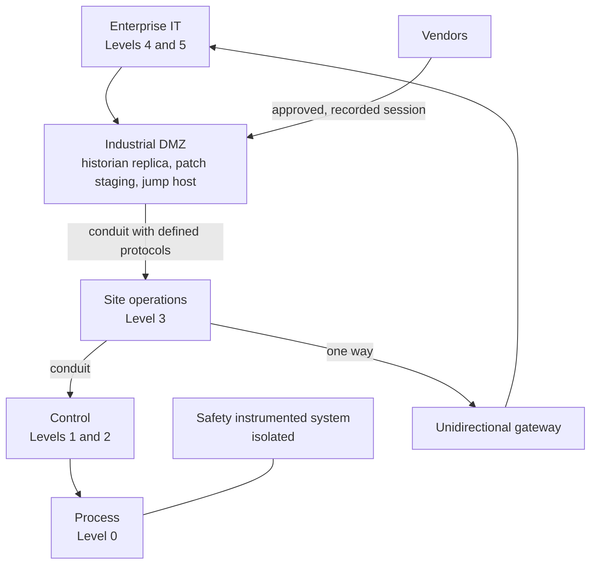

<!-- Generated by scripts/build.mjs from data/patterns/P13.json. Edit the data, then run npm run build. -->

[العربية](../ar/P13-ot-zones-and-conduits.md)

# P13 OT zones and conduits

> Group industrial systems into zones by function and consequence, connect zones only through defined conduits, and put an industrial DMZ between the enterprise network and the plant, so that nothing crosses from IT to control systems directly.

| Domain | Related patterns |
| --- | --- |
| Industrial | [P01 Zero trust access](P01-zero-trust-access.md), [P03 Tiered privileged access](P03-tiered-privileged-access.md), [P04 Segmentation and micro-segmentation](P04-segmentation.md), [P10 Security telemetry and detection pipeline](P10-detection-telemetry.md), [P12 Ransomware-resilient recovery](P12-resilient-recovery.md) |

## The problem

Control systems were built for reliability and a long life, not for hostile networks, and many of them cannot be patched or run security agents. When the plant network is reachable from the office network or from vendor remote access tools, ransomware and intruders reach the systems that move valves and motors, where the consequences are physical.

## Use it when

- You operate industrial, building management, or utility control systems.
- Vendors maintain control systems remotely.
- Office and plant networks are connected without a DMZ between them.

## The design

Use the Purdue reference model as a first map, and IEC 62443 to define zones and conduits. Group assets that share security requirements into zones, give each zone a target security level from a risk assessment, and define every conduit with its protocols, direction, and controls. Place an industrial DMZ between enterprise IT and the plant and end every connection there: historians replicate outwards, files and patches are staged and scanned, and remote users land on a jump host rather than on control systems.

Where data only needs to leave the plant, use a unidirectional gateway. Monitor OT traffic passively with sensors that understand industrial protocols, keep an accurate asset inventory, and give vendors approved, recorded sessions with a time limit through the DMZ. Safety instrumented systems stay isolated from everything else.

## Controls

### Foundation

- **Inventory OT assets:** Keep an inventory of controllers, workstations, and network devices with their firmware, owners, and zones, built with passive discovery where active scanning is unsafe.
  `NIST CM-8` `CIS 1.1` `CIS 2.1` `ISO A.5.9`
- **Separate IT and OT with an industrial DMZ:** End every connection between enterprise IT and the plant in an industrial DMZ, and allow no direct traffic from IT to the control levels.
  `NIST SC-7` `NIST AC-4` `CIS 12.2` `CIS 13.4` `ISO A.8.22`
- **Control vendor remote access:** Give vendors access only through the DMZ jump host, with MFA, approval per session, a time limit, and recording, and switch it off when it is not in use.
  `NIST AC-17` `NIST MA-4` `NIST IA-2(1)` `CIS 6.4` `CIS 13.5` `ISO A.5.19` `ISO A.5.20`

### Enhanced

- **Define zones, conduits, and target levels:** Give each zone a target security level based on a risk assessment, and document every conduit with its protocols, direction, and controls.
  `NIST PL-8` `NIST RA-3` `NIST CA-9` `CIS 12.4` `ISO A.8.22` `ISO A.8.27`
- **Monitor OT networks passively:** Deploy passive monitoring that understands industrial protocols in each zone, send alerts to the security operations team, and agree response steps with operations engineers.
  `NIST SI-4` `CIS 13.3` `CIS 13.6` `ISO A.8.16`
- **Stage and scan files and patches:** Move files and patches into the plant only through a staging point in the DMZ, where they are scanned and approved.
  `NIST SI-3` `ISO A.8.7` `ISO A.8.19`

### Advanced

- **Use unidirectional gateways for outbound data:** Replace two-way connections with unidirectional gateways wherever data only needs to leave the plant.
  `NIST AC-4` `NIST SC-7` `CIS 13.4` `ISO A.8.22`
- **Exercise OT incident response:** Rehearse scenarios with operations and safety staff, including running the process by hand while systems are rebuilt.
  `NIST IR-3` `NIST CP-4` `CIS 17.7` `ISO A.5.24` `ISO A.5.29`

## Decisions to record

- What are the zones and their target security levels, and who accepted the risk assessment?
- Which data must leave the plant, and can it leave in one direction only?
- How do vendors connect, who approves each session, and how is the session reviewed?

## Trade-offs

- Security controls must never weaken safety or availability, so test every change in a representative environment first.
- Unidirectional gateways are very strong, but make remote support and two-way integrations harder.
- Legacy systems that cannot be patched need compensating controls around them, which makes the zone more complex.

## Anti-patterns to avoid

- An engineering workstation connected to both the office network and the control network.
- Vendor remote access tools left installed and always on.
- Active vulnerability scans run against live controllers.

## How to verify it

- From the enterprise network, try to reach control level addresses, and confirm that nothing answers.
- Review last month's vendor sessions, and confirm each was approved, time-limited, and recorded.
- Compare the asset list seen by passive monitoring with the asset register, and resolve the differences.

## Threats it addresses

| Reference | Name |
| --- | --- |
| [T0822](https://attack.mitre.org/techniques/T0822/) | External Remote Services |
| [T0886](https://attack.mitre.org/techniques/T0886/) | Remote Services |
| [T0883](https://attack.mitre.org/techniques/T0883/) | Internet Accessible Device |
| [T0859](https://attack.mitre.org/techniques/T0859/) | Valid Accounts |

## References

- [ISA/IEC 62443 series of standards](https://www.isa.org/standards-and-publications/isa-standards/isa-iec-62443-series-of-standards)
- [NIST SP 800-82 Rev 3, guide to operational technology security](https://csrc.nist.gov/pubs/sp/800/82/r3/final)
- [MITRE ATT&CK for ICS](https://attack.mitre.org/matrices/ics/)
