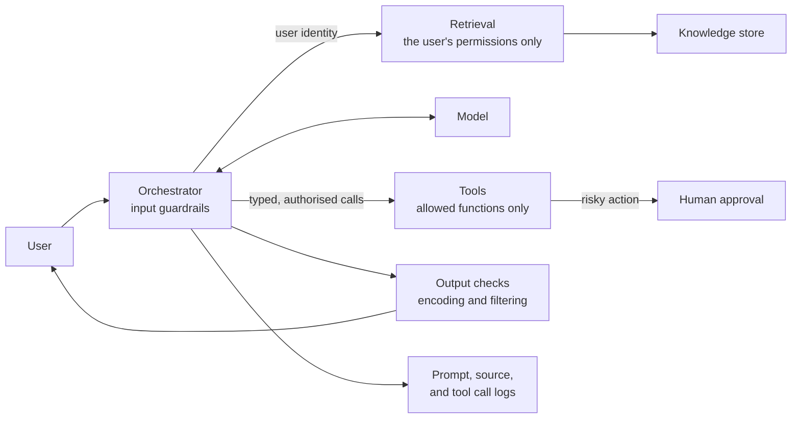

<!-- Generated by scripts/build.mjs from data/patterns/P14.json. Edit the data, then run npm run build. -->

[العربية](../ar/P14-llm-application-guardrails.md)

# P14 Guardrails for LLM applications and agents

> Treat model input and output as untrusted, give the model only the data and tools the current user is allowed to use, and surround any action with consequences with deterministic checks and human approval.

| Domain | Related patterns |
| --- | --- |
| AI | [P09 Data-centric protection](P09-data-centric-protection.md), [P07 API gateway and object level authorization](P07-api-security.md), [P02 Identity as the control plane](P02-identity-control-plane.md), [P10 Security telemetry and detection pipeline](P10-detection-telemetry.md) |

## The problem

Large language models follow instructions found anywhere in their context, including in a document, email, or web page that an attacker controls. Connected to company data and tools, a model can be steered to reveal information the user should not see or to take actions nobody approved, and its output can carry injected code into other systems.

## Use it when

- You build an assistant, a chatbot, or an agent on a large language model.
- The model can read internal documents through retrieval.
- The model can call tools that change data, send messages, or run code.

## The design

Place the model behind an orchestration layer that you control. Retrieval runs with the end user's identity and permissions, so the model sees only documents that user could open, and sensitive data is filtered before it enters the context. Each tool the model can call is a narrow, typed function with its own authorization, rate limits, and allowed parameters, never a general shell or an open database connection.

Screen inputs and outputs with guardrails, encode or validate model output before it reaches a browser, a query, or a shell, and require a person to confirm actions that move money, delete data, or contact people outside the organisation. Log prompts, retrieved sources, tool calls, and decisions, set limits on cost and usage, and test the system against prompt injection before and after release.

## Controls

### Foundation

- **Retrieve with the user's permissions:** Run retrieval with the end user's identity, so that the model receives only documents that user may already open.
  `NIST AC-3` `NIST AC-6` `CIS 3.3` `ISO A.5.15` `ISO A.8.3`
- **Treat model output as untrusted input:** Validate and encode model output before it is rendered, stored, or passed to another system, exactly as you would user input.
  `NIST SI-10` `NIST SI-15` `CIS 16.10` `ISO A.8.26` `ISO A.8.28`
- **Keep tools narrow and authorised:** Expose only specific, typed functions to the model, check authorization on every call, and never give it general shell, file, or database access.
  `NIST AC-6` `NIST CM-7` `ISO A.8.3` `ISO A.8.26`
- **Log the whole interaction:** Record prompts, retrieved sources, tool calls, and outputs with the user identity, subject to privacy rules.
  `NIST AU-2` `NIST AU-12` `CIS 8.5` `ISO A.8.15`

### Enhanced

- **Require human approval for consequential actions:** Ask a person to confirm actions that change records, move money, delete data, or send messages outside the organisation.
  `NIST AC-3` `ISO A.8.26`
- **Screen inputs and outputs:** Use guardrail checks for prompt injection patterns, sensitive data, and policy violations, on the way in and on the way out.
  `NIST SI-15` `NIST SI-4` `CIS 3.13` `ISO A.8.12`
- **Limit consumption:** Set limits per user and per application on requests, tokens, and cost, and alert on unusual usage.
  `NIST SC-5` `ISO A.8.6`

### Advanced

- **Test the application adversarially:** Test the system with direct and indirect prompt injection, data exfiltration, and tool abuse scenarios before release and after any change to the model or prompts.
  `NIST CA-8` `NIST SA-11` `CIS 16.13` `ISO A.8.29`
- **Govern models and prompts as code:** Version system prompts, model choices, tool definitions, and guardrail settings, review changes, and evaluate them against a test set before deployment.
  `NIST CM-3` `NIST SA-10` `ISO A.8.32` `ISO A.8.25`

## Decisions to record

- Which tools may the model call, and which actions need a person to confirm them?
- Where does the model run, and what data may be sent to it under your data protection obligations?
- How long are prompts and outputs kept, and who can read them?

## Trade-offs

- No filter reliably stops prompt injection, so safety has to come from limiting what the model can see and do.
- Human approval reduces risk and also reduces the benefit of automation, so reserve it for actions with real consequences.
- Detailed logs of prompts help investigations and also hold sensitive data, so protect them and let them expire.

## Anti-patterns to avoid

- A service account with broad read access used for retrieval on behalf of every user.
- Relying on the system prompt to keep secrets or enforce permissions.
- An agent allowed to run any code or query in production.

## How to verify it

- Plant an instruction in a document the assistant can retrieve, and confirm it cannot trigger a tool call or leak data.
- As a user with few permissions, ask the assistant for a document that only an executive can open, and confirm it is not returned.
- Review the logs of one conversation, and confirm you can trace every tool call back to a user and an approval.

## Threats it addresses

| Reference | Name |
| --- | --- |
| [T1213](https://attack.mitre.org/techniques/T1213/) | Data from Information Repositories |
| [LLM01:2025](https://genai.owasp.org/llmrisk/llm01-prompt-injection/) | Prompt Injection |
| [LLM02:2025](https://genai.owasp.org/llmrisk/llm022025-sensitive-information-disclosure/) | Sensitive Information Disclosure |
| [LLM05:2025](https://genai.owasp.org/llmrisk/llm052025-improper-output-handling/) | Improper Output Handling |
| [LLM06:2025](https://genai.owasp.org/llmrisk/llm062025-excessive-agency/) | Excessive Agency |
| [LLM07:2025](https://genai.owasp.org/llmrisk/llm072025-system-prompt-leakage/) | System Prompt Leakage |
| [LLM08:2025](https://genai.owasp.org/llmrisk/llm082025-vector-and-embedding-weaknesses/) | Vector and Embedding Weaknesses |
| [LLM10:2025](https://genai.owasp.org/llmrisk/llm102025-unbounded-consumption/) | Unbounded Consumption |

## References

- [OWASP Top 10 for LLM Applications 2025](https://genai.owasp.org/llm-top-10/)
- [NIST AI 600-1, Generative AI Profile](https://doi.org/10.6028/NIST.AI.600-1)
- [MITRE ATLAS](https://atlas.mitre.org/)
- [NIST AI Risk Management Framework](https://www.nist.gov/itl/ai-risk-management-framework)
