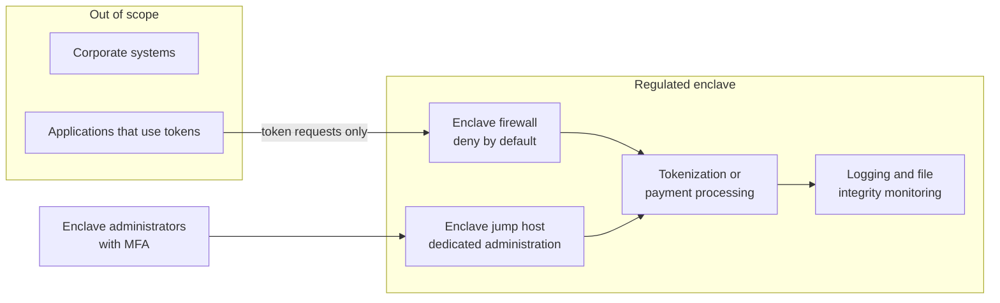

<!-- Generated by scripts/build.mjs from data/patterns/P15.json. Edit the data, then run npm run build. -->

[العربية](../ar/P15-regulated-enclave.md)

# P15 Regulated enclave

> Place the systems that store, process, or transmit regulated data, such as payment card data or SWIFT messaging, in a small and tightly controlled enclave, so that the strictest controls apply to a small scope and everything outside it stays out of scope.

| Domain | Related patterns |
| --- | --- |
| Data | [P04 Segmentation and micro-segmentation](P04-segmentation.md), [P03 Tiered privileged access](P03-tiered-privileged-access.md), [P09 Data-centric protection](P09-data-centric-protection.md), [P08 Secrets, keys, and workload identity](P08-secrets-keys-workload-identity.md) |

## The problem

When regulated data is spread across the network, every system that touches it or can reach it falls into scope, and the strictest requirements have to be met everywhere. That is expensive and rarely achieved, and the gaps that remain are where attackers find the data.

## Use it when

- You store, process, or transmit payment card data.
- You connect to SWIFT or to another high-value payment network.
- A regulator requires specific controls for a defined set of systems.

## The design

Reduce first. Remove regulated data you do not need, and replace stored card numbers with tokens from a tokenization service or payment provider, so that fewer systems ever see the real data. Then build the enclave: a segmented network with its own firewalls and deny-by-default rules, administration only through jump hosts inside the enclave, separate identities or at least separate privileged groups, and its own logging and file integrity monitoring.

Document every connection into and out of the enclave with its business reason, and test segmentation regularly to prove that out-of-scope systems really cannot reach it. For SWIFT the same idea appears as the secure zone of the Customer Security Controls Framework, and for payment cards as the cardholder data environment of PCI DSS.

## Controls

### Foundation

- **Minimise regulated data:** Stop storing regulated data you do not need, and replace stored card numbers with tokens wherever the business process allows.
  `NIST SI-12` `CIS 3.1` `ISO A.8.11`
- **Segment the enclave:** Isolate enclave systems in their own network segment, with deny-by-default filtering and a documented list of allowed connections.
  `NIST SC-7` `NIST SC-7(5)` `NIST AC-4` `CIS 12.2` `CIS 13.4` `CIS 3.12` `ISO A.8.22`
- **Administer the enclave separately:** Administer enclave systems only through jump hosts inside the enclave, with MFA and with accounts used for nothing else.
  `NIST AC-6(5)` `NIST IA-2(1)` `NIST AC-17` `CIS 5.4` `CIS 6.5` `CIS 12.8` `ISO A.8.2`

### Enhanced

- **Monitor integrity and access:** Run file integrity monitoring on critical enclave files, log all access to regulated data, and review the alerts every day.
  `NIST SI-7` `NIST AU-6` `CIS 3.14` `CIS 8.11` `ISO A.8.15` `ISO A.8.16`
- **Test segmentation:** Prove on a fixed schedule, at least as often as your obligations require and after every change, that systems outside the enclave cannot reach it.
  `NIST CA-8` `CIS 18.1` `ISO A.8.22`
- **Harden enclave systems:** Apply a hardening baseline, remove unnecessary services, and restrict software on enclave systems to an allow list.
  `NIST CM-6` `NIST CM-7` `CIS 4.1` `CIS 4.8` `CIS 2.5` `ISO A.8.9` `ISO A.8.19`

### Advanced

- **Give the enclave its own identity:** Use a separate directory or tenant for the enclave, so that a compromise of the corporate directory does not grant access to it.
  `NIST AC-2` `NIST SC-32` `ISO A.5.16`
- **Use hardware-backed keys for regulated data:** Protect the keys for regulated data in hardware security modules, with dual control for key management.
  `NIST SC-12` `NIST AC-5` `CIS 3.11` `ISO A.8.24`

## Decisions to record

- Which systems are in scope, and which were taken out of scope by tokenization or outsourcing?
- Which connections cross the enclave boundary, and what is the business reason for each?
- Who administers the enclave, and from where?

## Trade-offs

- A separate enclave duplicates some infrastructure, such as jump hosts and monitoring, which adds cost.
- Outsourcing card processing shrinks scope but moves trust to the provider, which must itself be assessed.
- Every new connection a project asks for weakens the boundary, so review each one.

## Anti-patterns to avoid

- Scope drawn around a diagram rather than around the real data flows.
- Enclave systems administered from ordinary corporate laptops.
- Card numbers in log files and support tickets outside the enclave.

## How to verify it

- Search out-of-scope systems, logs, and file shares for card numbers and other regulated data.
- From each out-of-scope segment, test that enclave systems cannot be reached.
- Compare the documented connections with the enclave firewall rules, and resolve any difference.

## Threats it addresses

| Reference | Name |
| --- | --- |
| [T1078](https://attack.mitre.org/techniques/T1078/) | Valid Accounts |
| [T1021](https://attack.mitre.org/techniques/T1021/) | Remote Services |
| [T1557](https://attack.mitre.org/techniques/T1557/) | Adversary-in-the-Middle |

## References

- [PCI Security Standards Council document library, PCI DSS v4.0.1 and scoping guidance](https://www.pcisecuritystandards.org/document_library/)
- [SWIFT Customer Security Programme](https://www.swift.com/customer-security-programme-csp)
- [CORF Workbook, an open assessment tool for the Central Bank of Kuwait Cyber and Operational Resilience Framework](https://github.com/SiteQ8/CORF)
