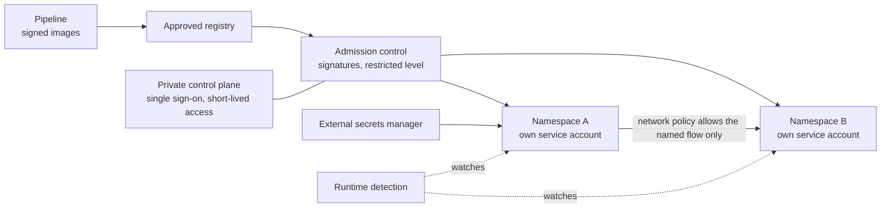

<!-- Generated by scripts/build.mjs from data/patterns/P16.json. Edit the data, then run npm run build. -->

[العربية](../ar/P16-container-platform-guardrails.md)

# P16 Container platform guardrails

> Run containers on a platform that decides what may run, isolates workloads from each other and from the host, and watches them at runtime, so that one vulnerable container does not become the whole cluster.

| Domain | Related patterns |
| --- | --- |
| Platform | [P06 Cloud landing zone with guardrails](P06-cloud-landing-zone.md), [P08 Secrets, keys, and workload identity](P08-secrets-keys-workload-identity.md), [P11 Trusted software supply chain](P11-software-supply-chain.md), [P04 Segmentation and micro-segmentation](P04-segmentation.md) |

## The problem

A cluster left at its defaults lets any workload run as root, talk to any other pod, mount the host, and use a service account that can read secrets across namespaces. One exploited container or one stolen pipeline credential can then take over the nodes, the cluster, and often the cloud account behind it.

## Use it when

- You run workloads on Kubernetes or another container platform.
- Several teams or applications share a cluster.
- Images come from public registries without review.

## The design

Keep the control plane private and administered through the identity provider with short-lived credentials, and separate clusters or node pools by trust level instead of mixing internet-facing and sensitive workloads. Enforce the restricted level of the Pod Security Standards, and admission policies that allow only signed images from approved registries, no privileged containers, no host mounts, and resource limits on every workload.

Default-deny network policies limit each workload to its dependencies, each workload gets its own service account with no token mounted unless it needs one, and secrets come from an external secrets manager. Runtime detection watches for shells in containers, unexpected processes, and escape attempts, and nodes are rebuilt from hardened images rather than patched by hand.

## Controls

### Foundation

- **Keep the control plane private:** Restrict access to the API server to private networks or approved addresses, and authenticate administrators through the identity provider with MFA.
  `NIST AC-17` `NIST SC-7` `NIST IA-2(1)` `CIS 6.5` `ISO A.8.20` `ISO A.8.5`
- **Enforce the restricted Pod Security level:** Apply the restricted level of the Pod Security Standards to application namespaces, with exceptions documented for each workload.
  `NIST CM-6` `NIST CM-7` `NIST AC-6` `CIS 4.1` `CIS 16.7` `ISO A.8.9`
- **Use approved, scanned images:** Pull images only from approved registries, scan them for vulnerabilities, and rebuild them regularly on patched base images.
  `NIST RA-5` `NIST SI-2` `CIS 16.5` `ISO A.8.8`

### Enhanced

- **Deny network traffic by default:** Deny all traffic in each namespace by default, and allow only the flows each workload needs.
  `NIST AC-4` `NIST SC-7(5)` `CIS 13.4` `ISO A.8.22`
- **Give each workload its own identity:** Create a service account for each workload with least-privilege access rules, turn off automatic token mounting, and use workload identity for cloud access.
  `NIST AC-6` `NIST IA-9` `CIS 5.5` `CIS 6.8` `ISO A.5.16`
- **Admit only signed images:** Verify image signatures and provenance at admission, and reject images that fail policy.
  `NIST CM-14` `NIST SI-7` `CIS 2.5` `ISO A.8.19`

### Advanced

- **Detect threats at runtime:** Watch containers for shells, unexpected processes, privilege escalation, and escape attempts, and send alerts to the security team.
  `NIST SI-4` `CIS 13.2` `ISO A.8.16`
- **Separate clusters by trust:** Run internet-facing, internal, and regulated workloads on separate clusters or dedicated node pools with their own policies.
  `NIST SC-32` `NIST SC-7(21)` `CIS 12.2` `CIS 3.12` `ISO A.8.22`

## Decisions to record

- How many clusters are there, and how are workloads of different trust separated?
- Which registries and signatures are trusted, and who can grant an exception?
- Who is a cluster administrator, and how is that access granted?

## Trade-offs

- Strict admission policies break third-party packages that expect high privileges, so plan exceptions and replacements.
- Separate clusters improve isolation, but multiply operational work and cost.
- Runtime agents need deep access to the host, so they must be trusted and kept up to date themselves.

## Anti-patterns to avoid

- A public API server protected only by a static token.
- Every workload using the default service account with read access across the whole cluster.
- Secrets stored as plain Kubernetes secrets and copied between namespaces.

## How to verify it

- Try to deploy a privileged pod and an unsigned image, and confirm that both are rejected.
- From a test pod, try to reach pods in another namespace and the cloud metadata service, and confirm that both are blocked.
- Open a shell in a test container, and confirm runtime detection raises an alert.

## Threats it addresses

| Reference | Name |
| --- | --- |
| [T1610](https://attack.mitre.org/techniques/T1610/) | Deploy Container |
| [T1611](https://attack.mitre.org/techniques/T1611/) | Escape to Host |
| [T1613](https://attack.mitre.org/techniques/T1613/) | Container and Resource Discovery |
| [T1078.004](https://attack.mitre.org/techniques/T1078/004/) | Valid Accounts: Cloud Accounts |

## References

- [Kubernetes, Pod Security Standards](https://kubernetes.io/docs/concepts/security/pod-security-standards/)
- [NIST SP 800-190, application container security guide](https://csrc.nist.gov/pubs/sp/800/190/final)
- [CIS Kubernetes Benchmark](https://www.cisecurity.org/benchmark/kubernetes)
